# Java Abstraction Lab

## What you'll learn

- Explain abstraction - hiding complex details while showing only what's needed - and why it leads to cleaner, better-organized code
- Write abstract classes that act as blueprints for related objects, and extend them with concrete subclasses
- Define interfaces as contracts and implement them in your own classes
- Choose between an abstract class ("is-a") and an interface ("can-do") when designing a program
- Program to an interface so new implementations can be added without changing existing code (the Open/Closed Principle)

## Table of Contents
1. [Abstract Classes](#1-abstract-classes)
2. [Interfaces](#2-interfaces)
3. [Abstract Classes vs. Interfaces](#3-abstract-classes-vs-interfaces)
4. [Practical Applications](#4-practical-applications)

## Getting started

This lab lives in the package `ie.atu.abstraction` - this folder. A runnable `Main.java` is already here: open this folder in VS Code or your Codespace, click ▶ on `Main.java` to check your setup works, then write each exercise's classes beside it in the same package.

## 1. Abstract Classes

### Real-World Example
Think about driving a car. To drive a car, you only need to know about:
- The steering wheel
- The pedals (gas and brake)
- The gear shift

You don't need to know how the engine works, how the transmission functions, or how the electrical system operates. This is abstraction - hiding complex details while showing only what's necessary to use something.

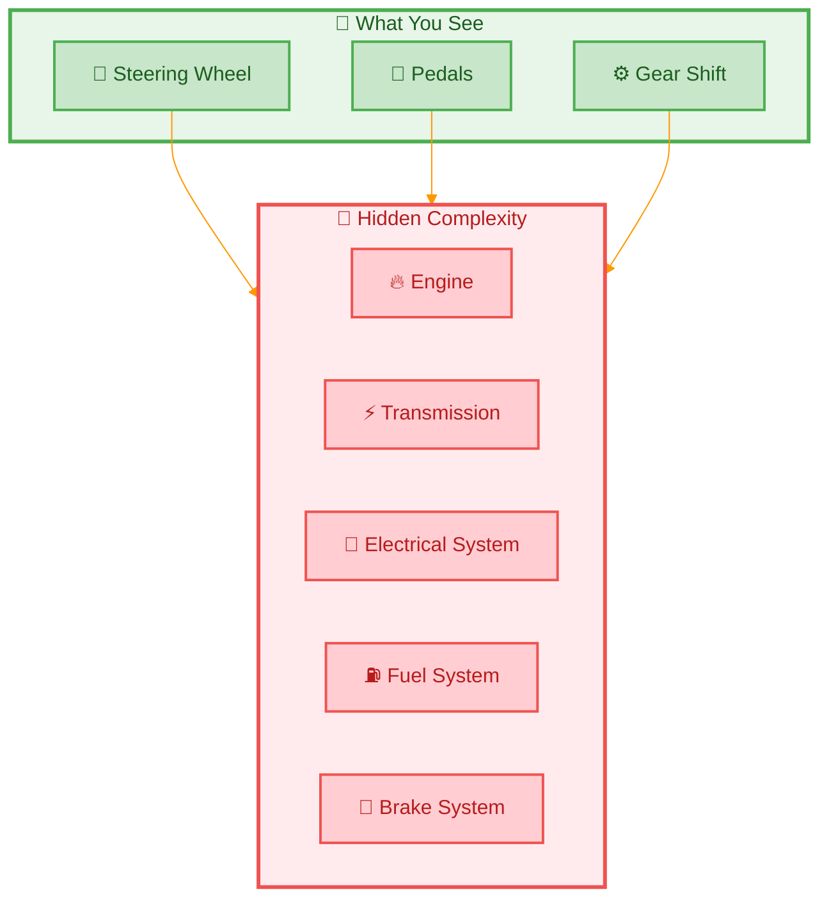

> **Key Concept:** Abstraction is like the dashboard of a car - it shows you only what you need to operate the vehicle while hiding all the complex machinery underneath.

### What is an Abstract Class?

An abstract class is a blueprint that defines what related objects should do, but cannot be instantiated directly. It can contain both complete methods (concrete) and incomplete methods (abstract) that subclasses must implement.

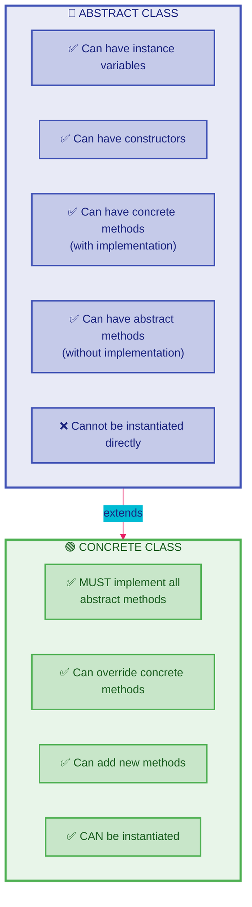

### Code Example: Animal Sounds
Let's create a simple system for animal sounds:

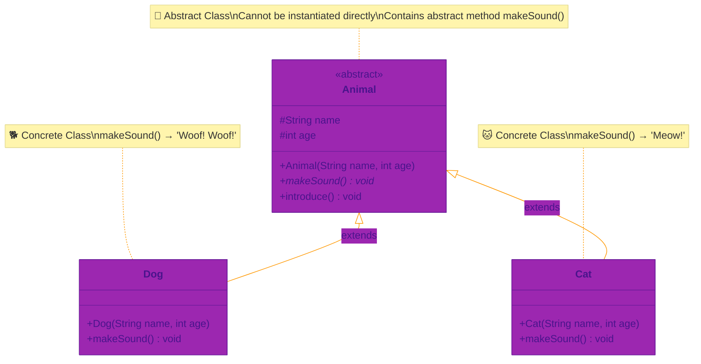

```java
// This is our abstract class - it defines what all animals can do
public abstract class Animal {
    // Properties that all animals have
    protected String name;
    protected int age;
    
    // Constructor to set up basic animal properties
    public Animal(String name, int age) {
        this.name = name;
        this.age = age;
    }
    
    // Abstract method - each animal must implement their own sound
    public abstract void makeSound();
    
    // Regular method all animals can use as-is
    public void introduce() {
        System.out.println("I am " + name + " and I am " + age + " years old");
    }
}

// A specific type of animal
public class Dog extends Animal {
    public Dog(String name, int age) {
        super(name, age);
    }
    
    // Dog's specific implementation of makeSound
    @Override
    public void makeSound() {
        System.out.println("Woof! Woof!");
    }
}

// Another type of animal
public class Cat extends Animal {
    public Cat(String name, int age) {
        super(name, age);
    }
    
    // Cat's specific implementation of makeSound
    @Override
    public void makeSound() {
        System.out.println("Meow!");
    }
}
```

Using these animals:
```java
public class Main {
    public static void main(String[] args) {
        // Create some animals
        Animal spot = new Dog("Spot", 3);
        Animal whiskers = new Cat("Whiskers", 2);
        
        // Make them introduce themselves and make sounds
        spot.introduce();      // Prints: I am Spot and I am 3 years old
        spot.makeSound();      // Prints: Woof! Woof!
        
        whiskers.introduce();  // Prints: I am Whiskers and I am 2 years old
        whiskers.makeSound();  // Prints: Meow!
    }
}
```

### DIY 1: Simple Shape System
Create a basic shape system with three classes: `Shape`, `Circle`, `Square`, and a `Main` class to test them.

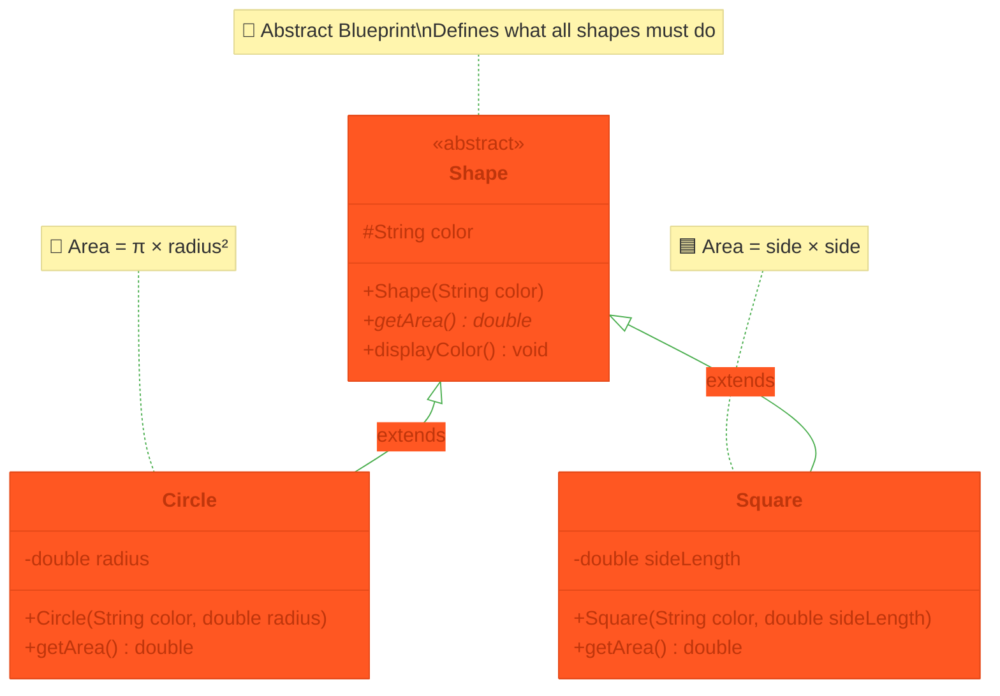

1. Create an abstract class named `Shape` - copy this code into a new file called `Shape.java`:
```java
public abstract class Shape {
    protected String color;
    
    public Shape(String color) {
        this.color = color;
    }
    
    // Every shape must implement this
    public abstract double getArea();
    
    // All shapes can use this as-is
    public void displayColor() {
        System.out.println("I am " + color + " in color");
    }
}
```

2. Create a class named `Circle` which extends the `Shape` class:
   - Add a `radius` instance variable (type `double`)
   - Add a constructor that takes `color` and `radius` as parameters
   - Implement the `getArea()` method using the formula: `π × radius²`

3. Create a class named `Square` which extends the `Shape` class:
   - Add a `sideLength` instance variable (type `double`)
   - Add a constructor that takes `color` and `sideLength` as parameters
   - Implement the `getArea()` method using the formula: `sideLength × sideLength`

4. Update the `Main` class to test your shapes:
```java
public class Main {
    public static void main(String[] args) {
        // Use Shape references (polymorphism)
        Shape circle = new Circle("Red", 5.0);
        Shape square = new Square("Blue", 4.0);
        
        // Test the circle below by calling the getArea() and displayColor() methods

        
        // Test the square below by calling the getArea() and displayColor() methods
  
    }
}
```

> **Note:** We use `Shape` as the reference type (`Shape circle = ...`) instead of `Circle` to demonstrate polymorphism - the same principle shown in the Animal example above.

**Expected output**
```text
Circle area: 78.53981633974483
I am Red in color
Square area: 16.0
I am Blue in color
```

<details><summary>Hint</summary>

Use `Math.PI * radius * radius` for the circle's area. To print an area with a label, use `System.out.println("Circle area: " + circle.getArea());` - and the same idea for the square.

</details>

## 2. Interfaces

### Real-World Example
Think of a power outlet. Any device with the right plug can connect to it, regardless of what the device does. The power outlet is like an interface - it defines a standard way of connecting.

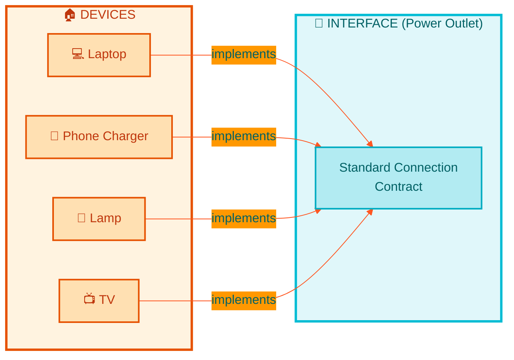

> **Key Concept:** An interface is like a contract - any class that "signs" the contract (implements the interface) promises to provide specific behaviors.

### Simple Code Example: Musical Instruments

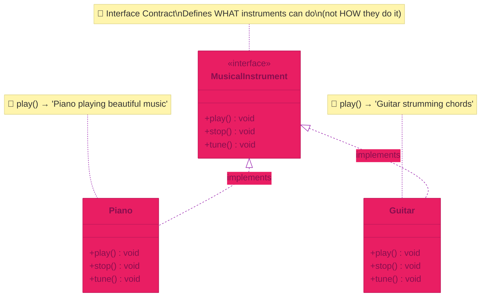

```java
// The interface defines what methods musical instruments must have
public interface MusicalInstrument {
    void play();
    void stop();
    void tune();
}

// A piano that implements the MusicalInstrument interface
public class Piano implements MusicalInstrument {
    @Override
    public void play() {
        System.out.println("Piano playing beautiful music");
    }
    
    @Override
    public void stop() {
        System.out.println("Piano stopped playing");
    }
    
    @Override
    public void tune() {
        System.out.println("Piano being tuned");
    }
}

// A guitar that also implements MusicalInstrument
public class Guitar implements MusicalInstrument {
    @Override
    public void play() {
        System.out.println("Guitar strumming chords");
    }
    
    @Override
    public void stop() {
        System.out.println("Guitar stopped playing");
    }
    
    @Override
    public void tune() {
        System.out.println("Guitar strings being tuned");
    }
}
```

### DIY 2: Simple Game Characters
Create a simple game character system:

1. Create an interface called `GameCharacter`:
```java
public interface GameCharacter {
    void move();
    void speak();
    void useItem();
}
```

2. Create two types of characters that implement this interface:
   - `Hero` - implements methods with heroic behavior (e.g., "Hero charges forward!", "For justice!", "Hero uses health potion!")
   - `Villain` - implements methods with villainous behavior (e.g., "Villain sneaks in shadows!", "You'll never stop me!", "Villain uses poison!")

3. Test your characters in the `Main` class:
```java
public class Main {
    public static void main(String[] args) {
        // Create game characters
        GameCharacter hero = new Hero();
        GameCharacter villain = new Villain();
        
        // Test the hero below by calling move(), speak(), and useItem()

        
        // Test the villain below by calling move(), speak(), and useItem()

    }
}
```

**Expected output**
```text
Hero charges forward!
For justice!
Hero uses health potion!
Villain sneaks in shadows!
You'll never stop me!
Villain uses poison!
```

<details><summary>Hint</summary>

Follow the `Piano` and `Guitar` pattern above: declare `public class Hero implements GameCharacter { ... }`, then give each of `move()`, `speak()`, and `useItem()` an `@Override` implementation that prints the character's line.

</details>

## 3. Abstract Classes vs. Interfaces

### Simple Comparison
Think of it this way:
- Abstract Class: "is-a" relationship (a Dog is an Animal)
- Interface: "can-do" relationship (a Bird can Fly)

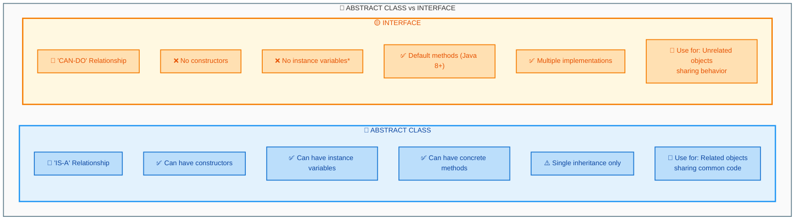

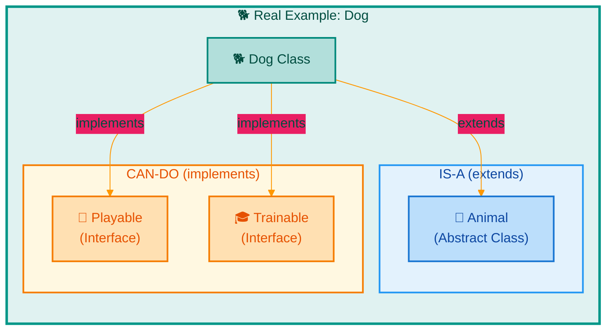

### Example: Pet Care System

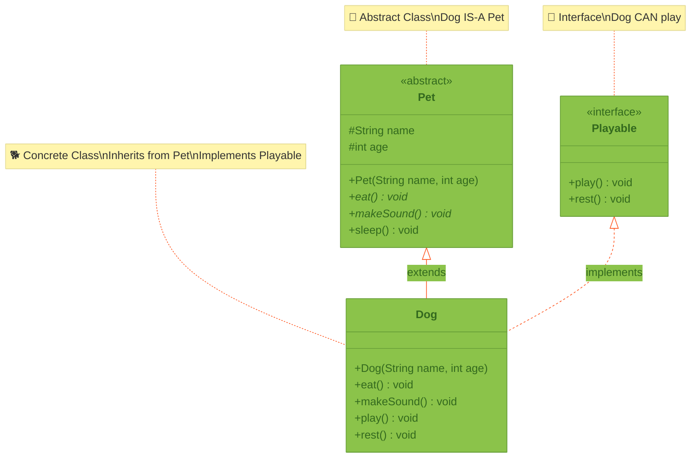

```java
// Interface for things pets can do
public interface Playable {
    void play();
    void rest();
}

// Abstract class for all pets
public abstract class Pet {
    protected String name;
    protected int age;
    
    public Pet(String name, int age) {
        this.name = name;
        this.age = age;
    }
    
    public abstract void eat();
    public abstract void makeSound();
    
    public void sleep() {
        System.out.println(name + " is sleeping...");
    }
}

// A dog is a pet that can play
public class Dog extends Pet implements Playable {
    public Dog(String name, int age) {
        super(name, age);
    }
    
    @Override
    public void eat() {
        System.out.println(name + " is eating dog food");
    }
    
    @Override
    public void makeSound() {
        System.out.println("Woof!");
    }
    
    @Override
    public void play() {
        System.out.println(name + " is playing fetch");
    }
    
    @Override
    public void rest() {
        System.out.println(name + " is resting after play");
    }
}
```

### DIY 3: School System
Create a simple school system:

1. Create an interface `Teachable`:
```java
public interface Teachable {
    void study();
    void doHomework();
}
```

2. Create an abstract class `Person`:
```java
public abstract class Person {
    protected String name;
    protected int age;
    
    public Person(String name, int age) {
        this.name = name;
        this.age = age;
    }
    
    public abstract void introduce();
}
```

3. Create a `Student` class that extends `Person` and implements `Teachable`:
   - Add a constructor that takes `name` and `age` parameters
   - Implement the `introduce()` method (e.g., "Hi, I'm [name] and I'm [age] years old")
   - Implement the `study()` method (e.g., "[name] is studying hard!")
   - Implement the `doHomework()` method (e.g., "[name] is doing homework...")

4. Test your `Student` class in the `Main` class:
```java
public class Main {
    public static void main(String[] args) {
        // Create a student
        Student student = new Student("Alice", 20);
        
        // Test the student below by calling introduce(), study(), and doHomework()

    }
}
```

**Expected output**
```text
Hi, I'm Alice and I'm 20 years old
Alice is studying hard!
Alice is doing homework...
```

<details><summary>Hint</summary>

`Student` uses both keywords in one declaration: `public class Student extends Person implements Teachable`. Its constructor should call `super(name, age)` to pass the values up to `Person`.

</details>

## 4. Practical Applications

### Why Program to an Interface?
When you write methods that accept an interface as a parameter, you can pass ANY class that implements that interface. This means:
- You can add new implementations without changing existing code
- Your code becomes more flexible and reusable
- Testing becomes easier (you can create mock implementations)

### The SOLID Principles: Open/Closed Principle

This approach follows one of the most important software design principles - the **Open/Closed Principle (OCP)**, which is the "O" in **SOLID**:

> **"Software entities should be open for extension, but closed for modification."**

What does this mean in practice?

| Concept | Meaning | Example |
|---------|---------|---------|
| **Open for Extension** | You can add new functionality | Add a new `EmailService` class that implements `MessageService` |
| **Closed for Modification** | You don't need to change existing code | The `NotificationManager` class doesn't need ANY changes to work with the new `EmailService` |

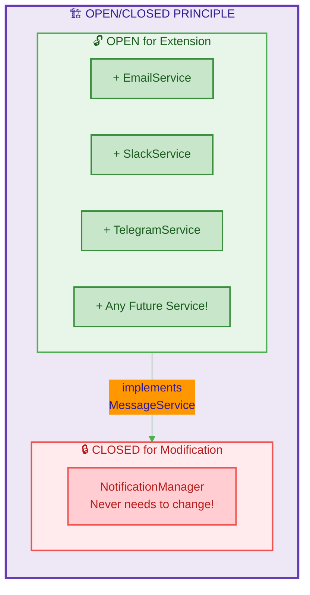

> **Why is this important?** In real-world applications, modifying existing code can introduce bugs. By following the Open/Closed Principle, you can add new features without risking breaking what already works!

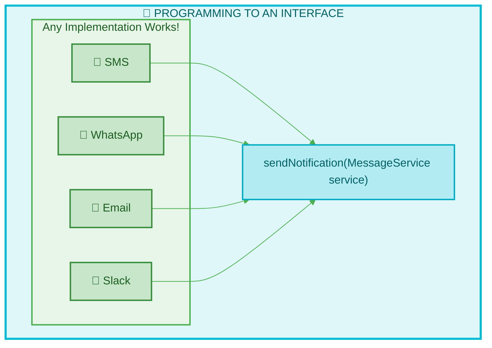

### DIY 4: Messaging System
Create a messaging system that demonstrates programming to an interface:

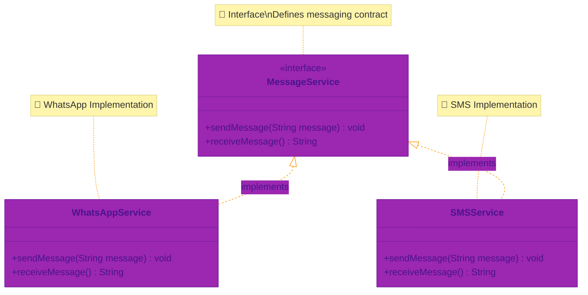

1. Create the `MessageService` interface:
```java
public interface MessageService {
    void sendMessage(String message);
    String receiveMessage();
}
```

2. Create a `WhatsAppService` class that implements `MessageService`:
   - Implement `sendMessage()` to print: "WhatsApp: Sending message - [message]"
   - Implement `receiveMessage()` to return: "WhatsApp: New message received!"

3. Create an `SMSService` class that implements `MessageService`:
   - Implement `sendMessage()` to print: "SMS: Sending text - [message]"
   - Implement `receiveMessage()` to return: "SMS: New text received!"

4. Create a `NotificationManager` class with a method that takes the interface as a parameter:
```java
public class NotificationManager {
    
    // This method accepts ANY MessageService implementation!
    public void sendNotification(MessageService service, String message) {
        System.out.println("Preparing to send notification...");
        service.sendMessage(message);
        System.out.println("Notification sent successfully!");
    }
}
```

5. Test everything in the `Main` class:
```java
public class Main {
    public static void main(String[] args) {
        // Create the notification manager
        NotificationManager manager = new NotificationManager();
        
        // Create different messaging services
        MessageService whatsapp = new WhatsAppService();
        MessageService sms = new SMSService();
        
        // Use the SAME method with DIFFERENT implementations!
        System.out.println("--- Sending via WhatsApp ---");
        manager.sendNotification(whatsapp, "Hello from WhatsApp!");
        
        System.out.println();
        
        System.out.println("--- Sending via SMS ---");
        manager.sendNotification(sms, "Hello from SMS!");
        
        // Test receiving messages
        System.out.println();
        System.out.println(whatsapp.receiveMessage());
        System.out.println(sms.receiveMessage());
    }
}
```

**Expected output**
```text
--- Sending via WhatsApp ---
Preparing to send notification...
WhatsApp: Sending message - Hello from WhatsApp!
Notification sent successfully!

--- Sending via SMS ---
Preparing to send notification...
SMS: Sending text - Hello from SMS!
Notification sent successfully!

WhatsApp: New message received!
SMS: New text received!
```

<details><summary>Hint</summary>

Watch the difference between the two methods: `sendMessage()` prints its line with `System.out.println`, but `receiveMessage()` must `return` its String - `Main` does the printing.

</details>

> **Key Takeaway:** The `NotificationManager.sendNotification()` method doesn't care whether it receives a `WhatsAppService` or `SMSService` - it just knows how to work with any `MessageService`. This is the power of programming to an interface!

## Summary
Through these examples and exercises, we've learned that:
- Abstraction helps hide complex details
- Abstract classes provide a blueprint for related objects
- Interfaces define what actions an object can perform
- Both help write cleaner, more organized code

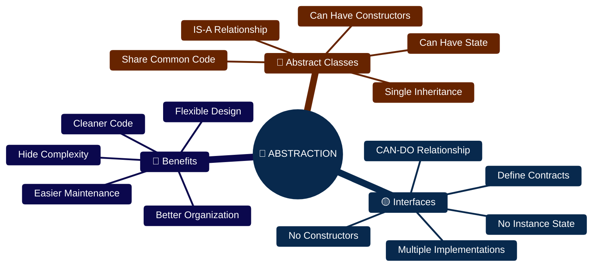

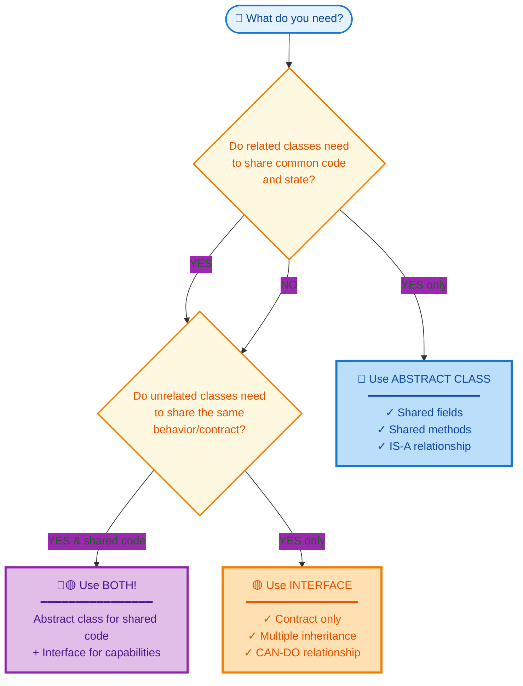

**Quick Reference Table:**

| Scenario | Use | Example |
|----------|-----|---------|
| Classes share code & state | 🔷 Abstract Class | `Animal` → `Dog`, `Cat` |
| Unrelated classes, same behavior | 🟡 Interface | `Flyable` → `Bird`, `Airplane` |
| Both shared code AND shared behavior | 🔷🟡 Both | `Pet` + `Playable` → `Dog` |

Remember: Start simple, and add complexity only when needed!
