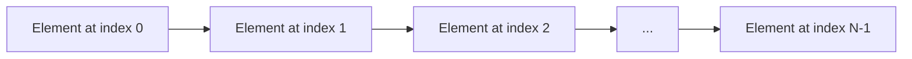

# Java Arrays Lab

## What you'll learn

- Declare, initialize, and iterate over arrays using indexed and enhanced `for` loops
- Predict the default values Java assigns to uninitialized array elements
- Modify array elements and build arrays of objects
- Copy, clone, sort, search, and compare arrays with `System.arraycopy`, `clone()`, and the `java.util.Arrays` utility class
- Work with 2D arrays and pass arrays to and from methods

## Table of Contents

1. [Introduction](#1-introduction)
2. [Default Values in Arrays](#2-default-values-in-arrays)
3. [Declaring and Assigning Arrays](#3-declaring-and-assigning-arrays)
4. [Accessing and Iterating Over Array Elements](#4-accessing-and-iterating-over-array-elements)
5. [Array Length and Modifying Arrays](#5-array-length-and-modifying-arrays)
6. [Arrays of Objects](#6-arrays-of-objects)
7. [Common Array Operations](#7-common-array-operations)
8. [2D Arrays](#8-2d-arrays)
9. [Passing Arrays to Methods](#9-passing-arrays-to-methods)

## Getting started

This lab lives in the package `ie.atu.arrays` - this folder. A runnable `Main.java` is already here: open this folder in VS Code or your Codespace, click ▶ on `Main.java` to check your setup works, then write each exercise's classes beside it in the same package.

## 1. Introduction

In Java, an array is a collection of variables of the same type, stored in a contiguous block of memory. Arrays allow you to store multiple values in a single variable, which can be accessed using an index. Understanding arrays is fundamental in programming as they provide a way to manage and manipulate data efficiently.

### Key Concepts

- **Fixed Size**: Once an array is created, its size cannot be changed.
- **Zero-Based Indexing**: Array indexing starts at 0.
- **Homogeneous Elements**: All elements in an array are of the same data type.

#### Array Structure



## 2. Default Values in Arrays

Before we delve deeper into arrays, it's important to understand the default values assigned to array elements when they are not explicitly initialized.

- **Numeric Types**: Default to `0`.
- **`char`**: Defaults to `'\u0000'` (the null character).
- **`boolean`**: Defaults to `false`.
- **Reference Types**: Defaults to `null`.

### Code Example

```java
public class DefaultValues {
    public static void main(String[] args) {
        int[] intArray = new int[3];
        boolean[] boolArray = new boolean[3];
        String[] stringArray = new String[3];

        System.out.println("Default int values:");
        for (int num : intArray) {
            System.out.print(num + " ");
        }

        System.out.println("\nDefault boolean values:");
        for (boolean bool : boolArray) {
            System.out.print(bool + " ");
        }

        System.out.println("\nDefault String values:");
        for (String str : stringArray) {
            System.out.print(str + " ");
        }
    }
}
```

<details>
<summary>Output</summary>

```
Default int values:
0 0 0 
Default boolean values:
false false false 
Default String values:
null null null 
```

</details>

### DIY 1: Default char values

1. Declare an array of `char` with a size of 4.
2. Using a loop, print each element on a single line, separated by spaces.

**Expected output**

```text
    
```

*(The line looks blank: each `char` element defaults to `'\u0000'`, the invisible NUL character, so you are printing four characters that have no visible glyph - only their separating spaces show.)*

<details>
<summary>Hint</summary>

Do not initialize the array elements; simply print them using a loop.

</details>

## 3. Declaring and Assigning Arrays

There are several ways to declare and initialize arrays in Java.

### Declaration Without Initialization

```java
int[] numbers; // Declares an array of integers
```

### Declaration With Initialization

```java
int[] numbers = new int[5]; // Declares an array and allocates memory for 5 integers
```

### Inline Initialization

```java
int[] numbers = {1, 2, 3, 4, 5}; // Declares and initializes the array with values
```

### Using the `new` Keyword with Initialization

```java
int[] numbers = new int[]{1, 2, 3, 4, 5};
```

### Code Example

```java
public class ArrayDeclaration {
    public static void main(String[] args) {
        // Method 1: Declaration without initialization
        int[] array1;
        array1 = new int[3]; // Now initialized with default values (0, 0, 0)

        // Method 2: Declaration with size
        int[] array2 = new int[3]; // Initialized with default values

        // Method 3: Inline initialization
        int[] array3 = {1, 2, 3};

        // Method 4: Using new keyword with initialization
        int[] array4 = new int[]{4, 5, 6};

        // Displaying array elements
        for (int num : array3) {
            System.out.print(num + " ");
        }
    }
}
```

<details>
<summary>Output</summary>

```
1 2 3 
```

</details>

### DIY 2: Inline initialization

1. Declare an array of `double` containing the values `1.5`, `2.5`, `3.5` and `4.5`.
2. Print each element on one line, separated by spaces.

**Expected output**

```text
1.5 2.5 3.5 4.5 
```

<details>
<summary>Hint</summary>

Use inline initialization similar to the examples above.

</details>

## 4. Accessing and Iterating Over Array Elements

After declaring and initializing an array, you can access its elements using indices and iterate over them using loops.

### Accessing Elements by Index

```java
int[] numbers = {10, 20, 30, 40, 50};
int firstNumber = numbers[0]; // Accessing the first element
System.out.println("First number: " + firstNumber);
```

### Iterating Using Loops

#### Using a Traditional `for` Loop

<!-- no-compile -->
```java
for (int i = 0; i < numbers.length; i++) {
    System.out.println("Element at index " + i + ": " + numbers[i]);
}
```

#### Using an Enhanced `for` Loop (For-Each Loop)

The enhanced `for` loop (also called a for-each loop) provides a simpler way to iterate over arrays. It automatically handles the indexing for you.

<!-- no-compile -->
```java
for (int num : numbers) {
    System.out.println(num);
}
```

### Code Example

```java
public class ArrayIteration {
    public static void main(String[] args) {
        int[] numbers = {5, 10, 15, 20};

        // Accessing elements by index
        System.out.println("First element: " + numbers[0]);
        System.out.println("Last element: " + numbers[numbers.length - 1]);

        // Iterating using traditional for loop
        System.out.println("Using traditional for loop:");
        for (int i = 0; i < numbers.length; i++) {
            System.out.println("Element at index " + i + ": " + numbers[i]);
        }

        // Iterating using enhanced for loop
        System.out.println("Using enhanced for loop:");
        for (int num : numbers) {
            System.out.println(num);
        }
    }
}
```

<details>
<summary>Output</summary>

```
First element: 5
Last element: 20
Using traditional for loop:
Element at index 0: 5
Element at index 1: 10
Element at index 2: 15
Element at index 3: 20
Using enhanced for loop:
5
10
15
20
```

</details>

### DIY 3: Reverse order

1. Create the array `int[] numbers = {5, 10, 15, 20};`.
2. Print all elements in reverse order, one per line.

**Expected output**

```text
20
15
10
5
```

<details>
<summary>Hint</summary>

Use a `for` loop starting from the last index.

</details>

## 5. Array Length and Modifying Arrays

### Array Length

The length of an array refers to the number of elements it can hold. In Java, you can access the length using the `.length` property.

```java
public class ArrayLength {
    public static void main(String[] args) {
        int[] numbers = {10, 20, 30, 40, 50};
        System.out.println("The length of the array is: " + numbers.length);
    }
}
```

<details>
<summary>Output</summary>

```
The length of the array is: 5
```

</details>

### DIY 4: Rainbow colors

1. Create a `String` array containing the seven colors of the rainbow.
2. Calculate the length of the array and print it in the form `Number of colors: <length>`.

**Expected output**

```text
Number of colors: 7
```

<details>
<summary>Hint</summary>

Create an array and use the `.length` property to get its size.

</details>

### Modifying Arrays

You can modify array elements by accessing them via their index and assigning new values.

```java
public class ModifyArray {
    public static void main(String[] args) {
        String[] fruits = {"Apple", "Banana", "Cherry"};
        fruits[1] = "Blueberry"; // Modifies the second element

        // Displaying modified array
        for (String fruit : fruits) {
            System.out.print(fruit + " ");
        }
    }
}
```

<details>
<summary>Output</summary>

```
Apple Blueberry Cherry 
```

</details>

### DIY 5: Update an element

1. Create the array `int[] nums = {10, 20, 30, 40};`.
2. Change the third element to `35`.
3. Print all elements on one line, separated by spaces.

**Expected output**

```text
10 20 35 40 
```

<details>
<summary>Hint</summary>

Access the element at index 2 and assign a new value.

</details>

## 6. Arrays of Objects

Arrays in Java can store objects, not just primitive data types. Below we have a Student class. In the ArrayOfObjects class we will create a students array which will hold Student objects.

### Code Example

```java
class Student {
    private String name;
    private int age;

    // Constructor
    Student(String name, int age) {
        this.name = name;
        this.age = age;
    }

    // Getter methods
    String getName() {
        return name;
    }

    int getAge() {
        return age;
    }
}
```

```java
public class ArrayOfObjects {
    public static void main(String[] args) {
        // Array of Strings (which are objects in Java)
        String[] names = {"Alice", "Bob", "Charlie"};

        // Array of custom objects
        Student[] students = new Student[2];

        students[0] = new Student("Dave", 20);
        students[1] = new Student("Eva", 22);

        for (Student student : students) {
            System.out.println(student.getName() + " is " + student.getAge() + " years old.");
        }
    }
}
```

<details>
<summary>Output</summary>

```
Dave is 20 years old.
Eva is 22 years old.
```

</details>

### DIY 6: Array of Book objects

1. Define a `Book` class with `title` and `author` fields, a constructor, and getter methods (model it on the `Student` class above).
2. Create a `Book[]` array holding `new Book("Dracula", "Bram Stoker")` and `new Book("Emma", "Jane Austen")`.
3. Loop over the array and print each book's details in the form `<title> by <author>`.

**Expected output**

```text
Dracula by Bram Stoker
Emma by Jane Austen
```

<details>
<summary>Hint</summary>

Define a `Book` class with appropriate attributes and methods.

</details>

## 7. Common Array Operations

Java gives you several ready-made ways to copy, sort, search, compare, and clone arrays.

### Copying Arrays

You can copy arrays using methods like `System.arraycopy()`.

```java
public class CopyArray {
    public static void main(String[] args) {
        int[] original = {1, 2, 3};
        int[] copy = new int[original.length];

        System.arraycopy(original, 0, copy, 0, original.length);

        // Modify the copy
        copy[0] = 10;

        // Display both arrays
        System.out.println("Original array: " + java.util.Arrays.toString(original));
        System.out.println("Copied array: " + java.util.Arrays.toString(copy));
    }
}
```

<details>
<summary>Output</summary>

```
Original array: [1, 2, 3]
Copied array: [10, 2, 3]
```

</details>

### Sorting Arrays

You can sort arrays using `Arrays.sort()`.

```java
import java.util.Arrays;

public class SortArray {
    public static void main(String[] args) {
        int[] numbers = {5, 3, 2, 4, 1};
        Arrays.sort(numbers);
        System.out.println("Sorted array: " + Arrays.toString(numbers));
    }
}
```

<details>
<summary>Output</summary>

```
Sorted array: [1, 2, 3, 4, 5]
```

</details>

### DIY 7: Copy, then sort

1. Start with `int[] original = {5, 3, 2, 4, 1};`.
2. Copy it into a new array, then sort the copy - the original must stay unchanged.
3. Print both arrays using `Arrays.toString()`, labelled as shown below.

**Expected output**

```text
Original array: [5, 3, 2, 4, 1]
Sorted copy: [1, 2, 3, 4, 5]
```

<details>
<summary>Hint</summary>

Use `System.arraycopy` and `Arrays.sort`.

</details>

### The Arrays Utility Class

The `java.util.Arrays` class provides utility methods for array manipulation.

#### Converting Arrays to Strings

```java
import java.util.Arrays;

public class ArraysToString {
    public static void main(String[] args) {
        String[] fruits = {"Apple", "Banana", "Cherry"};
        System.out.println(Arrays.toString(fruits));
    }
}
```

<details>
<summary>Output</summary>

```
[Apple, Banana, Cherry]
```

</details>

#### Searching Arrays

```java
import java.util.Arrays;

public class ArraySearch {
    public static void main(String[] args) {
        int[] numbers = {1, 2, 3, 4, 5};
        int index = Arrays.binarySearch(numbers, 3);
        System.out.println("Index of 3: " + index);
    }
}
```

<details>
<summary>Output</summary>

```
Index of 3: 2
```

</details>

### DIY 8: Compare two arrays

1. Create `int[] array1 = {1, 2, 3};`, `int[] array2 = {1, 2, 3};` and `int[] array3 = {3, 2, 1};`.
2. Use the `Arrays` class to check whether `array1` equals `array2`, and whether `array1` equals `array3`.
3. Print each result in the form shown below.

**Expected output**

```text
array1 equals array2: true
array1 equals array3: false
```

<details>
<summary>Hint</summary>

Use `Arrays.equals(array1, array2)`.

</details>

### Cloning Arrays

You can also create a copy of an array using the `clone()` method.

```java
public class CloneArray {
    public static void main(String[] args) {
        int[] original = {1, 2, 3};
        int[] clone = original.clone();

        // Modify the clone
        clone[0] = 10;

        // Display both arrays
        System.out.println("Original array: " + java.util.Arrays.toString(original));
        System.out.println("Cloned array: " + java.util.Arrays.toString(clone));
    }
}
```

<details>
<summary>Output</summary>

```
Original array: [1, 2, 3]
Cloned array: [10, 2, 3]
```

</details>

### DIY 9: Clone independence

1. Create `String[] original = {"Apple", "Banana", "Cherry"};` and clone it.
2. Change the first element of the clone to `"Avocado"`.
3. Print both arrays using `Arrays.toString()`, labelled as shown below, to show the original is unaffected.

**Expected output**

```text
Original array: [Apple, Banana, Cherry]
Cloned array: [Avocado, Banana, Cherry]
```

<details>
<summary>Hint</summary>

Verify the independence of the arrays after modification.

</details>

## 8. 2D Arrays

A 2D array is an array of arrays, useful for representing grids or tables.

### Declaration and Initialization

```java
int[][] matrix = new int[3][3]; // 3x3 matrix with default values

int[][] predefinedMatrix = {
    {1, 2, 3},
    {4, 5, 6},
    {7, 8, 9}
};
```

### Code Example

```java
public class TwoDArray {
    public static void main(String[] args) {
        int[][] matrix = {
            {1, 2, 3}, // Row 0
            {4, 5, 6}, // Row 1
            {7, 8, 9}  // Row 2
        };

        // Accessing element at row 1, column 2
        System.out.println("Element at (1,2): " + matrix[1][2]);

        // Modifying element at row 0, column 0
        matrix[0][0] = 10;

        // Displaying the 2D array
        for (int i = 0; i < matrix.length; i++) { // Rows
            for (int j = 0; j < matrix[i].length; j++) { // Columns
                System.out.print(matrix[i][j] + " ");
            }
            System.out.println();
        }
    }
}
```

<details>
<summary>Output</summary>

```
Element at (1,2): 6
10 2 3 
4 5 6 
7 8 9 
```

</details>

### DIY 10: Sum a 2D array

1. Create a 2D array representing the following table:

   ```text
   1 2 3
   4 5 6
   7 8 9
   ```

2. Add up every element in the array.
3. Print the total in the form `Sum of all elements: <total>`.

**Expected output**

```text
Sum of all elements: 45
```

<details>
<summary>Hint</summary>

Use nested loops to traverse the 2D array and accumulate the sum.

</details>

## 9. Passing Arrays to Methods

Arrays can be passed to methods as parameters, and methods can return arrays.

### Code Example

```java
public class ArrayMethods {
    public static void main(String[] args) {
        int[] numbers = {1, 2, 3};
        printArray(numbers);

        int[] squaredNumbers = squareArray(numbers);
        System.out.println("Squared array: " + java.util.Arrays.toString(squaredNumbers));
    }

    // Method to print array elements
    public static void printArray(int[] array) {
        for (int num : array) {
            System.out.print(num + " ");
        }
        System.out.println();
    }

    // Method to return a new array with squared elements
    public static int[] squareArray(int[] array) {
        int[] result = new int[array.length];
        for (int i = 0; i < array.length; i++) {
            result[i] = array[i] * array[i];
        }
        return result;
    }
}
```

<details>
<summary>Output</summary>

```
1 2 3 
Squared array: [1, 4, 9]
```

</details>

### DIY 11: Double the values

1. Write a method that takes an array of integers and returns a new array with each element doubled.
2. In `main`, call your method with the array `{1, 2, 3}` and print the returned array using `Arrays.toString()`, labelled as shown below.

**Expected output**

```text
Doubled array: [2, 4, 6]
```

<details>
<summary>Hint</summary>

Iterate over the input array, double each element, and store it in a new array.

</details>

## Summary

In this lab, we've covered:

- Various methods to declare and initialize arrays.
- Default values assigned to array elements.
- Accessing and iterating over array elements using traditional and enhanced for loops.
- Utilizing the array's length.
- Modifying elements within an array.
- Arrays of objects and how to work with them.
- Common array operations like copying, sorting, and searching.
- Utilizing the `Arrays` utility class for array manipulation.
- Cloning arrays to create independent copies.
- Understanding and working with 2D arrays.
- Passing arrays to methods.

Arrays are a foundational aspect of Java programming, enabling efficient data storage and manipulation. Mastery of arrays will significantly aid in understanding more complex data structures and algorithms.
