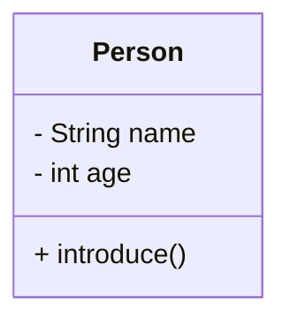
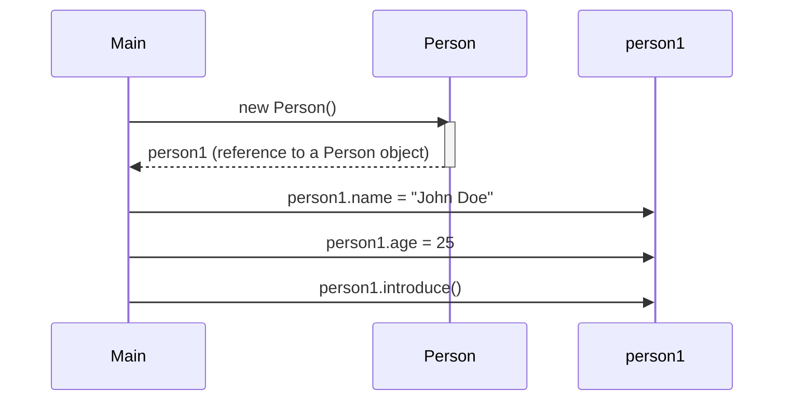
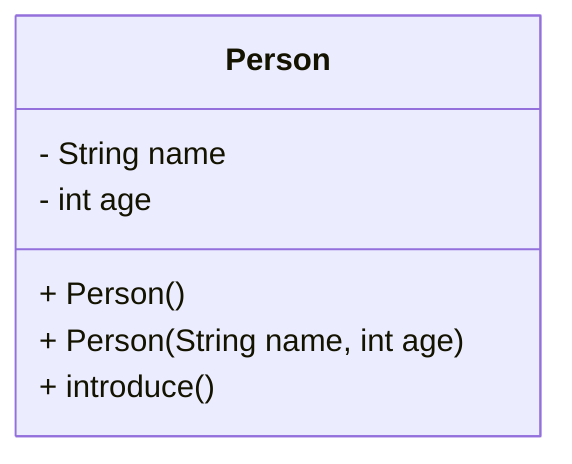
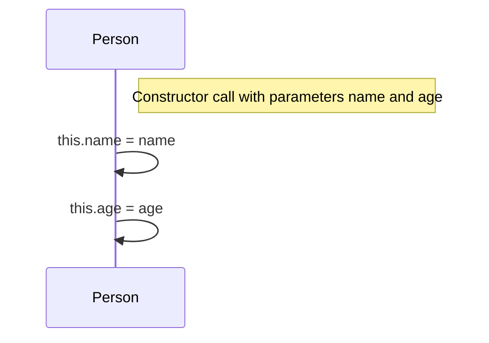

# Java Classes and Objects Lab

## What you'll learn

* How to define a class with fields and methods, and create objects from it with `new`
* How to initialize objects with default and parameterized constructors
* How to use the `this` keyword to resolve name clashes and chain constructors
* The difference between reference identity (`==`) and logical equality (`equals()`)
* How the Single Responsibility Principle (SRP) and `toString()` keep classes focused

## Table of Contents

1. [Introduction](#1-introduction)
2. [Defining Classes](#2-defining-classes)
3. [Creating Objects](#3-creating-objects)
4. [Constructors](#4-constructors)
5. [The `this` Keyword](#5-the-this-keyword)
6. [Reference Variables vs Object Identity](#6-reference-variables-vs-object-identity)
7. [Single Responsibility Principle (SRP)](#7-single-responsibility-principle-srp)

## Getting started

This lab lives in the package `ie.atu.classesandobjects` - this folder. A runnable `Main.java` is already here: open this folder in VS Code or your Codespace, click ▶ on `Main.java` to check your setup works, then write each exercise's classes beside it in the same package.

---

## 1. Introduction

Object-Oriented Programming (OOP) is a powerful programming paradigm that organizes code around "objects" rather than actions and data. Instead of focusing on procedures (like in procedural programming), OOP emphasizes *objects* which encapsulate both data (attributes or fields) and the actions that can be performed on that data (methods or functions). This approach offers several key advantages:

* **Modularity:** Code is broken down into reusable objects, making it easier to manage, understand, and maintain large projects. Changes to one object are less likely to affect others.
* **Reusability:** Objects can be reused in different parts of a program or even in different projects.
* **Maintainability:** The modular nature makes debugging and updating code significantly easier.
* **Scalability:** OOP principles help build programs that can easily handle increasing amounts of data and complexity.

In Java, OOP is implemented through the use of *classes* and *objects*.

**Key concepts:**

* **Classes:** Think of a class as a blueprint or template. It defines the *structure* (what data an object will hold, represented by fields/attributes/member variables) and *behavior* (what actions an object can perform, represented by methods/functions/member methods) of objects.

* **Objects:** Objects are the concrete instances of a class. They are the actual things created based on the class's blueprint. An object holds specific values for the fields defined in its class and can execute the methods defined in that class. For example, you could have a `Car` class as a blueprint, and then create many different `Car` *objects*, each representing a specific car with its own make, model, and year.

As you work through this lab, think about how real-world objects can be represented as classes: attributes are what *describe* an object; behaviors are what it can *do*.

---

## 2. Defining Classes

In Java, a class is defined using the `class` keyword, followed by the class name, and enclosed in curly braces `{}`. Inside the curly braces, you declare the fields (data) and methods (behavior) that define the class. The `public` keyword means this class is accessible from anywhere. You'll learn about other access modifiers (like `private`, `protected`) later.

**Example:** let's define a `Person` class with some attributes and methods.

```java
class Person {
  // Fields
  String name;
  int age;

  // Methods
  void introduce() {
    System.out.println("Hi, I'm " + name + " and I'm " + age + " years old.");
  }
}
```



### DIY 1: Define the `Student` class

1. Define a class named `Student`.
2. Add fields: `String studentID`, `int age`, `boolean isRegistered`.
3. Write a method `displayInfo()` that prints the student's details. Make sure the output is neatly formatted.

**Expected output** (when `displayInfo()` is called - here for a student with ID `S00123`, age `20`, registered):

```text
Student ID: S00123
Age: 20
Registered: true
```

<details>
<summary>Hint</summary>

Model `displayInfo()` on the `Person` class's `introduce()` method: build each line with string concatenation (`+`) inside `System.out.println(...)`.

</details>

---

## 3. Creating Objects

A class is just a blueprint; to actually use it, you need to create an *object* - an instance of the class. This is done using the `new` keyword, followed by a call to the class's constructor (we'll cover constructors in detail next).

**Syntax:**

<!-- no-compile -->
```java
ClassName objectName = new ClassName(); // Using the default constructor
```

or

<!-- no-compile -->
```java
ClassName objectName = new ClassName(parameters); // Using a parameterized constructor (explained later)
```

This creates a new object of type `ClassName` and assigns its reference (memory address) to the variable `objectName`. You can then access the object's fields and call its methods using the dot operator (`.`).

**Example:** using the `Person` class defined earlier, let's create an object.

<!-- no-compile -->
```java
public class Main {
  public static void main(String[] args) {
    // Creating an object of Person class
    Person person1 = new Person(); // creates a new person object using the default constructor (assuming it exists).
    person1.name = "John Doe";
    person1.age = 25;

    // Calling the method
    person1.introduce(); // Output: Hi, I'm John Doe and I'm 25 years old.
  }
}
```



### DIY 2: Create a `Student` object

1. In `Main.java`'s `main` method (this is where your program execution starts), create an instance of `Student`.
2. Assign values to its fields (`studentID`, `age`, `isRegistered`). This requires a default constructor, or setting the values after creating the object, as we did in the `Person` example.
3. Call the `displayInfo()` method to print the student's details.

**Expected output** (a representative run - yours shows whatever values you assigned):

```text
Student ID: S00123
Age: 20
Registered: true
```

<details>
<summary>Hint</summary>

Reach the object's fields and methods through the reference with the dot operator: `student1.studentID = "S00123";` then `student1.displayInfo();`.

</details>

---

## 4. Constructors

Constructors are special methods within a class that are automatically called when you create a new object using the `new` keyword. They are used to initialize the object's fields to initial values. They have the same name as the class and do *not* have a return type (not even `void`).

* **Default Constructor**: If you don't explicitly define any constructors, Java provides a default constructor that does nothing (sets fields to default values like 0 for numbers, `null` for strings, `false` for booleans).

* **Parameterized Constructor**: These allow you to pass values to the constructor when creating an object. This lets you initialize an object with specific values right from the start.

**Default constructor example** (this is what the compiler would create implicitly if you don't define any constructors):

```java
class Person {
  String name;
  int age;

  // Default constructor (implicitly provided if you define no constructors)
  // public Person(){}
}
```

**Parameterized constructor example:**

```java
class Person {
  String name;
  int age;

  // Parameterized constructor
  Person(String personName, int personAge) {
    name = personName;
    age = personAge;
  }
}
```



**Example:** using the `Person` class with constructors.

<!-- no-compile -->
```java
public class Main {
  public static void main(String[] args) {
    // Using default constructor (implicitly created by compiler, if you define no other constructors)
    Person person1 = new Person(); // This implicitly calls the parameterless constructor.
    person1.introduce(); // Output: Hi, I'm null and I'm 0 years old. (or similar, depending on the default values)

    // Using parameterized constructor
    Person person2 = new Person("Alice", 30);
    person2.introduce(); // Output: Hi, I'm Alice and I'm 30 years old.
  }
}
```

### DIY 3: Add constructors

1. In your `Student` class, add a default constructor that sets reasonable default values for the fields (`studentID`, `age`, `isRegistered`). For example, you might set `studentID` to "N/A".
2. Add a parameterized constructor that accepts `studentID`, `age`, and `isRegistered` as parameters and initializes the object's fields with those values.
3. Modify your `Main` class to create a `Student` object using the default constructor and call `displayInfo()`.
4. Create another `Student` object using the parameterized constructor and call `displayInfo()`.

**Expected output**

```text
Student ID: N/A
Age: 0
Registered: false

Student ID: S00234
Age: 22
Registered: true
```

<details>
<summary>Hint</summary>

A constructor has the same name as the class and no return type - not even `void`. The parameterized constructor should copy each parameter into the matching field.

</details>

---

## 5. The `this` Keyword

The `this` keyword is a reference to the current object instance. It's primarily used in two scenarios:

1. **Distinguishing between instance variables and parameters:** When a parameter's name is the same as an instance variable, `this` clarifies which one you're referring to.
2. **Calling other constructors (constructor chaining):** `this()` can be used inside a constructor to call another constructor of the same class. This reduces redundancy, particularly if you have several constructors with similar initialization steps.

**Example (scenario 1):**

```java
class Person {
  String name;
  int age;

  Person(String name, int age) {
    this.name = name; // 'this.name' refers to the class field; 'name' refers to the constructor parameter
    this.age = age;
  }
}
```

**Example (scenario 2): constructor chaining**

```java
class Person {
  String name;
  int age;
  String city;

  Person(String name, int age) {
    this(name, age, "Unknown"); // calls the constructor below
  }

  Person(String name, int age, String city) {
    this.name = name;
    this.age = age;
    this.city = city;
  }
}
```



**Example in `Student`:**

```java
class Student {
  String studentID;
  int age;
  boolean isRegistered;

  // Default constructor using this() to call parameterized constructor
  Student() {
    this("N/A", 0, false);
  }

  // Parameterized constructor using 'this'
  Student(String studentID, int age, boolean isRegistered) {
    this.studentID = studentID;
    this.age = age;
    this.isRegistered = isRegistered;
  }

  void displayInfo() {
    System.out.println("Student ID: " + this.studentID);
    System.out.println("Age: " + this.age);
    System.out.println("Registered: " + this.isRegistered);
  }
}
```

### DIY 4: Use `this` and constructor chaining

1. Update your `Student` class so both constructors use the `this` keyword to refer to class fields where appropriate.
2. In the default constructor, call the parameterized constructor using `this(...)` for constructor chaining.
3. Use `this` in the `displayInfo()` method where appropriate (though it's not strictly necessary here).
4. Verify that your program still works as expected.

**Expected output** (unchanged from DIY 3 - this refactor must not change behavior):

```text
Student ID: N/A
Age: 0
Registered: false

Student ID: S00234
Age: 22
Registered: true
```

<details>
<summary>Hint</summary>

`this.field = field` is what lets a parameter share its field's name: the bare name always means the nearest one, which is the parameter, so `this.` is how you reach past it to the field. For step 2, `this(...)` must be the **first** statement in the constructor - the compiler rejects it anywhere else, because the other constructor has to finish before your body starts adding to its work.

</details>

---

## 6. Reference Variables vs Object Identity

In Java, variables of a class type hold **references** to objects, not the objects themselves. Two different variables can reference the **same** object, or two different objects can have the **same field values** but be distinct in memory.

* `==` compares **reference identity** (are the two references pointing to the *same* object?).
* `equals()` compares **logical equality** (do the two objects represent the same value/meaning?). By default, `Object.equals()` behaves like `==` unless you override it.

**Example:**

```java
Student s1 = new Student("S001", 20, true);
Student s2 = s1; // s2 references the same object as s1
Student s3 = new Student("S001", 20, true); // same data, different object

System.out.println(s1 == s2);   // true (same identity)
System.out.println(s1 == s3);   // false (different objects)

System.out.println(s1.equals(s3)); // false unless equals() is overridden
```

**Overriding `equals()` and `hashCode()`:**

```java
class Student {
  String studentID;
  int age;
  boolean isRegistered;

  // constructors omitted for brevity

  @Override
  public boolean equals(Object o) {
    if (this == o) return true;
    if (o == null || getClass() != o.getClass()) return false;
    Student other = (Student) o;
    return studentID != null && studentID.equals(other.studentID);
  }

  @Override
  public int hashCode() {
    return studentID == null ? 0 : studentID.hashCode();
  }
}
```

### DIY 5: Identity vs equality

1. Create three `Student` references as in the example (`s1`, `s2`, `s3`) and print the results of `s1 == s2`, `s1 == s3`, and `s1.equals(s3)` before overriding `equals()`.
2. Implement `equals()` and `hashCode()` in `Student` using `studentID` as the identity key; re-run the comparisons and observe the difference.
3. (Stretch) Add `toString()` to print a friendly summary of a student.

**Expected output** (after step 2; in step 1, before `equals()` is overridden, the last line prints `false`):

```text
true
false
true
```

<details>
<summary>Hint</summary>

`==` on objects only ever asks "the same object?", never "the same contents?" - which is why the third line prints `false` until you override `equals()`. When you write it, compare the `studentID` values with `.equals()` rather than `==`, or you repeat the identical mistake one level down. Return a value derived from that same field in `hashCode()`, so two students your `equals()` calls equal never disagree about their hash.

</details>

---

## 7. Single Responsibility Principle (SRP)

**SRP:** A class should have **one reason to change**. Keep responsibilities focused.

**Smells indicating SRP violations:**

* A class doing **domain logic + I/O** (e.g., business rules and printing/parsing/saving).
* Many unrelated methods that change for different reasons (formatting changes vs. business rules).

**Refactor idea:**

* Keep `Student` focused on representing student data and related domain behavior.
* Prefer `toString()` for simple textual representation and print outside the class.
* If you need parsing or persistence, create `StudentParser` / `StudentRepository`.

**Example:**

<!-- no-compile -->
```java
class Student {
  String studentID;
  int age;
  boolean isRegistered;

  @Override
  public String toString() {
    return "Student{id='" + studentID + "', age=" + age + ", registered=" + isRegistered + "}";
  }
}

// elsewhere
System.out.println(s1.toString()); // or just System.out.println(s1);
```

### DIY 6: Refactor to `toString()`

1. Refactor `displayInfo()` into a `toString()` method in `Student` that *returns* the formatted string instead of printing it.
2. In `Main`, print your students with `System.out.println(...)` instead of calling `displayInfo()`.

**Expected output** (representative - format as in the example above; your values may differ):

```text
Student{id='S00234', age=22, registered=true}
```

<details>
<summary>Hint</summary>

`System.out.println(someObject)` calls that object's `toString()` automatically, so `System.out.println(s1);` is all you need.

</details>

---

## Summary

This lab introduced fundamental object-oriented programming concepts in Java. You learned how to:

* Define classes and their members (fields and methods)
* Create objects using constructors
* Use the `this` keyword and constructor chaining
* Distinguish between **reference identity** (`==`) and **logical equality** (`equals`)
* Apply the **Single Responsibility Principle (SRP)** to keep classes focused
