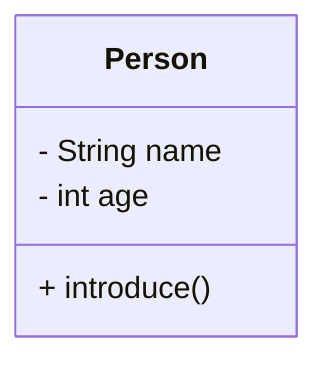
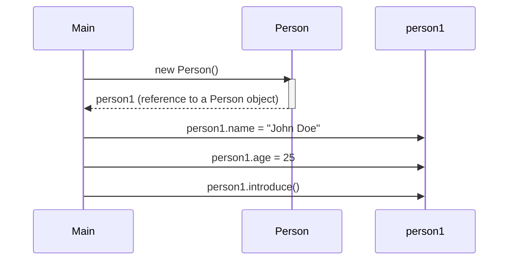
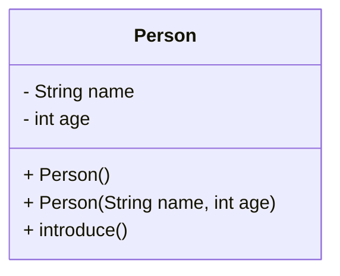
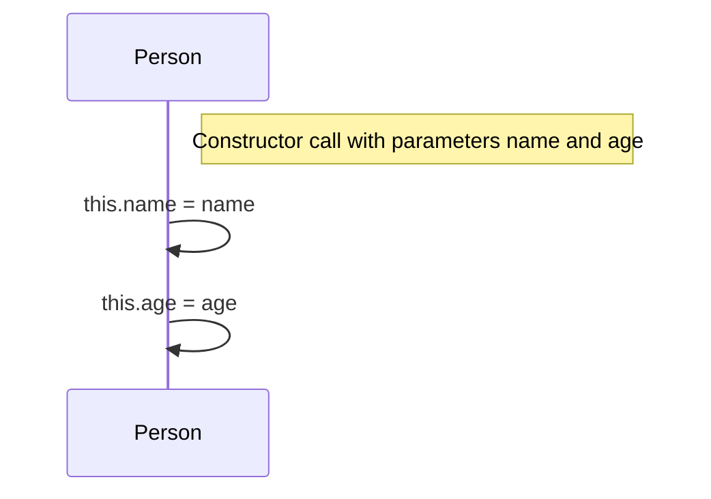

# Java Classes and Objects Lab

## What you'll learn

* How to define a class with fields and methods, and create objects from it with `new`
* How to initialize objects with default and parameterized constructors
* How to use the `this` keyword to resolve name clashes and chain constructors
* The difference between two references to one object and two objects that merely hold the same values
* How the Single Responsibility Principle (SRP) keeps a class focused on one job

## Table of Contents

1. [Introduction](#1-introduction)
2. [Defining Classes](#2-defining-classes)
3. [Creating Objects](#3-creating-objects)
4. [Constructors](#4-constructors)
5. [The `this` Keyword](#5-the-this-keyword)
6. [Reference Variables vs Object Identity](#6-reference-variables-vs-object-identity)
7. [Single Responsibility Principle (SRP)](#7-single-responsibility-principle-srp)

## Getting started

This lab lives in the package `ie.atu.classesandobjects` - this folder. A runnable `Main.java` is already here: open this folder in VS Code or your Codespace, click ▶ on `Main.java` to check your setup works. Then give **each exercise its own file** in this same package - `Diy1.java`, `Diy2.java`, ... - each with its own `main` method (the ▶ button appears above every `main`), so every exercise stays runnable on its own and finishing one never disturbs the last. Any extra class an exercise needs goes in its own file beside it, and every file starts with the package line you see in `Main.java`.

---

## 1. Introduction

Object-Oriented Programming (OOP) is a powerful programming paradigm that organizes code around "objects" rather than actions and data. Instead of focusing on procedures (like in procedural programming), OOP emphasizes *objects* which encapsulate both data (attributes or fields) and the actions that can be performed on that data (methods or functions). This approach offers several key advantages:

* **Modularity:** Code is broken down into reusable objects, making it easier to manage, understand, and maintain large projects. Changes to one object are less likely to affect others.
* **Reusability:** Objects can be reused in different parts of a program or even in different projects.
* **Maintainability:** The modular nature makes debugging and updating code significantly easier.
* **Scalability:** OOP principles help build programs that can easily handle increasing amounts of data and complexity.

In Java, OOP is implemented through the use of *classes* and *objects*.

**Key concepts:**

* **Classes:** Think of a class as a blueprint or template. It defines the *structure* (what data an object will hold, represented by fields/attributes/member variables) and *behavior* (what actions an object can perform, represented by methods/functions/member methods) of objects.

* **Objects:** Objects are the concrete instances of a class. They are the actual things created based on the class's blueprint. An object holds specific values for the fields defined in its class and can execute the methods defined in that class. For example, you could have a `Car` class as a blueprint, and then create many different `Car` *objects*, each representing a specific car with its own make, model, and year.

As you work through this lab, think about how real-world objects can be represented as classes: attributes are what *describe* an object; behaviors are what it can *do*.

---

## 2. Defining Classes

In Java, a class is defined using the `class` keyword, followed by the class name, and enclosed in curly braces `{}`. Inside the curly braces, you declare the fields (data) and methods (behavior) that define the class. The `public` keyword means this class is accessible from anywhere. You'll learn about other access modifiers (like `private`, `protected`) later.

**Example:** let's define a `Person` class with some attributes and methods.

```java
class Person {
  // Fields
  String name;
  int age;

  // Methods
  void introduce() {
    System.out.println("Hi, I'm " + name + " and I'm " + age + " years old.");
  }
}
```



### DIY 1: Define the `Student` class

1. Define a class named `Student`.
2. Add fields: `String studentID`, `int age`, `boolean isRegistered`.
3. Write a method `displayInfo()` that prints the student's details. Make sure the output is neatly formatted.

**Expected output** (when `displayInfo()` is called - here for a student with ID `S00123`, age `20`, registered):

```text
Student ID: S00123
Age: 20
Registered: true
```

<details>
<summary>Hint</summary>

Model `displayInfo()` on the `Person` class's `introduce()` method: build each line with string concatenation (`+`) inside `System.out.println(...)`.

</details>

---

## 3. Creating Objects

A class is just a blueprint; to actually use it, you need to create an *object* - an instance of the class. This is done using the `new` keyword, followed by a call to the class's constructor (we'll cover constructors in detail next).

**Syntax:**

<!-- no-compile -->
```java
ClassName objectName = new ClassName(); // Using the default constructor
```

or

<!-- no-compile -->
```java
ClassName objectName = new ClassName(parameters); // Using a parameterized constructor (explained later)
```

This creates a new object of type `ClassName` and assigns its reference (memory address) to the variable `objectName`. You can then access the object's fields and call its methods using the dot operator (`.`).

**Example:** using the `Person` class defined earlier, let's create an object.

<!-- no-compile -->
```java
public class Main {
  public static void main(String[] args) {
    // Creating an object of Person class
    Person person1 = new Person(); // creates a new person object using the default constructor (assuming it exists).
    person1.name = "John Doe";
    person1.age = 25;

    // Calling the method
    person1.introduce(); // Output: Hi, I'm John Doe and I'm 25 years old.
  }
}
```



### DIY 2: Create a `Student` object

1. In `Main.java`'s `main` method (this is where your program execution starts), create an instance of `Student`.
2. Assign values to its fields (`studentID`, `age`, `isRegistered`). This requires a default constructor, or setting the values after creating the object, as we did in the `Person` example.
3. Call the `displayInfo()` method to print the student's details.

**Expected output** (a representative run - yours shows whatever values you assigned):

```text
Student ID: S00123
Age: 20
Registered: true
```

<details>
<summary>Hint</summary>

Reach the object's fields and methods through the reference with the dot operator: `student1.studentID = "S00123";` then `student1.displayInfo();`.

</details>

---

## 4. Constructors

Constructors are special members of a class - not methods, since they have no return type - that run automatically when you create a new object using the `new` keyword. They are used to initialize the object's fields to initial values. They have the same name as the class and do *not* have a return type (not even `void`).

* **Default Constructor**: If you don't explicitly define any constructors, Java provides a default constructor that does nothing (sets fields to default values like 0 for numbers, `null` for strings, `false` for booleans).

* **Parameterized Constructor**: These allow you to pass values to the constructor when creating an object. This lets you initialize an object with specific values right from the start.

**Default constructor example** (this is what the compiler would create implicitly if you don't define any constructors):

```java
class Person {
  String name;
  int age;

  // Default constructor (implicitly provided if you define no constructors)
  // public Person(){}
}
```

**Parameterized constructor example:**

```java
class Person {
  String name;
  int age;

  // Parameterized constructor
  Person(String personName, int personAge) {
    name = personName;
    age = personAge;
  }
}
```



**Example:** using the `Person` class with constructors.

<!-- no-compile -->
```java
public class Main {
  public static void main(String[] args) {
    // Using default constructor (implicitly created by compiler, if you define no other constructors)
    Person person1 = new Person(); // This implicitly calls the parameterless constructor.
    person1.introduce(); // Output: Hi, I'm null and I'm 0 years old. (or similar, depending on the default values)

    // Using parameterized constructor
    Person person2 = new Person("Alice", 30);
    person2.introduce(); // Output: Hi, I'm Alice and I'm 30 years old.
  }
}
```

### DIY 3: Add constructors

1. In your `Student` class, add a default constructor that sets reasonable default values for the fields (`studentID`, `age`, `isRegistered`). For example, you might set `studentID` to "N/A".
2. Add a parameterized constructor that accepts `studentID`, `age`, and `isRegistered` as parameters and initializes the object's fields with those values.
3. Modify your `Main` class to create a `Student` object using the default constructor and call `displayInfo()`.
4. Create another `Student` object using the parameterized constructor and call `displayInfo()`.

**Expected output**

```text
Student ID: N/A
Age: 0
Registered: false

Student ID: S00234
Age: 22
Registered: true
```

<details>
<summary>Hint</summary>

A constructor has the same name as the class and no return type - not even `void`. The parameterized constructor should copy each parameter into the matching field.

</details>

---

## 5. The `this` Keyword

The `this` keyword is a reference to the current object instance. It's primarily used in two scenarios:

1. **Distinguishing between instance variables and parameters:** When a parameter's name is the same as an instance variable, `this` clarifies which one you're referring to.
2. **Calling other constructors (constructor chaining):** `this()` can be used inside a constructor to call another constructor of the same class. This reduces redundancy, particularly if you have several constructors with similar initialization steps.

**Example (scenario 1):**

```java
class Person {
  String name;
  int age;

  Person(String name, int age) {
    this.name = name; // 'this.name' refers to the class field; 'name' refers to the constructor parameter
    this.age = age;
  }
}
```

**Example (scenario 2): constructor chaining**

```java
class Person {
  String name;
  int age;
  String city;

  Person(String name, int age) {
    this(name, age, "Unknown"); // calls the constructor below
  }

  Person(String name, int age, String city) {
    this.name = name;
    this.age = age;
    this.city = city;
  }
}
```



**Where `Student` stands after DIY 3** - two constructors that repeat each
other, and no `this` anywhere. DIY 4 is the refactor that fixes both:

```java
class Student {
  String studentID;
  int age;
  boolean isRegistered;

  // Default constructor - sets the defaults directly, for now
  Student() {
    studentID = "N/A";
    age = 0;
    isRegistered = false;
  }

  // Parameterized constructor - the parameter names differ from the field
  // names, which is the only reason this works without 'this'
  Student(String id, int studentAge, boolean registered) {
    studentID = id;
    age = studentAge;
    isRegistered = registered;
  }

  void displayInfo() {
    System.out.println("Student ID: " + studentID);
    System.out.println("Age: " + age);
    System.out.println("Registered: " + isRegistered);
  }
}
```

### DIY 4: Use `this` and constructor chaining

1. Update your `Student` class so both constructors use the `this` keyword to refer to class fields where appropriate.
2. In the default constructor, call the parameterized constructor using `this(...)` for constructor chaining.
3. Use `this` in the `displayInfo()` method where appropriate (though it's not strictly necessary here).
4. Verify that your program still works as expected.

**Expected output** (unchanged from DIY 3 - this refactor must not change behavior):

```text
Student ID: N/A
Age: 0
Registered: false

Student ID: S00234
Age: 22
Registered: true
```

<details>
<summary>Hint</summary>

`this.field = field` is what lets a parameter share its field's name: the bare name always means the nearest one, which is the parameter, so `this.` is how you reach past it to the field. For step 2, `this(...)` must be the **first** statement in the constructor - the compiler rejects it anywhere else, because the other constructor has to finish before your body starts adding to its work.

</details>

---

## 6. Reference Variables vs Object Identity

In Java, variables of a class type hold **references** to objects, not the objects themselves. Two different variables can reference the **same** object, or two different objects can have the **same field values** but be distinct in memory.

* `==` compares **reference identity** (are the two references pointing to the *same* object?).
* `==` never looks inside the objects. Two objects built by two separate `new` calls are two objects, however identical their fields, so `==` between them is always `false`.

**Example:**

```java
Student s1 = new Student("S001", 20, true);
Student s2 = s1; // s2 copies the ARROW - it builds nothing
Student s3 = new Student("S001", 20, true); // same data, its own object

System.out.println(s1 == s2);   // true (one object, two arrows)
System.out.println(s1 == s3);   // false (two objects, identical contents)
```

Count the objects by counting the `new` calls, not the variable names: three
variables above, two objects.

So `==` answers "the same object?" and never "the same contents?". When a
program needs the second question answered, the class has to answer it
itself - you give it a method that compares the fields, and *you* decide
which fields make two objects count as the same thing. A library catalogue,
for instance, settles it on the catalogue number and the year rather than
the title: two different books can share a title, so a title makes a poor
identity.

### DIY 5: Identity vs equality

1. Write a `Book` class beside `Main.java` with three fields - `String title`, `int catalogueNumber` and `int year` - and one constructor that takes all three and assigns them using `this`.
2. In `main`, build `b1` and `b2` from two separate `new` calls, giving both exactly the same three values. Then add `Book b3 = b1;` and a fourth book `b4` with a different catalogue number and year.
3. Print `b1 == b2` and `b1 == b3`, each on its own labelled line as in the expected output below. Predict both answers before you run it.
4. Add an instance method `boolean sameBookAs(Book other)` to `Book` that returns `true` only when `this` and `other` have the same `catalogueNumber` *and* the same `year`.
5. Print `b1.sameBookAs(b2)` and `b1.sameBookAs(b4)` in the same labelled style. Now compare line 1 with line 3: the same two objects, opposite answers, because the two lines ask different questions.

**Expected output**

```text
b1 == b2: false
b1 == b3: true
b1.sameBookAs(b2): true
b1.sameBookAs(b4): false
```

<details>
<summary>Hint</summary>

`==` between two object variables only ever asks "the same object?" - it compares the arrows, not what they point at, so two separate `new` calls can never be `==`, however identical their fields. Inside `sameBookAs`, though, `==` is comparing `int` fields, where it *does* mean "the same value": the body is a single `return` of two `==` tests joined with `&&`. Reach the other book's fields through its own reference - `other.year` - exactly as `main` reaches `b1.title`. One trap when you print: `+` binds tighter than `==`, so the comparison needs brackets of its own, `... + (b1 == b2)`.

</details>

---

## 7. Single Responsibility Principle (SRP)

**SRP:** A class should have **one reason to change**. Keep responsibilities focused.

**Smells indicating SRP violations:**

* A class doing **domain logic + I/O** (e.g., business rules and printing/parsing/saving).
* Many unrelated methods that change for different reasons (formatting changes vs. business rules).

**Refactor idea:**

* Keep `Student` focused on representing student data and related domain behaviour.
* Have the class *build* its description and hand it back; let the caller decide where the text goes - the screen today, a file or a web page tomorrow.
* If you need parsing or persistence, create `StudentParser` / `StudentRepository`.

**Example:** a class that returns its description rather than printing it.

```java
class Lecturer {
  String name;
  String office;

  // Builds the line and RETURNS it - nothing is printed in here.
  String describe() {
    return name + " (office " + office + ")";
  }
}
```

The caller does the printing: `System.out.println(lecturer1.describe());`.
Java has a standard name for a method like this - `toString()` - which you
will meet when you learn about overriding; until then, name it yourself.

### DIY 6: Return the description instead of printing it

1. Add a method `String describe()` to `Student` that builds the one-line summary shown below out of `this.studentID`, `this.age` and `this.isRegistered`, and **returns** it. Nothing is printed inside the method.
2. In `Main`, print both of your students by passing the result of `describe()` to `System.out.println(...)`, instead of calling `displayInfo()`.
3. Say what moved: `displayInfo()` decided both *what* the text says and *where* it goes, so it held two jobs; `describe()` keeps only the first. That is SRP applied to a single method.

**Expected output** (match this format exactly; your values may differ):

```text
Student{id='N/A', age=0, registered=false}
Student{id='S00234', age=22, registered=true}
```

<details>
<summary>Hint</summary>

`describe()` hands a `String` back, so its body ends in a `return`, not a `println` - the same `+` concatenation you used in `displayInfo()`, joined into one value instead of three printed lines. The single quotes around the ID are ordinary characters inside the text, so they sit inside the double quotes you are concatenating.

</details>

---

## Summary

This lab introduced fundamental object-oriented programming concepts in Java. You learned how to:

* Define classes and their members (fields and methods)
* Create objects using constructors
* Use the `this` keyword and constructor chaining
* Distinguish **reference identity** (`==`, the same object) from two separate objects that merely hold the same values
* Apply the **Single Responsibility Principle (SRP)** to keep classes focused
