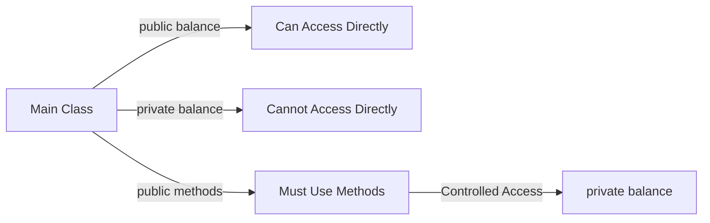
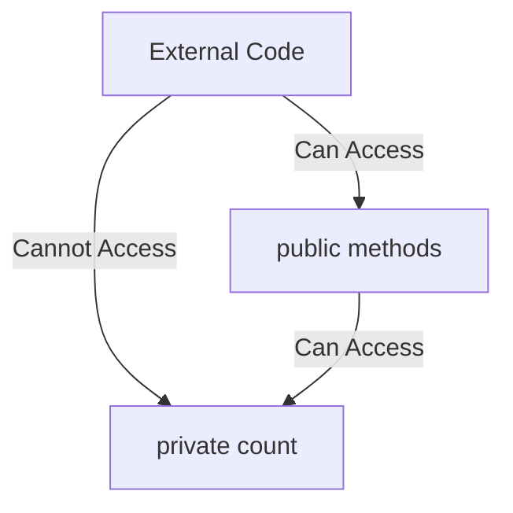
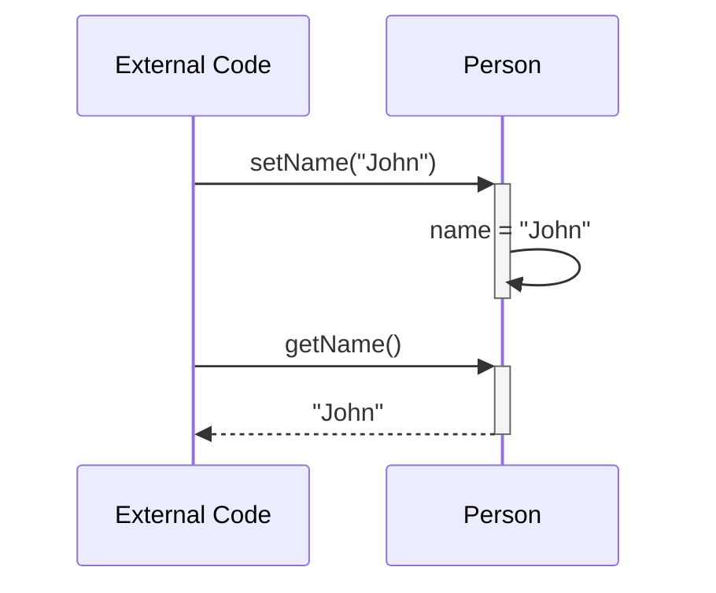
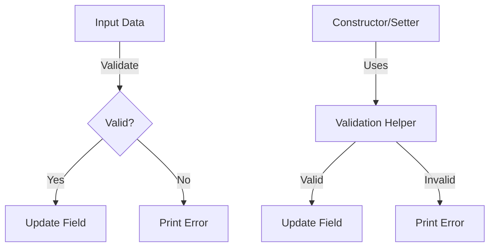
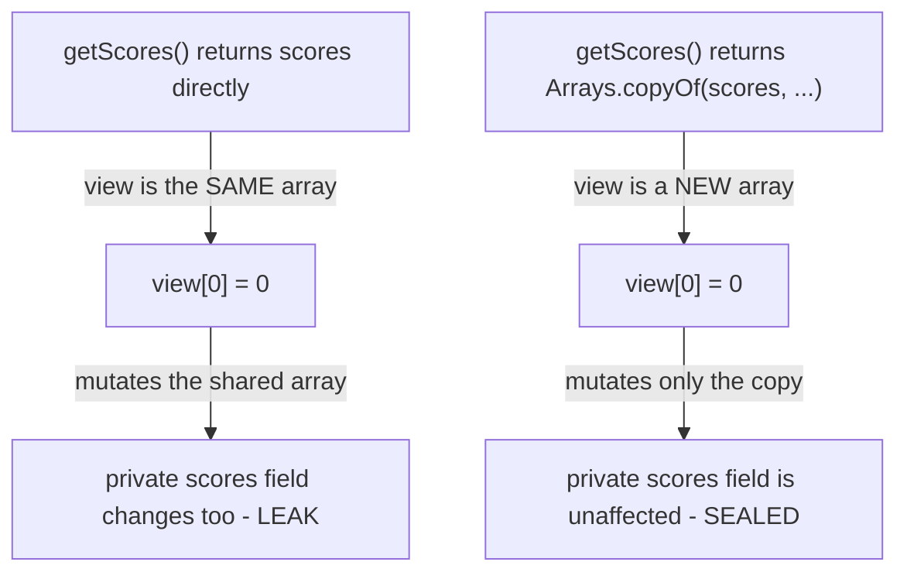

# Java Encapsulation Lab

## What you'll learn

**Encapsulation** is one of the four fundamental principles of Object-Oriented Programming (OOP), alongside inheritance, polymorphism, and abstraction: bundling data (fields) and the methods that operate on that data within a single unit (a class), while restricting direct access to some of the object's components. Think of it as a capsule or protective shell around your data - just as you can't reach the medicine inside a pill capsule without breaking it open, you shouldn't be able to reach an object's internal data without going through its controlled interface. By the end of this lab you will be able to:

- Explain why encapsulation matters: it protects an object's state from accidental or malicious corruption, lets you change internal implementation without affecting code that uses your class, keeps code maintainable by clearly separating internal from external, and enables validation so data stays valid throughout an object's lifetime.
- Use the `public` and `private` access modifiers to control the visibility of class members, and see the effect first-hand in VS Code's IntelliSense.
- Hide an object's data behind private fields so external code cannot corrupt its state.
- Provide controlled read and write access to private fields with getter and setter methods.
- Validate data in both constructors and setters, reusing the validation logic through private helper methods.

## Table of Contents
1. [Access Modifiers](#1-access-modifiers)
2. [Data Hiding](#2-data-hiding)
3. [Getters and Setters](#3-getters-and-setters)
4. [Data Validation](#4-data-validation)
5. [Defensive Copies](#5-defensive-copies)

## Getting started

This lab lives in the package `ie.atu.encapsulation` - this folder. A runnable `Main.java` is already here: open this folder in VS Code or your Codespace, click ▶ on `Main.java` to check your setup works, then write each exercise's classes beside it in the same package.

## 1. Access Modifiers

Access modifiers are keywords that set the accessibility level of classes, methods, and fields. The two most common access modifiers are:
- **public**: The member is accessible from anywhere in your program
- **private**: The member is only accessible within the same class

When you use the dot operator (`.`) on an object we create in the `main` method in VS Code, IntelliSense shows you a list of all the members you can access. This is a powerful visual demonstration of encapsulation in action - when you make a field private, it disappears from the list of accessible members.

### Example: The Problem with Public Fields
```java
public class BankAccount {
    public double balance;  // Public - accessible from anywhere!
    
    public BankAccount(double initialBalance) {
        balance = initialBalance;
    }
}
```

### What Can Go Wrong?
When fields are public, anyone can modify them directly, potentially breaking business rules:

```java
public class Main {
    public static void main(String[] args) {
        BankAccount account = new BankAccount(1000.00);
        
        // This should NOT be allowed, but it is!
        account.balance = -500.00;  // Negative balance! - Not Allowed in this case
        
        System.out.println("Balance: " + account.balance);
    }
}
```

### The Solution: Private Fields
```java
public class BankAccount {
    private double balance;  // Private - only accessible within this class
    
    public BankAccount(double initialBalance) {
        balance = initialBalance;
    }
    
    public void deposit(double amount) {
        if (amount > 0) {
            balance += amount;
        }
    }
    
    public double getBalance() {
        return balance;
    }
}
```

### Visual Representation


### DIY 1: Access modifier demonstration

**Part 1: Public field problems**

1. Create a `Student` class with the following **public** fields:
   - `name` (String)
   - `studentId` (int)
   - `gpa` (double)
2. Add a constructor that accepts all three parameters.
3. In your `Main` class, create a `Student` object, type `student.` and observe the autocomplete list in VS Code - you see `name`, `studentId`, `gpa`, and more: all fields appear in the list.
4. Set invalid values directly:

   <!-- no-compile -->
   ```java
   student.studentId = -1;  // Invalid ID
   student.gpa = 5.5;        // GPA above 4.0
   ```

**Part 2: Fixing with private fields**

5. Change all fields in the `Student` class to **private**.
6. In your `Main` class, type `student.` again and observe the autocomplete list - `name`, `studentId` and `gpa` have disappeared from the list and are inaccessible.
7. Try to access `student.name` directly - you'll get a compilation error.

The private fields have "disappeared" from outside access! Later we will show how to create public **getter** and **setter** methods that will provide access to these private instance variables.

**Expected output**

Once the fields are private, the compiler rejects every direct field access from `Main`:

```text
error: name has private access in Student
```

<details>
<summary>Hint</summary>

After you make the fields private, the direct assignments from Part 1 (`student.studentId = -1;` and `student.gpa = 5.5;`) stop compiling too. Hover over each red underline in VS Code to read the compiler error, then comment those lines out so the rest of your `main` method can run.

</details>

### Key Takeaway
The disappearance of private members from the autocomplete list is not just a convenience feature - it's the IDE enforcing Java's encapsulation rules. If you can't see it in the list, you can't access it directly. This is encapsulation protecting your data.

## 2. Data Hiding

Data hiding is the fundamental concept of encapsulation where we restrict direct access to certain components of an object, typically by making fields private. This protection prevents unauthorized access to internal data and helps maintain the object's state consistency. By controlling access to our object's data, we can ensure that the object's state is always valid and can't be corrupted by external code.

Now that you've seen how access modifiers work in Section 1, this section reinforces why we consistently make fields private and only expose what's necessary through public methods.

### Example
```java
public class Counter {
    private int count; // Private field - cannot be accessed directly from outside
    
    public void increment() {
        count++;
    }
    
    public void displayCount() {
        System.out.println("Current count: " + count);
    }
}
```

### Visual Representation


### DIY 2: Secret message

Create a `SecretMessage` class that keeps its data hidden:

1. Give the class a private String field to store a message.
2. Add a public method to display the message.
3. Create a `SecretMessage` object in the `Main` class.
4. Try to call the message field directly using the dot operator - you should get a compilation error.
5. Print the message to the console using the public method.

**Expected output**

```text
The secret message is: Hello, Encapsulation!
```

When you try to access the private field directly (step 4), expect a compilation error like:

```text
error: message has private access in SecretMessage
```

<details>
<summary>Hint</summary>

Follow the same shape as the `Counter` example above: one private field, one public method that prints it. You can set the message where the field is declared, or in a constructor.

</details>

## 3. Getters and Setters

While private fields prevent direct access, we often need controlled ways to read and modify their values through getter and setter methods. Getter methods allow read access to private fields while maintaining encapsulation, and setter methods provide a way to modify private fields with proper validation. This approach gives us the flexibility to change how we store and validate data without affecting code that uses our class.

This is the standard way to expose private data: create a protective layer of public methods that control how the data can be accessed and modified.

### Example
```java
public class Person {
    private String name;
    
    // Getter method
    public String getName() {
        return name;
    }
    
    // Setter method
    public void setName(String name) {
        this.name = name;
    }
}
```

### Visual Representation


### DIY 3: Temperature converter

Create a `Temperature` class that:

1. Stores a temperature in a private double instance variable named `celsius`.
2. Provides a getter method for `celsius`.
3. Provides a setter method that accepts celsius values.

Then test your class in the `Main` method:

4. Create a `Temperature` object.
5. Set a temperature value using the setter.
6. Read the temperature value using the getter and print the result to the console.

**Expected output**

```text
Temperature: 25.0°C
```

<details>
<summary>Hint</summary>

Example test code for your `main` method:

<!-- no-compile -->
```java
Temperature temp = new Temperature();
temp.setCelsius(25.0);
System.out.println("Temperature: " + temp.getCelsius() + "°C");
```

</details>

## 4. Data Validation

Validation ensures that the data inside an object remains correct and meaningful. When encapsulating data, validation can occur in different stages of an object's lifecycle:
 - **Constructor validation** ensures that objects are created in a valid state from the beginning.
 - **Setter validation** ensures only valid data is stored when fields are modified after object creation.

This is where encapsulation truly shines - by controlling access through methods, we can ensure data is always valid before it's stored.

### Example 1: Validation logic in a constructor and setter (Code Duplication)
```java
public class Student {
    private int age;

    // Constructor with validation logic
    public Student(int age) {
        if (age < 16 || age > 100) {
            System.out.println("Invalid age input: must be between 16 and 100 inclusive. Age set to 16.");
            this.age = 16;   // fall back to a valid age so the object is never left invalid
        } else {
            this.age = age;
        }
    }

    // Setter with validation logic
    public void setAge(int age) {
        if (age < 16 || age > 100) {
            System.out.println("Invalid age input: must be between 16 and 100 inclusive. Age set to 16.");
            this.age = 16;
        } else {
            this.age = age;
        }
    }
    
    public int getAge() {
        return age;
    }
} 
```

**Problem**: Notice how the validation logic is duplicated in both the constructor and setter. This violates the DRY (Don't Repeat Yourself) principle.

### Example 2: Using Validation Helpers (Best Practice)

Using helper methods avoids duplication of validation logic between constructors and setters, improving maintainability and reducing bugs.  

```java
public class Student {
    private int age;

    /* Constructor is a kind of setter too. It initially sets the value of object fields. It too
       can use the same validation as the setter method */  
    public Student(int age) {
        this.age = validateAge(age);
    }
    
    public void setAge(int age) {
        this.age = validateAge(age);
    }

    // Private internal validation method just usable in this class by the constructor and the setter  
    private int validateAge(int age) {
        if (age < 16 || age > 100) {
            System.out.println("Invalid age input: must be between 16 and 100 inclusive. Age set to 16.");
            return 16; // If invalid input is received we must return a valid age to keep the object state valid.
        }
        return age;
    }
    
    public int getAge() {
        return age;
    }
}
```

### Visual Representation


### DIY 4: Grade book

Create a `Grade` class that:

1. Has these private fields:
   - `studentName` (String)
   - `numericGrade` (int)
   - `courseCode` (String)
2. Implements these validation helper methods:
   - `validateStudentName(String name)` - Returns the name if not empty, otherwise returns "Unknown" and prints an error
   - `validateGrade(int grade)` - Returns the grade if within range (0-100), otherwise returns 0 and prints an error
   - `validateCourseCode(String code)` - Returns the code if it matches a pattern like "CS101" (2-3 letters followed by 3 digits), otherwise returns "UNKNOWN" and prints an error
3. Uses the helpers in both:
   - the constructor (which should accept all three parameters)
   - the setter methods
4. Provides getter methods for all fields.

Example structure:

```java
public class Grade {
    private String studentName;
    private int numericGrade;
    private String courseCode;

    // TODO: Add constructor that uses validation helpers

    // TODO: Add getters for all fields

    // TODO: Add setters that use validation helpers

    // TODO: Add validation helper methods (private)
}
```

Then test your `Grade` class in `Main`:

5. Create a valid `Grade` object.
6. Create an invalid `Grade` object (with a grade of 150).
7. Use setters to try setting invalid values.
8. Use getters to display the current state.

**Expected output**

```text
=== Valid Grade ===
Student: John Doe
Grade: 85
Course: CS101

=== Invalid Grade (150) ===
Invalid grade: must be between 0 and 100. Grade set to 0.
Student: Jane Smith
Grade: 0
Course: MATH201

=== Testing Invalid Setters ===
Invalid student name: cannot be empty. Name set to "Unknown".
Invalid grade: must be between 0 and 100. Grade set to 0.
Invalid course code format. Code set to "UNKNOWN".
Student: Unknown
Grade: 0
Course: UNKNOWN
```

<details>
<summary>Hint</summary>

Example test code for your `main` method:

<!-- no-compile -->
```java
// Valid grade
Grade grade1 = new Grade("John Doe", 85, "CS101");
System.out.println("=== Valid Grade ===");
System.out.println("Student: " + grade1.getStudentName());
System.out.println("Grade: " + grade1.getNumericGrade());
System.out.println("Course: " + grade1.getCourseCode());

// Invalid grade (150)
System.out.println("\n=== Invalid Grade (150) ===");
Grade grade2 = new Grade("Jane Smith", 150, "MATH201");
System.out.println("Student: " + grade2.getStudentName());
System.out.println("Grade: " + grade2.getNumericGrade());
System.out.println("Course: " + grade2.getCourseCode());

// Testing invalid setters
System.out.println("\n=== Testing Invalid Setters ===");
Grade grade3 = new Grade("Bob Jones", 75, "ENG202");
grade3.setStudentName("");
grade3.setNumericGrade(-50);
grade3.setCourseCode("INVALID");
System.out.println("Student: " + grade3.getStudentName());
System.out.println("Grade: " + grade3.getNumericGrade());
System.out.println("Course: " + grade3.getCourseCode());
```

</details>

## 5. Defensive Copies

Sections 1-4 hid every field behind `private` and routed every read and write through a method. That closes the front door - but there is a side door hiding in plain sight. If a private field is an array (or any other mutable object) and a getter returns that field directly, the caller does not receive a snapshot of the data - they receive the exact array the object uses internally. Every access still goes through the getter, and no code anywhere ever assigns to the field directly - yet mutating that array from the outside changes the private field too.

### Example: An Array Field That Leaks
```java
public class Gradebook {
    private int[] scores = {70, 80, 90};

    public int[] getScores() {
        return scores;
    }
}
```

### What Can Go Wrong?
The getter looks safe - `scores` is `private`, and `getScores()` is the only way to reach it. But an array variable does not hold values, it holds an **arrow** pointing at them. `getScores()` hands the caller that exact arrow, not a copy of what it points to:

```java
class Main {
    public static void main(String[] args) {
        Gradebook gradebook = new Gradebook();
        int[] view = gradebook.getScores();

        view[0] = 0;                            // scribble on what the getter gave us

        System.out.println(gradebook.getScores()[0]);
    }
}
```

No line here ever writes `gradebook.scores`. No compiler error, no exception - `gradebook.getScores()[0]` now prints `0`, not `70`. The private field changed anyway.

### The Solution: Return a Copy
```java
import java.util.Arrays;

public class Gradebook {
    private int[] scores = {70, 80, 90};

    public int[] getScores() {
        return Arrays.copyOf(scores, scores.length);   // new array - the original stays sealed
    }
}
```

`Arrays.copyOf` builds a brand-new array holding the same values and hands out an arrow to *that* instead. The caller can still scribble on the array it received - but that array is no longer the one `Gradebook` keeps for itself. Returning a copy of mutable state like this is called a **defensive copy**.

### Visual Representation


### DIY 5: Report card leak

**Part 1: Build the leak**

1. Create a `ReportCard` class with a private field `int[] grades` initialized to `{88, 91, 76}`.
2. Add a getter `getGrades()` that returns the `grades` field directly.
3. In your `Main` class, create a `ReportCard` object.
4. Print `reportCard.getGrades()[0]` - this is the value before anything touches it.
5. Call `getGrades()`, store the result in a local `int[] view`, then set `view[0] = 0;`.
6. Print `reportCard.getGrades()[0]` again. Even though no code anywhere wrote `reportCard.grades = ...`, the private field changed.

**Part 2: Patch it with a defensive copy**

7. Add `import java.util.Arrays;` to the top of your `ReportCard` file.
8. Change `getGrades()` so it returns `Arrays.copyOf(grades, grades.length)` instead of `grades` directly.
9. Run the exact same lines from Part 1 (steps 3-6) again, unchanged.
10. Compare the two runs: the second `getGrades()[0]` no longer changes, because `view` now points at a copy, not the original array.

**Expected output**

```text
=== Before the fix ===
Before: 88
After:  0

=== After the fix ===
Before: 88
After:  88
```

<details>
<summary>Hint</summary>

Example test code for your `main` method - run it once against the leaky `ReportCard`, then again, unchanged, against the patched one:

<!-- no-compile -->
```java
ReportCard reportCard = new ReportCard();
System.out.println("Before: " + reportCard.getGrades()[0]);

int[] view = reportCard.getGrades();
view[0] = 0;

System.out.println("After:  " + reportCard.getGrades()[0]);
```

The only thing that changes between Part 1 and Part 2 is the body of `getGrades()` inside `ReportCard` - this test code stays identical both times.

</details>

## Summary
This lab covered the essential concepts of encapsulation in Java:
1. **Access modifiers** and their effect on visibility - seeing how `public` and `private` control what can be accessed
2. **Data hiding** using private fields - understanding why we protect our data
3. **Controlled access** through getters and setters - learning how to safely expose data
4. **Data validation** for maintaining integrity - ensuring data remains valid throughout an object's lifecycle

By mastering these concepts, you can write more robust, maintainable, and secure Java applications. Encapsulation is not just a good practice - it's essential for professional software development.
