# Java Inheritance Lab

## What you'll learn

By the end of this lab you will be able to:

- Explain inheritance and the "Is-A" relationship, and use `extends` to let one class acquire the fields and methods of another
- Describe a class hierarchy using the core terminology: superclass (parent class) and subclass (child class)
- Recognise single, multilevel and hierarchical inheritance, and explain why Java does not support multiple inheritance of classes
- Explain the role of `Object` as the root superclass that every Java class implicitly inherits from
- Initialise inherited state correctly by chaining constructors with the `super` keyword
- Open a superclass field to its subclasses with `protected`, and choose between inheritance and containment using the is-a / has-a sentence test

## Table of Contents

1. [Definition and Basics of Inheritance](#1-definition-and-basics-of-inheritance)
2. [Terminology](#2-terminology)
3. [Types of Inheritance](#3-types-of-inheritance)
4. [The Object Class](#4-the-object-class)
5. [Constructors in Inheritance](#5-constructors-in-inheritance)
6. [Is-A or Has-A](#6-is-a-or-has-a)

## Getting started

This lab lives in the package `ie.atu.inheritance` - this folder. A runnable `Main.java` is already here: open this folder in VS Code or your Codespace, click ▶ on `Main.java` to check your setup works. Then give **each exercise its own file** in this same package - `Diy1.java`, `Diy2.java`, ... - each with its own `main` method (the ▶ button appears above every `main`), so every exercise stays runnable on its own and finishing one never disturbs the last. Any extra class an exercise needs goes in its own file beside it, and every file starts with the package line you see in `Main.java`.

## 1. Definition and Basics of Inheritance

### Explanation

Inheritance is a fundamental principle in object-oriented programming (OOP) that allows a new class (subclass) to inherit properties and methods from an existing class (superclass). This promotes code reusability and logical organisation of classes. The subclass inherits characteristics (fields and methods) from the superclass, allowing you to create specialised classes based on more general ones.

An **"Is-A"** relationship is established between the subclass and superclass. For example, an Employee is a Person; hence, Employee can inherit from Person.

### Example

<!-- no-compile -->
```java
public class Person {
    private String name;

    public String getName() { 
        return name; 
    }

    public void setName(String name) { 
        this.name = name; 
    }
}

public class Employee extends Person {
    private int employeeId;

    public int getEmployeeId() { 
        return employeeId; 
    }

    public void setEmployeeId(int id) { 
        this.employeeId = id; 
    }
}

// Example usage (e.g. in `Main.java`)
public static void main(String[] args) {
    Employee e = new Employee();
    e.setName("Alice");
    e.setEmployeeId(123);
    System.out.println("Employee: " + e.getName() + ", ID: " + e.getEmployeeId());
}
```

### Visual Representation

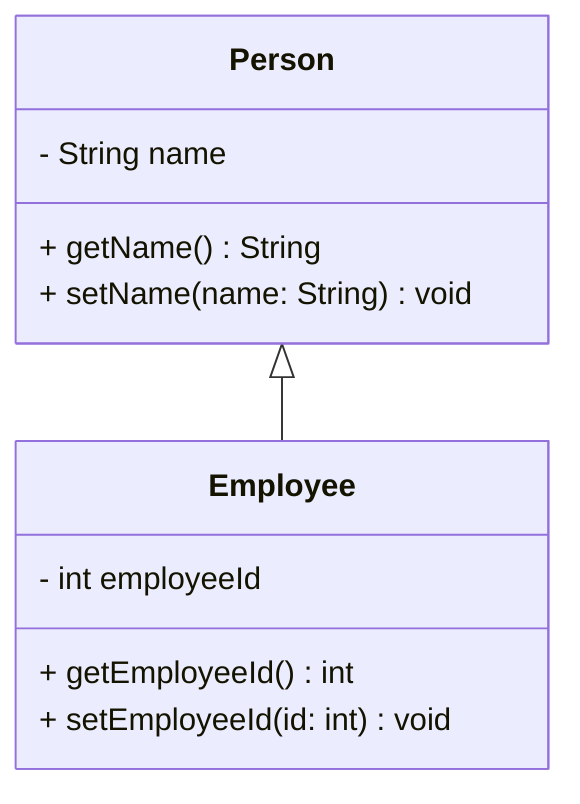

### DIY 1: Animals

1. Create an `Animal` class in this package with:
   - A `private` field `species` (String).
   - Getter and setter methods for the `species` field.
2. Create a `Dog` class that `extends` (i.e. inherits from) `Animal`, with:
   - A `private` field `name` (String).
   - Getter and setter methods for the `name` field.
3. In `Main`, create an instance of `Dog`, call `setSpecies()` and `setName()`, then print both values to the terminal using `getSpecies()` and `getName()`.

**Expected output**

```text
Species: Canine
Name: Rex
```

(Sample values shown - use any species and name you like.)

<details><summary>Hint</summary>

Only `Dog` needs the `extends` keyword - it picks up `species` and its getter and setter from `Animal` automatically. Suggested design:

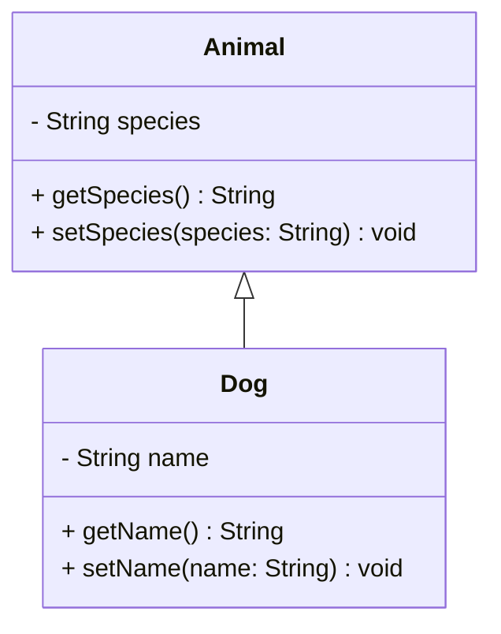

</details>

## 2. Terminology

### Explanation

- **Superclass (Parent Class):** The class from which properties and methods are inherited. It represents a general concept.
- **Subclass (Child Class):** The class that inherits from the superclass. It represents a specialised version of the superclass.

Inheritance establishes a hierarchy between classes, where the subclass extends the functionality of the superclass.

### DIY 2: Vehicles

1. **Superclass:** create a class `Vehicle` with a method `move()` that prints "The vehicle is moving."
2. **Subclass:** create a class `Car` that extends `Vehicle` and adds a method `playRadio()` that prints "Playing radio."
3. In `Main`, create an instance of `Car` and call both `move()` and `playRadio()` on it.

**Expected output**

```text
The vehicle is moving.
Playing radio.
```

<details><summary>Hint</summary>

`Car` never declares `move()`, yet a `Car` object can call it - that is inheritance at work. Suggested design:

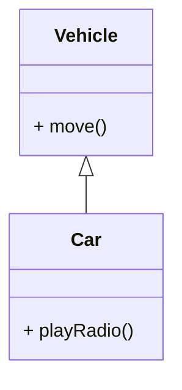

</details>

## 3. Types of Inheritance

### Explanation and Examples

#### 1. Single Inheritance
One class inherits from one superclass.

```java
public class Vehicle {
    public void move() {
        System.out.println("Vehicle moves");
    }
}

public class Car extends Vehicle {
    public void honk() {
        System.out.println("Car honks");
    }
}
```

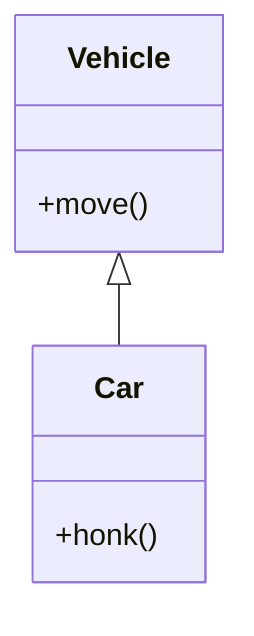

#### 2. Multilevel Inheritance
Chain of inheritance where subclass becomes superclass for another class.

```java
public class Animal {
    public void eat() {
        System.out.println("Animal eats");
    }
}

public class Mammal extends Animal {
    public void breathe() {
        System.out.println("Mammal breathes");
    }
}

public class Dog extends Mammal {
    public void bark() {
        System.out.println("Dog barks");
    }
}
```

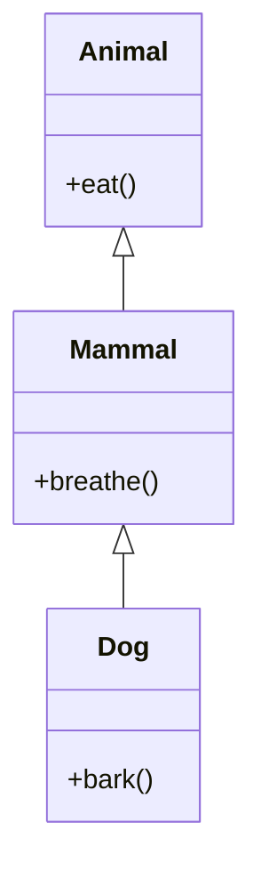

#### 3. Hierarchical Inheritance
Multiple classes inherit from one superclass.

```java
public class Shape {
    public void draw() {
        System.out.println("Drawing shape");
    }
}

public class Circle extends Shape {
    public void radius() {
        System.out.println("Has radius");
    }
}

public class Square extends Shape {
    public void sides() {
        System.out.println("Has four sides");
    }
}
```

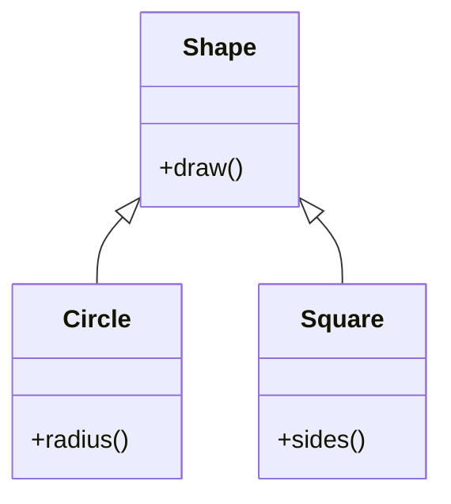

#### 4. Multiple Inheritance (Not Supported in Java)
One class inheriting from multiple superclasses.

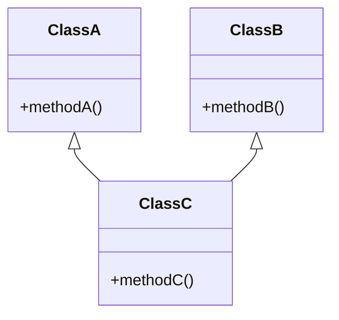

Java doesn't support multiple inheritance with classes to avoid:
1. Ambiguity when same method exists in multiple parent classes
2. Complexity in method resolution
3. Potential naming conflicts

Instead, Java provides interfaces for implementing multiple inheritance of behaviour.

### DIY 3: Electric Car

Create (or evolve from DIY 2) the classes listed below in this package, building a multilevel inheritance chain:

1. `Vehicle` (superclass):
   - Private field: `String type`.
   - Constructor: `Vehicle(String type)` to initialise `type`.
   - Getter and setter for `type`.
   - Method: `void move()` that prints a short message, e.g. "The <type> is moving".
2. `Car` (subclass of `Vehicle`):
   - Private field: `int doors`.
   - Constructor: `Car(String type, int doors)` which calls `super(type)`.
   - Getter and setter for `doors`.
   - Method: `void honk()` that prints a short message, e.g. "Beep!".
3. `ElectricCar` (subclass of `Car`):
   - Private field: `int batteryCapacity` (e.g. in kWh).
   - Constructor: `ElectricCar(String type, int doors, int batteryCapacity)` which calls `super(type, doors)`.
   - Getter and setter for `batteryCapacity`.
   - Method: `void charge()` that prints a short message, e.g. "Charging...".
4. In `Main`:
   - Create an instance of `ElectricCar` using the constructor.
   - Call `move()`, `honk()`, and `charge()` on the instance.
   - Use the getters to retrieve and print the `type`, `doors`, and `batteryCapacity` values.

Keep the method implementations simple - print statements are fine. The key skill here is using `extends` and `super(...)` correctly to pass values up the inheritance chain.

**Expected output**

```text
The electric car is moving
Beep!
Charging...
Type: electric car
Doors: 4
Battery capacity: 75 kWh
```

(Sample values - yours will match whatever you pass to the constructor.)

<details><summary>Hint</summary>

The first statement of each subclass constructor must be its `super(...)` call: `ElectricCar` hands `type` and `doors` up to `Car`, and `Car` hands `type` up to `Vehicle`. Each class initialises only its own field.

</details>

### DIY 4: Motorbike

Add a `Motorbike` class to the DIY 3 hierarchy to demonstrate hierarchical inheritance, where multiple subclasses share the same superclass:

1. Create `Motorbike` extending `Vehicle` (do **not** extend `Car`), with:
   - Private field: `boolean hasSidecar`.
   - Constructor: `Motorbike(String type, boolean hasSidecar)` which calls `super(type)`.
   - Getter and setter for `hasSidecar`.
   - Method: `void ride()` that prints "Riding the " followed by the superclass field `type` **read directly** - not through `getType()` - and then indicates whether it has a sidecar.
2. That direct read will not compile yet: `type` is `private` in `Vehicle`, so javac reports `type has private access in Vehicle`. Change `Vehicle`'s `type` field from `private` to `protected` and compile again. `protected` is the access level to reach for here because it opens the field to the subclasses (`Car`, `ElectricCar`, `Motorbike`) while keeping it closed to every unrelated class - `private` locks the family out, and `public` hands the field to the whole program.
3. In `Main`, declare the variable with the subclass as its type - `Motorbike m = new Motorbike("motorbike", false);` - then call `m.move()` and `m.ride()`. `Motorbike` never declares `move()`; it inherits it from `Vehicle`, exactly as `Car` does.

This shows hierarchical inheritance: multiple subclasses (`Car`, `Motorbike`, etc.) can extend the same superclass (`Vehicle`). Together, DIY 3 and DIY 4 combine multilevel and hierarchical inheritance in one hierarchy - sometimes called hybrid inheritance.

**Expected output**

```text
The motorbike is moving
Riding the motorbike (no sidecar)
```

(Exact wording will vary with your messages.)

<details><summary>Hint</summary>

`Motorbike` never declares `move()` - it comes down from `Vehicle`, which is also where `type` lives. A subclass inherits a `private` field's storage but not the right to touch it; `protected` is the access level that says "family only". Suggested design for the full hierarchy from DIY 3 and DIY 4:

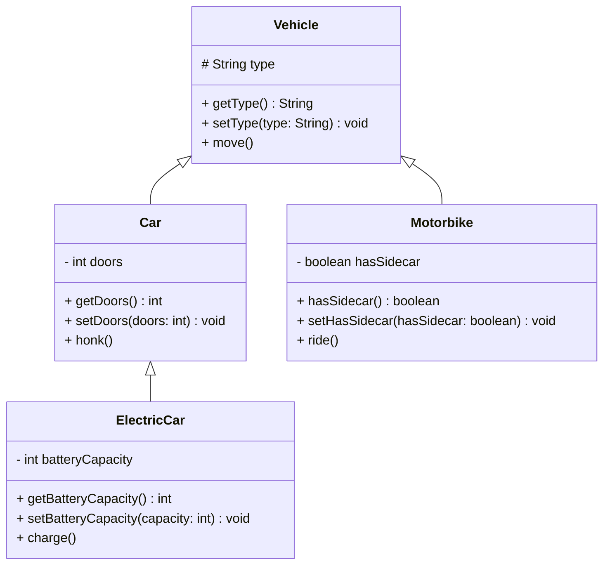

</details>

## 4. The Object Class

### Explanation

Every class in Java ultimately inherits from `Object` - it is the root superclass of the entire class hierarchy. Even when you write a class with no `extends` clause, it implicitly extends `Object`, which is why methods such as `toString()`, `equals()` and `hashCode()` are available on every object you create.

### Visual Representation

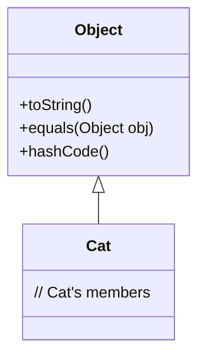

### DIY 5: Implicit Inheritance

1. Create a class `Gadget` - do not specify a superclass.
2. In `Main`, create an instance of `Gadget` and print the result of calling `toString()` on it.
3. Type the variable name followed by a dot (`.`) and look at the list of methods your editor suggests - call one more method inherited from `Object` (e.g. `hashCode()`) and print its result.

**Expected output**

```text
ie.atu.inheritance.Gadget@7a81197d
2055281021
```

(The hex code and hash number will differ on your machine - they identify your particular object.)

<details><summary>Hint</summary>

You never wrote `toString()` or `hashCode()`, so where do they come from? Suggested design:

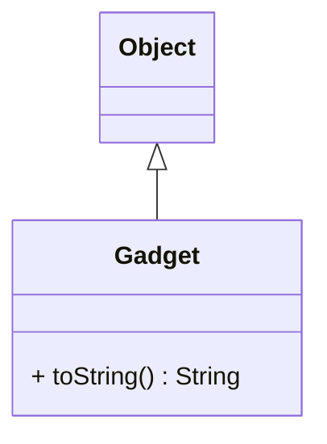

</details>

## 5. Constructors in Inheritance

### Explanation

In Java inheritance, constructors play a crucial role in object initialization. When you create an instance of a subclass:

1. The superclass constructor must be called first before the subclass constructor executes
2. If not explicitly called, Java automatically calls the no-argument constructor of the superclass
3. Use the `super()` keyword to call a specific superclass constructor
4. The `super()` call must be the first statement in the subclass constructor

Key points to remember:

- Every constructor must invoke a constructor from its superclass, either explicitly or implicitly
- If the superclass doesn't have a no-argument constructor, the subclass must explicitly call a superclass constructor using `super()`
- The `super` keyword can also be used to access superclass methods and fields

### Example

```java
public class Person {
    protected String name;

    public Person(String name) {
        this.name = name;
    }
}

public class Employee extends Person {
    private int employeeId;

    public Employee(String name, int employeeId) {
        super(name); // Call superclass constructor
        this.employeeId = employeeId;
    }
}
```

### Visual Representation

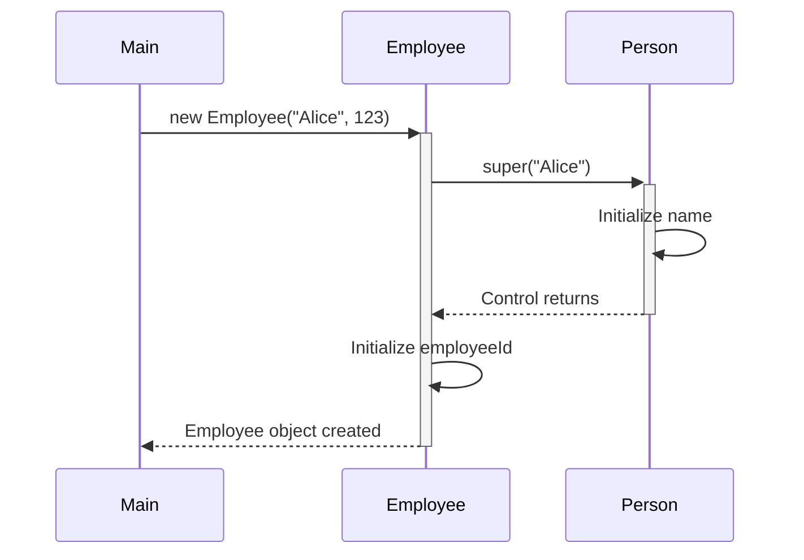

### DIY 6: School Management

1. Create a `Person` class with:
   - Private fields: `name` (String) and `age` (int).
   - A constructor that initializes both fields.
   - Getters and setters for the fields.
2. Create a `Student` class that extends `Person` with:
   - A private field: `studentId` (String).
   - A constructor that initializes `name`, `age`, and `studentId`.
   - Getters and setters for its field.
3. In `Main`, create instances of both `Person` and `Student`, and print the details of both using the getter methods.

**Expected output**

```text
Person: Alice, Age: 30
Student: Bob, Age: 20, ID: S12345
```

(Sample values - print whichever details you passed to the constructors.)

<details><summary>Hint</summary>

`Student`'s constructor must start with `super(name, age)` so `Person` initialises its fields first. Suggested design:

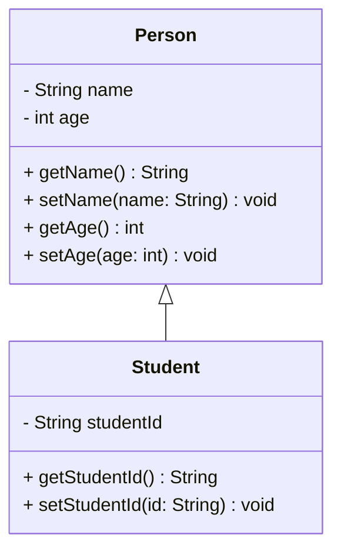

</details>

## 6. Is-A or Has-A

### Explanation

`extends` is not the only way to connect two classes, and reaching for it by reflex is the classic design bug. Before you write `extends`, run the **sentence test**: say "an X **is a** Y" out loud. If the sentence is true, inheritance is right and Y goes *above* X as its superclass. If the truth is really "an X **has a** Y", then Y goes *inside* X as a field.

| Pair | Say it out loud | Relationship | In Java |
|---|---|---|---|
| `Employee`, `Person` | "an Employee is a Person" - true | is-a | `class Employee extends Person` |
| `Car`, `Engine` | "a Car is an Engine" - nonsense | has-a | `class Car { private Engine engine; }` |

The two do different work for you. Inheritance hands the subclass the whole superclass menu automatically. Containment hands you nothing automatically: the outer class holds the other object in a field and **delegates** - it asks the field to do the job. When you are genuinely torn, prefer has-a. A field is easy to change later; `extends` is a public promise that X is a Y, and you cannot take it back.

### DIY 7: Is-a or has-a?

1. For each pair below, run the sentence test and write your answer as a comment in `Main` - is it **is-a** (use `extends`) or **has-a** (make it a field)?
   - `Car` and `Engine`
   - `Dog` and `Animal`
   - `Library` and `Book`
   - `Square` and `Shape`
2. Implement one of the **has-a** pairs. Write a `Book` class with a private `String title`, a constructor that sets it, a getter, and a `void read()` method that prints "Reading " followed by the title. Then write a `Library` class with a private `String name` **and a private `Book featured` field**. `Library`'s constructor takes a library name and a book title, and builds its own `Book` from that title. Give `Library` a `void showFeatured()` method that prints the library name followed by " features one book today:" and then delegates the rest of the job to the book by calling `featured.read()`.
3. Implement one of the **is-a** pairs. Write a `Shape` class with a `void describe()` method that prints "I am a shape" (if you typed in the `Shape` example from section 3, just add the method to it). Then write `Square extends Shape` with a private `double side`, a constructor that sets it, and a `void printSide()` method that prints "My side is " followed by the side. `Square` writes no `describe()` of its own.
4. In `Main`, create a `Library` named "ATU Library" featuring "The Hobbit" and call `showFeatured()`. Then create a `Square` with side `4.0` and call `describe()` followed by `printSide()`. That `describe()` call is the proof of the is-a link: `Square` never declared the method.

**Expected output**

```text
ATU Library features one book today:
Reading The Hobbit
I am a shape
My side is 4.0
```

<details><summary>Hint</summary>

The sentence test is the whole exercise: can you say "an X **is a** Y" without lying? "a Square is a Shape" - fine, so `Square extends Shape`. "a Library is a Book" - nonsense; a library *holds* books, so `Book` becomes a field inside `Library`. Work the other two the same way, out loud.

Then watch what each relationship gives you. `Square` gets `describe()` for free - inheritance copies the parent's whole menu down. `Library` gets nothing for free: it holds a `Book` and has to ask it, `featured.read()`, which is exactly what delegation means. Suggested design:

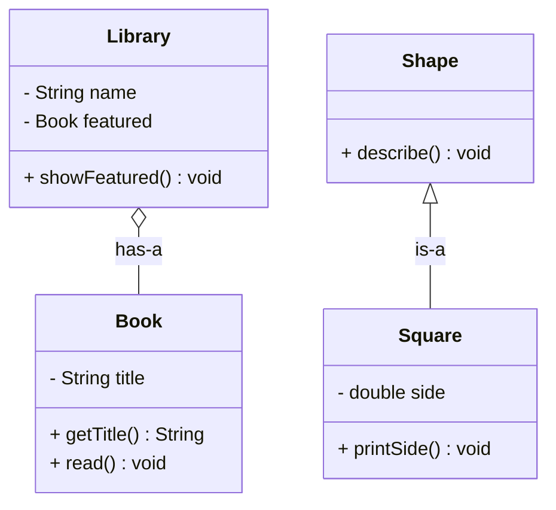

</details>

## Summary

In this lab you covered:

- Definition and Basics of Inheritance
- Terminology
- Types of Inheritance
- The Object Class
- Constructors in Inheritance
- Is-A or Has-A

Happy coding! Remember to test your classes and understand how inheritance affects the behaviour and structure of your objects.
