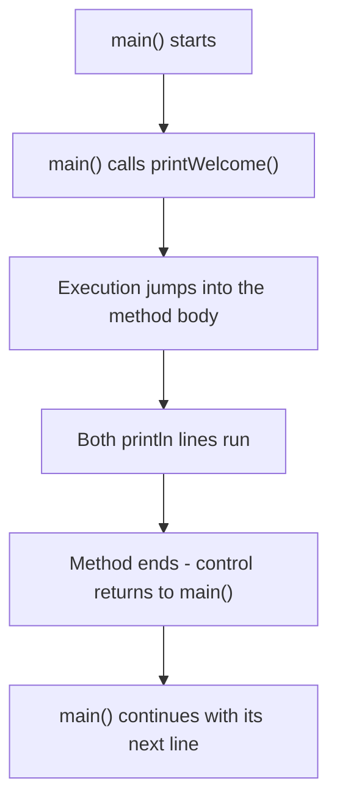
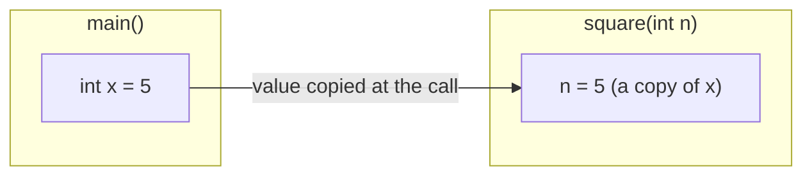
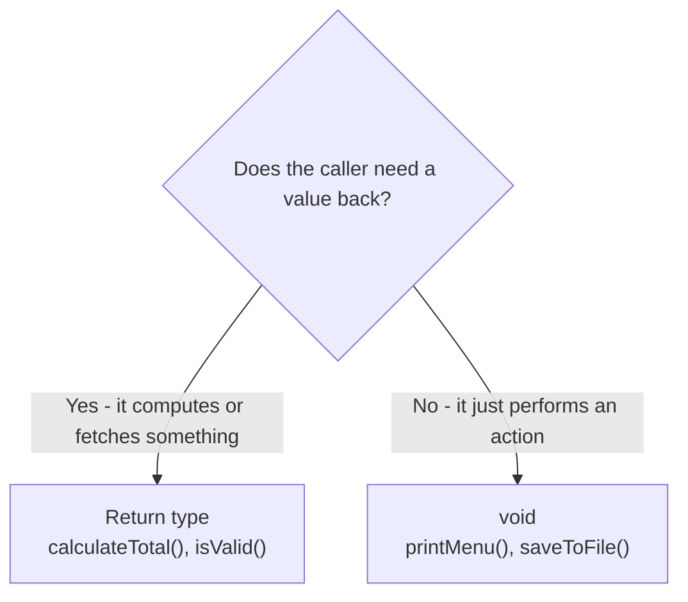
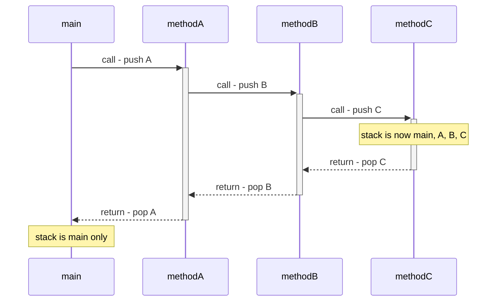

# Java Methods Lab

## What you'll learn

* How to define methods and call them from `main`
* How parameters carry values into a method and return values carry results back out
* When to choose `void` and when to return a value
* How `public`, `private`, and `static` change who can call a method and how
* How Java tracks running methods on the call stack - including recursive calls

## Table of Contents

- [1. Introduction](#1-introduction)
- [2. Defining Simple Methods](#2-defining-simple-methods)
- [3. Methods with Parameters](#3-methods-with-parameters)
- [4. Methods with Return Values](#4-methods-with-return-values)
- [5. void vs Return Types](#5-void-vs-return-types)
- [6. Method Visibility: public and private](#6-method-visibility-public-and-private)
- [7. Static Methods](#7-static-methods)
- [8. Method Call Stack and Execution Flow](#8-method-call-stack-and-execution-flow)
- [9. Common Mistakes and Debugging](#9-common-mistakes-and-debugging)

## Getting started

This lab lives in the package `ie.atu.methods` - this folder. A runnable `Main.java` is already here: open this folder in VS Code or your Codespace, click ▶ on `Main.java` to check your setup works. Then give **each exercise its own file** in this same package - `Diy1.java`, `Diy2.java`, ... - each with its own `main` method (the ▶ button appears above every `main`), so every exercise stays runnable on its own and finishing one never disturbs the last. Any extra class an exercise needs goes in its own file beside it, and every file starts with the package line you see in `Main.java`.

---

## 1. Introduction

A **method** is a named block of code that performs one task and can be reused anywhere in your program. Instead of copy-pasting the same lines, you write them once and *call* the method wherever you need it. Methods make code **reusable** (write once, call many times), **modular** (big problems become small pieces), **readable** (a good name like `calculateAverage` documents itself), and **maintainable** (fix a bug in one place, not everywhere it was pasted).

Four terms you'll meet constantly:

* **Declaration** - the access modifier, return type, name, and parameter list.
* **Body** - the code between `{ }` that runs when the method is called.
* **Call** - using the method's name (plus arguments) to run it.
* **Signature** - the method's name plus its parameter list.

---

## 2. Defining Simple Methods

Every method follows the same pattern:

```
accessModifier returnType methodName(parameters) {
    // method body
    return value;   // only if returnType is not void
}
```

* **Access modifier** - `public`, `private`, etc. (we'll use `public` for now)
* **Return type** - the type of value sent back, or `void` for none
* **Name** - descriptive, camelCase
* **Parameters** - optional inputs the method needs

Here's a simple `void` method and the call that runs it:

```java
public class GreetingApp {

    public void printWelcome() {
        System.out.println("Welcome to Java Methods Lab!");
        System.out.println("Let's learn about methods together.");
    }

    public static void main(String[] args) {
        GreetingApp app = new GreetingApp();
        app.printWelcome();
    }
}
```

When `main` reaches `app.printWelcome();`, execution jumps into the method, runs its body, and comes straight back:



### DIY 1: Calculator menu

1. Create a class named `Calculator`.
2. Add a method `printHeader()` that prints the three-line header shown below.
3. Add a method `printMenu()` that lists the four operations shown below.
4. In `main`, create a `Calculator` object and call both methods.

**Expected output**

```text
================================
     SIMPLE CALCULATOR
================================
Choose an operation:
1. Addition
2. Subtraction
3. Multiplication
4. Division
```

<details><summary>Hint</summary>

Both methods are `void`: they print and hand nothing back, so neither needs a `return`. Neither takes parameters either - everything they print is fixed text. Count the `=` characters in the expected output and match them exactly, or the two rules will not line up.

</details>

---

## 3. Methods with Parameters

**Parameters** let a method accept input. You name them in the method definition; the **arguments** are the actual values you supply in the call. At the moment of the call, each argument's *value is copied* into the matching parameter - the method then works on its own copy, so reassigning a parameter never changes the caller's variable:



A method can take as many parameters as it needs, separated by commas:

```java
public class Greeter {

    public void greetUser(String name) {
        System.out.println("Hello, " + name + "!");
        System.out.println("Welcome to our program.");
    }

    public void greetUserWithAge(String name, int age) {
        System.out.println("Hello, " + name + "!");
        System.out.println("You are " + age + " years old.");
    }

    public static void main(String[] args) {
        Greeter greeter = new Greeter();
        greeter.greetUser("Alice");
        greeter.greetUserWithAge("Bob", 25);
    }
}
```

```text
Hello, Alice!
Welcome to our program.
Hello, Bob!
You are 25 years old.
```

### DIY 2: Calculator print methods

1. In `Calculator`, add four methods:
   * `printAddition(int a, int b)` - prints `a + b = result`
   * `printSubtraction(int a, int b)` - prints `a - b = result`
   * `printMultiplication(int a, int b)` - prints `a × b = result`
   * `printDivision(double a, double b)` - prints `a ÷ b = result` (use `double` for division)
2. In `main`, test each method with different values.

These methods only print - they don't return anything. The next section fixes that.

**Expected output**

```text
5 + 3 = 8
10 - 4 = 6
6 × 7 = 42
15.0 ÷ 3.0 = 5.0
```

<details><summary>Hint</summary>

Four `void` methods again, but this time each one declares its two values as parameters. Two details decide whether your output matches: the last method takes `double`, not `int`, because `15 / 3` on ints prints `5` rather than `5.0`; and the symbols in the expected output are `×` and `÷`, not `*` and `/` - copy them from the block above rather than typing them.

</details>

---

## 4. Methods with Return Values

A method with a non-`void` return type sends a value back to the caller with the `return` keyword. That's far more powerful than printing, because the caller can store the result and keep computing with it.

* The returned value's type must match the declared return type.
* `return` immediately ends the method.
* A method may contain several `return` statements, but only one runs per call.

```java
public class MathOperations {

    public int add(int a, int b) {
        int sum = a + b;
        return sum;
    }

    public double calculateAverage(int num1, int num2, int num3) {
        int total = num1 + num2 + num3;
        return total / 3.0;
    }

    public static void main(String[] args) {
        MathOperations math = new MathOperations();
        int result = math.add(10, 5);
        System.out.println("10 + 5 = " + result);
        System.out.println("Average: " + math.calculateAverage(80, 90, 85));
    }
}
```

```text
10 + 5 = 15
Average: 85.0
```

### DIY 3: Calculator with return values

1. In `Calculator`, replace the print methods with value-returning versions:
   * `int add(int a, int b)` - returns the sum
   * `int subtract(int a, int b)` - returns the difference
   * `int multiply(int a, int b)` - returns the product
   * `double divide(double a, double b)` - returns the quotient
2. Add error handling to `divide()`: if `b` is 0, print an error message and return 0.
3. In `main`, call each method, store each result in a variable, and print the results in a formatted way.

**Expected output**

```text
Addition: 5 + 3 = 8
Subtraction: 10 - 4 = 6
Multiplication: 6 × 7 = 42
Division: 15.0 ÷ 3.0 = 5.0
Error: Cannot divide by zero!
Division: 10.0 ÷ 0.0 = 0.0
```

<details><summary>Hint</summary>

Test `b == 0` at the top of `divide()` and return early - check *before* you divide, never after.

</details>

---

## 5. void vs Return Types

The choice is simpler than it looks:



* **`void`** - the method's purpose is a side effect: printing, saving, updating state.
* **Return type** - the method produces a value the caller will use: a calculation, a lookup, a true/false check.

```java
public class StudentGradeProcessor {

    public void printGrade(String studentName, double score) {   // action -> void
        System.out.println(studentName + " scored " + score + "%");
    }

    public char calculateLetterGrade(double score) {             // computes -> returns
        if (score >= 90) return 'A';
        else if (score >= 80) return 'B';
        else if (score >= 70) return 'C';
        else if (score >= 60) return 'D';
        else return 'F';
    }

    public boolean isPassing(double score) {                     // checks -> returns
        return score >= 60;
    }

    public static void main(String[] args) {
        StudentGradeProcessor processor = new StudentGradeProcessor();
        double score = 85.5;
        processor.printGrade("Alice", score);
        System.out.println("Letter Grade: " + processor.calculateLetterGrade(score));
        System.out.println("Passing: " + processor.isPassing(score));
    }
}
```

```text
Alice scored 85.5%
Letter Grade: B
Passing: true
```

### DIY 4: Temperature converter

1. Create a class named `TemperatureConverter` with these methods:
   * `double celsiusToFahrenheit(double celsius)`
   * `double fahrenheitToCelsius(double fahrenheit)`
   * `void printConversionTable(int startCelsius, int endCelsius)` - prints a table in steps of 10 (void: it only displays)
   * `boolean isFreezingCelsius(double celsius)` - true at or below 0°C
   * `boolean isBoilingCelsius(double celsius)` - true at or above 100°C
2. Formulas: Fahrenheit = (Celsius × 9/5) + 32 and Celsius = (Fahrenheit − 32) × 5/9.
3. Test all five methods in `main`.

**Expected output**

```text
25.0°C = 77.0°F
77.0°F = 25.0°C

Celsius to Fahrenheit Conversion Table:
0°C = 32.0°F
10°C = 50.0°F
20°C = 68.0°F
30°C = 86.0°F

Is 0°C freezing? true
Is 100°C boiling? true
Is 25°C freezing? false
```

<details><summary>Hint</summary>

Write the fraction as `9.0 / 5.0`. With `int` literals, `9 / 5` is integer division and equals `1`, which silently wrecks the formula.

</details>

---

## 6. Method Visibility: public and private

**Access modifiers** control who may call a method:

* **`public`** - callable from anywhere. Use it for the operations a class offers to the outside world.
* **`private`** - callable only inside the same class. Use it for helper methods that support the public ones.

Keeping helpers `private` is **encapsulation**: implementation details stay hidden, so you can rewrite them later without breaking any other class - and no outside code can call them in the wrong order.

```java
public class BankAccount {
    private double balance;

    // Public methods - the class's interface
    public void deposit(double amount) {
        if (isValidAmount(amount)) {          // calls a private helper
            balance += amount;
            System.out.println("Deposited: $" + amount);
        } else {
            System.out.println("Invalid deposit amount");
        }
    }

    public void withdraw(double amount) {
        if (isValidAmount(amount) && hasSufficientFunds(amount)) {
            balance -= amount;
            System.out.println("Withdrew: $" + amount);
        } else {
            System.out.println("Invalid withdrawal");
        }
    }

    public double getBalance() {
        return balance;
    }

    // Private helpers - invisible outside this class
    private boolean isValidAmount(double amount) {
        return amount > 0;
    }

    private boolean hasSufficientFunds(double amount) {
        return balance >= amount;
    }
}
```

### DIY 5: PIN validator

A bank card PIN is four digits, and not every four-digit number is acceptable: `7777` and `1234` are the first two anyone guesses.

1. Create a class named `PinValidator`.
2. Add two **public** methods:
   * `boolean isValidPin(int pin)` - true only if all four checks below pass
   * `void printValidationReport(int pin)` - prints whether the PIN is valid, then the result of each individual check
3. Add four **private** helper methods, each returning `boolean`:
   * `hasFourDigits` - the PIN is between 1000 and 9999
   * `hasMixedDigits` - the four digits are not all the same (`7777` fails)
   * `isNotAscendingRun` - the digits do not each climb by one (`1234` fails)
   * `isNotDescendingRun` - the digits do not each drop by one (`5432` fails)
4. `isValidPin()` must call all four helpers - it does no digit arithmetic of its own.
5. Test three PINs in `main`: two rejected for different reasons, one accepted.

**Expected output**

```text
Testing PIN: 1234
Valid: false
- Four digits (1000-9999): true
- Not all the same digit: true
- Not an ascending run: false
- Not a descending run: true

Testing PIN: 7777
Valid: false
- Four digits (1000-9999): true
- Not all the same digit: false
- Not an ascending run: true
- Not a descending run: true

Testing PIN: 4830
Valid: true
- Four digits (1000-9999): true
- Not all the same digit: true
- Not an ascending run: true
- Not a descending run: true
```

<details><summary>Hint</summary>

Pull the digits apart with arithmetic - `/` and `%` are the only tools you need. For a four-digit `pin`: `pin / 1000` is the first digit, `(pin / 100) % 10` the second, `(pin / 10) % 10` the third, and `pin % 10` the last. Each helper is then a single `return` of a boolean expression, and a `!` in front of a bracketed condition flips "is a run" into "is not a run". `isValidPin` joins the four helper calls with `&&`.

</details>

---

## 7. Static Methods

A **static** method belongs to the class itself, not to any object. Call it as `ClassName.methodName()` - no `new` required.

* `main` is static; so are utilities like `Math.sqrt()` and `Math.pow()`.
* Static methods cannot directly access instance variables or use `this` - there is no object.
* Use them for operations that depend only on their parameters.

```java
public class MathHelper {

    public static int square(int number) {
        return number * number;
    }

    public static double calculateCircleArea(double radius) {
        return Math.PI * radius * radius;
    }

    public static int findMax(int a, int b, int c) {
        int max = a;
        if (b > max) max = b;
        if (c > max) max = c;
        return max;
    }

    public static void main(String[] args) {
        System.out.println("Square of 5: " + MathHelper.square(5));
        System.out.println("Area of circle: " + MathHelper.calculateCircleArea(3.0));
        System.out.println("Maximum: " + MathHelper.findMax(10, 25, 15));
    }
}
```

```text
Square of 5: 25
Area of circle: 28.274333882308138
Maximum: 25
```

The same distinction applies to fields - a `static` field is shared by every instance, while each object gets its own copy of an instance field:

```java
public class Counter {
    static int staticCount = 0;      // shared by all instances
    int instanceCount = 0;           // unique per object

    public static void incrementStatic() {
        staticCount++;
    }

    public void incrementInstance() {
        instanceCount++;
    }

    public void printCounts() {
        System.out.println("Static: " + staticCount + ", Instance: " + instanceCount);
    }

    public static void main(String[] args) {
        Counter c1 = new Counter();
        Counter c2 = new Counter();
        c1.incrementInstance();
        c1.incrementInstance();
        Counter.incrementStatic();
        Counter.incrementStatic();
        c2.incrementInstance();
        Counter.incrementStatic();
        c1.printCounts();  // Static: 3, Instance: 2
        c2.printCounts();  // Static: 3, Instance: 1
    }
}
```

### DIY 6: Number utilities

Build a small library of `static` maths helpers - the kind of thing `Math` itself is made of.

1. Create a class named `NumberUtils` with these **static** methods:
   * `boolean isEven(int n)` - true when `n` divides by 2 exactly
   * `int digitSum(int n)` - adds the digits: `digitSum(4821)` is 15
   * `int reverseDigits(int n)` - `reverseDigits(4821)` is 1284
   * `boolean isNumberPalindrome(int n)` - reads the same both ways; **call `reverseDigits` rather than repeating its loop**
   * `int gcd(int a, int b)` - the greatest common divisor of two positive numbers
   * `int lcm(int a, int b)` - the lowest common multiple; **call `gcd`**
   * `boolean isPrime(int n)` - true when `n` is 2 or more and divides evenly by nothing but 1 and itself
2. Call every one of them from `main` and print the results - **without creating a single object**.

**Expected output**

```text
Testing NumberUtils:
Is 14 even? true
Is 7 even? false
Digit sum of 4821: 15
Reverse of 4821: 1284
Is 1221 a palindrome? true
Is 1234 a palindrome? false
GCD of 48 and 18: 6
LCM of 4 and 6: 12
Is 29 prime? true
Is 27 prime? false
```

<details><summary>Hint</summary>

`%` and `/` do all the work here. To walk the digits of `n`, loop while `n > 0`, taking `n % 10` as the last digit and then shrinking `n` with `n = n / 10`. For `gcd`, keep replacing the pair `(a, b)` with `(b, a % b)` until `b` is 0 - the answer is whatever `a` holds then. Then `lcm(a, b)` is `a / gcd(a, b) * b`. For `isPrime`, reject anything below 2, then try divisors from 2 upward while `i * i <= n`.

</details>

---

## 8. Method Call Stack and Execution Flow

When methods call other methods, Java tracks them on the **call stack** - Last-In-First-Out, like a stack of plates:

1. Calling a method **pushes** it onto the top of the stack.
2. When it finishes, it is **popped** off, and execution resumes in the method below it.
3. Too many nested calls (usually runaway recursion) overflow the stack - the infamous `StackOverflowError`.

```java
public class CallStackDemo {

    public static void main(String[] args) {
        System.out.println("Starting in main");
        methodA();
        System.out.println("Back in main");
    }

    public static void methodA() {
        System.out.println("  In methodA");
        methodB();
        System.out.println("  Back in methodA");
    }

    public static void methodB() {
        System.out.println("    In methodB");
        methodC();
        System.out.println("    Back in methodB");
    }

    public static void methodC() {
        System.out.println("      In methodC");
        System.out.println("      Finishing methodC");
    }
}
```

```text
Starting in main
  In methodA
    In methodB
      In methodC
      Finishing methodC
    Back in methodB
  Back in methodA
Back in main
```

Each call pushes a frame onto the stack; each return pops one off:



**Recursion** is a method calling itself. Every call pushes a fresh frame, so a **base case** must eventually stop the chain:

```java
public static int factorial(int n) {
    if (n <= 1) return 1;            // base case - stops the recursion
    return n * factorial(n - 1);     // recursive step - pushes another frame
}
// factorial(5) -> 5 * 4 * 3 * 2 * 1 = 120
```

### DIY 7: Trace the call stack

1. Create a class named `ExecutionTracer`.
2. Add three **static** methods:
   * `methodA()` - prints `A start`, calls `methodB()`, prints `A end`
   * `methodB()` - prints `B start`, calls `methodC()`, prints `B end`
   * `methodC()` - prints `C start`, then `C end`
3. Call `methodA()` from `main`.
4. Before running, predict the output on paper by drawing the stack at each step - then run and check yourself.

**Expected output**

```text
A start
B start
C start
C end
B end
A end
```

<details><summary>Hint</summary>

All three methods are `static`, so `main` calls them by name with no object involved. The order is not three tidy pairs: `methodA` cannot reach its `A end` line until `methodB` has completely finished, and `methodB` cannot finish until `methodC` has. Draw the stack growing downward as each call is pushed, then unwinding from the bottom as each returns - the printed order is the shape of that drawing.

</details>

### DIY 8: Simple recursion

1. Create a class named `RecursiveMethods` with these **static** recursive methods:
   * `int countdown(int n)` - prints n down to 1, then returns 0
   * `int sumToN(int n)` - returns 1 + 2 + … + n, printing each call
   * `int power(int base, int exponent)` - returns base^exponent, printing each call
2. Test each with small values (n ≤ 5) so you can follow the stack in the output.

**Expected output**

```text
Countdown from 5:
5
4
3
2
1

Sum from 1 to 5:
Calculating sum(5)
Calculating sum(4)
Calculating sum(3)
Calculating sum(2)
Calculating sum(1)
Result: 15

Power 2^4:
Calculating 2^4
Calculating 2^3
Calculating 2^2
Calculating 2^1
Calculating 2^0
Result: 16
```

<details><summary>Hint</summary>

Every recursive method needs the same two pieces as `factorial`: a base case that returns without recursing (`n <= 1` or `exponent == 0`), and a recursive step that calls itself with a *smaller* argument.

</details>

---

## 9. Common Mistakes and Debugging

Seven errors account for most method bugs. Each snippet shows the mistake and its fix:

**1. Missing return statement** - every path through a non-void method must return:

```java
public int getValue(int x) {
    if (x > 0) {
        return x;
    }
    return 0;   // without this line: compiler error
}
```

**2. Wrong argument type:**

<!-- no-compile -->
```java
add(5, "3");   // error: can't pass a String where an int is expected
add(5, 3);     // correct
```

**3. Discarding the return value:**

<!-- no-compile -->
```java
calculateTotal(10, 5);               // legal, but the result is lost
int result = calculateTotal(10, 5);  // store it - then use it
```

**4. Calling an instance method from a static context:**

<!-- no-compile -->
```java
instanceMethod();               // error: main is static, there is no object
MyClass obj = new MyClass();
obj.instanceMethod();           // correct
```

**5. Returning a value from a `void` method:**

<!-- no-compile -->
```java
public void calculate(int x) {   // error
    return x * 2;
}

public int calculate(int x) {   // correct
    return x * 2;
}
```

**6. Confusing parameters with arguments:**

<!-- no-compile -->
```java
public void greet(String name) { ... }   // 'name' is the parameter
greet("Alice");                          // "Alice" is the argument
```

**7. Arguments in the wrong order** - arguments fill parameters left to right, by position:

<!-- no-compile -->
```java
subtract(3, 10);   // compiles, runs, and quietly answers -7
subtract(10, 3);   // correct - the order is on you, not the compiler
```

Notice which of these the compiler can catch. Mistakes **1, 2, 4 and 5 stop the build** - `javac` names the file and the line, and you cannot ship until you fix them. Mistakes **3 and 7 are legal Java**: the class builds, runs, and is simply wrong - nothing but reading will find them. (6 is vocabulary rather than a bug.) That split is exactly what the next exercise is about.

**Debugging tips:** print on entry (`"Entering divide with " + a + ", " + b`), print every return value before using it, and learn your IDE's debugger - stepping through line by line beats guessing.

### DIY 9: Fix the buggy calculator

The class below carries **10 labelled faults: 8 compile errors and 2 design faults.** The compiler finds the first eight for you. The last two are legal Java - the class builds and runs with them still in place, so only reading will catch them.

<!-- no-compile -->
```java
public class BuggyCalculator {

    // Compile error 1: no return type
    public static calculateSum(int a, int b) {
        return a + b;
    }

    // Compile error 2: a void method handing back a value
    public static void getProduct(int a, int b) {
        return a * b;
    }

    // Compile error 3: no return when num is 0
    public static int checkValue(int num) {
        if (num > 0) {
            return 1;
        } else if (num < 0) {
            return -1;
        }
    }

    private int multiplier = 10;

    // Compile error 4: a static method reading an instance field
    public static int scaleValue(int value) {
        return value * multiplier;
    }

    // Compile error 5: a void method handing back a value
    public static void printResult() {
        return 42;
    }

    // Not a fault - this declaration is fine. Watch how main calls it.
    public void displayMessage() {
        System.out.println("Hello!");
    }

    // Not a fault either - this one is correct. Watch how main uses it.
    public static int subtract(int a, int b) {
        return a - b;
    }

    public static void main(String[] args) {
        // Compile error 6: wrong argument type
        int sum = calculateSum(5, "10");

        // Compile error 7: an instance method called with no object
        displayMessage();

        // Compile error 8: wrong number of arguments
        getProduct(5);

        // Design fault 9: legal Java - the answer is computed, then thrown away
        subtract(10, 3);

        // Design fault 10: legal Java - but read the label against the arguments
        System.out.println("10 - 3 = " + subtract(3, 10));
    }
}
```

1. Copy the class into your package.
2. Fix the eight compile errors first. Faults 1-5 are in the declarations, 6-8 in how `main` calls them - repair the declarations and most of the calls fall into place.
3. Expect `javac` to report **far fewer than eight at a time**. Fault 1 is a *parse* error, so on the first run it is the only message you get - and the missing-return check does not run at all until the type errors above it are gone. Fix, recompile, repeat until the class builds.
4. Now hunt faults 9 and 10 by **reading**, not compiling: the build is already green and stays green with both still in place. For each, say what the code does and what it was clearly meant to do.
5. Make `main` store and print every result, so each fix shows up in the output.
6. Compile and run.

**Expected output**

```text
Sum: 15
Hello!
Product: 20
Check 0: 0
Scaled: 70
10 - 3 = 7
Result: 42
```

(Representative run - your exact fixes and wording may differ, as long as the class compiles and every call works.)

<details><summary>Hint</summary>

Work top-down. Faults 1-5 live in the method declarations: one has no return type, two hand a value back from a `void` method, one leaves a path with nothing to return, and one reads an instance field from a `static` method - make `multiplier` static, or pass it in as a parameter. Faults 6-8 live in `main`: check each call's argument types, its argument count, and whether the method it names needs an object first. For fault 9, ask where the answer goes - a call sitting alone on a line computes and then discards. For fault 10, compare the printed label with the parameter list of the method being called.

</details>

---

## Summary

You can now:

* **Define and call methods** - the building blocks of every Java program.
* **Pass parameters** (values are copied in) and **return results** (typed values come back out).
* **Choose `void` for actions** and a **return type for computations**.
* **Encapsulate** with `private` helpers behind `public` methods.
* **Write static utilities** that belong to the class, not to objects.
* **Read the call stack** - LIFO push and pop, the key to tracing recursion and debugging.

Habits worth keeping: give methods verb names that say what they do, keep each method focused on one task, prefer returning values over printing, and test edge cases (zero, negatives, empty strings).

Want more practice? Build a student grade system (final grades, letter grades, GPA), a number toolkit (prime testing, digit sums, factors, base conversion), or a number guessing game (random number, guess checking, hints, score tracking) - methods everywhere.
