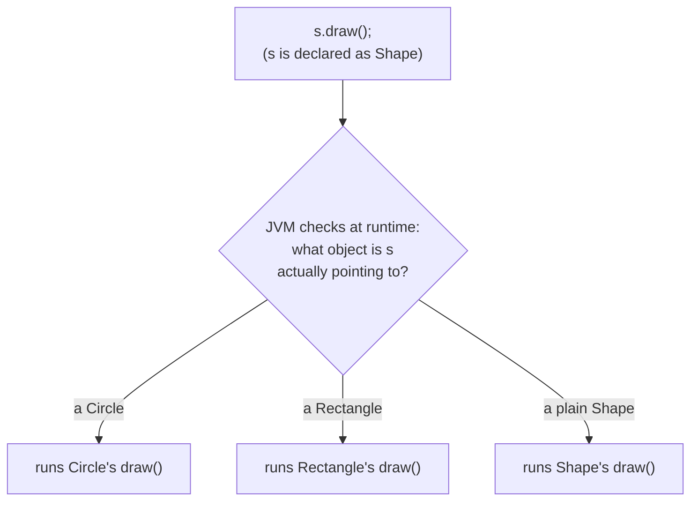
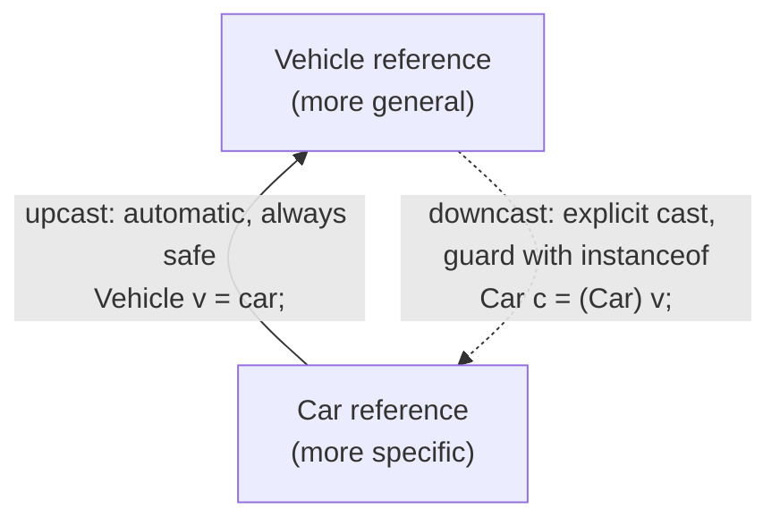
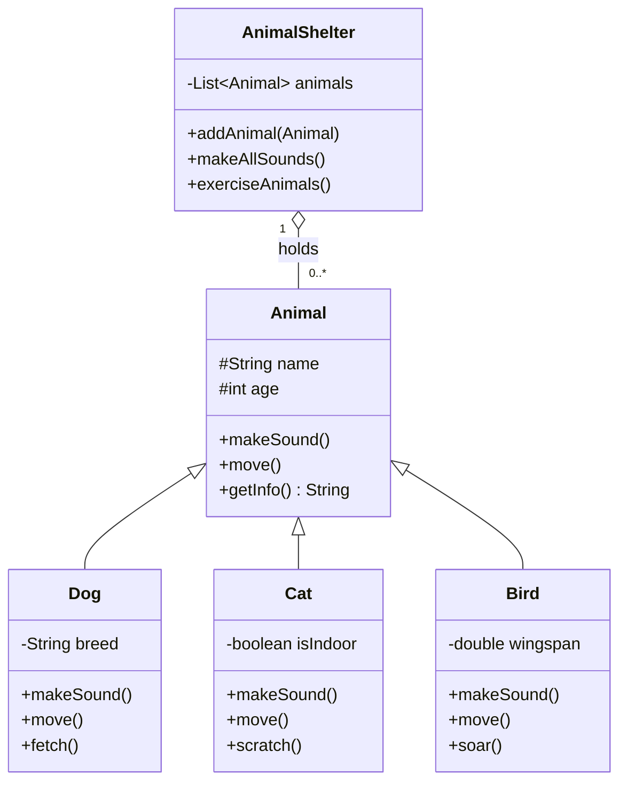

# Java Polymorphism Lab

## What you'll learn

By the end of this lab you will be able to:

- Use method overriding so the same call behaves differently at runtime depending on the actual object type (runtime polymorphism)
- Overload methods with the same name but different signatures, and explain how the compiler chooses between them (compile-time polymorphism)
- Convert references up and down an inheritance hierarchy safely using upcasting, downcasting and `instanceof`
- Store different subclasses in a single collection of their parent type and process them uniformly (heterogeneous collections)

## Table of Contents

1. [Runtime Polymorphism: Understanding "Many Forms"](#1-runtime-polymorphism-understanding-many-forms)
2. [Compile-time Polymorphism (Method Overloading)](#2-compile-time-polymorphism-method-overloading)
3. [Reference Type Conversions](#3-reference-type-conversions)
4. [Heterogeneous Collections](#4-heterogeneous-collections)

## Getting started

This lab lives in the package `ie.atu.polymorphism` - this folder. A runnable `Main.java` is already here: open this folder in VS Code or your Codespace, click ▶ on `Main.java` to check your setup works, then write each exercise's classes beside it in the same package.

## 1. Runtime Polymorphism: Understanding "Many Forms"

### Explanation
The word "polymorphism" comes from Greek, meaning "many forms." In Java, this concept allows us to write methods that can work differently depending on the type of object that uses them. Think of it like a universal remote control - while the "volume up" button does the same basic job (increase volume), it works slightly differently for each device it controls.

Before we dive deeper, let's understand what makes a method unique - its `signature`. A method signature consists of the method name and its parameter types (in order). For example, these two methods have different signatures even though they share the same name:
```java
public void displayInfo(String name) {
    System.out.println("Name: " + name);
}

public void displayInfo(String name, int age) {
    System.out.println("Name: " + name + ", Age: " + age);
}
```
In runtime polymorphism, we often override methods that have the exact same signature in the child class. When you override a method, you're saying "I want to provide my own version of this behavior while keeping the same signature."

Let's see this in action with a simple example using shapes.

```java
public class Shape {
    private String color;
    
    public Shape(String color) {
        this.color = color;
    }
    
    public String getColor() {
        return color;
    }
    
    public void draw() {
        System.out.println("Drawing a shape in " + color);
    }
    
    public double getArea() {
        return 0.0;  // Base implementation
    }
}
```
```java
public class Circle extends Shape {
    private double radius;
    
    public Circle(String color, double radius) {
        super(color);
        this.radius = radius;
    }
    
    @Override
    public void draw() {
        System.out.println("Drawing a " + getColor() + " circle with radius " + radius);
    }
    
    @Override
    public double getArea() {
        return Math.PI * radius * radius;
    }
}
```
```java
public class Rectangle extends Shape {
    private double width;
    private double height;
    
    public Rectangle(String color, double width, double height) {
        super(color);
        this.width = width;
        this.height = height;
    }
    
    @Override
    public void draw() {
        System.out.println("Drawing a " + getColor() + " rectangle " + width + "x" + height);
    }
    
    @Override
    public double getArea() {
        return width * height;
    }
}
```
```java
public class Main {
    public static void main(String[] args) {
        // Create some shapes
        Shape circle = new Circle("red", 5.0);
        Shape rectangle = new Rectangle("blue", 4.0, 6.0);
        
        // Demonstrate method overriding
        circle.draw();      // Will call Circle's draw method
        rectangle.draw();   // Will call Rectangle's draw method
        
        // Demonstrate polymorphic method calls
        System.out.println("Circle area: " + circle.getArea());
        System.out.println("Rectangle area: " + rectangle.getArea());
    }
}
```

When `circle.draw()` runs, the compiler only checks that the declared type (`Shape`) has a `draw()` method. At runtime the JVM looks at the object the reference actually points to and runs that class's override:



### Key Concepts Illustrated
1. Method Overriding: Both Circle and Rectangle provide their own versions of draw() and getArea()
2. Runtime Behavior: The correct method version is called based on the actual object type
3. Common Interface: Both shapes can be treated as Shape references but maintain their specific behaviors
4. Parent Class Reference: We can store a Circle or Rectangle in a Shape variable

### DIY 1: Basic Shapes
Create a simple shape hierarchy that demonstrates method overriding:

1. Create a base `Shape` class with a color property and two methods: `getPerimeter()` (base version returns `0.0`) and `describe()` (base version prints a generic message).
2. Create two subclasses: `Square` (add a side length) and `Circle` (add a radius).
3. In each subclass, override `getPerimeter()` to calculate the correct perimeter, and override `describe()` to print shape-specific information in the form `A red square with side 4.0`.
4. In your main program, create a red `Square` with side `4.0` and a blue `Circle` with radius `5.0`, store both in `Shape` variables, and for each one call `describe()` and then print `"Perimeter: " + getPerimeter()` to demonstrate overriding.

**Expected output**

```text
A red square with side 4.0
Perimeter: 16.0
A blue circle with radius 5.0
Perimeter: 31.41592653589793
```

<details><summary>Hint</summary>

Pass the color up with `super(color)` in each subclass constructor, and mark every override with `@Override` so the compiler checks that your signature matches. Perimeter formulas: `4 * side` for the square and `2 * Math.PI * radius` for the circle.

</details>

## 2. Compile-time Polymorphism (Method Overloading)

### Explanation
Method overloading occurs when we create multiple methods in the same class with the same name but different parameter lists. The compiler determines which version of the method to call based on the method signature. Think of it like having multiple doors to the same room - while the destination (method name) is the same, how you get there (parameters) can be different.

A method signature includes:
- Method name
- Number of parameters
- Type of parameters
- Order of parameters

Note: Return type and parameter names are NOT part of the method signature.

### Example

```java
public class Calculator {
    // Basic integer addition
    public int add(int x, int y) {
        System.out.println("Adding two integers");
        return x + y;
    }
    
    // Three parameter addition
    public int add(int x, int y, int z) {
        System.out.println("Adding three integers");
        return x + y + z;
    }
    
    // Double addition
    public double add(double x, double y) {
        System.out.println("Adding two doubles");
        return x + y;
    }
    
    // String concatenation
    public String add(String x, String y) {
        System.out.println("Concatenating strings");
        return x + y;
    }
    
    // Mixed parameter types
    public double add(int x, double y) {
        System.out.println("Adding integer and double");
        return x + y;
    }
}
```

```java
public class Main {
    public static void main(String[] args) {
        Calculator calc = new Calculator();
        
        // The compiler chooses the correct method based on arguments
        int sum1 = calc.add(5, 3);                    // Calls first method
        int sum2 = calc.add(5, 3, 2);                 // Calls second method
        double sum3 = calc.add(5.5, 3.5);             // Calls third method
        String result = calc.add("Hello ", "World");   // Calls fourth method
        double sum4 = calc.add(5, 3.5);               // Calls fifth method
        
        // This won't compile - no matching signature
        // calc.add("Hello", 5);
    }
}
```

### Why This is Compile-time Polymorphism
The term "compile-time" comes from when the decision about which method to call is made. The compiler looks at:
1. The method name
2. The arguments provided in the call
3. The available method signatures

Based on this information, it determines at compile time (before the program runs) which method should be called. If no matching method is found, you'll get a compilation error.

### DIY 2: Shop Price Calculator
Create a price calculator for a small shop that needs to handle various types of discounts. Your calculator should help the shop owner quickly determine final prices after applying different combinations of discounts. This exercise will help you understand how method overloading can solve real business problems by handling different discount scenarios with clearly named methods.

1. Create a `PriceCalculator` class with these overloaded methods:
   * `calculatePrice(double basePrice)` - returns the regular price with no discount
   * `calculatePrice(double basePrice, double discountPercent)` - returns the price after applying a percentage discount
   * `calculatePrice(double basePrice, boolean hasStudentId)` - returns the price with the student discount ($5 off with valid ID)
   * `calculatePrice(double basePrice, double discountPercent, boolean hasStudentId)` - returns the price with both discounts applied: the percentage discount first, then $5 off
2. In your main method, create a test case with an item priced at $50.00.
3. Show how the price changes with: no discount, a 10% discount, the student discount, and both the 10% and student discounts together.
4. Print all results clearly showing which discount was applied, using the labels shown below.

**Expected output**

```text
Regular price: $50.0
After 10% discount: $45.0
After student discount: $45.0
After 10% + student discount: $40.0
```

<details><summary>Hint</summary>

The compiler picks the overload from the argument types alone: `calculatePrice(50.00, 10.0)` matches `(double, double)`, while `calculatePrice(50.00, true)` matches `(double, boolean)`. In the three-argument version, apply the percentage discount first and subtract the $5 from the result - reusing your other methods keeps the code short.

</details>

## 3. Reference Type Conversions

### Explanation
In Java, an object can be referenced through its own class type or any of its parent class types. This is like how a Square can always be referred to as a Shape - it's still a Square, but we're choosing to view it more generally. This ability to reference objects through different types is fundamental to polymorphism and comes in two forms: upcasting and downcasting.

Upcasting moves a reference up the hierarchy and is always safe; downcasting moves it back down and only works if the object really is that type:



### Example

```java
public class Vehicle {
    private String model;
    
    public Vehicle(String model) {
        this.model = model;
    }
    
    public String getModel() {
        return model;
    }
    
    public void startEngine() {
        System.out.println("Starting engine of " + model);
    }
}
```
```java
public class Car extends Vehicle {
    private int numberOfDoors;
    
    public Car(String model, int numberOfDoors) {
        super(model);
        this.numberOfDoors = numberOfDoors;
    }
    
    public void drive() {
        System.out.println(getModel() + " is driving smoothly on the road");
    }
    
    @Override
    public void startEngine() {
        System.out.println("Starting " + numberOfDoors + "-door " + getModel() + " with key fob");
    }
}
```
```java
public class Main {
    public static void main(String[] args) {
        // Upcasting - implicit (automatic) conversion
        Car car = new Car("Toyota Camry", 4);
        Vehicle vehicle = car;  // Upcasting happens automatically
        
        // Both call Car's version of startEngine
        car.startEngine();      // Calls Car's method
        vehicle.startEngine();   // Also calls Car's method
        
        // This works fine - calling through Car reference
        car.drive();
        
        // This won't compile - Vehicle reference doesn't know about drive()
        // vehicle.drive();  // Compilation error!
        
        // Safe downcasting using instanceof
        if (vehicle instanceof Car) {
            Car downcasted = (Car) vehicle;  // Explicit casting
            downcasted.drive();              // Now we can call Car-specific methods
        }
        
        // Example of unsafe downcasting
        Vehicle genericVehicle = new Vehicle("Generic Vehicle");
        
        // This would compile but throw a ClassCastException at runtime!
        // Car wrongCast = (Car) genericVehicle;
        
        // Proper way to prevent runtime errors
        if (genericVehicle instanceof Car) {
            Car safeCast = (Car) genericVehicle;  // This block won't execute
        } else {
            System.out.println("Not a Car - casting prevented!");
        }
    }
}
```

### Key Concepts
1. Upcasting (Widening):
   - Converting from a more specific type to a more general type
   - Always safe and happens automatically
   - Might lose access to specific methods
   - Example: Car to Vehicle

2. Downcasting (Narrowing):
   - Converting from a more general type to a more specific type
   - Requires explicit casting
   - Can cause runtime errors if not done carefully
   - Should always use instanceof to check first
   - Example: Vehicle to Car

### DIY 3: Shape Type Conversion
Create a program that demonstrates type conversions with shapes:

1. Reuse your `Shape`, `Circle` and `Square` classes from DIY 1, adding a `getArea()` method to `Shape` (return `0.0`), an overridden `getArea()` plus a `getCircumference()` method to `Circle`, and an overridden `getArea()` plus a `getDiagonal()` method to `Square`.
2. Demonstrate upcasting: create a `Circle` with radius `5.0` and a `Square` with side `2.0`, store each in a `Shape` variable, and print both areas through the `Shape` references - method overriding means the subclass versions run even though the declared type is `Shape`.
3. Demonstrate safe downcasting: use `instanceof` checks with explicit casts to get the `Circle` and `Square` references back, then print the circumference and the diagonal.
4. Demonstrate what happens with unsafe downcasting: store a plain `Shape` object in a `Shape` variable and guard an attempted cast to `Circle` with `instanceof`, printing `Not a Circle - casting prevented!` when the check fails. (Try the cast once without the guard to see the `ClassCastException`, then put the guard back.)

**Expected output**

```text
Circle area: 78.53981633974483
Square area: 4.0
Circle circumference: 31.41592653589793
Square diagonal: 2.8284271247461903
Not a Circle - casting prevented!
```

<details><summary>Hint</summary>

Upcasting needs no cast at all: `Shape s = new Circle("green", 5.0);`. Downcasting needs both the check and the cast:

<!-- no-compile -->
```java
if (s instanceof Circle) {
    Circle c = (Circle) s;
    System.out.println("Circle circumference: " + c.getCircumference());
}
```

Formulas: circumference = `2 * Math.PI * radius`, diagonal = `side * Math.sqrt(2)`.

</details>

## 4. Heterogeneous Collections

Because every `Dog`, `Cat` and `Bird` is-an `Animal`, a single `List<Animal>` can hold all of them at once, and polymorphism decides whose `makeSound()` or `move()` runs on each loop iteration:



### Example: Animal Kingdom

```java
public class Animal {
    protected String name;
    protected int age;
    
    public Animal(String name, int age) {
        this.name = name;
        this.age = age;
    }
    
    public void makeSound() {
        System.out.println(name + " makes a sound");
    }
    
    public void move() {
        System.out.println(name + " moves around");
    }
    
    public String getInfo() {
        return name + " (" + age + " years old)";
    }
}
```

```java
public class Dog extends Animal {
    private String breed;
    
    public Dog(String name, int age, String breed) {
        super(name, age);
        this.breed = breed;
    }
    
    @Override
    public void makeSound() {
        System.out.println(name + " barks: Woof! Woof!");
    }
    
    @Override
    public void move() {
        System.out.println(name + " runs on four legs");
    }
    
    public void fetch() {
        System.out.println(name + " the " + breed + " fetches the ball");
    }
}
```

```java
public class Cat extends Animal {
    private boolean isIndoor;
    
    public Cat(String name, int age, boolean isIndoor) {
        super(name, age);
        this.isIndoor = isIndoor;
    }
    
    @Override
    public void makeSound() {
        System.out.println(name + " meows: Meow!");
    }
    
    @Override
    public void move() {
        System.out.println(name + " prowls gracefully");
    }
    
    public void scratch() {
        System.out.println(name + " scratches the " + 
            (isIndoor ? "furniture" : "tree"));
    }
}
```

```java
public class Bird extends Animal {
    private double wingspan;
    
    public Bird(String name, int age, double wingspan) {
        super(name, age);
        this.wingspan = wingspan;
    }
    
    @Override
    public void makeSound() {
        System.out.println(name + " chirps: Tweet! Tweet!");
    }
    
    @Override
    public void move() {
        System.out.println(name + " flies with its " + wingspan + "cm wingspan");
    }
    
    public void soar() {
        System.out.println(name + " soars high in the sky");
    }
}
```

<!-- no-compile -->
```java
public class AnimalShelter {
    private List<Animal> animals;
    
    public AnimalShelter() {
        this.animals = new ArrayList<>();
    }
    
    public void addAnimal(Animal animal) {
        animals.add(animal);
    }
    
    public void makeAllSounds() {
        System.out.println("\nAll animals making sounds:");
        for (Animal animal : animals) {
            animal.makeSound();
        }
    }
    
    public void exerciseAnimals() {
        System.out.println("\nExercising all animals:");
        for (Animal animal : animals) {
            // Common behavior
            animal.move();
            
            // Type-specific behavior
            if (animal instanceof Dog) {
                ((Dog) animal).fetch();
            } else if (animal instanceof Cat) {
                ((Cat) animal).scratch();
            } else if (animal instanceof Bird) {
                ((Bird) animal).soar();
            }
            
            System.out.println("---------------");
        }
    }
}
```

<!-- no-compile -->
```java
public class Main {
    public static void main(String[] args) {
        AnimalShelter shelter = new AnimalShelter();
        
        // Adding different types of animals
        shelter.addAnimal(new Dog("Buddy", 5, "Golden Retriever"));
        shelter.addAnimal(new Cat("Whiskers", 3, true));
        shelter.addAnimal(new Bird("Tweety", 1, 15.5));
        shelter.addAnimal(new Dog("Rex", 7, "German Shepherd"));
        
        // Demonstrate common behaviors
        shelter.makeAllSounds();
        
        // Demonstrate type-specific behaviors
        shelter.exerciseAnimals();
    }
}
```

### Key Benefits of Heterogeneous Collections
1. Single Collection Type: Store different but related objects in one collection
2. Unified Processing: Handle different types uniformly when needed
3. Type-Specific Operations: Still possible through instanceof and casting
4. Flexibility: Easy to add new animal types without changing existing code
5. Code Organization: Common behaviors in parent class, specific in subclasses

### DIY 4: Extend the Shelter
Grow the animal kingdom from the example above:

1. Add a fourth animal class: a `Horse` with a `breed` field (plus the usual name and age), overriding `makeSound()` to print `<name> neighs: Neigh!` and `move()` to print `<name> gallops across the field`. Give it a `getBreed()` method.
2. Add the new animal to the shelter in `main`, after the example's four animals: `new Horse("Star", 6, "Connemara")`. Run the program - `makeAllSounds()` and `exerciseAnimals()` pick it up without a single change to `AnimalShelter`.
3. Add a `printRoster()` method to `AnimalShelter` that prints all the animals' names and breeds: a blank line and the heading `Shelter roster:`, then one line per animal showing `getInfo()`, plus ` - ` and the breed for animals that have one (give `Dog` a `getBreed()` method too). Call it at the end of `main`.

**Expected output**

```text

All animals making sounds:
Buddy barks: Woof! Woof!
Whiskers meows: Meow!
Tweety chirps: Tweet! Tweet!
Rex barks: Woof! Woof!
Star neighs: Neigh!

Exercising all animals:
Buddy runs on four legs
Buddy the Golden Retriever fetches the ball
---------------
Whiskers prowls gracefully
Whiskers scratches the furniture
---------------
Tweety flies with its 15.5cm wingspan
Tweety soars high in the sky
---------------
Rex runs on four legs
Rex the German Shepherd fetches the ball
---------------
Star gallops across the field
---------------

Shelter roster:
Buddy (5 years old) - Golden Retriever
Whiskers (3 years old)
Tweety (1 years old)
Rex (7 years old) - German Shepherd
Star (6 years old) - Connemara
```

<details><summary>Hint</summary>

Step 2 is the whole point of heterogeneous collections: `addAnimal(Animal animal)` already accepts any `Animal` subclass, so the shelter needs no changes. Notice that `exerciseAnimals()` still moves the horse but gives it no type-specific exercise - its `instanceof` chain doesn't know about `Horse`. For the roster, build each line with `instanceof` and a cast:

<!-- no-compile -->
```java
String line = animal.getInfo();
if (animal instanceof Dog) {
    line += " - " + ((Dog) animal).getBreed();
} else if (animal instanceof Horse) {
    line += " - " + ((Horse) animal).getBreed();
}
System.out.println(line);
```

</details>

### DIY 5: The Adoption Board
The shelter wants a one-line advert for each animal, for a scrolling board on its adoption website. Build it with one array typed `Animal`, one loop, and let every element answer in its own voice - then add a brand new kind of animal and watch that same loop pick it up without changing a single line.

1. Add a `tagline()` method to `Animal` that prints a generic line, `<name> is up for adoption.`. Override it in `Dog`, `Cat`, `Bird` and `Horse` (the classes from DIY 4) so each prints its own one-line advert instead:
   * `Dog` - `<name> the <breed> is looking for a forever home.`
   * `Cat` - `<name> is a purr-fect companion.`
   * `Bird` - `<name> will brighten up your home with song.`
   * `Horse` - `<name> the <breed> needs plenty of space to run.`
2. In `main`, declare your own array, `Animal[] board`, separate from `shelter`, holding four new objects: a `Dog` called "Milo" (age 2, breed "Beagle"), a `Cat` called "Luna" (age 4, indoor), a `Bird` called "Kiwi" (age 1, wingspan 18.0) and a `Horse` called "Ash" (age 3, breed "Shire").
3. Write a loop over `board` that calls `tagline()` on every element, then run the program: four different adverts print, one per animal, in array order.
4. Add a fifth kind of animal: a `Rabbit` class that extends `Animal`, with a `furColor` field (plus the usual name and age), overriding `tagline()` to print `<name> is a gentle <furColor> rabbit.`. Add a `Rabbit` called "Thumper" (age 1, fur color "brown") as the last element of `board`, and run the program again - the same loop prints Thumper's advert too, with no change to the loop itself.

**Expected output**

```text
Milo the Beagle is looking for a forever home.
Luna is a purr-fect companion.
Kiwi will brighten up your home with song.
Ash the Shire needs plenty of space to run.
Thumper is a gentle brown rabbit.
```

<details><summary>Hint</summary>

`tagline()` follows the same shape as `makeSound()`: a `void` method, `@Override` in every subclass, one `System.out.println` inside. Extending `board` is just adding one more element to the array literal you already wrote for `Milo`, `Luna`, `Kiwi` and `Ash`. The loop itself only needs to know it is holding `Animal` references: it calls `tagline()` once per element and never mentions `Dog`, `Cat`, `Bird`, `Horse` or `Rabbit` by name - which is exactly why adding `Rabbit` is all it takes; the loop you already wrote picks it up untouched.

</details>

## Summary
Through these examples and exercises, we've seen how polymorphism:
- Enables more flexible and reusable code
- Simplifies program structure and maintenance
- Allows uniform treatment of different objects
- Facilitates easy extension through new subclasses
- Promotes better code organization

These benefits make polymorphism a fundamental concept in object-oriented programming, essential for creating maintainable and scalable applications.
