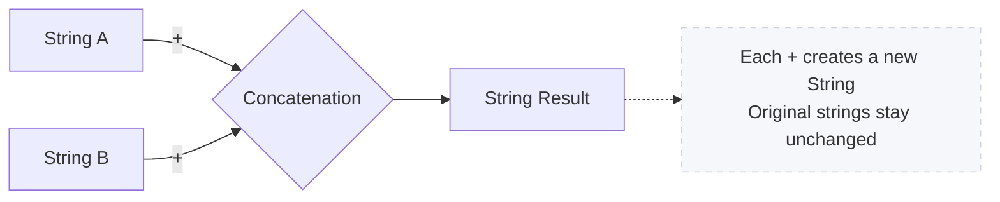
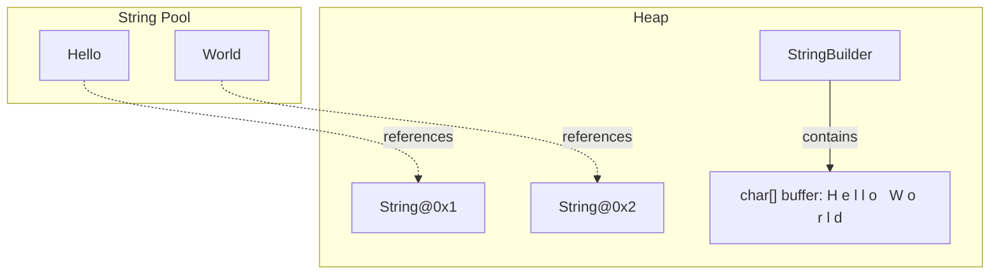
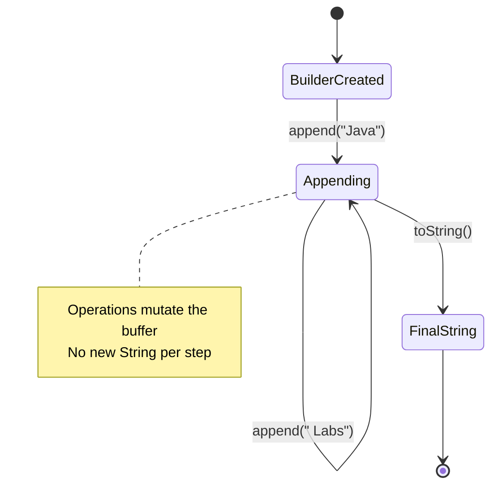

# Java Strings Lab

## What you'll learn

- Create, inspect, and transform text with the core `String` API
- Compare strings safely with `equals()`, `equalsIgnoreCase()`, and `compareTo()` instead of `==`
- Explain immutability and the string pool, and prove both with `==` and identity hash codes
- Assemble text with `StringBuilder` (and meet `StringBuffer`, its synchronised twin), and see how the cost of `+` in a loop grows
- Spot and fix common string bugs, from missing null checks to `substring` bounds and regex traps

## Table of Contents

1. [Introduction](#1-introduction)
2. [Creating and Inspecting Strings](#2-creating-and-inspecting-strings)
3. [Concatenation and Formatting](#3-concatenation-and-formatting)
4. [Comparing Strings](#4-comparing-strings)
5. [Immutability, the Pool, and Memory](#5-immutability-the-pool-and-memory)
6. [Working with StringBuilder](#6-working-with-stringbuilder)
7. [Common String Methods](#7-common-string-methods)
8. [Common Mistakes and Debugging](#8-common-mistakes-and-debugging)

## Getting started

This lab lives in the package `ie.atu.strings` - this folder. A runnable `Main.java` is already here: open this folder in VS Code or your Codespace, click ▶ on `Main.java` to check your setup works. Then give **each exercise its own file** in this same package - `Diy1.java`, `Diy2.java`, ... - each with its own `main` method (the ▶ button appears above every `main`), so every exercise stays runnable on its own and finishing one never disturbs the last. Any extra class an exercise needs goes in its own file beside it, and every file starts with the package line you see in `Main.java`.

---

## 1. Introduction

### Explanation

Strings are sequences of characters that power almost every Java application. From user input and configuration to network communication and file handling, mastering strings is essential. Java represents strings with the `String` class, which provides a rich set of built-in capabilities for creating, transforming, and inspecting textual data.

**Why Focus on Strings?**

* **Universal:** Text is everywhere - log messages, prompts, file formats, and user interfaces.
* **Feature-Rich API:** `String` offers dozens of methods for searching, replacing, slicing, formatting, and more.
* **Immutable by Design:** Java strings cannot change once created, a feature that simplifies reasoning but affects performance.
* **Interoperability:** Strings integrate seamlessly with Java's standard library, including collections, streams, and I/O.

**Key Concepts:**

* **String Literal:** Characters enclosed in double quotes, e.g., `"Hello"`.
* **String Object:** An instance of the `String` class; may be created with literals or with `new`.
* **Immutability:** String contents never change; method calls return new objects instead.
* **String Pool:** A JVM-managed cache for literal strings that saves memory.

### DIY 1: First strings

**Objective:** Prepare your environment and experiment with basic strings.

1. Open the `Main` class in the `ie.atu.strings` package.
2. In the `main` method, declare three string variables using literals.
3. Print them to confirm everything compiles.

**Expected output**

```text
Hello
Java
Strings
```

*A representative run - your three strings can hold any values you like.*

<details><summary>Hint</summary>

This one is a setup check rather than a puzzle: if it compiles and prints three lines, your package and run button are working and the rest of the lab will behave. Declare each variable with a literal in double quotes (`String a = "Hello";`) rather than `new String(...)` - the difference between those two forms is the whole subject of section 5, so it is worth being in the habit before you get there.

</details>

---

## 2. Creating and Inspecting Strings

### Explanation

Strings can be created with literals or constructors. Once created, you can query information about them.

```java
String literalGreeting = "Welcome to Java Strings"; // literal, lives in the string pool
String constructedGreeting = new String("Welcome to Java Strings"); // forces new object
```

**Inspection Methods:**

* `length()` - counts characters.
* `charAt(int index)` - retrieves a single character.
* `isEmpty()` / `isBlank()` - checks for empty or whitespace-only strings (Java 11+).
* `toUpperCase()` / `toLowerCase()` - returns uppercase or lowercase versions.

### Example

```java
package ie.atu.strings;

public class StringInspector {
	public static void main(String[] args) {
		String message = "Java Strings Lab";
		System.out.println("Message: " + message);
		System.out.println("Length: " + message.length());
		System.out.println("First char: " + message.charAt(0));
		System.out.println("Uppercase: " + message.toUpperCase());
		System.out.println("Lowercase: " + message.toLowerCase());
		System.out.println("Is empty? " + message.isEmpty());
	}
}
```

### DIY 2: Inspect strings

**Objective:** Practice constructing strings and accessing their metadata.

1. In the `Main` class `main` method, create three test strings: `String normal = "Learning Java"`, `String empty = ""`, and `String whitespace = "   "`.
2. For each string, use `length()` to get the number of characters and print it.
3. For each string, use an `if` statement to check whether it is empty. If not empty, use `charAt(0)` to print the first character and `charAt(length - 1)` to print the last; if empty, print `(none)` for first and last.
4. For each string, use `trim().isEmpty()` to check whether it is blank (or `isBlank()` if on Java 11+) and print the result.

**Expected output**

```text
Input: "Learning Java"
Length: 13
First: L
Last: a
Blank? false

Input: ""
Length: 0
First: (none)
Last: (none)
Blank? true

Input: "   "
Length: 3
First:  
Last:  
Blank? true
```

<details><summary>Hint</summary>

The last character lives at index `length() - 1`. Guard the empty string first - calling `charAt(0)` on `""` throws `StringIndexOutOfBoundsException`. For the blank check, `"   ".trim().isEmpty()` is `true` because trimming removes every space.

</details>

---

## 3. Concatenation and Formatting

### Explanation

Combining strings is a common task. Java supports several approaches:

* **Concatenation Operator (`+`):** the natural choice for a handful of pieces - a single `+` expression is compiled into efficient building for you. Inside a loop it is a different story, which section 6 measures.
* **`concat()` Method:** Equivalent to `+` for straightforward joins.
* **`String.format()` / `printf()`:** Allows templates with placeholders.
* **`String.join()` and `String.join(System.lineSeparator(), ...)`:** Ideal for joining collections or arrays.

```java
String title = "Java";
String topic = "Strings";
String combined = title + " " + topic; // "Java Strings"
String templated = String.format("%s Lab - %d modules", title, 10);
```

### Mermaid Diagram: Concatenation Flow



### DIY 3: Concatenate and format

**Objective:** Experiment with multiple concatenation strategies.

1. In the `Main` class `main` method, create two String variables `title` with value `"Java"` and `topic` with value `"Strings"`. Use the `+` operator to concatenate them with a space in between and display the result.
2. Create three variables: `name` (String), `age` (int), and `course` (String). Use `String.format("Name: %s, Age: %d, Course: %s", name, age, course)` to create a formatted sentence and print it.
3. Create a String array with the words `{"Java", "Strings", "are", "powerful"}`. Use `String.join(" ", array)` to join them with spaces and print the result.
4. Add a comment naming one place where `+` is the right tool (joining a handful of pieces in one expression) and one where a `StringBuilder` is (joining inside a loop).

**Expected output**

```text
Using + : Java Strings
Formatted: Name: Ade, Age: 21, Course: OOP
Joined: Java Strings are powerful
```

<details><summary>Hint</summary>

In a format string, `%s` is a placeholder for a String and `%d` for an int. `String.join(" ", words)` takes the separator first and the array second - no loop required.

</details>

---

## 4. Comparing Strings

### Explanation

String comparisons must use methods, not `==`, which only checks whether references point to the same object.

* `equals(Object obj)` - case-sensitive equality.
* `equalsIgnoreCase(String other)` - case-insensitive equality.
* `compareTo(String other)` - lexicographic comparison (negative, zero, positive).
* `regionMatches(...)` - compare substrings.

```java
String expected = "SUCCESS";
String actual = "success";
System.out.println(expected.equals(actual));          // false
System.out.println(expected.equalsIgnoreCase(actual)); // true
```

### DIY 4: Compare strings

**Objective:** Practice comparing strings safely.

1. In the `Main` class `main` method, create two String variables `str1` and `str2` both with the value `"Java"`. Use `equals()` to compare them and print the result.
2. Create two String variables `str3` with value `"Java"` and `str4` with value `"java"`. Use `equalsIgnoreCase()` to compare them and print the result.
3. Create two String variables `str5` with value `"Java"` and `str6` with value `"Kotlin"`. Use `compareTo()` to compare them alphabetically and print the result (negative means `str5` comes before `str6`).
4. Create a String variable `str7` and assign it `null`. Before calling any string method on it, add an if statement to check `if (str7 != null)` to avoid a `NullPointerException`.

**Expected output**

```text
Equal? true
Equal ignore case? true
Order (Java vs Kotlin): -1
Null-safe comparison passed.
```

<details><summary>Hint</summary>

`compareTo` works alphabetically: `"Java".compareTo("Kotlin")` is negative because `'J'` comes before `'K'`. In the null test, the `!= null` check must run first - `str7 != null && str7.equals("Java")` can never throw.

</details>

---

## 5. Immutability, the Pool, and Memory

### Explanation

Strings are immutable - once created, their value cannot change. Any method that appears to modify a string actually returns a new instance.

**Benefits:**

* Thread-safety without extra synchronisation.
* Security for values like configuration keys or user names.
* Caching via the **string pool**, which stores literal strings for reuse.

**Implications:**

* Frequent changes create many short-lived objects.
* Use builders for heavy modifications or loops.

```java
String original = "Java";
String modified = original + " Strings"; // original stays "Java"
```

**Where those objects actually live:**

* Literals go into the string pool, so two identical literals share one object.
* `new String(...)` builds a distinct heap object every time, even when a literal with the same text already exists.
* A `StringBuilder` owns an internal `char[]` buffer that grows as you append to it.

### Memory Layout Diagram



### DIY 5: Prove immutability and the pool

**Objective:** Prove that a String never changes, that literals are shared, and that a `StringBuilder` behaves the opposite way.

1. In the `Main` class `main` method, test immutability: create a String variable `original` with value `"Hello"`. Store `System.identityHashCode(original)` in an `int` before you touch it, reassign `original = original + " World"`, then store the identity hash code again. Print whether the two numbers are equal, then print the text.
2. Test the string pool: create two String variables using literals, `String lit1 = "Lab"` and `String lit2 = "Lab"`. Compare them with `==` and print the result.
3. Test `new`: create `String heap1 = new String("Lab")` and `String heap2 = new String("Lab")`. Print whether `heap1 == heap2`, then print whether `heap1 == lit1`.
4. Test `intern()`: print whether `heap1.intern() == lit1`. Note that `intern()` *returns* the pooled object rather than changing `heap1`, so the result has to be used or assigned.
5. Contrast with `StringBuilder`: create a StringBuilder holding `"Hello"`, store its identity hash code, call `append(" World")`, then store the identity hash code again. Print whether the two numbers are equal, and print the text.
6. Watch the buffer grow: create an empty StringBuilder with `new StringBuilder()` and print its `capacity()`. Append 50 characters in a loop, then print `capacity()` again to see that it resized itself.
7. Add comments explaining why repeated `+` concatenation costs more with every round (each round copies everything built so far) and why sharing one String between two variables is always safe.

**Expected output**

```text
Same object after concat? false
Text now: Hello World
Two literals are the same object? true
Two new Strings are the same object? false
A new String is the pooled object? false
intern() returns the pooled object? true
Same builder object after append? true
Builder now: Hello World
Initial capacity: 16
Capacity after 50 appends: 70
```

*Identity hash codes differ from run to run, which is why this exercise prints the comparison rather than the number - every line above is the same on every run.*

<details><summary>Hint</summary>

`System.identityHashCode(obj)` describes the object itself, not its contents: the same object always reports the same number, and two different objects usually - though not always - report different ones. That "usually" is why the exercise prints `before == after` instead of the numbers, and why `==` on the strings themselves is the stronger evidence. `intern()` asks the pool for the shared copy of that text and hands it back, so `heap1.intern() == lit1` is `true` even though `heap1 == lit1` is `false`. Remember to reassign the result of concatenation - `original = original + " World";` - or nothing appears to change. `capacity()` is a `StringBuilder` method: a `String` has no spare room to report, and a default builder starts at 16 and grows on its own.

</details>

---

## 6. Working with StringBuilder

### Explanation

`StringBuilder` provides a mutable sequence of characters, ideal for repeated modifications. Unlike strings, builders modify their internal buffer instead of creating new objects.

**Key Methods:**

* `append(...)` - add text or values.
* `insert(int offset, String str)` - insert at position.
* `delete(int start, int end)` - remove a range.
* `reverse()` - reverse contents.
* `toString()` - produce an immutable `String` snapshot.

```java
StringBuilder sb = new StringBuilder("Java");
sb.append(" ").append("Strings");
String result = sb.toString();
```

`StringBuffer` is the older sibling: same method names, same behaviour, one difference. Every `StringBuffer` method is synchronised, so several threads can share one buffer safely - and that lock costs time no single-threaded program ever gets back. Hence the three-way choice: `String` for text you read, pass and compare; `StringBuilder` for assembling; `StringBuffer` only when threads genuinely share one builder.

### Mermaid Diagram: Builder Workflow



### DIY 6: Build with StringBuilder

**Objective:** Assemble text with a builder, meet its synchronised twin, and see how the cost of `+` in a loop grows.

1. In the `Main` class `main` method, build a menu: create a StringBuilder. Use a for loop (1 to 3) to append numbered menu items like `"1. Start\n"`, `"2. Settings\n"`, `"3. Exit\n"`. Convert to String with `toString()` and print.
2. Reverse words: create a String `sentence = "learn to love strings"`. Use `split(" ")` to get a String array of words. Create a StringBuilder and use a reverse for loop to append the words from end to start, separated by single spaces. Print the result.
3. Build a report: create a StringBuilder. Append the title `"Report"` on its own line, then an underline built with `"=".repeat(title.length())`, then three bullet points appended in a loop. Print the result.
4. Swap the class: copy your menu code from step 1 and change `StringBuilder` to `StringBuffer` - nothing else. Run it, then print whether the two menus are `equals()`. The output is identical because the two classes share one API and differ only in thread-safety: `StringBuffer` synchronises every method so threads can share a buffer, and that lock is the only thing you are choosing between when you pick one.
5. Compare the two approaches: choose a loop count of 50,000. Time a loop that appends `"a"` to a String with `+=` using `System.nanoTime()`, then time the same loop written with a StringBuilder. Print whether both produced the same text, the length of the result, and whether the builder was faster. Print the comparison rather than the milliseconds - how many milliseconds this costs depends on your machine, your JDK and even which run it is.
6. Add a comment on when each tool is right: `+` for a handful of pieces in one expression, a builder the moment you are assembling inside a loop.

**Expected output**

```text
Menu:
1. Start
2. Settings
3. Exit

Reversed: strings love to learn

Report
======
- Point one
- Point two
- Point three

Same menu from StringBuffer? true
Same text from both? true
Length: 50000
StringBuilder was faster? true
```

<details><summary>Hint</summary>

Walk the words backwards with `for (int i = words.length - 1; i >= 0; i--)`, appending `words[i]` and a space each time - skip the space after the last word so the line does not end in one. For the swap, `StringBuffer` accepts exactly the same calls as `StringBuilder`, so only the type name changes; compare the two results with `menu.toString().equals(buffer.toString())`. `System.nanoTime()` returns a count of nanoseconds: subtract the start from the end and compare the two durations directly - there is no need to convert to milliseconds when the answer you print is which one won.

</details>

### Guided method: `countTheCopying()`

**Objective:** See the *shape* of the cost rather than a headline number. Add this method to a class in the package and call it from `main`.

```java
public void countTheCopying() {
	System.out.println("Building a string one character at a time");
	System.out.println("     n | characters copied by + | characters written by a builder");

	for (int n = 1000; n <= 8000; n *= 2) {
		long plusCopies = 0;
		for (int i = 0; i < n; i++) {
			plusCopies += i + 1;  // copy the i characters built so far, then write one more
		}
		long builderWrites = n;   // a builder writes each character exactly once

		System.out.printf("  %4d | %21d | %31d%n", n, plusCopies, builderWrites);
	}

	System.out.println();
	System.out.println("Double n and the + column grows about four times over;");
	System.out.println("the builder column simply doubles.");
	System.out.println("That is the whole argument: + in a loop grows with the SQUARE");
	System.out.println("of the length, a builder grows in step with it.");
}
```

**Expected output**

```text
Building a string one character at a time
     n | characters copied by + | characters written by a builder
  1000 |                500500 |                            1000
  2000 |               2001000 |                            2000
  4000 |               8002000 |                            4000
  8000 |              32004000 |                            8000

Double n and the + column grows about four times over;
the builder column simply doubles.
That is the whole argument: + in a loop grows with the SQUARE
of the length, a builder grows in step with it.
```

**Why This Matters:**
- It counts the work instead of timing it, so the numbers are identical on every machine and every JDK.
- It shows the growth, not one point on it: quadratic for `+`, linear for a builder. A stopwatch only ever reports one size on one machine.
- The exact speed-up you measure will differ from a classmate's, and from your own next run. The shape will not.

### Extension Challenge (Optional)

Add a line to your step 5 code that prints the two durations in milliseconds (divide the nanosecond difference by `1_000_000`), then run it at 10,000, 25,000 and 50,000 rounds and write the figures down. Compare them with someone else's: the numbers will not match - they depend on the machine, the JDK and even the run - but on every list the `+` version will have grown far faster than the loop count did. That growth is the point; the number never was, which is why it is not in the expected output above.

---

## 7. Common String Methods

### Explanation

Java's `String` class provides diverse utility methods. Understanding their behavior prevents bugs and makes your code concise.

**Categories:**

* **Searching:** `contains`, `indexOf`, `lastIndexOf`.
* **Slicing:** `substring`, `subSequence`.
* **Replacement:** `replace`, `replaceAll`, `replaceFirst`.
* **Trimming:** `trim`, `strip`, `stripIndent` (Java 15+).
* **Splitting:** `split(String regex)`.

### Example

```java
String logEntry = "INFO: Connected at 10:45";
boolean containsTime = logEntry.contains("10:45");
String level = logEntry.substring(0, logEntry.indexOf(':'));
String replaced = logEntry.replace("INFO", "DEBUG");
String[] parts = logEntry.split(": ");
```

### DIY 7: Everyday string methods

**Objective:** Collect and practice essential methods.

1. In the `Main` class `main` method, do a case-insensitive search: create a String `text = "Java is a powerful programming language"` and `keyword = "POWERFUL"`. Convert both to lowercase with `toLowerCase()` and use `contains()` to check if the text contains the keyword. Print the result.
2. Extract initials: create a String `fullName = "John Doe"`. Use `split(" ")` to get an array of names. Loop through the array, use `charAt(0)` to get the first character of each name, and build the initials (e.g., `J.D.`). Print the result.
3. Mask an email: create a String `email = "john@example.com"`. Use `indexOf('@')` to find the `@` position. Use `substring(0, atIndex)` to get the local part and `substring(atIndex)` to get the domain. Build a masked version: keep the first character, replace the other local-part characters with `*`, then append the domain. Print the result.
4. Parse CSV: create a String `csv = "Java, Strings, Lab"`. Use `split(",")` to split by comma into an array. Loop through the array and use `trim()` on each element to remove spaces. Print the trimmed parts.

**Expected output**

```text
Contains keyword? true
Initials: J.D.
Masked email: j***@example.com
CSV parts: ["Java", "Strings", "Lab"]
```

<details><summary>Hint</summary>

For the mask, everything between index `1` and `atIndex` needs replacing - `"*".repeat(atIndex - 1)` builds all the stars in one call. `split(",")` keeps the space after each comma, which is exactly why each part needs `trim()`.

</details>

---

## 8. Common Mistakes and Debugging

### Explanation

Awareness of frequent pitfalls helps you debug faster and write robust string code.

**1. Using `==` Instead of `equals`**

```java
String input = new String("YES");
System.out.println(input == "YES");    // false
System.out.println(input.equals("YES")); // true
```

**2. Ignoring Immutability in Loops**

```java
String result = "";
for (int i = 0; i < 1000; i++) {
	result += i; // each round copies everything built so far, then discards it
}
```

**3. Forgetting Null Checks**

```java
String value = null;
if (value != null && value.contains("ok")) {
	System.out.println("Contains ok");
}
```

**4. Misusing Regex in `replaceAll`**

`replaceAll` treats the first argument as a regular expression. Use `replace` for literal replacements.

**5. Off-by-One Errors with `substring`**

Remember: `substring(start, end)` includes `start` but excludes `end`.

### Debugging Tips

* Log intermediate strings with context labels.
* Print identity hash codes to confirm whether objects change - the same object always reports the same number, and different objects usually report different ones.
* Use your IDE debugger to inspect string values step by step.
* Consider third-party tools or profilers to detect excessive allocations.

### DIY 8: Fix the bugs

**Objective:** Identify and correct common mistakes.

Fix the 10 labeled issues in the following class:

```java
package ie.atu.strings;

public class BuggyStrings {

	// Error 1: Using == for content comparison
	public boolean isYes(String input) {
		return input == "YES";
	}

	// Error 2: Potential NullPointerException
	public boolean hasKeyword(String text, String keyword) {
		return text.contains(keyword.toLowerCase());
	}

	// Error 3: Inefficient concatenation in loop
	public String joinNumbers(int limit) {
		String numbers = "";
		for (int i = 0; i <= limit; i++) {
			numbers += i + ",";
		}
		return numbers;
	}

	// Error 4: Off-by-one substring
	public String firstThree(String input) {
		return input.substring(0, 3 + 1);
	}

	// Error 5: Regex misuse
	public String removeDots(String version) {
		return version.replaceAll(".", "");
	}

	// Error 6: Ignoring immutability result
	public void trimInput(StringBuilder builder) {
		builder.toString().trim();
	}

	// Error 7: Modifying shared literal
	public String appendExclamation(String input) {
		input.concat("!");
		return input;
	}

	// Error 8: Unsafe charAt
	public char firstLetter(String text) {
		return text.charAt(0);
	}

	// Error 9: Unbounded split
	public String[] splitCsv(String csv) {
		return csv.split(",");
	}

	// Error 10: Ignoring uppercase logic
	public String shout(String text) {
		text.toUpperCase();
		return text;
	}
}
```

1. Create the `BuggyStrings` class from the listing above in the `ie.atu.strings` package and fix all 10 labeled issues.
2. String comparison: in the `Main` class `main` method, create `String input = new String("YES")`. Try comparing with `==` to `"YES"` (returns `false`). Fix by using `equals()` instead.
3. Null safety: create `String text = null`. Try calling `text.contains("test")` (throws an exception). Fix by adding an `if (text != null)` check before the method call.
4. Loop concatenation: create an empty String. Use a for loop to concatenate 100 numbers with `+=`, so every round copies everything built so far. Fix by using StringBuilder with `append()` instead.
5. Substring bounds: create `String str = "Java"`. Try `str.substring(0, 4)` to get the first 4 chars (works), then try `str.substring(0, 5)` - it throws an exception. Remember: the end index is exclusive.
6. Replace vs replaceAll: create `String version = "1.2.3"`. Try `version.replaceAll(".", "-")` (every character becomes `-` because `.` is a regex wildcard). Fix by using `replace()` for a literal replacement.
7. Add comments explaining each fix and why the original code failed. When you are done, your updated class should compile and every scenario should behave correctly.

**Expected output**

```text
== comparison: false
equals() comparison: true
text is null - skipping contains()
Joined with StringBuilder: 0,1,2,3, ... ,98,99,
First four characters: Java
replaceAll(".", "-"): -----
replace(".", "-"): 1-2-3
```

*A representative run - the `...` stands in for the middle of the 100-number line, and your labels may differ.*

<details><summary>Hint</summary>

The same few fixes cover most of the errors: use `equals` (or `equalsIgnoreCase`) instead of `==`; check `!= null` before calling any method; capture returned values, because `text.toUpperCase()` on its own changes nothing; and prefer `replace` unless you genuinely need a regular expression.

</details>

---

## Summary

This lab guided you through essential string concepts:

* Declaring, inspecting, and transforming strings.
* Comparing strings safely and handling nulls.
* Understanding immutability, the string pool, and where string objects live.
* Contrasting String immutability with StringBuilder mutability using identity hash codes.
* Assembling text with `StringBuilder`, and meeting `StringBuffer`, its synchronised twin.
* Counting the work that `+` in a loop repeats, and seeing how that work grows.
* Applying core string methods for real-world tasks.

### Key Takeaways

✅ Strings are immutable; every change creates a new object.

✅ Identity hash codes show that String creates a new object while StringBuilder reuses the same one - the same object always reports the same number, and two different objects usually report different ones.

✅ Avoid `==` for string comparisons - use `equals` or `equalsIgnoreCase`.

✅ `StringBuilder` is the go-to for repeated concatenation or heavy editing; `StringBuffer` shares its API and adds a thread-safety lock you rarely need.

✅ `+` in a loop copies everything built so far on every round, so the work grows with the square of the length while a builder's grows in step with it. How many milliseconds that costs varies with your machine, your JDK and the run; the shape of the growth does not.

✅ Always validate inputs to prevent null pointer issues.

✅ Remember substring's inclusive/exclusive indices.

### Best Practices Checklist

✔ Use literals for fixed text; call `intern()` only when measuring memory.

✔ Prefer builders or `String.join` when merging collections or loops.

✔ Guard against `null` before calling string methods.

✔ Document assumptions about casing, whitespace, and locales.

✔ Measure string-heavy code paths on the machine that will run them, rather than trusting a remembered number.

✔ A handful of pieces in one expression? `+` is fine. Assembling inside a loop? Reach for a `StringBuilder`.
