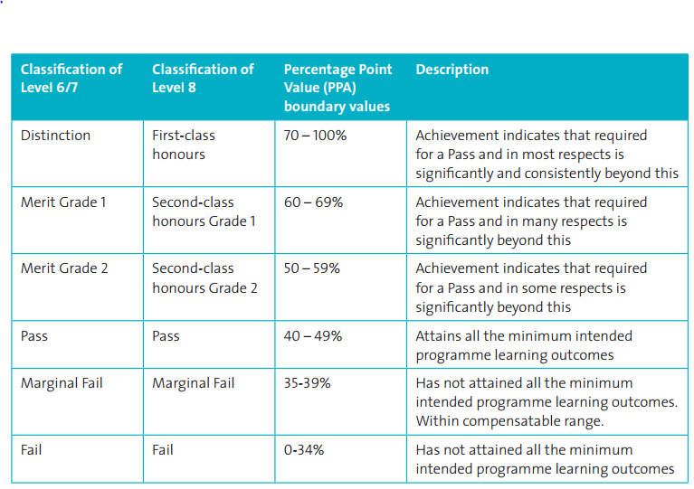
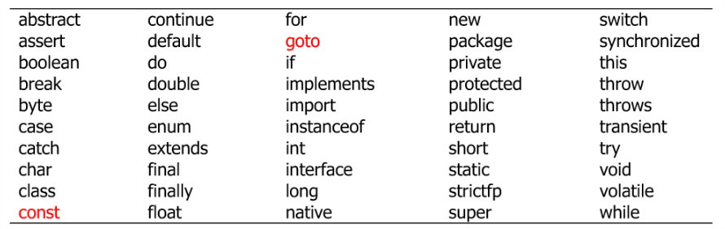
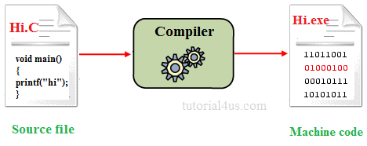
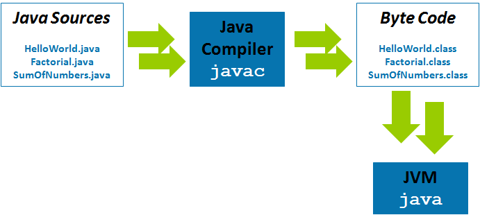
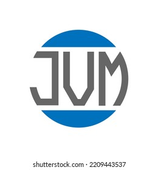
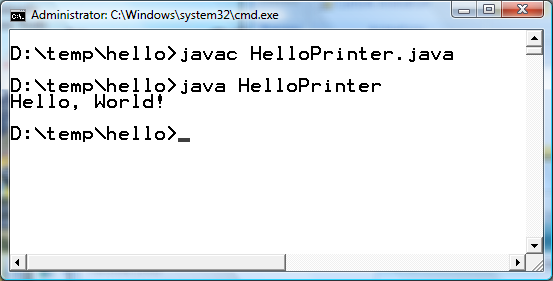
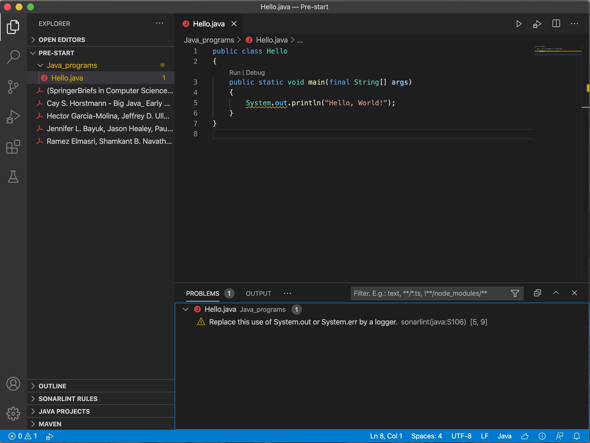
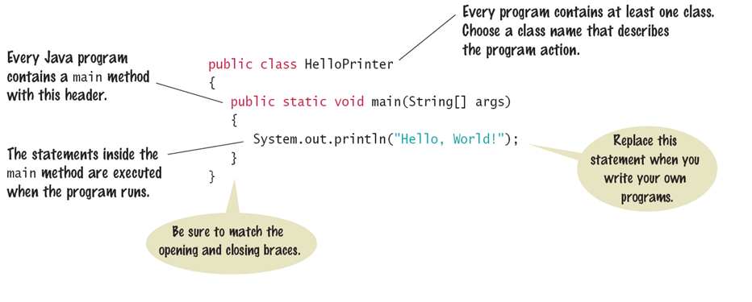
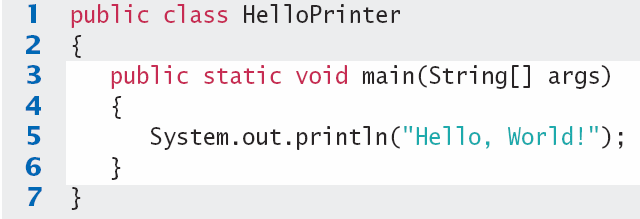
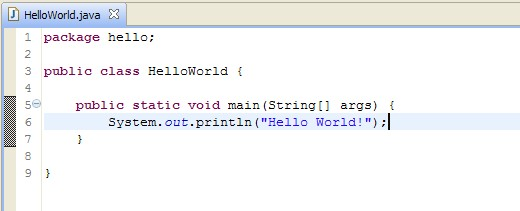

# Object Oriented Computing

- Module Introduction

---

## Welcome

* This module assumes that you have some prior fundamental programming experience.
* This module focuses on the Object-Oriented paradigm of programming.

---

## About Me

* These details can be found on the top of the module Moodle page.

---

## Module Learning Outcomes

* On completion of this module the learner will/should be able to;
* Explain the fundamentals of programming such as variables, operators, conditional and iterative statements etc.
* Understand the fundamentals of Object Oriented Programming such as defining Classes, instantiating Objects and invoking methods etc.
* Set up and configure a software development environment.
* Develop basic object-oriented applications.

---

## Module Delivery

* Delivered in an incremental and iterative fashion
  * Ideas and concepts expanded and expounded week by week.
* Practice makes perfect – Programming is best learned through constant practice (constructive failure) over an extended period of time.
* Traits of a good programmer:
  * Patience
  * Consistency
  * Diligence
  * Dedication

---

## Timetable

* 13 teaching weeks over 14 calendar weeks. We have a 1 week break for reading week.
* Labs Start Week 2
* See top of Moodle page for Timetable and Syllabus breakdown

---

## Assessment Matrix

| Week No. | Assessment Type | Grade Portion |
|---|---|---|
| 5 | MCQ 1 | 30% |
| 9 | MCQ 2 | 35% |
| 13 | MCQ 3 | 35% |


<!-- Speaker notes:
Get Exam Papers ASAP
-->

---

## Lab Coding Environment

* We will use GitHub Codespaces as our coding environment.
* GitHub Codespaces is VS Code running on a virtual machine which you connect to via a browser. It is a cloud based IDE.
* If you are familiar with VSCode then you will notice no difference.
* We will be using AI to assist in answer questions.

---

## Assessments

* All assessments are completed in-person in a lab.
* MCQ questions are taken from Lab and Lecture materials.
* Use AI to generate sample MCQ questions for you. Google's NotebookLM is a great tool to do this.
* MCQ's will involve standard MCQ questions plus some coding questions.

---

## Grading System



---

## What do I do if I fail?

* Pass by compensation
* Repeat Project over Summer. Submit end of August

---

## Enrol in Module on Moodle

* https://vlegalwaymayo.atu.ie/
* Search for course: 8963
  * Please note I teach two Object Oriented Computing Modules so be careful to select to the correct one!
* Enrolment key:
  * object

---

## Tasks for this week

* Sign up for [GitHub Student Developer Pack](https://education.github.com/pack)
* Research Github Codespaces

---

## Programming Experience

* What programming experience do you have?
* What languages have you used?
* Have you used an OO language?
* What do we need to run a  Java program?
* When do we need to compile a Java Program?
* What is an IDE?

---

## Java Refresh

---

## Agenda

* Java Background
* Running code in Java
* JVM, JRE, JDK
* IDE
* Common Errors

---

## Why Java?

* Java is object-oriented by design, encouraging students to model real-world concepts using classes and objects.
* Its strong static typing helps catch errors early and promotes disciplined coding habits.
* Java has clear, readable syntax that makes OO concepts like encapsulation, inheritance, and polymorphism easy to teach.
* It's widely used in industry, so students gain skills that are directly applicable to real-world development.
* The standard library is rich, especially for data structures and algorithms, making it easy to build meaningful examples.
* Java is supported by excellent IDEs and tools (e.g. IntelliJ, VS Code) that enhance learning through debugging and code completion.
* The OO principles learned in Java translate easily to other languages like Python, C#, and Kotlin.

---

## Java Background

* Java was originally designed by James Gosling at Sun Microsystems in 1991.
* It was initially named "Oak", inspired by an oak tree outside Gosling’s office.
* The name was later changed to Java, after Java coffee.
* In 2010, Oracle Corporation completed its acquisition of Sun Microsystems and became the steward of Java.
* Over 45 billion active Java Virtual Machines (JVMs) are deployed worldwide across devices and servers.
* Java remains one of the most popular programming languages, with over 10 million developers globally (and growing).
* It powers a wide range of technologies — from Android apps and enterprise systems to cloud platforms and IoT devices.

---

## Java Version History

* [Java version history - Wikipedia](https://en.wikipedia.org/wiki/Java_version_history)

---

## Java Key Words

* A Computer Program is a sequence of human readable instructions that are converted by software into machine executable instructions.
* List of 50 Java key words:



---

## Compiler vs Interpreter

* A compiler program that converts instructions into a machine-code or lower-level form so that they can be read and executed by a computer.
* An interpreter is a computer program that directly executes, i.e. performs, instructions written in a programming or scripting language, without previously compiling them into a machine language program.
* Java is both a compiled and an interpreted language. Java source code is first compiled into bytecode by the Java compiler. Then, the bytecode is executed by the Java Virtual Machine (JVM), which is a software-based interpreter.

---

## non-Java program VS Java Program




<!-- Speaker notes:
Non java = compiled program
Java is compiled then interpreted
The whole source code is compiled in one go and is processed all at once by the computer.
-->

---

## JIT

* JIT
* The JVM also has a Just-in-Time (JIT) compiler that can optimize the bytecode to native machine code at runtime







<!-- Speaker notes:
Non java = compiled program
Java is compiled then interpreted
The whole source code is compiled in one go and is processed all at once by the computer.
-->

---

## Advantages of the JVM

* Java is platform independent: Write Once Run Anywhere (WORA)
* A computer platform is a system that consists of a hardware device and an operating system that an application, program or process runs upon. (e.g. PC with Intel Processor running Windows 10)
* A Java program (myprogram.java) is written once and then compiled to bytecode (myprogram.class). The JVM program, which can be install on any platform, then runs this bytecode.

---

## Java Development Kit (JDK)

* You need to install the Java JDK (Java Development Kit) to develop Java programs
  * Location after installed on Windows will be:
  * C:\Program Files\Java\jdk1.8.x
* The JDK includes programs such as:
  * javac.exe (Java compiler)
  * javadoc.exe (Javadoc generator)

---

## Your First Program

* Traditional ‘Hello World’ program in Java
* We will examine this program in the lab
  * Be careful of spelling
  * JaVa iS CaSe SeNsItiVe
  * Java uses special characters, e.g. {}


---

## Text Editor Programming

* You can also use a simple text editor such as Notepad to write your source code.
* Once saved as HelloPrinter.java, you can use a console window to:
  * Compile the program
  * Run the program
* Compile
* Execute
* Output



---

## Integrated Development Environment (IDE)

* An Integrated Development Environment used to  develop software.
  * A complete tool kit for development.
  * Contains a suite of productivity tools and options.
* Common Java IDEs are Eclipse, NetBeans and IntelliJ.
* You can use notepad to write the hello world program to show the advantages of using an IDE and to provide you with a better understanding of what is happening behind the scenes of an IDE.

---

## VS Code IDE example

* Output
* Editor



---

## Syntax 1.1: The Java Program

* Every application has the same basic layout
  * Add your ‘code’ inside the main method



---

## Common Error

* Omitting Semicolons
  * In Java, every statement must end in a semicolon. Forgetting to type a semicolon is a common error.  It confuses the compiler, because the compiler uses the semicolon to find where one statement ends and the next one starts.  For example, the compiler sees the below code:
```java
System.out.println("Hello")
System.out.println("World!");
```
  * As this….
```java
System.out.println("Hello") System.out.println("World!");
```

---

## Syntax Errors

* What happens if you
  * Misspell a word:		 System.ou.println
  * Don’t Capitalise a word system.out.println
  * Leave out a word 	  void
  * Forget a Semicolon after ("Hello, World!")
  * Don’t match a curly brace?   Remove line 6




---

## Summary: Java

* The Java compiler translates source code into class files that contain instructions for the Java virtual machine.
* Java programs are distributed as instructions for a virtual machine, making them platform-independent.
* An editor is a program for entering and modifying text, such as a Java program.
* Classes are the fundamental building blocks of Java programs.
* Every Java application contains a class with a main method. When the application starts, the instructions in the main method are executed.

---

## Side Note: Java and C# similarities



