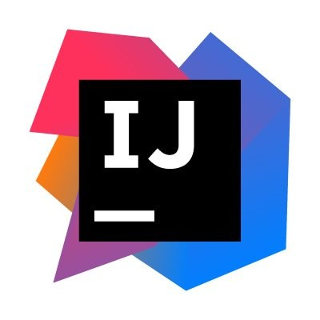

<!-- _class: lead -->
<!-- _paginate: false -->

# Object Oriented Computing

Module Introduction

---

## Welcome

* This module assumes that you have some prior fundamental programming experience.
* This module focuses on the **Object-Oriented paradigm** of programming.

---

## About Me


---

## Module Learning Outcomes

On completion of this module the learner will/should be able to;

* **Explain** the fundamentals of programming such as variables, operators, conditional and iterative statements etc.
* **Understand** the fundamentals of Object Oriented Programming such as defining Classes, instantiating Objects and invoking methods etc.
* **Set up** and configure a software development environment.
* **Develop** basic object-oriented applications.

---

## Module Delivery

* Delivered in an **incremental and iterative** fashion
  * Ideas and concepts expanded and expounded week by week.
* **Practice makes perfect** — programming is best learned through constant practice *(constructive failure)* over an extended period of time.
* Traits of a good programmer:
  * Patience · Consistency · Diligence · Dedication

---

## Timetable

* **12 teaching weeks** over 13 calendar weeks. 
  * We have a 1 week break for reading week.
* Labs start **week 2**
* See top of Moodle page for Timetable.

---

<!-- _class: centered-table -->

## Assessment Matrix

<br>

| Week | Assessment | Grade portion |
|---|---|---|
| 5 | MCQ 1 | **33%** |
| 9 | MCQ 2 | **33%** |
| 12 | MCQ 3 | **33%** |

<br>
> All assessments are completed **in person, in a lab**.

---

## Lab Coding Environment

* We will use **GitHub Codespaces** as our coding environment.
* GitHub Codespaces is VS Code running on a virtual machine which you connect to via a browser. It is a cloud based IDE.
* If you are familiar with VS Code then you will notice no difference.
* We will be using **AI** to assist in answering questions.

---

## Assessments

* All assessments are completed **in-person in a lab**.
* MCQ questions can be sourced from **Lecture and Lab** materials.
* Use AI to generate sample MCQ questions for you. Google's **NotebookLM** is a great tool to do this.
* MCQs will involve standard MCQ questions **plus some Coderunner coding questions**.

---

## Enrol in Module on Moodle

* Go to <https://vlegalwaymayo.atu.ie/>
* Search for course: **8963**
  * I teach *two* Object Oriented Computing modules — be careful to select the correct one!
* Enrolment key:
  * `object`

---

## Tasks for this week

* Sign up for the [GitHub Student Developer Pack](https://education.github.com/pack)
* Research **GitHub Codespaces**

---

## Programming Experience

* What programming experience do you have?
* What languages have you used?
* Have you used an OO language?
* What do we need to run a Java program?
* When do we need to compile a Java program?
* What is an IDE?

---

<!-- _class: lead -->

<span class="kicker">// part 2</span>

# Java Refresh

Background · running code · JVM, JDK · IDEs · common errors

---

## Agenda

* Java Background
* Running code in Java
* JVM, JDK
* IDE
* Common Errors

---

<!-- _class: cols -->

## Why Java

* Java is **object-oriented** programming language. Real-world concepts are modeled using classes and objects.
* Its **strong static typing** helps catch errors early and promotes disciplined coding habits.
* Java has clear, readable syntax that makes OO concepts like encapsulation, inheritance, and polymorphism easy to teach.
* It's **widely used in industry**, so students gain skills that are directly applicable to real-world development.
* The standard library is rich, especially for data structures and algorithms, making it easy to build meaningful examples.
* Java is supported by excellent IDEs and tools *(e.g. IntelliJ, VS Code)* that enhance learning through debugging and code completion.
* The OO principles learned in Java translate easily to other languages like **Python, C#, and Kotlin**.

---

<!-- _class: cols -->

## Java Background

* Java was originally designed by **James Gosling** at Sun Microsystems in **1991**.
* It was initially named **"Oak"**, inspired by an oak tree outside Gosling's office.
* The name was later changed to **Java**, after Java coffee.
* In **2010, Oracle Corporation** completed its acquisition of Sun Microsystems and became the steward of Java.
* Over **45 billion** active Java Virtual Machines (JVMs) are deployed worldwide across devices and servers.
* Java remains one of the most popular programming languages, with over **10 million developers** globally (and growing).
* It powers a wide range of technologies — from Android apps and enterprise systems to cloud platforms and IoT devices.

---

## Java Key Words

* A **computer program** is a sequence of human-readable instructions that are converted by software into machine-executable instructions.
* List of 50 Java key words:

| Range | Keywords |
|---|---|
| A–C | abstract, assert, boolean, break, byte, case, catch, char, class, *const* |
| C–F | continue, default, do, double, else, enum, extends, final, finally, float |
| F–N | for, *goto*, if, implements, import, instanceof, int, interface, long, native |
| N–S | new, package, private, protected, public, return, short, static, strictfp, super |
| S–W | switch, synchronized, this, throw, throws, transient, try, void, volatile, while |

*`const` and `goto` are reserved but not currently used in Java.*

---

<!-- _class: dense -->

## Compiler vs Interpreter

* A **compiler** is a program that converts instructions into a machine-code or lower-level form so that they can be read and executed by a computer.
* An **interpreter** is a computer program that directly executes, i.e. performs, instructions written in a programming or scripting language, without previously compiling them into a machine language program.
* Java is **both compiled and interpreted**. Java source code is first compiled into bytecode by the Java compiler. Then, the bytecode is executed by the Java Virtual Machine (JVM), which is a software-based interpreter.

---

<!-- _class: grid2 -->

## non-Java program VS Java Program

   

---

<!-- _class: grid2 -->

## Advantages of the JVM

* Java is **platform independent**: Write Once Run Anywhere *(WORA)*
* A computer **platform** is a system that consists of a hardware device and an operating system that an application, program or process runs upon. *(e.g. PC with Intel processor running Windows 10)*
* A Java program (`myprogram.java`) is written once and then compiled to bytecode (`myprogram.class`). The JVM program, which can be installed on any platform, then runs this bytecode.

---

## Java Development Kit (JDK)

* You need to install the **Java JDK** (Java Development Kit) to develop Java programs
  * Location after install on Windows: `C:\Program Files\Java\jdk1.8.x`
* The JDK includes programs such as:
  * `javac.exe` *(Java compiler)*
  * `javadoc.exe` *(Javadoc generator)*

---

## Your First Program

* Traditional **'Hello World'** program in Java
* We will examine this program in the lab
  * Be careful of spelling — `JaVa iS CaSe SeNsItiVe`
  * Java uses special characters, e.g. `{}`

```java
public class HelloPrinter
{
    public static void main(String[] args)
    {
        System.out.println("Hello, World!");
    }
}
```

---

## Text Editor Programming

* You can also use a simple text editor such as **Notepad** to write your source code.
* Once saved as `HelloPrinter.java`, you can use a console window to **compile** and **run** the program.

```text
D:\temp\hello>javac HelloPrinter.java

D:\temp\hello>java HelloPrinter
Hello, World!

D:\temp\hello>
```

---

<!-- _class: logos -->

## Integrated Development Environment (IDE)

* An **Integrated Development Environment** is used to develop software — a complete toolkit for development with a suite of productivity tools.
* Common Java IDEs are **Eclipse, NetBeans and IntelliJ**.
* Writing Hello World in Notepad first shows the advantages of an IDE — and what happens behind the scenes.

  

---

## VS Code IDE example

* **Editor** — where the code is written
* **Output** — where the program speaks back


---

## Syntax 1.1: The Java Program

* Every application has the same basic layout
  * Add your 'code' inside the **main method**

```java
public class HelloPrinter
{
    public static void main(String[] args)
    {
        System.out.println("Hello, World!");
    }
}
```

---

## Common Error

* **Omitting semicolons** — in Java, every statement must end in a semicolon. Forgetting one confuses the compiler, which uses `;` to find where one statement ends and the next starts. The compiler sees this code:

<!-- no-compile -->
```java
System.out.println("Hello")
System.out.println("World!");
```

* As this…

<!-- no-compile -->
```java
System.out.println("Hello") System.out.println("World!");
```

---

<!-- _class: grid2 -->

## Syntax Errors

* What happens if you…
  * **Misspell** a word: `System.ou.println` · **don't capitalise**: `system.out.println`
  * **Leave out** a word: `void` · **forget a semicolon** after `("Hello, World!")`
  * **Don't match a curly brace?** Remove line 6


```java
public class HelloPrinter
{
    public static void main(String[] args)
    {
        System.out.println("Hello, World!");
    }
}
```

