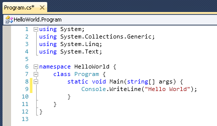

<style>
/* ── OOC theme: "the lecture as source code" ─────────────────────────
   Palette from Java's own identity: java-blue #33698C, java-orange #E76F00,
   ink #1E2833, paper #FBFAF7. Signature: an editor gutter down the left,
   slide numbers set like line numbers, and every heading ends in ;
   (element rules are section-prefixed to outrank the default theme) */
section {
  font-family: 'Segoe UI', 'Helvetica Neue', Arial, sans-serif;
  font-size: 25px;
  line-height: 1.5;
  color: #1E2833;
  /* the editor-gutter rail is painted into the background — template-proof */
  background: linear-gradient(to right,
    #FBFAF7 0, #FBFAF7 86px,
    #DED8C9 86px, #DED8C9 88px,
    #FBFAF7 88px, #FBFAF7 100%);
  padding: 56px 72px 56px 122px;
  justify-content: flex-start !important;
  align-content: flex-start !important;
  align-items: stretch !important;
}
section::after {
  position: absolute !important; left: 0 !important; right: auto !important;
  top: auto !important; bottom: 26px !important; width: 86px !important;
  text-align: center !important; padding: 0 !important; background: transparent !important;
  font-family: 'Segoe UI', 'Helvetica Neue', Arial, sans-serif !important;
  font-size: 16px !important; font-weight: 400 !important; color: #AFA893 !important;
  content: attr(data-marpit-pagination) !important;
}
section h1, section h2 {
  font-family: 'Cascadia Code', Consolas, 'Courier New', monospace;
  font-weight: 600; letter-spacing: -0.01em;
}
section h2 { font-size: 40px; margin: 0 0 26px 0 !important; padding: 0; color: #1E2833; border: none; }
section h2::after { content: ';'; color: #E76F00; }
section ul { margin: 0; padding-left: 1.15em; }
section li { margin: 7px 0; }
section ul li::marker { content: '▸ '; color: #E76F00; }
section ul ul li::marker { content: '· '; color: #8B94A3; }
section ul ul { font-size: 0.9em; color: #46536B; }
section a { color: #33698C; text-decoration-color: #E76F00; }
section strong { color: #0F1720; }
section em { color: #46536B; }
section code {
  font-family: 'Cascadia Code', Consolas, monospace;
  background: #EFECE3; color: #B94E00;
  padding: 0.1em 0.35em; border-radius: 5px; font-size: 0.9em;
}
section pre {
  background: #16222E; border: none; border-radius: 10px;
  padding: 20px 24px; margin: 14px 0;
  line-height: 1.45;
}
section pre code { background: transparent; color: #E8ECF1; font-size: 21px; padding: 0; }
section pre code .hljs-string { color: #F0B26B; }
section pre code .hljs-keyword { color: #7FB4D8; }
section pre code .hljs-title, section pre code .hljs-built_in { color: #A8D3EE; }
section pre code .hljs-comment { color: #7C8B99; }
section table { margin: 10px 0 18px 0; border-collapse: collapse; font-size: 24px; }
section table th {
  font-family: 'Cascadia Code', Consolas, monospace; font-weight: 600;
  text-align: left; color: #46536B; font-size: 20px;
  border: none; border-bottom: 2px solid #1E2833;
  padding: 8px 34px 8px 6px; background: transparent;
}
section table td {
  border: none; border-bottom: 1px solid #DED8C9;
  padding: 10px 34px 10px 6px; background: transparent;
}
section table thead tr, section table tbody tr,
section table tbody tr:nth-child(odd), section table tbody tr:nth-child(even) { background: transparent !important; }
section table td strong { color: #E76F00; }
section blockquote {
  border: none; border-left: 4px solid #E76F00; background: #F4F0E6;
  margin: 14px 0; padding: 12px 20px; color: #46536B; font-size: 0.92em;
}
section img {
  max-width: 100%;
  background: #FFFFFF; border: 1px solid #E5E1D6;
  border-radius: 8px; padding: 6px;
}
/* lead: title + section dividers — inverted ink, no gutter */
section.lead {
  background: linear-gradient(150deg, #14202C 0%, #23405A 100%);
  color: #F4F1E8; padding: 96px 110px; justify-content: center;
}
section.lead::after { color: #4E6478; }
section.lead h1 { font-size: 62px; color: #FFFFFF; margin: 6px 0 18px 0; }
section.lead h1::after { content: ';'; color: #E76F00; }
section.lead p { color: #A9B6C4; font-size: 26px; }
section.lead .kicker {
  font-family: 'Cascadia Code', Consolas, monospace;
  font-size: 21px; color: #E76F00; letter-spacing: 0.06em;
}
/* cols: two-column bullet flow for dense slides */
section.cols ul { columns: 2; column-gap: 52px; font-size: 21px; }
section.cols li { break-inside: avoid; margin: 0 0 12px 0; }
/* grid2: side-by-side image walls (JVM diagrams, error screenshots) */
section.grid2 p:has(img) {
  display: flex; flex-wrap: wrap; gap: 14px;
  justify-content: center; align-items: center; margin: 10px 0;
}
section.grid2 img { max-width: 46%; max-height: 215px; object-fit: contain; }
/* logos: borderless inline logo row */
section.logos p:has(img) {
  display: flex; gap: 28px; justify-content: center; align-items: center;
}
section.logos img { border: none; background: transparent; padding: 0; max-height: 100px; max-width: 30%; object-fit: contain; }
/* dense: slightly smaller body for prose-heavy slides */
section.dense { font-size: 22px; }
</style>

<!-- _class: lead -->
<!-- _paginate: false -->

<span class="kicker">// week 01 · object-oriented computing · atu</span>

# Object Oriented Computing

Module Introduction — Daniel Cregg

---

## Welcome

* This module assumes that you have some prior fundamental programming experience.
* This module focuses on the **Object-Oriented paradigm** of programming.

---

## About Me

* These details can be found on the top of the module Moodle page.


---

## Module Learning Outcomes

On completion of this module the learner will/should be able to;

* **Explain** the fundamentals of programming such as variables, operators, conditional and iterative statements etc.
* **Understand** the fundamentals of Object Oriented Programming such as defining Classes, instantiating Objects and invoking methods etc.
* **Set up** and configure a software development environment.
* **Develop** basic object-oriented applications.

---

## Module Delivery

* Delivered in an **incremental and iterative** fashion
  * Ideas and concepts expanded and expounded week by week.
* **Practice makes perfect** — programming is best learned through constant practice *(constructive failure)* over an extended period of time.
* Traits of a good programmer:
  * Patience · Consistency · Diligence · Dedication

---

## Timetable

* **13 teaching weeks** over 14 calendar weeks. We have a 1 week break for reading week.
* Labs start **week 2**
* See top of Moodle page for Timetable and Syllabus breakdown

---

## Assessment Matrix

| Week | Assessment | Grade portion |
|---|---|---|
| 5 | MCQ 1 | **30%** |
| 9 | MCQ 2 | **35%** |
| 13 | MCQ 3 | **35%** |

> All assessments are completed **in person, in a lab**.

<!-- Speaker notes:
Get Exam Papers ASAP
-->

---

## Lab Coding Environment

* We will use **GitHub Codespaces** as our coding environment.
* GitHub Codespaces is VS Code running on a virtual machine which you connect to via a browser. It is a cloud based IDE.
* If you are familiar with VS Code then you will notice no difference.
* We will be using **AI** to assist in answering questions.

---

## Assessments

* All assessments are completed **in-person in a lab**.
* MCQ questions are taken from **Lab and Lecture materials**.
* Use AI to generate sample MCQ questions for you — Google's **NotebookLM** is a great tool to do this.
* MCQs will involve standard MCQ questions **plus some coding questions**.

---

## Grading System


---

## What if I fail

* Pass by **compensation**
* **Repeat project** over summer — submit end of August

---

## Enrol in Module on Moodle

* Go to <https://vlegalwaymayo.atu.ie/>
* Search for course: **8963**
  * I teach *two* Object Oriented Computing modules — be careful to select the correct one!
* Enrolment key:
  * `object`

---

## Tasks for this week

* Sign up for the [GitHub Student Developer Pack](https://education.github.com/pack)
* Research **GitHub Codespaces**

---

## Programming Experience

* What programming experience do you have?
* What languages have you used?
* Have you used an OO language?
* What do we need to run a Java program?
* When do we need to compile a Java program?
* What is an IDE?

---

<!-- _class: lead -->

<span class="kicker">// part 2</span>

# Java Refresh

Background · running code · JVM, JRE, JDK · IDEs · common errors

---

## Agenda

* Java Background
* Running code in Java
* JVM, JRE, JDK
* IDE
* Common Errors

---

<!-- _class: cols -->

## Why Java

* Java is **object-oriented by design**, encouraging students to model real-world concepts using classes and objects.
* Its **strong static typing** helps catch errors early and promotes disciplined coding habits.
* Java has clear, readable syntax that makes OO concepts like encapsulation, inheritance, and polymorphism easy to teach.
* It's **widely used in industry**, so students gain skills that are directly applicable to real-world development.
* The standard library is rich, especially for data structures and algorithms, making it easy to build meaningful examples.
* Java is supported by excellent IDEs and tools *(e.g. IntelliJ, VS Code)* that enhance learning through debugging and code completion.
* The OO principles learned in Java translate easily to other languages like **Python, C#, and Kotlin**.

---

<!-- _class: cols -->

## Java Background

* Java was originally designed by **James Gosling** at Sun Microsystems in **1991**.
* It was initially named **"Oak"**, inspired by an oak tree outside Gosling's office.
* The name was later changed to **Java**, after Java coffee.
* In **2010, Oracle Corporation** completed its acquisition of Sun Microsystems and became the steward of Java.
* Over **45 billion** active Java Virtual Machines (JVMs) are deployed worldwide across devices and servers.
* Java remains one of the most popular programming languages, with over **10 million developers** globally (and growing).
* It powers a wide range of technologies — from Android apps and enterprise systems to cloud platforms and IoT devices.

---

## Java Version History

* [Java version history — Wikipedia](https://en.wikipedia.org/wiki/Java_version_history)

---

## Java Key Words

* A **computer program** is a sequence of human-readable instructions that are converted by software into machine-executable instructions.
* List of 50 Java key words:


---

<!-- _class: dense -->

## Compiler vs Interpreter

* A **compiler** is a program that converts instructions into a machine-code or lower-level form so that they can be read and executed by a computer.
* An **interpreter** is a computer program that directly executes, i.e. performs, instructions written in a programming or scripting language, without previously compiling them into a machine language program.
* Java is **both compiled and interpreted**. Java source code is first compiled into bytecode by the Java compiler. Then, the bytecode is executed by the Java Virtual Machine (JVM), which is a software-based interpreter.

---

<!-- _class: grid2 -->

## non-Java program VS Java Program

   

<!-- Speaker notes:
Non java = compiled program
Java is compiled then interpreted
The whole source code is compiled in one go and is processed all at once by the computer.
-->

---

<!-- _class: grid2 -->

## JIT

* The JVM also has a **Just-in-Time (JIT)** compiler that can optimize the bytecode to native machine code at runtime

   

<!-- Speaker notes:
Non java = compiled program
Java is compiled then interpreted
The whole source code is compiled in one go and is processed all at once by the computer.
-->

---

## Advantages of the JVM

* Java is **platform independent**: Write Once Run Anywhere *(WORA)*
* A computer **platform** is a system that consists of a hardware device and an operating system that an application, program or process runs upon. *(e.g. PC with Intel processor running Windows 10)*
* A Java program (`myprogram.java`) is written once and then compiled to bytecode (`myprogram.class`). The JVM program, which can be installed on any platform, then runs this bytecode.

---

## Java Development Kit (JDK)

* You need to install the **Java JDK** (Java Development Kit) to develop Java programs
  * Location after install on Windows: `C:\Program Files\Java\jdk1.8.x`
* The JDK includes programs such as:
  * `javac.exe` *(Java compiler)*
  * `javadoc.exe` *(Javadoc generator)*

---

## Your First Program

* Traditional **'Hello World'** program in Java
* We will examine this program in the lab
  * Be careful of spelling — `JaVa iS CaSe SeNsItiVe`
  * Java uses special characters, e.g. `{}`


---

## Text Editor Programming

* You can also use a simple text editor such as **Notepad** to write your source code.
* Once saved as `HelloPrinter.java`, you can use a console window to **compile** and **run** the program.


---

<!-- _class: logos -->

## Integrated Development Environment (IDE)

* An **Integrated Development Environment** is used to develop software — a complete toolkit for development with a suite of productivity tools.
* Common Java IDEs are **Eclipse, NetBeans and IntelliJ**.
* Writing Hello World in Notepad first shows the advantages of an IDE — and what happens behind the scenes.

  

---

## VS Code IDE example

* **Editor** — where the code is written
* **Output** — where the program speaks back


---

## Syntax 1.1: The Java Program

* Every application has the same basic layout
  * Add your 'code' inside the **main method**


---

## Common Error

* **Omitting semicolons** — in Java, every statement must end in a semicolon. Forgetting one confuses the compiler, which uses `;` to find where one statement ends and the next starts. The compiler sees this code:

```java
System.out.println("Hello")
System.out.println("World!");
```

* As this…

```java
System.out.println("Hello") System.out.println("World!");
```

---

<!-- _class: grid2 -->

## Syntax Errors

* What happens if you…
  * **Misspell** a word: `System.ou.println` · **don't capitalise**: `system.out.println`
  * **Leave out** a word: `void` · **forget a semicolon** after `("Hello, World!")`
  * **Don't match a curly brace?** Remove line 6

 

---

## Summary: Java

* The **Java compiler** translates source code into class files that contain instructions for the **Java virtual machine**.
* Java programs are distributed as instructions for a virtual machine, making them **platform-independent**.
* An **editor** is a program for entering and modifying text, such as a Java program.
* **Classes** are the fundamental building blocks of Java programs.
* Every Java application contains a class with a **main method** — when the application starts, the instructions in the main method are executed.

---

<!-- _class: grid2 -->

## Side Note: Java and C# similarities

 
