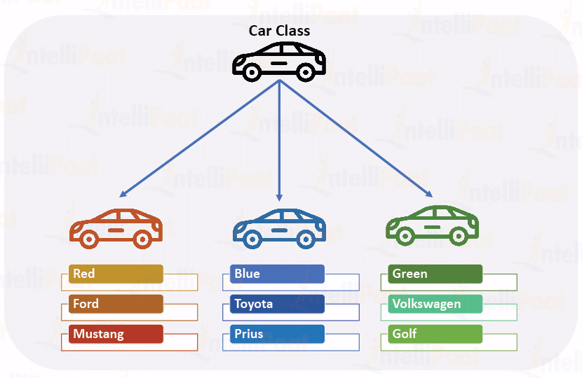
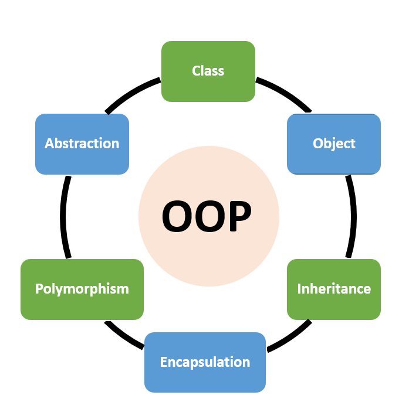
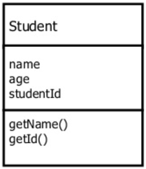
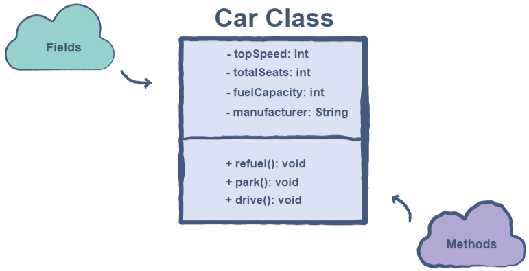
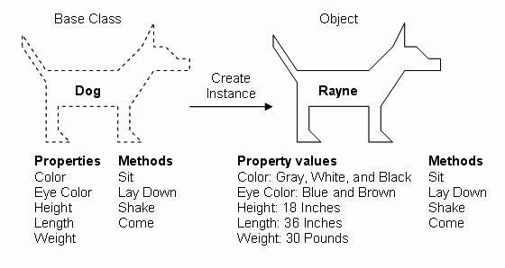
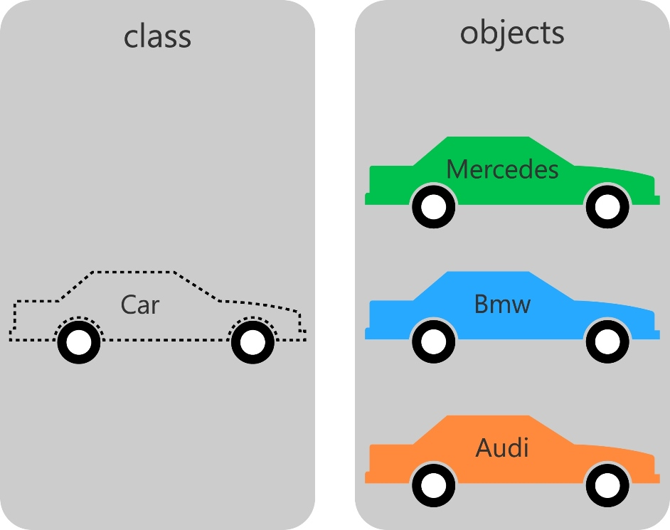
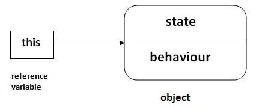

<!-- _class: lead -->
<!-- _paginate: false -->

<span class="kicker">// week 02 · classes and objects · object-oriented computing</span>

# Classes and Objects



---

## Agenda

- Object-Oriented Programming (quick context)
- Class vs Object (definitions + real-world example)
- Members of a Class: fields & methods
- Declaring a Class (syntax)
- Constructors (default & parameterized)
- Creating Objects with new
- Reference Variables vs Object Identity
- this keyword (when & why)
- Single Responsibility Principle
- Wrap-Up

---

## Object-Oriented (OO) Languages

- Java is an Object-oriented Language and thus follows the OO Programming System.
- The OO programming paradigm is based on the concept of “objects”.
- Objects are constructed using a class as the blueprint.
- Objects contain data, in the form of fields (also called instance variables) and expose behaviour via methods defined by their class; the method code is shared by all instances.



---

## What is a class?

- Classes are the fundamental building blocks of programs developed using the object-oriented programming paradigm.
- A class is a blueprint for creating objects.
- A class describes what an object knows (state/fields) and what an object does (behaviour/methods).
- A class defines the properties (variables) and behaviors (methods) of its objects.



---

## What is a class?

- In the real world, we can find many objects around us like cars, buildings, and humans. All these objects have some state and behaviour.
- If we consider a car, then its states can be top speed, total seats, fuel capacity and manufacturer.
- Its behaviours can be refuel, park, and drive.

<style scoped>
section img { max-height: 300px; }
</style>



---

## Attributes (also called members) of a class

- The Car class is implemented on the right.
- Fields – also called member variables/instance variables of a class. This is because they contain the information relevant to the object of the class. A car object would have a top speed, a certain number of seats, and so many other pieces of data that we could store in variables.
- Methods - This category of attributes enables the class object to perform operations using the fields. In the case of the car class, the refuel() function would fill up the fuelCapacity property of the object.

---

## Attributes (also called members) of a class (continued)

<!-- no-compile -->
```java
class Car { // Class name
  // Class Data members
  int topSpeed;
  int totalSeats;
  int fuelCapacity;
  String manufacturer;
  // Class Methods
  void refuel();
  void park();
  void drive();
}
```

---

## Class Declaration

- The written code of a class and its attributes are known as the definition or implementation of the class.
- In Java, we define classes in the following way:
- The class command tells the compiler that we are creating our custom class. All the members of the class will be defined within the class scope.

```java
class ClassName { // Class name

  /* All member variables
and methods*/

}
```

---

## Benefits of Using Classes

- The concept of classes allows us to construct complex objects from basic data types. This is why classes are the basic building blocks behind all of the OOP’s principles.
- Classes are also very useful in compartmentalising the code of an application.
- Ready-made components can be available for use in future applications.
- The use of classes makes it easier to maintain the different parts of an application since it is easier to make changes in classes.

---

## What is an object?



---

## What is an object?

- An object is an instance of a class.
- You develop one class and create many objects of that class e.g. your write a Student class and then you create many students based off the structure contained in the Student class.
- Objects have an identity (a distinct memory location) and contain states (stored in variables) and behaviours (stored in methods) e.g. A dog object could have the name dog1 states such as name, breed, colour, awake, weight and behaviours such as eating, sleeping, barking.
- An object is memory allocated by the JVM for an instance’s state (its fields), with a header linking it to its class. Methods belong to the class and are shared by all instances.



---

## Creating/Instantiating/Constructing an object

- Here we will instantiate an object of the Elephant class.
- The reference variable to this object is elephantObject1
- We can create a new object by calling the keyword new :

<!-- no-compile -->
```java
class Main {
    // Main method
    public static void main(String args[]) {
        // Create an elephant object called elephantObject1
        Elephant elephantObject1 = new Elephant();
    }
}
```

---

## Reference Variables (Names in Code)

- In the previous slide elephantObject1 is a reference variable.
- Reference Variables are labels in your code that point to an object in memory.
- They are not the identity of the object; they are just handles.
- You could have multiple reference variables pointing to the same object.
- Both s1 and s2 point to the same object identity.

<!-- no-compile -->
```java
Student s1 = new Student("Alice");
Student s2 = s1;    // s2 now refers to the same object as s1
```

---

## Object Identity vs Reference Variables

- Object Identity
  - Each object has a unique identity, defined by its memory location in the JVM heap.
  - Even if two objects have the same values, they are different objects if stored at different memory locations.
- Reference Variables
  - A variable name (e.g. s1, s2) is just a reference (handle) to an object in memory.
  - Multiple variables can point to the same object.

<!-- no-compile -->
```java
Student s1 = new Student("Alice");
Student s2 = new Student("Alice");
Student s3 = s1;
```
- s1 and s2 → different objects (different memory locations)
- s1 and s3 → same object (same memory location)

---

## Object Identity vs Reference Variables (continued)

> **Analogy** — Object = a house. Reference variable = a slip of paper with directions to the house. Name of the variable = what you wrote on the slip for yourself (e.g. "Alice's house").

---

## Class VS Object

<style scoped>
section pre { padding: 8px 14px; margin: 4px 0; }
section pre code { font-size: 14px; line-height: 1.25; }
</style>

```java
public class Student {
    // Instance variables
    private String name;
    private int age;
    private double gpa;
    // Constructor
    public Student(String name, int age, double gpa) {
        this.name = name;
        this.age = age;
        this.gpa = gpa;
    }
    // Getter methods
    public String getName() {
        return name;
    }
    public int getAge() {
        return age;
    }
    public double getGpa() {
        return gpa;
    }
    // Additional methods:
    // You can add other methods as needed, for example:
    //
    // - calculateAverageGrade(double[] grades)
    // - printStudentInfo()
    // - isEligibleForScholarship()
}
```

---

## Class VS Object (continued)

<style scoped>
section pre { padding: 12px 18px; margin: 8px 0; }
section pre code { font-size: 17px; line-height: 1.3; }
</style>

<!-- no-compile -->
```java
public class Main {

    public static void main(String[] args) {

        // Create student objects
        Student student1 = new Student("John Doe", 20, 3.85);
        Student student2 = new Student("Jane Smith", 22, 3.50);

        // Use getter methods to access student information
        System.out.println("Student 1:");
        System.out.println("Name: " + student1.getName());
        System.out.println("Age: " + student1.getAge());
        System.out.println("GPA: " + student1.getGpa());

        // You can add more functionality here, such as:
        //
        // - Create an array of students
        // - Loop through the array and print information for each student

    }
}
```

---

## Constructors

- A constructor in Java is a block of code similar to a method that's called when an instance of an object is created (i.e. Constructed)
- Every class contains a constructor method. if no constructor is declared, the compiler provides a default constructor.
- A constructor allows you to provide initial values for class instance variables when you create the object.
- If we do not explicitly write a constructor for a class, the Java compiler builds a default constructor for that class.
```java
public class Puppy {
    public Puppy()  {
    }
}
```

---

## Types of Constructors

```java
public class Puppy {
    // Instance variable
    String name;
     // Default Constructor (i.e. no input parameters)
    public Puppy() {
    }
    // Constructor with input parameters
    public Puppy(String puppyName) {
	name = puppyName;
    }
}
```

---

## Unique factors of Constructors

- A constructor does not have a return type.
- The name of the constructor must be the same as the name (i.e. identifier) of the class.
- Unlike methods, constructors are not considered members of a class.
- A constructor is called automatically when a new instance of an object is created.

---

## this Reference Variable

- this is a keyword in the Java language
- The this reference variable exists for every class but may not be used.
- You will find the this keyword within an instance method or a constructor.



---

## this Reference Variable

- this is a reference to the current object (i.e. the object whose method or constructor is being called).
- You can refer to any member (i.e. instance variable or method) of the current object from within a class method or constructor by using this (e.g. this.age).


---

## this usage

- The most common reason for using the this keyword is when we have a method or constructor input parameter which has the same name as a class instance variable.
- To refer to the class instance variable the constructor must use this
```java
public class Cat {
// Instance Variable
int age;
// Parameterized Constructor
public Cat(int newAge) {
    age = newAge;
}
}
```
```java
public class Cat {
// Instance Variable
int age;
// Parameterized Constructor
public Cat(int age) {
    this.age = age;
}
}
```

---

## Single Responsibility Principle (SRP)

- The development of a class should be guided by the Single Responsibility Principle (SRP).
- A class should have one, and only one, responsibility. Every field and method it defines should serve that single responsibility.

---

## Wrap-Up

- Class = blueprint (fields + methods).
- Object = instance with its own state; method code is shared via the class.
- Constructors initialize objects; default no-arg exists only if you don’t declare any.
- Reference variables ≠ identity; many refs can point to one object.
- Use this to disambiguate names and refer to the current object.
- Aim for SRP: one responsibility per class.

