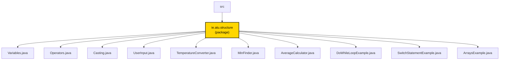
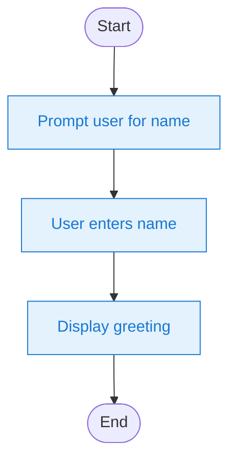
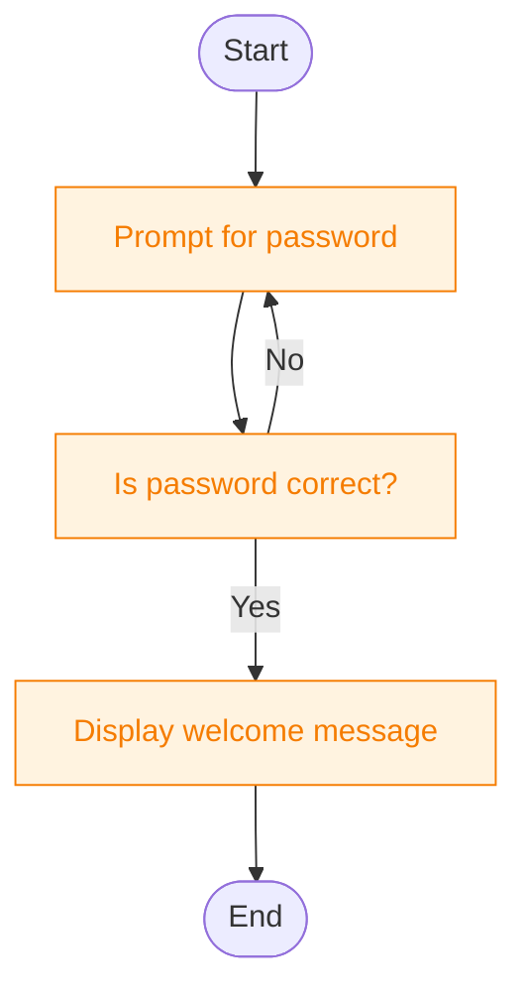
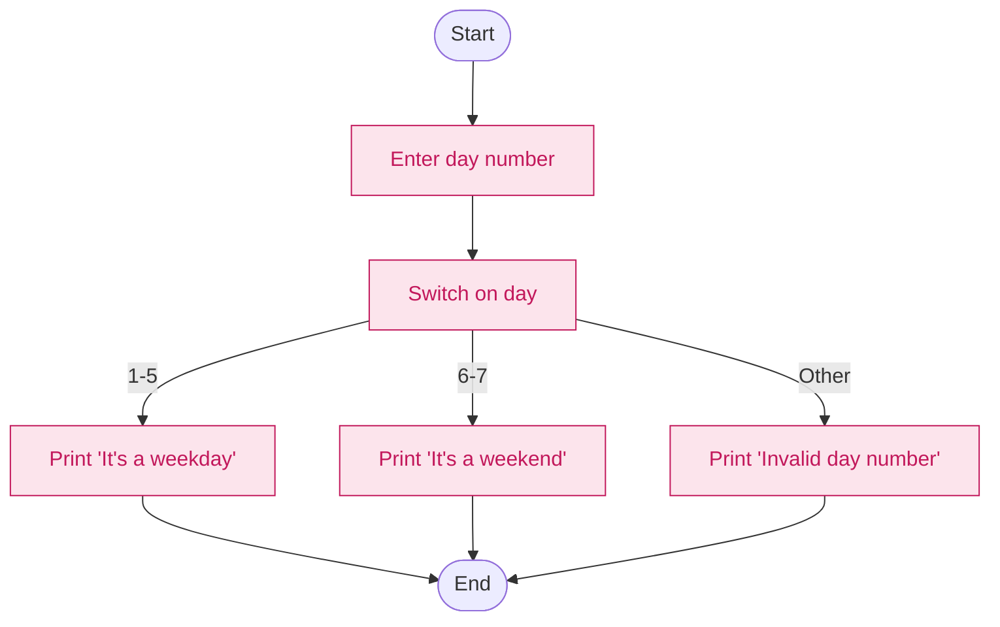
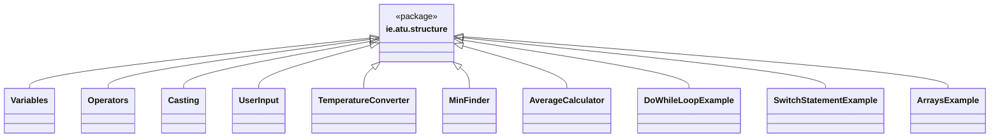

# Week 2 Lab — Structure

> **GitHub Classroom assignment:** REDACTED
> **Starter repo (canonical instructions):** https://github.com/DanielCreggOrganization/ooc-lab-structure-ooc-w2-lab-structure-template
> **Worked solutions:** https://github.com/danielcregg/REDACTED
>
> The section below is a synced snapshot of the starter repo's README —
> the instructions students receive. If you edit it here, push the same
> change to the starter repo.

---

### Lab: Java Program Structure and Basic Concepts

In this lab, you will learn basic Java concepts such as variables, operators, type casting, user input, and control structures. Each section includes code examples with explanations and comments to help clarify key principles. Additionally, each section contains a **Do It Yourself (DIY)** step to help you test your understanding by modifying the code and implementing new features.

## Agenda

1. [Setting Up Your Java Project](#1-setting-up-your-java-project-in-vs-code)
2. [Variables and Data Types](#2-variables-and-data-types)
3. [Basic Arithmetic Operations](#3-basic-arithmetic-operations)
4. [Type Casting](#4-type-casting)
5. [User Input](#5-user-input)
6. [Temperature Conversion](#6-temperature-conversion)
7. [Finding the Minimum of Three Numbers](#7-finding-the-minimum-of-three-numbers)
8. [Calculating Average](#8-calculating-average)
9. [Do-While Loop Example](#9-do-while-loop-example)
10. [Switch Statement Example](#10-switch-statement-example)
11. [Arrays Example](#11-arrays-example)
12. [Final Summary](#12-final-summary)
13. [Additional Practice](#13-additional-practice)

---

### 1. Setting Up Your Java Project in VS Code

Before we begin, you need to set up a Java project in VS Code and create a package named `ie.atu.structure`. Follow the steps below to set up your development environment.

#### **Step 1: Open a GitHub Codespace for this repository**

1. **Locate the green `Code` Button:**

2. **Select the codespaces tab:**

3. **Click the green button to create on `Main`:**

#### **Step 2: Open the Java Project Explorer**

- Click on the **Explorer** icon on the left sidebar.
- In the Explorer, you will see the **Java Projects** section.

#### **Step 4: Create the Package `ie.atu.structure`**

1. **Locate the `src` Folder:**

   - In the **Java Projects** view, expand your project to find the `src` folder.

2. **Create a New Package:**

   - Right-click on the `src` folder.
   - Select **"New Package"**.

3. **Name the Package:**

   - In the prompt, enter `ie.atu.structure` as the package name.

   **Explanation:**

   - The package name `ie.atu.structure` follows the convention of reverse domain naming.
   - `ie` represents Ireland (country code), `atu` could stand for your institution or organization, and `structure` is the specific package name.

4. **Confirm Creation:**

   - Press **Enter** to create the package.

#### **Step 5: Create New Java Classes**

1. **Right-click on the `ie.atu.structure` package:**

   - Select **"New Class"**.

2. **Name the Class:**

   - Enter the name of your class (e.g., `Variables`, `Operators`, etc.) depending on the section you're working on.

3. **Repeat for Other Classes:**

   - For each section of the lab, create a new class within the `ie.atu.structure` package.

#### **Step 6: Verify the Package Structure**


Your project should now have the following structure:



#### **Step 7: Update Package Declarations**

- In each Java file, ensure the package declaration at the top matches the package name:

```java
package ie.atu.structure;
```

---

Now that your project is set up, you are ready to start coding!

---


### 2. Variables and Data Types

#### Concept:
Variables store data for use in programs. Java is a statically typed language, which means you must declare the type of the variable (e.g., `int`, `double`, `String`) before using it.

#### Code Example:
```java
package ie.atu.structure;

public class Variables {
    public static void main(String[] args) {
        // Declare and initialize variables
        int number = 5;          // Integer variable
        double decimal = 5.99;    // Double for decimal numbers
        char character = 'A';     // Character variable
        boolean isTrue = true;    // Boolean variable (true or false)
        String name = "Daniel";   // String variable (sequence of characters)

        // Print variables to the console
        System.out.println("Integer: " + number);
        System.out.println("Double: " + decimal);
        System.out.println("Character: " + character);
        System.out.println("Boolean: " + isTrue);
        System.out.println("String: " + name);
    }
}
```

#### Commentary:
- **`int`**: Stores whole numbers without decimals.
- **`double`**: Stores decimal numbers.
- **`char`**: Stores a single character (in single quotes).
- **`boolean`**: Stores a true/false value.
- **`String`**: Stores a sequence of characters (in double quotes).

#### DIY Steps:
1. Create a new class file named `Variables.java` in the `ie.atu.structure` package. Implement your solution in this file.
2. Declare and initialize a `float`, `long`, and `short` variable. Print each one to the console, and experiment with changing their values.

---


### 3. Basic Arithmetic Operations

#### Concept:
In Java, you can perform arithmetic operations like addition, subtraction, multiplication, division, and modulus.

#### Code Example:
```java
package ie.atu.structure;

public class Operators {
    public static void main(String[] args) {
        // Declare two integer variables
        int x = 10;
        int y = 3;

        // Perform arithmetic operations and print the results
        System.out.println("Addition: " + (x + y));          // Adds x and y
        System.out.println("Subtraction: " + (x - y));       // Subtracts y from x
        System.out.println("Multiplication: " + (x * y));    // Multiplies x by y
        System.out.println("Division: " + (x / y));          // Divides x by y (integer division)
        System.out.println("Modulus: " + (x % y));           // Finds remainder of x divided by y
    }
}
```

#### Commentary:
- The **modulus** operator (`%`) returns the remainder of the division of two numbers.
- Integer division truncates the decimal part in Java (e.g., `10 / 3` equals `3`).

#### DIY Steps:
1. Create a new class file named `Operators.java` in the `ie.atu.structure` package. Implement your solution in this file.
2. Add two `double` variables and perform the same arithmetic operations. Print the results to observe the differences between integer and floating-point arithmetic.

---


### 4. Type Casting

#### Concept:
Type casting is converting one data type to another. Java supports both implicit and explicit casting.

#### Code Example:
```java
package ie.atu.structure;

public class Casting {
    public static void main(String[] args) {
        int myInt = 9;              // Integer value
        double myDouble = myInt;     // Implicit casting: int to double

        System.out.println("Implicit casting from int to double: " + myDouble);

        double anotherDouble = 9.78;
        int anotherInt = (int) anotherDouble; // Explicit casting: double to int

        System.out.println("Explicit casting from double to int: " + anotherInt);
    }
}
```

#### Commentary:
- **Implicit casting**: Automatically converting a smaller data type to a larger one (e.g., `int` to `double`).
- **Explicit casting**: Manually converting a larger data type to a smaller one (e.g., `double` to `int`).

#### DIY Steps:
1. Create a new class file named `Casting.java` in the `ie.atu.structure` package. Implement your solution in this file.
2. Create two `float` variables and perform implicit and explicit casting to `int` and `double`. Print the results and observe how the values are truncated or converted.

---


### 5. User Input

#### User Input/Output Flowchart


#### Concept:
The `Scanner` class is used in Java to accept input from the user.

#### Code Example:
```java
package ie.atu.structure;

import java.util.Scanner;  // Import Scanner class

public class UserInput {
    public static void main(String[] args) {
        Scanner myScanner = new Scanner(System.in);  // Create Scanner object

        // Prompt the user for input
        System.out.print("Enter your name: ");
        String userName = myScanner.nextLine();      // Read user input (a string)

        // Greet the user
        System.out.println("Hello, " + userName + "!");

        myScanner.close(); // Close the scanner to prevent resource leaks
    }
}
```

#### Commentary:
- The `Scanner` object reads input from the console. The `nextLine()` method captures the entire line as a string.
- **Always close the `Scanner` after use** with `myScanner.close();` to free system resources.

#### DIY Steps:
1. Create a new class file named `UserInput.java` in the `ie.atu.structure` package. Implement your solution in this file.
2. Modify the program to also ask for the user’s age (as an integer) and print a greeting like, "Hello, [Name], you are [Age] years old."

---


### 6. Temperature Conversion

#### Concept:
This program converts a temperature from Celsius to Fahrenheit.

#### Code Example:
```java
package ie.atu.structure;

import java.util.Scanner;

public class TemperatureConverter {
    public static void main(String[] args) {
        Scanner scanner = new Scanner(System.in);

        // Prompt user to enter a temperature in Celsius
        System.out.print("Enter temperature in Celsius: ");
        double celsius = scanner.nextDouble();

        // Convert Celsius to Fahrenheit
        double fahrenheit = (celsius * 9/5) + 32;

        // Output the result
        System.out.println("Temperature in Fahrenheit: " + fahrenheit

);

        scanner.close(); // Close the scanner
    }
}
```

#### Commentary:
- The formula to convert Celsius to Fahrenheit is `F = (C * 9/5) + 32`.
- **Important:** Close the `Scanner` object after use.

#### DIY Steps:
1. Create a new class file named `TemperatureConverter.java` in the `ie.atu.structure` package. Implement your solution in this file.
2. Add functionality to convert from Fahrenheit to Celsius. Prompt the user for which conversion they want to perform.

---


### 7. Finding the Minimum of Three Numbers

#### Concept:
This program finds the smallest of three numbers entered by the user.

#### Code Example:
```java
package ie.atu.structure;

import java.util.Scanner;

public class MinFinder {
    public static void main(String[] args) {
        Scanner scanner = new Scanner(System.in);

        // Get three numbers from the user
        System.out.println("Enter three numbers: ");
        int num1 = scanner.nextInt();
        int num2 = scanner.nextInt();
        int num3 = scanner.nextInt();

        // Use Math.min to find the minimum number
        int min = Math.min(num1, Math.min(num2, num3));

        // Display the smallest number
        System.out.println("The minimum number is: " + min);

        scanner.close(); // Close the scanner
    }
}
```

#### Commentary:
- **`Math.min()`** finds the smaller of two numbers. It is used here recursively to find the minimum of three numbers.
- **Always close the `Scanner` after use.**

#### DIY Steps:
1. Create a new class file named `MinFinder.java` in the `ie.atu.structure` package. Implement your solution in this file.
2. Extend the program to also find and display the maximum of the three numbers, using `Math.max()`.

---


### 8. Calculating Average

#### Concept:
This program calculates the average of three numbers.

#### Code Example:
```java
package ie.atu.structure;

import java.util.Scanner;

public class AverageCalculator {
    public static void main(String[] args) {
        Scanner scanner = new Scanner(System.in);

        // Prompt user for three numbers
        System.out.println("Enter three numbers: ");
        double num1 = scanner.nextDouble();
        double num2 = scanner.nextDouble();
        double num3 = scanner.nextDouble();

        // Calculate the average
        double average = (num1 + num2 + num3) / 3;

        // Output the result
        System.out.println("The average is: " + average);

        scanner.close(); // Close the scanner
    }
}
```

#### Commentary:
- The average is calculated by summing the numbers and dividing by the total count (3 in this case).
- **Remember to close the `Scanner` to prevent resource leaks.**

#### DIY Steps:
1. Create a new class file named `AverageCalculator.java` in the `ie.atu.structure` package. Implement your solution in this file.
2. Modify the program to allow the user to enter any number of values, and then calculate and display the average.

---


### 9. Do-While Loop Example

#### Do-While Loop Control Flow


#### Concept:
A `do-while` loop executes the code inside the loop at least once, then repeats the execution while a given condition is true.

#### Code Example:
```java
package ie.atu.structure;

import java.util.Scanner;

public class DoWhileLoopExample {
    public static void main(String[] args) {
        Scanner scanner = new Scanner(System.in);
        int number;

        // Do-while loop to ensure user input is within a range
        do {
            System.out.print("Enter a number between 1 and 10: ");
            number = scanner.nextInt();
        } while (number < 1 || number > 10);

        // Output valid input
        System.out.println("You entered: " + number);

        scanner.close(); // Close the scanner
    }
}
```

#### Commentary:
- The `do-while` loop ensures the code block is executed at least once, regardless of the condition.
- It prompts the user until they enter a number between 1 and 10.
- **Closing the `Scanner` is good practice.**

#### DIY Steps:
1. Create a new class file named `DoWhileLoopExample.java` in the `ie.atu.structure` package. Implement your solution in this file.
2. Modify the program to ask the user for a password. Keep asking until the user enters the correct password, then print a welcome message.

---


### 10. Switch Statement Example

#### Switch Statement Flowchart


#### Concept:
A `switch` statement is used when you want to select one of many possible blocks of code to execute based on a variable’s value.

#### Code Example:
```java
package ie.atu.structure;

import java.util.Scanner;

public class SwitchStatementExample {
    public static void main(String[] args) {
        Scanner scanner = new Scanner(System.in);

        // Prompt user for a day of the week number
        System.out.print("Enter a day of the week (1 for Monday, 7 for Sunday): ");
        int day = scanner.nextInt();

        // Use switch to determine the day
        switch (day) {
            case 1:
                System.out.println("It's Monday!");
                break;
            case 2:
                System.out.println("It's Tuesday!");
                break;
            case 3:
                System.out.println("It's Wednesday!");
                break;
            case 4:
                System.out.println("It's Thursday!");
                break;
            case 5:
                System.out.println("It's Friday!");
                break;
            case 6:
                System.out.println("It's Saturday!");
                break;
            case 7:
                System.out.println("It's Sunday!");
                break;
            default:
                System.out.println("Invalid day number. Please enter a number between 1 and 7.");
        }

        scanner.close(); // Close the scanner
    }
}
```

#### Commentary:
- The `switch` statement checks the value of the `day` variable and executes the corresponding `case`.
- **`break` Statements:** Each case ends with a `break` to prevent fall-through.
- If no matching case is found, the `default` case is executed.

#### DIY Steps:
1. Create a new class file named `SwitchStatementExample.java` in the `ie.atu.structure` package. Implement your solution in this file.
2. Extend the program to print whether the day is a weekday or weekend (e.g., "It's a weekday" or "It's a weekend").

---


### 11. Arrays Example

#### Concept:
An array is a data structure that allows you to store multiple values of the same type in a single variable. You can access the values in an array using their index.

#### Code Example:
```java
package ie.atu.structure;

public class ArraysExample {
    public static void main(String[] args) {
        // Declare an array of integers
        int[] numbers = {10, 20, 30, 40, 50};

        // Loop through the array and print each element
        for (int i = 0; i < numbers.length; i++) {
            System.out.println("Element at index " + i + ": " + numbers[i]);
        }

        // Calculate the sum of all elements in the array
        int sum = 0;
        for (int number : numbers) {
            sum += number;  // Add each element to sum
        }
        System.out.println("The sum of the array elements is: " + sum);
    }
}
```

#### Commentary:
- The array `numbers` holds five integer values.
- **Standard For Loop:** Used to access elements by their index.
- **Enhanced For Loop:** Used to iterate through each element directly.
- **Array Indices:** Start at `0`.

#### DIY Steps:
1. Create a new class file named `ArraysExample.java` in the `ie.atu.structure` package. Implement your solution in this file.
2. Write a program to find the largest number in the array and print it.

---


### 12. Final Summary

#### Class Diagram


This lab covered the following Java principles:

1. **Variables and Data Types**: Declaring and initializing variables of various types.
2. **Operators**: Performing arithmetic operations.
3. **Type Casting**: Converting between different data types.
4. **User Input**: Using `Scanner` to get input from the user.
5. **Temperature Conversion**: Working with simple mathematical formulas.
6. **Minimum Finder**: Using control flow to find the smallest number.
7. **Average Calculator**: Summing numbers and calculating their average.
8. **Do-While Loop**: Ensuring code executes at least once before checking conditions.
9. **Switch Statement**: Using a `switch` block to control program flow based on a variable's value.
10. **Arrays**: Storing and working with multiple values using arrays.

---

### 13. Additional Practice

- **Find the Largest Number in an Array:**

  Modify the array example to find the largest number in the array.

  **Code Example:**
  ```java
  package ie.atu.structure;

  public class FindLargestInArray {
      public static void main(String[] args) {
          int[] numbers = {10, 20, 30, 40, 50};

          int largest = numbers[0]; // Assume first element is the largest
          for (int number : numbers) {
              if (number > largest) {
                  largest = number;
              }
          }

          System.out.println("The largest number in the array is: " + largest);
      }
  }
  ```

- **Update the `MinFinder` Program to Find the Maximum:**

  **Code Example:**
  ```java
  package ie.atu.structure;

  import java.util.Scanner;

  public class MaxFinder {
      public static void main(String[] args) {
          Scanner scanner = new Scanner(System.in);

          // Get three numbers from the user
          System.out.println("Enter three numbers: ");
          int num1 = scanner.nextInt();
          int num2 = scanner.nextInt();
          int num3 = scanner.nextInt();

          // Use Math.max to find the maximum number
          int max = Math.max(num1, Math.max(num2, num3));

          // Display the largest number
          System.out.println("The maximum number is: " + max);

          scanner.close(); // Close the scanner
      }
  }
  ```

By working through these examples, you will have a solid foundation in basic Java programming concepts. Feel free to experiment with the code and add new features to the programs!

---

**Congratulations!** You have successfully set up your Java project and completed the lab exercises. Keep practicing to enhance your understanding of Java programming.

---
