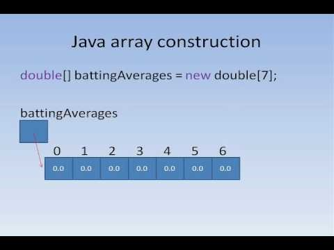
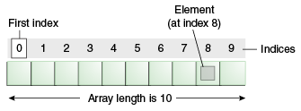
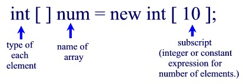
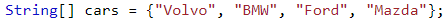
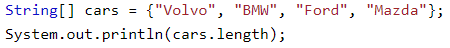
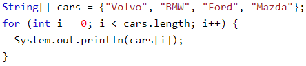
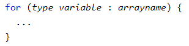
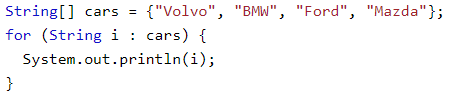

# Java Arrays

---

## Agenda

- What is an Array?
- Declaring and Assigning an array
- Array Length
- Array editing
- Multidimensional Arrays

---

## Slide 3



---

## What is an Array?

- An array is a container object that holds a fixed number of values of a single type. - Oracle
- An array is a structure which can store multiple values of the same data type. This prevents the need to declare separate variables for each value.
- String name1;
- String name2;
- String name 3;
- String[] names;

---

## Characteristics of an Array

- An array has two distinguishing characteristics:
  - Length (i.e., the number of variables (AKA components) it stores) The length of an array cannot be changed (i.e., it is fixed upon creation).
  - Homogeneity (i.e., every variable in an array has the same data type).

---

## Array Length and Homogeneity

```java
// Declare an array of ints to store student ages
int[] studentAgesArray;

// Allocate memory for 5 ints
studentAgesArray= new int[5];
```
- Below is the studentAgesArray. It can store 5 ages of type int. I have populated it with 5 ages which are all ints. The length of this array is 5. The length cannot be changed. If I wanted to add more ages, I would need to create a new array.
| 17 | 21 | 18 | 18 | 19 |
|---|---|---|---|---|


---

## Arrays Details

- The individual values in an array are called elements (or components).
- The type of those elements (which must be the same because arrays are homogeneous) is called the element type.
- The number of elements is called the length of the array.
- Each element is identified by its position number in the array, which is called its index.
- Index numbers always begin with 0 and therefore extends up to one less than the length of the array.



---

## Declaring and Assigning an Array

- As with any other variable, array variables must be declared before you use them. e.g., String[] cars;
- The most common syntax for declaring and assigning an array variable looks like this:         int[] ages = new int[100];
- The part of the line to the left of the equal sign declares the variable. The part to the right creates an array value with the specified number of elements and then assigns it to the array variable.



---

## Another way to declare and assign an Array

- We can declare an array variable that holds an array of strings.
- To insert values to it, we can use an array literal - place the values in a comma-separated list, inside curly braces:



---

## ..

- Array
- 0
- 1	2
- 3 ..
- n-1

---

## ..

- Arrays
- Example: double [ ]
- 5.0	2.44	9.01	1.0
- -9.9
- 0
- 1	2
- 3 ..
- n-1

---

## Arrays

- The index starts at zero and ends at length-1.
- Example:
```java
int[] values = new int[5];  values[0] = 12; // CORRECT  values[4] = 12; // CORRECT
values[5] = 12; // WRONG!! compiles but
// throws an Exception
// at run-time
```
- Will test in Lab

---

## Quiz time!

- Is there an error in this code?
```java
int[] values
```
```java
= {1, 2.5, 3, 3.5, 4};
```

---

## Array Length

- To find out how many elements an array have, use the length property:
- What does this output?



---

## The length variable

- Each array has a length variable built-in that  contains the length of the array.
```java
int[] values =	new int[12];
int size =	values.length; // 12
int[] values2 = {1,2,3,4,5};
int size2 =	values2.length; // 5
```

---

## Loop through an Array

- You can loop through the array elements with the for loop, and use the length property to specify how many times the loop should run.
- The following example outputs all elements in the cars array:



---

## Loop Through an Array with For-Each





---

## Multidimensional Arrays

- A multidimensional array is an array containing one or more arrays.
- To create a two-dimensional array, add each array within its own set of curly braces:
```java
char[][] board = { {‘a’, ’b’, ’c’}, {‘a’, ’b’, ’c’}, {‘a’, ’b’, ’c’} };
```
- Board is an array with 3 elements
- To access the elements of the board array, specify two indexes:
  - For the array
  - For the element inside that array.

---

## Multidimensional Arrays

```java
char[][] board = { {‘a’, ’b’, ’c’},
```
- {‘a’, ’b’, ’c’},
```java
                   {‘a’, ’b’, ’c’} };
char x = board[1][1];
System.out.println(x);
board[1][2] = ‘d’;
System.out.println(board[1][2]);
```
- Create a chess board

---

## Kahoot - Arrays


---

## Resources

