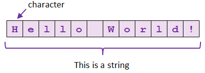
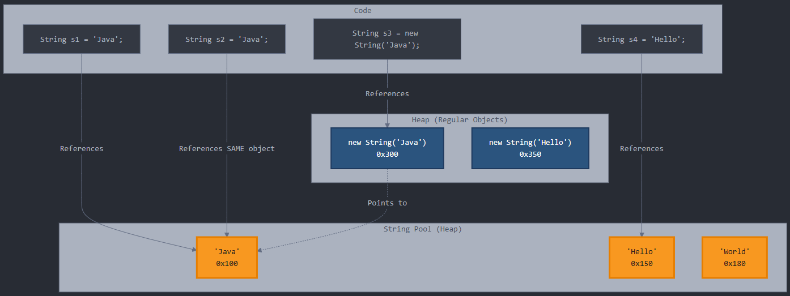
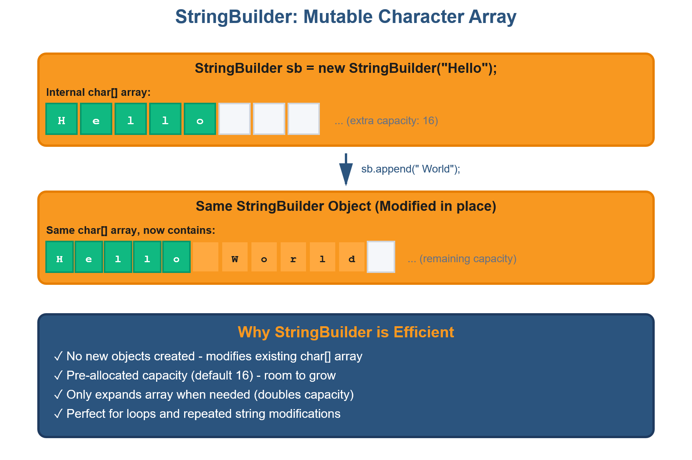

<!-- _class: lead -->
<!-- _paginate: false -->

<span class="kicker">// week 06 · strings · object-oriented computing</span>

# Java Strings

<!-- no-compile -->
```java
"Hello, World!"
```

---

## Agenda

- What is a String?
- Creating Strings
- String Immutability — the good and the bad
- String Pool & Memory
- StringBuilder — mutable strings
- String vs StringBuffer vs StringBuilder
- Performance Comparison
- Best Practices & Common Mistakes
- Summary & resources

---

## What is a String?

* A String is a sequence of characters representing text
* Strings are objects, not primitive types
* Part of java.lang package (imported automatically)
* Most commonly used class in Java programming
* Since Java 9, every character in a string is stored in an 8-bit byte array with an additional coder field to indicate the encoding.

```java
String str1 = "Hello";
String str2 = new String("Hello");
char[] charArray = {'J', 'a', 'v', 'a'};
String str3 = new String(charArray);
```

---

## Creating Strings

- There are several ways to create a String:

```java
// String literal (uses the String pool)
String s1 = "Hello";

// Using the new keyword
String s2 = new String("World");

// From a char array
char[] chars = {'J','a','v','a'};
String s3 = new String(chars);

// Concatenation
String s4 = "Hello" + " " + "World";

// From a StringBuilder
StringBuilder sb = new StringBuilder("Hi");
String s5 = sb.toString();
```

---

## String Immutability

* Once created, a String's value can not be changed
* Any modification creates a NEW String object
* Original String remains unchanged in memory


---

## String Immutability – Coding Example

- Output, in order: `Hello`, `HELLO`, `Hello`, `HELLO`

```java
String str = "Hello";
System.out.println(str);      // Prints "Hello"

System.out.println(str.toUpperCase()); // Returns new String and prints it

System.out.println(str);      // Still prints "Hello"

str = str.toUpperCase();     // Must reassign!
System.out.println(str);      // Now prints "HELLO"
// Original String will be garbage collected because it has no references.
```

---

## Why is String Immutability Good?

* Security: Prevents malicious code from modifying String values
* Thread Safety: Multiple threads can share Strings safely
* String Pool Optimization: Enables efficient memory usage
* HashCode Caching: Hash value computed once and reused
* Class Loading: Class names are Strings and must not change



---

## String Pool & Memory

* String Pool: Special memory area in heap for String literals
* String s1 = "Java"; // Stored in pool
* String s2 = "Java"; // Reuses same object from pool
* s1 == s2 returns true (same reference)
* String s3 = new String("Java"); // Creates new object in heap

> Note: `==` compares *references* (same object?), not text. To compare the actual characters, always use `.equals()` — more in Common Mistakes at the end.

---

## String Pool & Memory (continued)



---

## Why is String Immutability bad?

* String concatenation in loops creates many temporary objects
* Each + operation creates a new String object
* Memory intensive and slow for repeated modifications
* Example: Building a String in a loop of 1000 iterations
* Creates 1000 temporary String objects!

---

## Why is String Immutability bad? (continued)

<style scoped>
section pre { padding: 12px 16px; margin: 8px 0; }
</style>

**The Problem: String Immutability**

```java
String result = "";
for (int i = 0; i < 1000; i++) {
    result += "a";  // Creates 1000 NEW String objects!
}
// Memory: 1000 temporary objects created and discarded
```

**The Solution: StringBuilder's Mutability**

```java
StringBuilder result = new StringBuilder();
for (int i = 0; i < 1000; i++) {
    result.append("a");  // Modifies SAME object 1000 times
}
// Memory: 1 object reused
```

---

## StringBuilder: Mutable Strings

* StringBuilder provides MUTABLE character sequences
* Modifies the same object instead of creating new ones
* Much more efficient for string manipulation
* Introduced in Java 5 as faster alternative to StringBuffer

---

## StringBuilder: Mutable Strings (continued)

<style scoped>
section img { max-height: 500px; }
</style>



---

## Predict the Output

```java
String s = "hello";
s.toUpperCase();
System.out.println(s);

StringBuilder sb = new StringBuilder("hello");
sb.append(" world");
System.out.println(sb);
```

* `hello` — Strings are immutable; the upper-case copy was created and thrown away.
* `hello world` — StringBuilder mutates the same object in place.

---

## Why StringBuilder Was Created

* String and StringBuffer shipped together in Java 1.0 (1996): String immutable, StringBuffer mutable and synchronized — 90s Java valued "safe by default"
* Java 5 (2004) added StringBuilder: same API as StringBuffer, no synchronization overhead — most code is single-threaded and never needed it
* Solves String's slow-concatenation problem: loops, repeated modifications, building large strings
* In practice: use StringBuilder unless multiple threads share the object

```java
StringBuilder sb = new StringBuilder();
sb.append("Hello").append(" World");      // common case

StringBuffer safeSb = new StringBuffer(); // only if threads share it
```

---

## Key StringBuilder Methods

* append(): Add text to end
* insert(): Add text at specific position
* delete(): Remove characters from range
* reverse(): Reverse the character sequence
* toString(): Convert to String object

---

## Key StringBuilder Methods — in Action

<style scoped>
section pre { padding: 12px 16px; margin: 8px 0; }
section pre code { font-size: 17px; line-height: 1.3; }
</style>

```java
StringBuilder methods = new StringBuilder("Hello World");

// append()
methods.append(" - Welcome");
System.out.println("append: " + methods);

// insert()
methods.insert(5, " Java");
System.out.println("insert: " + methods);

// delete()
methods.delete(5, 10);
System.out.println("delete: " + methods);

// deleteCharAt()
methods.deleteCharAt(5);
System.out.println("deleteCharAt: " + methods);

// replace()
methods.replace(0, 5, "Greetings");
System.out.println("replace: " + methods);
```

---

## Key StringBuilder Methods — in Action (continued)

<style scoped>
section pre { padding: 12px 16px; margin: 8px 0; }
section pre code { font-size: 17px; line-height: 1.3; }
</style>

```java
// reverse()
StringBuilder toReverse = new StringBuilder("Java");
toReverse.reverse();
System.out.println("reverse: " + toReverse);

// setCharAt()
StringBuilder modify = new StringBuilder("Hello");
modify.setCharAt(0, 'h');
System.out.println("setCharAt: " + modify);

// substring() - returns String, doesn't modify
StringBuilder sub = new StringBuilder("Hello World");
String extracted = sub.substring(0, 5);
System.out.println("substring (returns String): " + extracted);
System.out.println("Original StringBuilder unchanged: " + sub);
```

---

<!-- _class: centered-table -->

## String vs StringBuffer vs StringBuilder

| Class | Introduced | Mutable? | Thread-safe? | Notes |
|---|---|---|---|---|
| `String` | Java 1.0 (1996) | No | Yes | Stored in the String pool |
| `StringBuilder` | Java 5 (2004) | Yes | No | Faster for modifications |
| `StringBuffer` | Java 1.0 (1996) | Yes | Yes (synchronized) | Slower |

- Use String for read-only text
- Use StringBuilder for frequent modifications
- Use StringBuffer when multiple threads share it

---

## Which to Use?

<style scoped>
section img { max-height: 500px; }
</style>


---

<!-- _class: centered-table -->

## Performance Comparison

| Metric | String | StringBuilder |
|---|---|---|
| Concatenating 10,000 strings in a loop | ~1000ms (very slow) | ~1ms (1000x faster!) |
| Memory usage | Creates thousands of temporary objects | Reuses same object with dynamic array |

---

## Best Practices

* Use String for simple, unchanging text
* Use StringBuilder for loops and repeated modifications
* Use StringBuffer only when thread safety is required
* Avoid string concatenation in loops (use StringBuilder)
* For simple concatenations, + operator is fine (compiler optimizes)

---

## Common Mistakes to Avoid

* Forgetting that Strings are immutable
* Using == to compare String values (use .equals() instead)
* String concatenation in loops without StringBuilder
* Not converting StringBuilder to String when needed
* Using StringBuffer when StringBuilder would suffice

```java
String s1 = new String("Hi");
String s2 = new String("Hi");
if (s1 == s2) { }        // false!

if (s1.equals(s2)) { }   // true
```

---

## Summary

- Strings are immutable objects — every "change" quietly creates a new String.
- Immutability buys safety and the String pool, but makes repeated concatenation slow.
- StringBuilder is the mutable fix: use it for loops and heavy editing, then `toString()`.
- StringBuffer is the thread-safe (slower) sibling — only when threads share the object.
- Compare String *content* with `.equals()`, never `==`.

---

## Resources

- Oracle Java Tutorials — Strings: https://docs.oracle.com/javase/tutorial/java/data/strings.html
- W3Schools Java Strings: https://www.w3schools.com/java/java_strings.asp
- https://claude.ai/new?q=Give%20me%20an%20introductory%20overview%20of%20Java%20Strings%20and%20StringBuilder%20with%20clear%20examples%20suitable%20for%20beginner%20students
