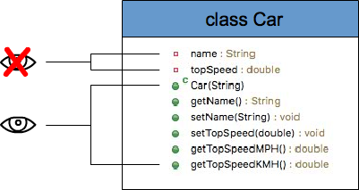

<!-- _class: lead -->
<!-- _paginate: false -->

<span class="kicker">// week 07 · encapsulation · object-oriented computing</span>

# Encapsulation

---

## Agenda

- Why learn encapsulation
- Definition & OOP context
- Access modifiers (private, default, protected, public)
- Implementing encapsulation (private fields, getters & setters)
- Getters & setters: purpose + examples
- Validation via setters (e.g., username length)
- Coding example: BankAccount
- Benefits: protection, flexibility, maintainability
- Wrap-up & resources

---

## Why are we learning about Encapsulation


---

## Encapsulation Definition

- English meaning of encapsulation
  - To encase in, as if in a capsule
- Encapsulation meaning in OOP:
  - Encapsulation in Java refers to the bundling of data (aka fields or instance variables) and methods that operate on that data (AKA Getters and Setters) within a single unit (a class), while restricting direct access to some of the object's components.
  - In Encapsulation, the instance variables of a class are hidden (i.e., made private) from other classes and can only be accessed through the methods of their own class.
  - Data hiding is the practice of making fields private to prevent direct external access — a key aspect of encapsulation.

---

## Encapsulation Definition

A class is a capsule: private data on one side, the methods that operate on it on the other — bundled together as a single unit.


---

<!-- _class: centered-table -->

## Access Modifiers

- Encapsulation is the principle of hiding internal implementation details and exposing only what is necessary through a controlled interface.
- Access modifiers are the keywords Java gives you to enforce that principle — associated with each member to define which parts of the program can access it directly.
- In Java, there are 3 types of access modifier and 4 levels of access:

| Modifier | Class | Package | Subclass (other package) | World |
|---|---|---|---|---|
| `private` | Y | N | N | N |
| *(default)* | Y | Y | N | N |
| `protected` | Y | Y | Y | N |
| `public` | Y | Y | Y | Y |

- *(default)* means no modifier keyword is written at all. Source: https://www.javatpoint.com/access-modifiers


---

## How to Implement Encapsulation

- Declare instance variables private.
- Provide a public getter and setter method for each private instance variable.
```java
public class Student {
    // Private instance variable
    private String email;

    // Getter method
    public String getEmail() {
        return email;
    }

    // Setter method
    public void setEmail(String email) {
        this.email = email;
    }
}
```

---

## Getters and Setters

- Getter methods are used to "get" (i.e., retrieve) the current value of a private instance variable — sometimes called accessor methods.
- Setter methods are used to "set" (i.e., update) the value of a private instance variable — sometimes called mutator methods.
- It is a common convention to name these methods after the corresponding field, prefixed with `get` or `set`.

---

## Getters and Setters

```java
class Car {
    private int speed; // member field speed

    // Setter method to set the speed of the car
    public void setSpeed(int x) {
        speed = x;
    }

    // Getter method to get the speed of the car
    public int getSpeed() {
        return speed;
    }
}

class Main {
    public static void main(String[] args) {
        Car car = new Car();
        car.setSpeed(100); // calling the setter method
        // calling the getter method
        System.out.println(car.getSpeed());
    }
}
```

---

## Why use Getters and Setter Methods?

- You may have concluded that we could just change the private fields of the class definition to be public and achieve the same results.
- However, hiding the instance variables of an object (i.e., making them private) and using public methods to access them allows us to:
  - Change how the data is handled behind the scenes.
  - Impose validation on the values that the instance variables are being set to.

---

## Why use Getters and Setter Methods?

- Let us say we decide to modify how we store middle names in the person class. Instead of just one String we want to use an array of Strings.
- The implementation inside the class has changed but the outside world is not affected. The way the methods are called remains the same.
```java
public class Person {
    // Private instance variable
    private String middleNames;

    public String getMiddleNames() {
        return middleNames;
    }

    public void setMiddleNames(String middleNames) {
        this.middleNames = middleNames;
    }
}
```

---

## Why use Getters and Setter Methods?

<style scoped>
section pre { padding: 12px 18px; margin: 8px 0; }
section pre code { font-size: 18px; line-height: 1.3; }
</style>

- Internally, `middleNames` becomes a `String[]` — the getter/setter signatures don't change:
```java
public class Person {
    // Private instance variable - array to store multiple middle names
    // Encapsulation: data is hidden from direct external access
    private String[] middleNames;

    /**
     * Getter method to retrieve all middle names as a single String
     * Demonstrates encapsulation: controlled access to private data
     * @return String containing all middle names separated by spaces
     */
    public String getMiddleNames() {
        // Check if array is null or empty to avoid NullPointerException
        if (middleNames == null || middleNames.length == 0) {
            return "";
        }
        // Use String.join() to combine array elements with spaces
        // More efficient and cleaner than StringBuffer for this purpose
        return String.join(" ", middleNames);
    }
}
```

---

## Why use Getters and Setter Methods?

<style scoped>
section pre { padding: 12px 18px; margin: 8px 0; }
section pre code { font-size: 18px; line-height: 1.3; }
</style>

- The matching setter validates the input and rebuilds the array:
```java
public class Person {
    private String[] middleNames;

    /**
     * Setter method to set middle names from a String input
     * Demonstrates encapsulation: controlled modification of private data
     * The setter transforms the input (String) into internal format (array)
     * @param middleNames String containing middle names separated by spaces
     */
    public void setMiddleNames(String middleNames) {
        // Validate input: check for null or empty string
        if (middleNames == null || middleNames.trim().isEmpty()) {
            // If invalid, set to empty array rather than leaving null
            this.middleNames = new String[0];
        } else {
            // Split the string into an array using whitespace as delimiter
            // trim() removes leading/trailing spaces
            // \\s+ splits on one or more whitespace characters (handles multiple spaces)
            this.middleNames = middleNames.trim().split("\\s+");
        }
    }
}
```

---

<style scoped>section pre code { font-size: 18px; } section pre { padding: 14px 18px; }</style>

## Why use Getters and Setter Methods?

- Let us say Person class objects can only accept usernames that have a maximum of ten characters.
- We can add validation in the setUsername setter method to make sure the username conforms to this requirement.
- If the username passed to the setUsername() setter method is longer than ten characters, it is automatically truncated (e.g. the output below is `theRedRhin`)

---

<style scoped>section pre code { font-size: 19px; } section pre { padding: 14px 18px; }</style>

## Why use Getters and Setter Methods? (continued)

```java
public class Person {
    // Private instance variable
    private String username;

    public String getUsername() {
        return username;
    }

    public void setUsername(String username) {
        if (username.length() > 10) {
            this.username = username.substring(0, 10);
        } else {
            this.username = username;
        }
    }
}
```

---

## Why use Getters and Setter Methods?

- Calling code sees only the public `getUsername()`/`setUsername(String)` interface — truncation happens invisibly inside the setter:

<!-- no-compile -->
```java
// Person class defined on the previous slide — this fence is a continuation, not standalone
public class Main {
    public static void main(String[] args) {
        Person perObj1 = new Person();
        perObj1.setUsername("theRedRhino"); // 11 characters in username
        System.out.println(perObj1.getUsername());
    }
}
```

---

## Encapsulation Visualised



---

## Coding Example

- Private Data: The accountHolder and balance are private, ensuring controlled access.
- Constructor: Initializes a new bank account object.
- Getters: Allow for reading the account holder's name and the current balance.
- Transaction Methods: The deposit() and withdraw() methods encapsulate the logic of transactions while enforcing basic rules (preventing negative deposits and overdrafts).

---

## Coding Example

```java
public class BankAccount {
    private String accountHolder;
    private double balance;

    // Constructor
    public BankAccount(String accountHolder, double initialBalance) {
        this.accountHolder = accountHolder;
        this.balance = initialBalance;
    }

    // Getters
    public String getAccountHolder() {
        return accountHolder;
    }

    public double getBalance() {
        return balance;
    }

    // Methods for transactions (with basic safeguards)
    public void deposit(double amount) {
        if (amount > 0) {
            balance += amount;
        }
    }

    public void withdraw(double amount) {
        if (amount > 0 && amount <= balance) {
            balance -= amount;
        }
    }
}
```

---

## Benefits of Encapsulation

- Data Protection (Validation & Security):
  - Getters and setters allow you to validate data before it's modified, preventing invalid or harmful changes to the object's internal state.
  - Example: Ensuring a PIN is 4 digits, or a balance is never negative.
- Flexibility (Implementation Independence):
  - You can change the internal implementation of a class without breaking external code, as long as the public interface (the methods) remains the same.
  - Example: Changing middleNames from an array to an ArrayList internally—external code still works.
- Code Maintainability:
  - Encapsulation promotes organised, modular code that is easier to understand and maintain.
  - Changes are localised to the class, reducing ripple effects throughout the codebase.

---

## End note

- Core Concept: Encapsulation is a fundamental principle in object-oriented programming (OOP). It involves bundling data (instance variables) and the code that operates on that data (methods) together into a single unit, such as a class.
- Controlling Access: Access control mechanisms (like private, public, and protected) are central to encapsulation. By making instance variables private, you prevent direct access to them from outside the class. This forces interaction through the provided methods (getters and setters).

---

## Resources

- https://claude.ai/new?q=Give%20me%20an%20introductory%20overview%20of%20encapsulation%20in%20Java%20with%20clear%20examples%20and%20explanations%20suitable%20for%20beginner%20students
- https://chat.openai.com/?q=Explain+encapsulation+in+Java+for+beginners+in+a+study+mode

