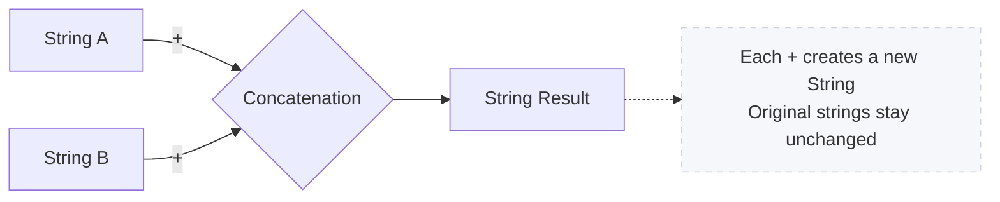
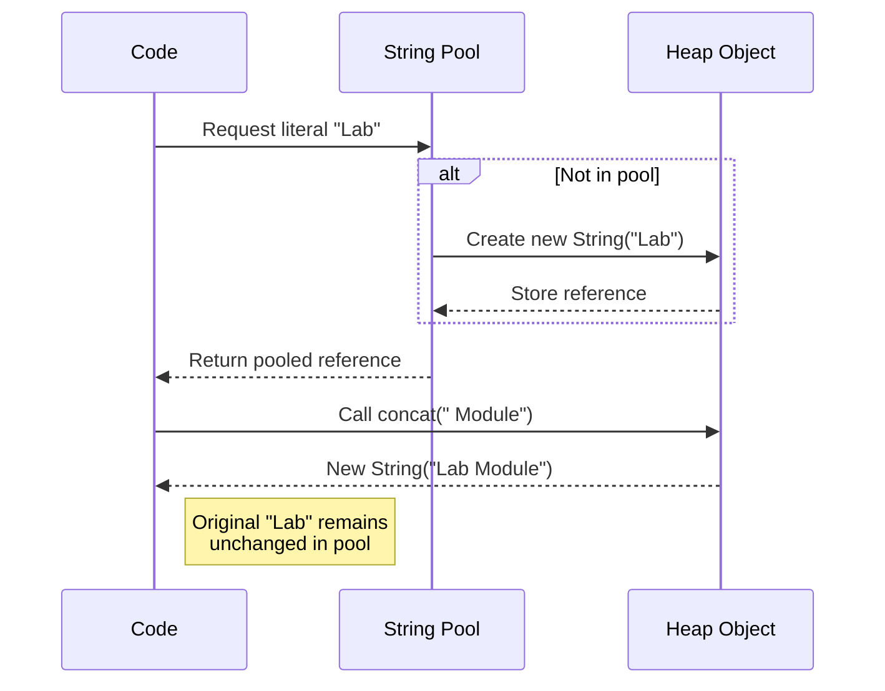
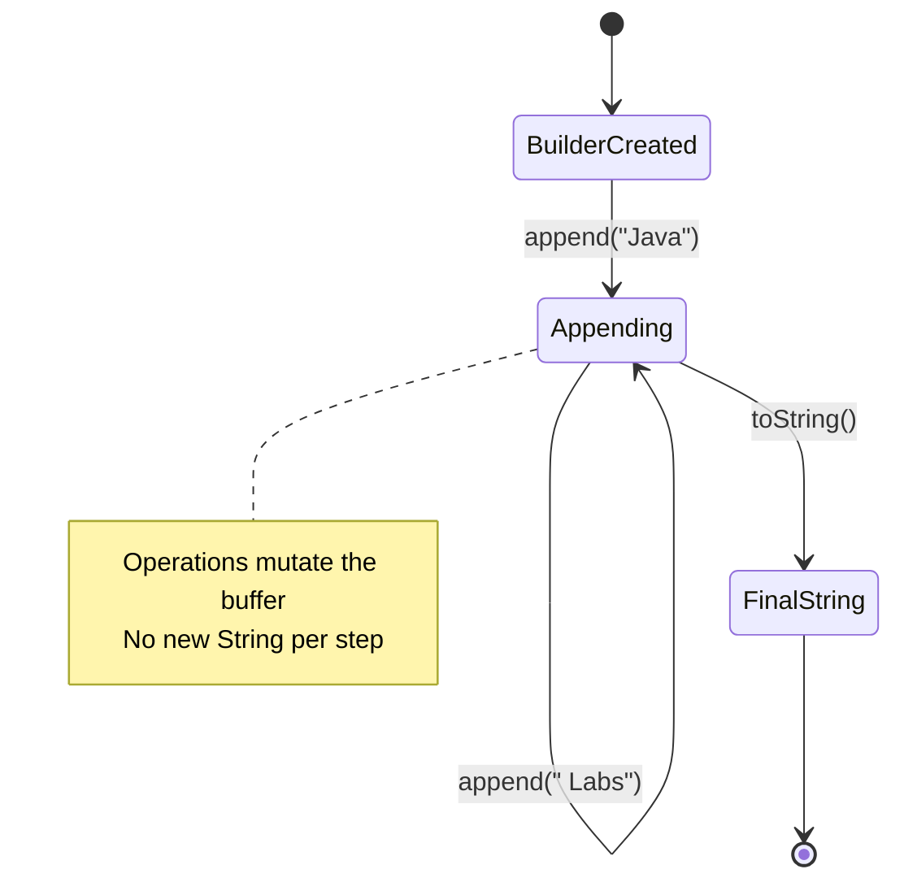
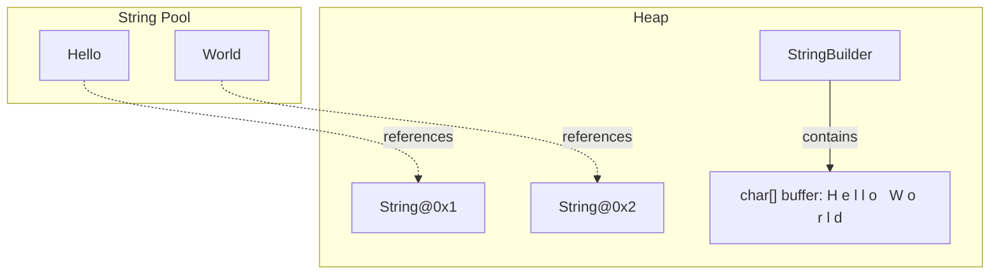

# Week 7 Lab — Java Strings

> **GitHub Classroom assignment:** REDACTED
> **Starter repo (canonical instructions):** https://github.com/DanielCreggOrganization/ooc-lab-strings-template
> **Worked solutions:** https://github.com/danielcregg/REDACTED
>
> The section below is a synced snapshot of the starter repo's README —
> the instructions students receive. If you edit it here, push the same
> change to the starter repo.

---

# Java Strings Lab

## Agenda

1. [Introduction](#1-introduction)
2. [Creating and Inspecting Strings](#2-creating-and-inspecting-strings)
3. [Concatenation and Formatting](#3-concatenation-and-formatting)
4. [Comparing Strings](#4-comparing-strings)
5. [Immutability and the String Pool](#5-immutability-and-the-string-pool)
6. [Working with StringBuilder](#6-working-with-stringbuilder)
7. [Common String Methods](#7-common-string-methods)
8. [Strings in Memory](#8-strings-in-memory)
9. [Common Mistakes and Debugging](#9-common-mistakes-and-debugging)
10. [Summary and Further Reading](#10-summary-and-further-reading)

---

## 1. Introduction

### Explanation

Strings are sequences of characters that power almost every Java application. From user input and configuration to network communication and file handling, mastering strings is essential. Java represents strings with the `String` class, which provides a rich set of built-in capabilities for creating, transforming, and inspecting textual data.

**Why Focus on Strings?**

* **Universal:** Text is everywhere—log messages, prompts, file formats, and user interfaces.
* **Feature-Rich API:** `String` offers dozens of methods for searching, replacing, slicing, formatting, and more.
* **Immutable by Design:** Java strings cannot change once created, a feature that simplifies reasoning but affects performance.
* **Interoperability:** Strings integrate seamlessly with Java's standard library, including collections, streams, and I/O.

**Key Concepts:**

* **String Literal:** Characters enclosed in double quotes, e.g., `"Hello"`.
* **String Object:** An instance of the `String` class; may be created with literals or with `new`.
* **Immutability:** String contents never change; method calls return new objects instead.
* **String Pool:** A JVM-managed cache for literal strings that saves memory.

### DIY Coding Task

**Objective:** Prepare your environment and experiment with basic strings.

**Task:**

1. Open the `Main` class in the `ie.atu.strings` package.
2. In the `main` method, declare three string variables using literals.
3. Print them to confirm everything compiles.

---

## 2. Creating and Inspecting Strings

### Explanation

Strings can be created with literals or constructors. Once created, you can query information about them.

```java
String literalGreeting = "Welcome to Java Strings"; // literal, lives in the string pool
String constructedGreeting = new String("Welcome to Java Strings"); // forces new object
```

**Inspection Methods:**

* `length()` – counts characters.
* `charAt(int index)` – retrieves a single character.
* `isEmpty()` / `isBlank()` – checks for empty or whitespace-only strings (Java 11+).
* `toUpperCase()` / `toLowerCase()` – returns uppercase or lowercase versions.

### Example

```java
package ie.atu.strings;

public class StringInspector {
	public static void main(String[] args) {
		String message = "Java Strings Lab";
		System.out.println("Message: " + message);
		System.out.println("Length: " + message.length());
		System.out.println("First char: " + message.charAt(0));
		System.out.println("Uppercase: " + message.toUpperCase());
		System.out.println("Lowercase: " + message.toLowerCase());
		System.out.println("Is empty? " + message.isEmpty());
	}
}
```

### DIY Coding Task

**Objective:** Practice constructing strings and accessing their metadata.

**Task:**

1. In the `Main` class `main` method, create three test strings:
   * Declare a String variable called `normal` with the value `"Learning Java"`.
   * Declare a String variable called `empty` with the value `""`.
   * Declare a String variable called `whitespace` with the value `"   "`.
2. For each string, test the inspection methods:
   * Use `length()` to get the number of characters and print it.
   * Use an if statement to check if the string is empty. If not empty, use `charAt(0)` to get the first character and `charAt(length-1)` to get the last character.
   * If empty, print `"(none)"` for first and last.
   * Use `trim().isEmpty()` to check if the string is blank (or `isBlank()` if on Java 11+) and print the result.

**Sample Output:**
```
Input: "Learning Java"
Length: 13
First: L
Last: a
Blank? false

Input: ""
Length: 0
First: (none)
Last: (none)
Blank? true

Input: "   "
Length: 3
First:  
Last:  
Blank? true
```

---

## 3. Concatenation and Formatting

### Explanation

Combining strings is a common task. Java supports several approaches:

* **Concatenation Operator (`+`):** Simple but creates multiple objects due to immutability.
* **`concat()` Method:** Equivalent to `+` for straightforward joins.
* **`String.format()` / `printf()`:** Allows templates with placeholders.
* **`String.join()` and `String.join(System.lineSeparator(), ...)`:** Ideal for joining collections or arrays.

```java
String title = "Java";
String topic = "Strings";
String combined = title + " " + topic; // "Java Strings"
String templated = String.format("%s Lab - %d modules", title, 10);
```

### Mermaid Diagram: Concatenation Flow



### DIY Coding Task

**Objective:** Experiment with multiple concatenation strategies.

**Task:**

1. In the `Main` class `main` method, test different concatenation approaches:
   * **Using + operator:** Create two String variables `title` with value `"Java"` and `topic` with value `"Strings"`. Use the `+` operator to concatenate them with a space in between and display the result.
   * **Using String.format():** Create three variables: `name` (String), `age` (int), and `course` (String). Use `String.format("Name: %s, Age: %d, Course: %s", name, age, course)` to create a formatted sentence and print it.
   * **Using String.join():** Create a String array with the words `{"Java", "Strings", "are", "powerful"}`. Use `String.join(" ", array)` to join them with spaces and print the result.
2. Add a comment describing when you would avoid the `+` operator inside loops.

**Sample Output:**
```
Using + : Java + Strings + Lab = Java Strings Lab
Formatted: Name: Ade, Age: 21, Course: OOP
Joined: Java Strings are powerful
```

---

## 4. Comparing Strings

### Explanation

String comparisons must use methods, not `==`, which only checks whether references point to the same object.

* `equals(Object obj)` – case-sensitive equality.
* `equalsIgnoreCase(String other)` – case-insensitive equality.
* `compareTo(String other)` – lexicographic comparison (negative, zero, positive).
* `regionMatches(...)` – compare substrings.

```java
String expected = "SUCCESS";
String actual = "success";
System.out.println(expected.equals(actual));          // false
System.out.println(expected.equalsIgnoreCase(actual)); // true
```

### DIY Coding Task

**Objective:** Practice comparing strings safely.

**Task:**

1. In the `Main` class `main` method, test string comparisons:
   * Create two String variables `str1` and `str2` both with the value `"Java"`. Use `equals()` to compare them and print the result.
   * Create two String variables `str3` with value `"Java"` and `str4` with value `"java"`. Use `equalsIgnoreCase()` to compare them and print the result.
   * Create two String variables `str5` with value `"Java"` and `str6` with value `"Kotlin"`. Use `compareTo()` to compare them alphabetically and print the result (negative means str5 comes before str6).
   * Create a String variable `str7` and assign it `null`. Before calling any string method on it, add an if statement to check `if (str7 != null)` to avoid NullPointerException.

**Sample Output:**
```
Equal? true
Equal ignore case? true
Order (Java vs Kotlin): -1
Null-safe comparison passed.
```

---

## 5. Immutability and the String Pool

### Explanation

Strings are immutable—once created, their value cannot change. Any method that appears to modify a string actually returns a new instance.

**Benefits:**

* Thread-safety without extra synchronization.
* Security for values like configuration keys or user names.
* Caching via the **string pool**, which stores literal strings for reuse.

**Implications:**

* Frequent changes create many short-lived objects.
* Use builders for heavy modifications or loops.

```java
String original = "Java";
String modified = original + " Strings"; // original stays "Java"
```

### Mermaid Diagram: String Pool and Immutability



### DIY Coding Task

**Objective:** See immutability in action and contrast with StringBuilder's mutability.

**Task:**

1. In the `Main` class `main` method:
   * **Test String immutability:** Create a String variable `original` with value `"Hello"`. Print its identity hash code using `System.identityHashCode(original)`. Now concatenate it: `original = original + " World"`. Print the new identity hash code and compare - they should be different, proving a new object was created.
   * **Test String pool:** Create two String variables using literals: `String pooled1 = "Lab"` and `String pooled2 = "Lab"`. Compare them with `==` and print the result (should be true - same object in pool).
   * **Test intern():** Create a String using constructor: `String constructed = new String("Lab")`. Compare it with `pooled1` using `==` (should be false). Now call `constructed.intern()` and compare again with `pooled1` using `==` (should be true).
   * **Compare with StringBuilder:** Create a StringBuilder with value `"Hello"`. Print its identity hash code. Use `append(" World")` to modify it. Print the identity hash code again - it should be the same, proving the same object was modified.
2. Add comments explaining why repeated `+` concatenations hurt performance (each creates a new object).

### (Optional) Fun Method to Implement: `compareStringAndBuilder()`

**Objective:** Directly compare immutable String behavior with mutable StringBuilder behavior.

```java
public void compareStringAndBuilder() {
	System.out.println("\n=== String vs StringBuilder Identity Test ===\n");
	
	// String - immutable: modification creates NEW object
	String str = "Hello";
	System.out.println("String before: " + str);
	int stringHash1 = System.identityHashCode(str);
	System.out.println("String identity hash: " + stringHash1);
	
	str = str + " World";  // Creates NEW String object
	System.out.println("String after concat: " + str);
	int stringHash2 = System.identityHashCode(str);
	System.out.println("String identity hash: " + stringHash2);
	System.out.println("String hashes differ? " + (stringHash1 != stringHash2));
	System.out.println("Conclusion: String created NEW object on modification\n");
	
	// StringBuilder - mutable: modification changes SAME object
	StringBuilder sb = new StringBuilder("Hello");
	System.out.println("StringBuilder before: " + sb);
	int sbHash1 = System.identityHashCode(sb);
	System.out.println("StringBuilder identity hash: " + sbHash1);
	
	sb.append(" World");  // Modifies SAME object
	System.out.println("StringBuilder after append: " + sb);
	int sbHash2 = System.identityHashCode(sb);
	System.out.println("StringBuilder identity hash: " + sbHash2);
	System.out.println("StringBuilder hashes same? " + (sbHash1 == sbHash2));
	System.out.println("Conclusion: StringBuilder modified SAME object\n");
	
	// Summary
	System.out.println("KEY INSIGHT:");
	System.out.println("- String: Every modification = NEW object (inefficient for loops)");
	System.out.println("- StringBuilder: Modifications reuse SAME object (efficient for loops)");
}
```

**Sample Output:**
```
=== String vs StringBuilder Identity Test ===

String before: Hello
String identity hash: 366712642
String after concat: Hello World
String identity hash: 1829164700
String hashes differ? true
Conclusion: String created NEW object on modification

StringBuilder before: Hello
StringBuilder identity hash: 1580066828
StringBuilder after append: Hello World
StringBuilder identity hash: 1580066828
StringBuilder hashes same? true
Conclusion: StringBuilder modified SAME object

KEY INSIGHT:
- String: Every modification = NEW object (inefficient for loops)
- StringBuilder: Modifications reuse SAME object (efficient for loops)

Original hash: 366712642
After concat hash: 1829164700
Same reference? false
Literal A == Literal B? true
Constructed == Literal? false
Constructed.intern() == Literal? true
```

**Why This Matters:**
- **SEE** the difference directly with hash codes
- Makes abstract concept concrete
- Perfect setup for why StringBuilder exists
- Explains performance difference before measuring it

---

## 6. Working with StringBuilder

### Explanation

`StringBuilder` provides a mutable sequence of characters, ideal for repeated modifications. Unlike strings, builders modify their internal buffer instead of creating new objects.

**Key Methods:**

* `append(...)` – add text or values.
* `insert(int offset, String str)` – insert at position.
* `delete(int start, int end)` – remove a range.
* `reverse()` – reverse contents.
* `toString()` – produce an immutable `String` snapshot.

```java
StringBuilder sb = new StringBuilder("Java");
sb.append(" ").append("Strings");
String result = sb.toString();
```

### Mermaid Diagram: Builder Workflow



### DIY Coding Task

**Objective:** Gain hands-on experience with `StringBuilder` and **measure actual performance differences**.

**Task:**

1. In the `Main` class `main` method:
   * **Build a menu:** Create a StringBuilder. Use a for loop (1 to 3) to append numbered menu items like `"1. Start\n"`, `"2. Settings\n"`, `"3. Exit\n"`. Convert to String with `toString()` and print.
   * **Reverse words:** Create a String `sentence = "learn to love strings"`. Use `split(" ")` to get a String array of words. Create a StringBuilder and use a reverse for loop to append words from end to start. Print the result.
   * **Build a report:** Create a StringBuilder. Append a title like `"Report\n"`, then use `"=".repeat(title.length())` for underline, then append bullet points in a loop. Print the result.
   * **Performance test:** Record start time with `long start = System.nanoTime()`. Use a for loop (10,000 iterations) to concatenate with `+`. Record end time and calculate duration. Repeat with StringBuilder using `append()`. Compare and print the time difference.
2. Add comments summarizing which approach is faster and by how much.

### NEW Method to Implement: `measurePerformance()`

**Objective:** Prove StringBuilder's performance advantage with real measurements.

```java
public void measurePerformance() {
	System.out.println("\n=== Performance Comparison: String vs StringBuilder ===\n");
	
	int iterations = 10000;
	System.out.println("Task: Concatenate 'a' " + iterations + " times\n");
	
	// Test 1: String concatenation (INEFFICIENT)
	long startTime = System.nanoTime();
	String result = "";
	for (int i = 0; i < iterations; i++) {
		result += "a";  // Creates NEW String object each time!
	}
	long stringTime = (System.nanoTime() - startTime) / 1_000_000; // Convert to milliseconds
	
	System.out.println("String Concatenation Results:");
	System.out.println("  Final length: " + result.length());
	System.out.println("  Time taken: " + stringTime + " ms");
	System.out.println("  Objects created: ~" + iterations + " temporary String objects");
	System.out.println("  Memory impact: HIGH - many short-lived objects");
	
	// Test 2: StringBuilder (EFFICIENT)
	startTime = System.nanoTime();
	StringBuilder builder = new StringBuilder();
	for (int i = 0; i < iterations; i++) {
		builder.append("a");  // Modifies SAME object each time!
	}
	String builderResult = builder.toString();
	long builderTime = (System.nanoTime() - startTime) / 1_000_000;
	
	System.out.println("\nStringBuilder Results:");
	System.out.println("  Final length: " + builderResult.length());
	System.out.println("  Time taken: " + builderTime + " ms");
	System.out.println("  Objects created: 1 StringBuilder (reused)");
	System.out.println("  Memory impact: LOW - single object modified");
	
	// Calculate speedup
	System.out.println("\n=== COMPARISON ===");
	if (builderTime > 0) {
		long speedup = stringTime / builderTime;
		System.out.println("StringBuilder is ~" + speedup + "x FASTER than String concatenation!");
	} else {
		System.out.println("StringBuilder was too fast to measure accurately (< 1ms)");
		System.out.println("String took: " + stringTime + " ms");
	}
	
	System.out.println("\nKEY TAKEAWAY:");
	System.out.println("✅ Use StringBuilder for loops and repeated modifications");
	System.out.println("✅ Use String for simple, one-time concatenations");
	System.out.println("❌ NEVER use String concatenation (+) inside loops!");
}
```

**Sample Output:**
```
=== Performance Comparison: String vs StringBuilder ===

Task: Concatenate 'a' 10000 times

String Concatenation Results:
  Final length: 10000
  Time taken: 1247 ms
  Objects created: ~10000 temporary String objects
  Memory impact: HIGH - many short-lived objects

StringBuilder Results:
  Final length: 10000
  Time taken: 1 ms
  Objects created: 1 StringBuilder (reused)
  Memory impact: LOW - single object modified

=== COMPARISON ===
StringBuilder is ~1247x FASTER than String concatenation!

KEY TAKEAWAY:
✅ Use StringBuilder for loops and repeated modifications
✅ Use String for simple, one-time concatenations
❌ NEVER use String concatenation (+) inside loops!

Menu:
1. Start
2. Settings
3. Exit

Reverse: "learn to love strings"
```

**Why This Addition Matters:**
- Students **MEASURE** real performance differences (not just theory)
- Concrete numbers make the point undeniable (~1000x speedup!)
- Shows memory impact, not just speed
- Provides clear recommendations (✅/❌)
- Reinforces Section 5's immutability concept

### Extension Challenge (Optional)

Try different iteration counts and graph the results:
- 100 iterations
- 1,000 iterations
- 10,000 iterations
- 50,000 iterations

Create a table showing how the performance gap grows!

---

## 7. Common String Methods

### Explanation

Java's `String` class provides diverse utility methods. Understanding their behavior prevents bugs and makes your code concise.

**Categories:**

* **Searching:** `contains`, `indexOf`, `lastIndexOf`.
* **Slicing:** `substring`, `subSequence`.
* **Replacement:** `replace`, `replaceAll`, `replaceFirst`.
* **Trimming:** `trim`, `strip`, `stripIndent` (Java 15+).
* **Splitting:** `split(String regex)`.

### Example

```java
String logEntry = "INFO: Connected at 10:45";
boolean containsTime = logEntry.contains("10:45");
String level = logEntry.substring(0, logEntry.indexOf(':'));
String replaced = logEntry.replace("INFO", "DEBUG");
String[] parts = logEntry.split(": ");
```

### DIY Coding Task

**Objective:** Collect and practice essential methods.

**Task:**

1. In the `Main` class `main` method:
   * **Case-insensitive search:** Create a String `text = "Java is a powerful programming language"` and `keyword = "POWERFUL"`. Convert both to lowercase with `toLowerCase()` and use `contains()` to check if text contains the keyword. Print the result.
   * **Extract initials:** Create a String `fullName = "John Doe"`. Use `split(" ")` to get an array of names. Loop through the array, use `charAt(0)` to get the first character of each name, and build the initials (e.g., "J.D."). Print the result.
   * **Mask email:** Create a String `email = "john@example.com"`. Use `indexOf('@')` to find the @ position. Use `substring(0, atIndex)` to get the local part and `substring(atIndex)` to get the domain. Build a masked version: keep first character, replace others with '*', then append the domain. Print the result.
   * **Parse CSV:** Create a String `csv = "Java, Strings, Lab"`. Use `split(",")` to split by comma into an array. Loop through the array and use `trim()` on each element to remove spaces. Print the trimmed array.

**Sample Output:**
```
Contains keyword? true
Initials: J.D.
Masked email: j****@example.com
CSV parts: ["Java", "Strings", "Lab"]
```

---

## 8. Strings in Memory

### Explanation

Visualizing how strings occupy memory clarifies why immutability matters and when to pick `StringBuilder` over repeated concatenation.

**Memory Highlights:**

* Literals go into the string pool during class loading.
* Constructors (`new String`) create distinct heap objects, even if content matches a literal.
* Builders manage an internal `char[]` buffer that grows as needed.

### Memory Layout Diagram



### DIY Coding Task

**Objective:** Observe how JVM handles string memory.

**Task:**

1. In the `Main` class `main` method:
   * **Test string pool:** Create two string literals: `String lit1 = "Hello"` and `String lit2 = "Hello"`. Print their identity hash codes with `System.identityHashCode()`. They should be the same because they share the pooled object.
   * **Test heap strings:** Create two strings with constructors: `String heap1 = new String("Hello")` and `String heap2 = new String("Hello")`. Print their identity hashes. They should be different because each creates a new heap object.
   * **Test intern():** Create `String heap3 = new String("World")` and `String lit3 = "World"`. Compare them with `==` (should be false). Now assign `heap3 = heap3.intern()` and compare with `==` again (should be true).
   * **Test StringBuilder capacity:** Create a StringBuilder with `new StringBuilder()`. Print its initial capacity with `capacity()`. Append 50 characters in a loop. Print capacity again to see how it grows automatically.
2. Add comments documenting your observations about the string pool and memory allocation.

**Sample Output:**
```
Literal hash: 11258999
Constructed hash: 99887766
After intern equals literal? true
Builder capacity: 64
```

---

## 9. Common Mistakes and Debugging

### Explanation

Awareness of frequent pitfalls helps you debug faster and write robust string code.

**1. Using `==` Instead of `equals`**

```java
String input = new String("YES");
System.out.println(input == "YES");    // false
System.out.println(input.equals("YES")); // true
```

**2. Ignoring Immutability in Loops**

```java
String result = "";
for (int i = 0; i < 1000; i++) {
	result += i; // inefficient; creates 1000+ objects
}
```

**3. Forgetting Null Checks**

```java
String value = null;
if (value != null && value.contains("ok")) {
	System.out.println("Contains ok");
}
```

**4. Misusing Regex in `replaceAll`**

`replaceAll` treats the first argument as a regular expression. Use `replace` for literal replacements.

**5. Off-by-One Errors with `substring`**

Remember: `substring(start, end)` includes `start` but excludes `end`.

### Debugging Tips

* Log intermediate strings with context labels.
* Print identity hash codes to confirm whether objects change.
* Use your IDE debugger to inspect string values step by step.
* Consider third-party tools or profilers to detect excessive allocations.

### DIY Coding Task

**Objective:** Identify and correct common mistakes.

**Task:**

Fix the 10 labeled issues in the following class:

```java
package ie.atu.strings;

public class BuggyStrings {

	// Error 1: Using == for content comparison
	public boolean isYes(String input) {
		return input == "YES";
	}

	// Error 2: Potential NullPointerException
	public boolean hasKeyword(String text, String keyword) {
		return text.contains(keyword.toLowerCase());
	}

	// Error 3: Inefficient concatenation in loop
	public String joinNumbers(int limit) {
		String numbers = "";
		for (int i = 0; i <= limit; i++) {
			numbers += i + ",";
		}
		return numbers;
	}

	// Error 4: Off-by-one substring
	public String firstThree(String input) {
		return input.substring(0, 3 + 1);
	}

	// Error 5: Regex misuse
	public String removeDots(String version) {
		return version.replaceAll(".", "");
	}

	// Error 6: Ignoring immutability result
	public void trimInput(StringBuilder builder) {
		builder.toString().trim();
	}

	// Error 7: Modifying shared literal
	public String appendExclamation(String input) {
		input.concat("!");
		return input;
	}

	// Error 8: Unsafe charAt
	public char firstLetter(String text) {
		return text.charAt(0);
	}

	// Error 9: Unbounded split
	public String[] splitCsv(String csv) {
		return csv.split(",");
	}

	// Error 10: Ignoring uppercase logic
	public String shout(String text) {
		text.toUpperCase();
		return text;
	}
}
```

**Your Task:**

1. In the `Main` class `main` method, test and fix each buggy scenario:
   * **String comparison:** Create `String input = new String("YES")`. Try comparing with `==` to `"YES"` (returns false). Fix by using `equals()` instead.
   * **Null safety:** Create `String text = null`. Try calling `text.contains("test")` (throws exception). Fix by adding `if (text != null)` check before the method call.
   * **Loop concatenation:** Create an empty String. Use a for loop to concatenate 100 numbers with `+=` (slow). Fix by using StringBuilder with `append()` instead.
   * **Substring bounds:** Create `String str = "Java"`. Try `str.substring(0, 4)` to get first 4 chars (works, but try `str.substring(0, 5)` and it throws exception). Remember: end index is exclusive.
   * **Replace vs replaceAll:** Create `String version = "1.2.3"`. Try `version.replaceAll(".", "-")` (removes everything because `.` is regex). Fix by using `replace()` for literal replacement.
2. Add comments explaining each fix and why the original code failed.

**Expected Result:**
```
Your updated class compiles and all sample scenarios behave correctly.
```

---

## 10. Summary and Further Reading

This lab guided you through essential string concepts:

* Declaring, inspecting, and transforming strings.
* Comparing strings safely and handling nulls.
* Understanding immutability and the string pool.
* **NEW:** Comparing String immutability with StringBuilder mutability using identity hash codes.
* Leveraging `StringBuilder` for efficient modifications.
* **NEW:** Measuring actual performance differences between String and StringBuilder.
* Applying core string methods for real-world tasks.

### Key Takeaways

✅ Strings are immutable; every change creates a new object.

✅ **NEW:** Identity hash codes prove String creates new objects vs StringBuilder reusing the same object.

✅ Avoid `==` for string comparisons—use `equals` or `equalsIgnoreCase`.

✅ `StringBuilder` is the go-to for repeated concatenation or heavy editing.

✅ **NEW:** Performance measurements show StringBuilder is ~1000x faster than String concatenation in loops!

✅ Always validate inputs to prevent null pointer issues.

✅ Remember substring's inclusive/exclusive indices.

### Best Practices Checklist

✔ Use literals for fixed text; call `intern()` only when measuring memory.

✔ Prefer builders or `String.join` when merging collections or loops.

✔ Guard against `null` before calling string methods.

✔ Document assumptions about casing, whitespace, and locales.

✔ Profile string-heavy code paths to avoid hidden performance costs.

✔ **NEW:** Always use StringBuilder for string concatenation inside loops!

### Further Reading

* [Official Java String Documentation](https://docs.oracle.com/javase/8/docs/api/java/lang/String.html)
* [StringBuilder API](https://docs.oracle.com/javase/8/docs/api/java/lang/StringBuilder.html)
* [Java Strings Tutorial](https://www.baeldung.com/java-string)
* [Java String Pool Explained](https://www.geeksforgeeks.org/string-pool-in-java/)
* [Effective Java, Item 63: Beware the Performance of String Concatenation](https://www.oreilly.com/library/view/effective-java/9780134686097/)

---

**Congratulations!** You now have a solid foundation for working with Java strings efficiently and effectively. You've not only learned the concepts but **measured and proven** the performance differences yourself!
