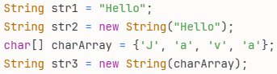
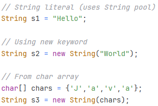
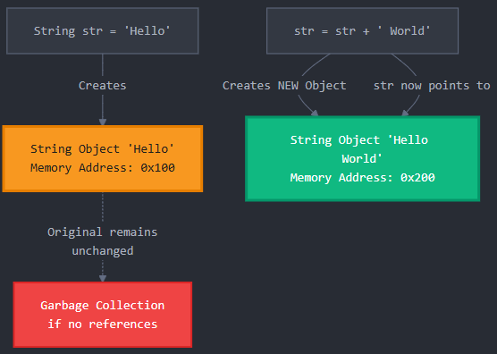
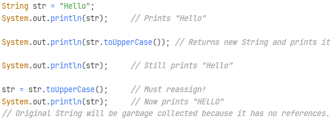
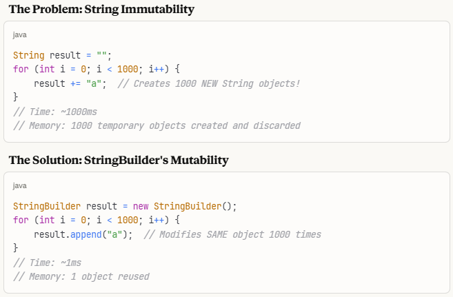
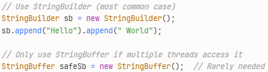
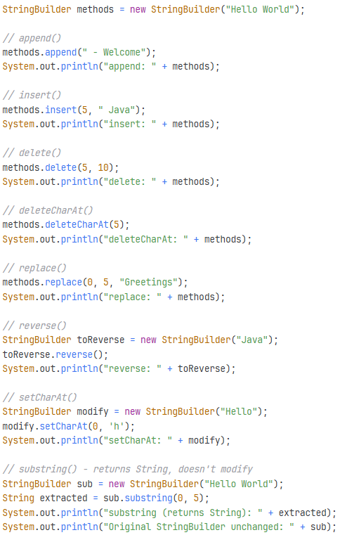
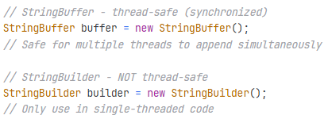
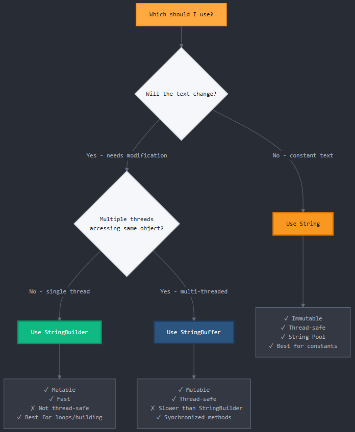
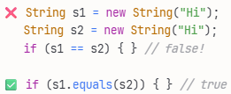

# Java Strings

---

## Agenda

- What is a String?
- String Immutability
- Why Strings are Immutable
- String Pool & Memory
- String vs StringBuffer vs String Builder
- Performance Comparison
- Best Practices

---

## What is a String?

- A String is a sequence of characters representing text
- Strings are objects, not primitive types
- Part of java.lang package (imported automatically)
- Most commonly used class in Java programming
- Since Java 9, every character in a string is stored in an 8-bit byte array with an additional coder field to indicate the encoding.

---

## Creating Strings

- String literal:
  - String s1 = "Hello";
- Using new keyword:
  - String s2 = new String("World");
- From char array:
  - String s3 = new String(chars);
- Concatenation:
  - String s4 = "Hello" + " " + "World";
- From StringBuilder:
  - String s5 = sb.toString();

---

## String Immutability

- Once created, a String's value can not be changed
- Any modification creates a NEW String object
- Original String remains unchanged in memory

---

## String Immutability – Coding Example

- Output:
- Hello
- HELLO
- Hello
- HELLO

---

## Why is String Immutability Good?

- Security: Prevents malicious code from modifying String values
- Thread Safety: Multiple threads can share Strings safely
- String Pool Optimization: Enables efficient memory usage
- HashCode Caching: Hash value computed once and reused
- Class Loading: Class names are Strings and must not change

---

## String Pool & Memory

- String Pool: Special memory area in heap for String literals
- String s1 = "Java"; // Stored in pool
- String s2 = "Java"; // Reuses same object from pool
- s1 == s2 returns true (same reference)
- String s3 = new String("Java"); // Creates new object in heap

---

## Why is String Immutability bad?

- String concatenation in loops creates many temporary objects
- Each + operation creates a new String object
- Memory intensive and slow for repeated modifications
- Example: Building a String in a loop of 1000 iterations
- Creates 1000 temporary String objects!

---

## String vs StringBuffer vs StringBuilder

- String - Java 1.0 (1996) - Immutable
- StringBuffer - Java 1.0 (1996) - Mutable, thread-safe
- StringBuilder - Java 5 (2004) - Mutable, NOT thread-safe
- Both String and StringBuffer were in the original Java release. They were designed together from the start:
- String for immutable text
- StringBuffer for mutable text operations (like concatenation in loops)
- The reason StringBuffer was synchronized from the beginning was that early Java emphasized thread-safety as a core feature - this was the 90s when multi-threading was becoming important, and Java wanted to be "safe by default."

---

## String vs StringBuffer vs StringBuilder

- StringBuilder came 8 years later when the Java team realized that most StringBuffer usage was in single-threaded contexts, and the synchronization overhead was unnecessary performance cost.
- So Java added StringBuilder as a drop-in replacement for StringBuffer with identical API but without the synchronization overhead.
- In practice: You'll almost always use StringBuilder. StringBuffer is now quite rare since most code doesn't need that level of thread-safety, and if it does, there are often better concurrent solutions available.

---

## StringBuilder: Mutable Strings

- StringBuilder provides MUTABLE character sequences
- Modifies the same object instead of creating new ones
- Much more efficient for string manipulation
- Not thread-safe (use StringBuffer for thread safety)
- Introduced in Java 5 as faster alternative to StringBuffer

---

## Why StringBuilder Was Created

- StringBuilder was specifically designed to solve the performance problem caused by String immutability when you need to:
- Build strings in loops ✅
- Make multiple modifications ✅
- Concatenate many pieces ✅
- Construct large strings ✅

---

## Key StringBuilder Methods

- append(): Add text to end
- insert(): Add text at specific position
- delete(): Remove characters from range
- reverse(): Reverse the character sequence
- toString(): Convert to String object

---

## StringBuffer: Thread-Safe Alternative

- StringBuffer is similar to StringBuilder but thread-safe
- All methods are synchronized (thread-safe)
- Slower than StringBuilder due to synchronization overhead
- Use ONLY when multiple threads access same object
- For single-threaded code, always use StringBuilder
- API identical to StringBuilder (append, insert, delete, etc.)

---

## String vs StringBuilder

- String: Immutable, thread-safe, stored in String pool
- StringBuilder: Mutable, not thread-safe, faster for modifications
- StringBuffer: Mutable, thread-safe (synchronized), slower
- Use String for read-only text
- Use StringBuilder for frequent modifications

---

## Which to Use?

---

## Performance Comparison

- Concatenating 10,000 strings in a loop:
  - String concatenation: ~1000ms (very slow)
  - StringBuilder: ~1ms (1000x faster!)
- Memory usage:
  - String: Creates thousands of temporary objects
  - StringBuilder: Reuses same object with dynamic array

---

## Best Practices

- Use String for simple, unchanging text
- Use StringBuilder for loops and repeated modifications
- Use StringBuffer only when thread safety is required
- Avoid string concatenation in loops (use StringBuilder)
- For simple concatenations, + operator is fine (compiler optimizes)

---

## Common Mistakes to Avoid

- Forgetting that Strings are immutable
- Using == to compare String values (use .equals() instead)
- String concatenation in loops without StringBuilder
- Not converting StringBuilder to String when needed
- Using StringBuffer when StringBuilder would suffice

