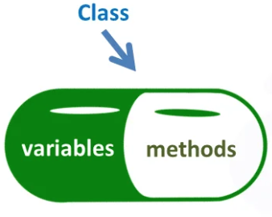
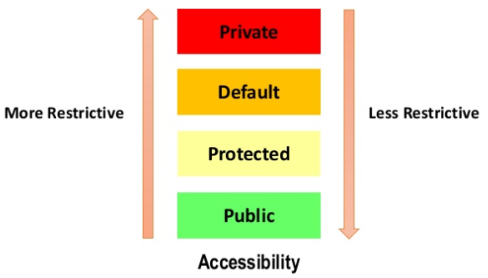
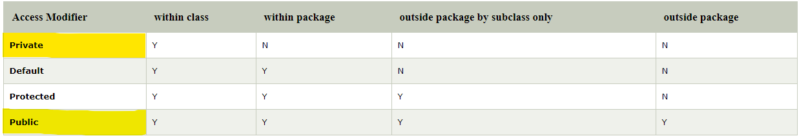
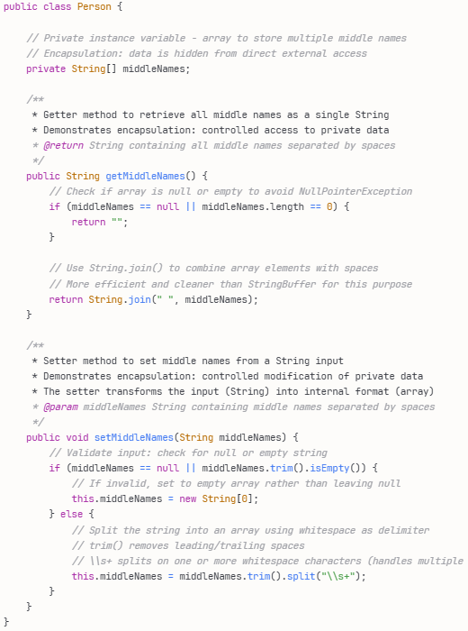
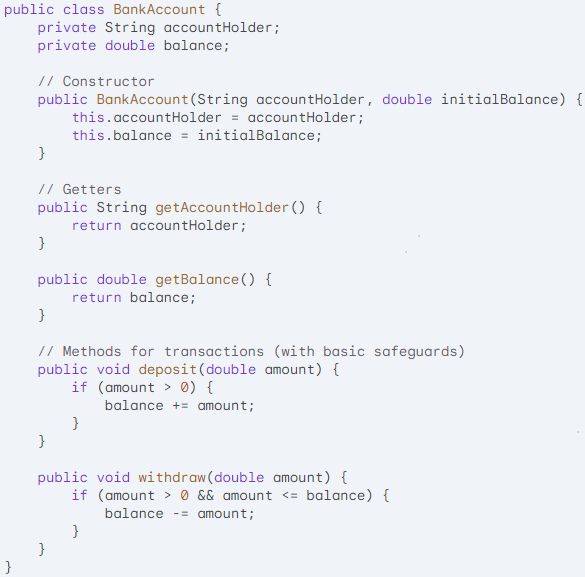

<!-- _class: lead -->
<!-- _paginate: false -->

<span class="kicker">// week 08 · encapsulation · object-oriented computing</span>

# Encapsulation


---

## Agenda

- Why learn encapsulation
- Definition & OOP context
- Access modifiers (private, default, protected, public)
- Implementing encapsulation (private fields, getters & setters)
- Getters & setters: purpose + examples
- Validation via setters (e.g., username length)
- Coding example: BankAccount
- Benefits: protection, flexibility, maintainability
- Wrap-up & resources

---

## Why are we learning about Encapsulation


---

## Encapsulation Definition

- English meaning of encapsulation
  - To encase in
  - As if in a capsule
- Encapsulation meaning in OOP:
  - Encapsulation in Java refers to the bundling of data (aka fields or instance variables) and methods that operate on that data (AKA Getters and Setters) within a single unit (a class), while restricting direct access to some of the object's components.



---

## What is Encapsulation?

- Encapsulation is one of the four fundamental OOP concepts.
- Encapsulation in Java is a mechanism of wrapping the instance variables and methods acting on the instance variables together as a single unit.
- In Encapsulation, the instance variables of a class will be hidden (i.e., made private) from other classes. They can only be accessed only through the methods of their current class.
- Data hiding is the practice of making fields private to prevent direct external access, which is a key aspect of encapsulation.

---

## Access Modifiers

- Encapsulation is the principle of hiding internal implementation details and exposing only what is necessary through a controlled interface.
- Access modifiers are the tools Java gives you to enforce that principle.
- We can impose access restrictions on instance variable and methods.
- The restrictions are specified through access modifiers.
- Access modifiers are keywords we can associate with each member to define which parts of the program can access it directly.
- In Java, there are 3 types of access modifier and 4 levels of access.



---

## Access Modifiers Table

    - Visible to the class only (private).
    - Visible to the package (default). No modifiers are needed!
    - Visible to the package and all subclasses (protected).
    - Visible to the world (public).
    - https://www.javatpoint.com/access-modifiers



---

## Hot to Implement Encapsulation

- Declare instance variables private.
- Provide a public getter and setter method for each private instance variable.
```java
public class Student {
// Private instance variable
private String email;
// Getter method
public String getEmail() {
	return email;
}
// Setter method
public void setEmail(String email) {
	this.email = email;
}
}
```

---

## Getter and Setter Methods

- Getter methods are used to “get” (i.e., retrieve) the current value of a private instance variable.
- Setters methods are used to “set” (i.e., update) the value of a private instance variable.
- Getter methods are sometimes referred to as accessors methods.
- Setters methods are sometimes referred to as mutator methods.

---

## Getters and Setters

- These two types of methods are very popular in OOP. A get method retrieves the value of a particular instance variable, whereas a set method sets its value.
- It is a common convention to write the name of the corresponding member fields with the get or set command.
```java
// Car class
class Car {
   private int speed; // member field speed
   // Setter method to set the speed of the car
   public void setSpeed(int x) {
     speed = x;
   }
   // Getter method to get the speed of the car
   public int getSpeed() {
       return speed;
   }
}
class Main {
   public static void main(String args[]) {
       Car car = new Car();
       car.setSpeed(100); // calling the setter method
       // calling the getter method
       System.out.println(car.getSpeed());
   }
}
```

---

## Why use Getters and Setter Methods?

- You may have concluded that we could just change the private fields of the class definition to be public and achieve the same results.
- However, hiding the instance variables of an object (i.e., making them private) and using public methods to access them allows us to:
  - Change how the data is handled behind the scenes.
  - Impose validation on the values that the instance variables are being set to.

---

## Why use Getters and Setter Methods?

- Let us say we decide to modify how we store middle names in the person class. Instead of just one String we want to use an array of Strings.
- The implementation inside the class has changed but the outside world is not affected. The way the methods are called remains the same.
```java
public class Person {
// Private instance variables
private String middleNames;
public String getMiddleNames() {
	return middleNames;
}
public void setMiddleNames(String middleNames) {
	this.middleNames = middleNames;
}
}
```



---

## Why use Getters and Setter Methods?

- Let us say Person class objects can only accept usernames that have a maximum of ten characters.
- We can add validation in the setUsername setter method to make sure the username conforms to this requirement.
- If the username passed to the setUsername() setter method is longer than ten characters, it is automatically truncated (e.g. the code output on right = theRedRhin)
```java
public class Person {
// Private instance variables
private String username;
public String getUsername() {
	return username;
}
public void setUsername(String username) {
if (username.length() > 10) {
	this.username = username.substring(0, 10);
} else {
	this.username = username;
}
}
}
```
```java
public class Main {
public static void main(String[] args) {
Person perObj1 = new Person();
perObj1.setUsername("theRedRhino"); // 11 Characters in username
System.out.println(perObj1.getUsername());
}
}
```

---

## Slide 14


---

## Coding Example

- Private Data: The accountHolder and balance are private, ensuring controlled access.
- Constructor: Initializes a new bank account object.
- Getters: Allow for reading the account holder's name and the current balance.
- Transaction Methods: The deposit() and withdraw() methods encapsulate the logic of transactions while enforcing basic rules (preventing negative deposits and overdrafts).



---

## Benefits of Encapsulation

- Data Protection (Validation & Security):
  - Getters and setters allow you to validate data before it's modified, preventing invalid or harmful changes to the object's internal state.
  - Example: Ensuring a PIN is 4 digits, or a balance is never negative.
- Flexibility (Implementation Independence):
  - You can change the internal implementation of a class without breaking external code, as long as the public interface (the methods) remains the same.
  - Example: Changing middleNames from an array to an ArrayList internally—external code still works.
- Code Maintainability:
  - Encapsulation promotes organised, modular code that is easier to understand and maintain.
  - Changes are localised to the class, reducing ripple effects throughout the codebase.

---

## End note

- Core Concept: Encapsulation is a fundamental principle in object-oriented programming (OOP). It involves bundling data (instance variables) and the code that operates on that data (methods) together into a single unit, such as a class.
- Controlling Access: Access control mechanisms (like private, public, and protected) are central to encapsulation. By making instance variables private, you prevent direct access to them from outside the class. This forces interaction through the provided methods (getters and setters).

---

## Resources

- https://claude.ai/new?q=Give%20me%20an%20introductory%20overview%20of%20encapsulation%20in%20Java%20with%20clear%20examples%20and%20explanations%20suitable%20for%20beginner%20students
- https://chat.openai.com/?q=Explain+encapsulation+in+Java+for+beginners+in+a+study+mode

