# Week 8 Lab — Inheritance

> **GitHub Classroom assignment:** REDACTED
> **Starter repo (canonical instructions):** https://github.com/DanielCreggOrganization/ooc-w10-lab-inheritance-template
> **Worked solutions:** https://github.com/danielcregg/REDACTED/tree/master/src/ie/atu/inheritance
>
> The section below is a synced snapshot of the starter repo's README —
> the instructions students receive. If you edit it here, push the same
> change to the starter repo.

---

# Java Inheritance Lab

## Table of Contents
1. [Definition and Basics of Inheritance](#1-definition-and-basics-of-inheritance)
2. [Terminology](#2-terminology)
3. [Types of Inheritance](#3-types-of-inheritance)
4. [The Object Class](#4-the-object-class)
5. [Constructors in Inheritance](#5-constructors-in-inheritance)

## Lab Setup
1. Create a package called `ie.atu.inheritance`.
2. Create a `Main` class inside this package.
3. Place all the below classes from the DIY sections into this package.

## 1. Definition and Basics of Inheritance

### Learning Objective
Understand the concept of inheritance in Java, how it is implemented and how it allows one class to acquire the properties and behaviours of another class.

### Explanation
Inheritance is a fundamental principle in object-oriented programming (OOP) that allows a new class (subclass) to inherit properties and methods from an existing class (superclass). This promotes code reusability and logical organisation of classes. The subclass inherits characteristics (fields and methods) from the superclass, allowing you to create specialised classes based on more general ones.

An **"Is-A"** relationship is established between the subclass and superclass. For example, an Employee is a Person; hence, Employee can inherit from Person.

### Example
```java
public class Person {
    private String name;

    public String getName() { 
        return name; 
    }

    public void setName(String name) { 
        this.name = name; 
    }
}

public class Employee extends Person {
    private int employeeId;

    public int getEmployeeId() { 
        return employeeId; 
    }

    public void setEmployeeId(int id) { 
        this.employeeId = id; 
    }
}

// Example usage (e.g. in `Main.java`)
public static void main(String[] args) {
    Employee e = new Employee();
    e.setName("Alice");
    e.setEmployeeId(123);
    System.out.println("Employee: " + e.getName() + ", ID: " + e.getEmployeeId());
}
```

### Visual Representation
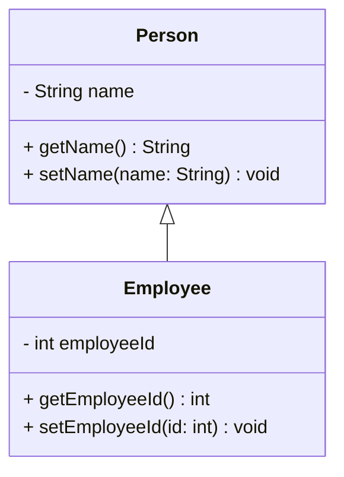

### DIY Exercise: Animals
1. Create 2 classes. An `Animal` class and a `Dog` class. The `Dog` class will extend (i.e. inherit from) the `Animal` class. Place both classes inside the `ie.atu.inheritance` package you created previously.

**The Animal Class will contain:**
-   A `private` field for `species` (String).
-   `Getter` and `setter` methods for the species field.

**The Dog Class will contain:**
-   A `private` field for `name` (String).
-   `Getter` and `setter` methods for the name field.

**In the `Main` class:**
-   Create an instance of `Dog`.
-   Call the setSpecies() and setName() methods. Then print the results to the terminal using the getSpecies() and setSpecies() methods. 
 -   Call the setSpecies() and setName() methods. Then print the results to the terminal using the getSpecies() and setSpecies() methods. 

### Suggested Solution (UML)
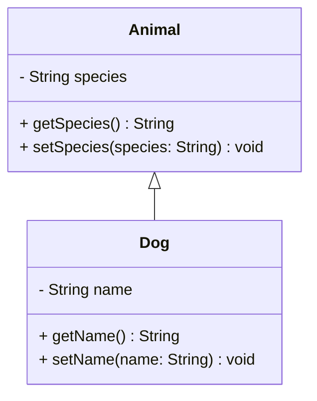
## 2. Terminology

### Learning Objective
Familiarise yourself with key terms in inheritance, such as superclass and subclass, and understand their roles.

### Explanation
-   **Superclass (Parent Class):** The class from which properties and methods are inherited. It represents a general concept.
-   **Subclass (Child Class):** The class that inherits from the superclass. It represents a specialised version of the superclass.

Inheritance establishes a hierarchy between classes, where the subclass extends the functionality of the superclass.

### DIY Exercise: Vehicles
1.  **Superclass:** Create a class `Vehicle` with a method `move()` that prints "The vehicle is moving."
2.  **Subclass:** Create a class `Car` that extends `Vehicle` and adds a method `playRadio()` that prints "Playing radio."

**In your `Main` class:**
-   Create an instance of `Car`.
-   Call `move()` and `playRadio()`.
 -   Call `move()` and `playRadio()`.

### Suggested Solution (UML)
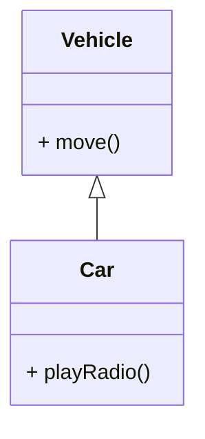
## 3. Types of Inheritance

### Learning Objective
Explore different types of inheritance and understand Java's inheritance model.

### Explanation and Examples

#### 1. Single Inheritance
One class inherits from one superclass.

```java
public class Vehicle {
    public void move() {
        System.out.println("Vehicle moves");
    }
}

public class Car extends Vehicle {
    public void honk() {
        System.out.println("Car honks");
    }
}
```

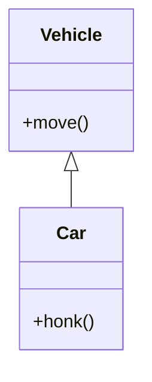

#### 2. Multilevel Inheritance
Chain of inheritance where subclass becomes superclass for another class.

```java
public class Animal {
    public void eat() {
        System.out.println("Animal eats");
    }
}

public class Mammal extends Animal {
    public void breathe() {
        System.out.println("Mammal breathes");
    }
}

public class Dog extends Mammal {
    public void bark() {
        System.out.println("Dog barks");
    }
}
```

```mermaid
classDiagram
    Animal <|-- Mammal
    Mammal <|-- Dog
    class Animal{
        +eat()
    }
    class Mammal{
        +breathe()
    }
    class Dog{
        +bark()
    }
```

#### 3. Hierarchical Inheritance
Multiple classes inherit from one superclass.

```java
public class Shape {
    public void draw() {
        System.out.println("Drawing shape");
    }
}

public class Circle extends Shape {
    public void radius() {
        System.out.println("Has radius");
    }
}

public class Square extends Shape {
    public void sides() {
        System.out.println("Has four sides");
    }
}
```

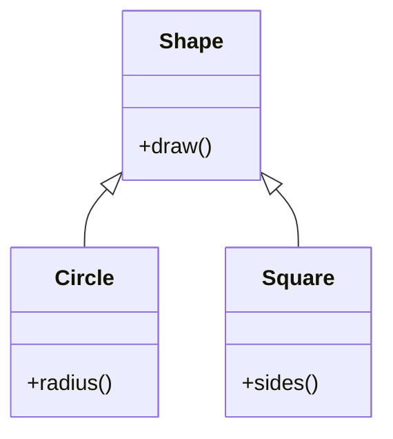

#### 4. Multiple Inheritance (Not Supported in Java)
One class inheriting from multiple superclasses.

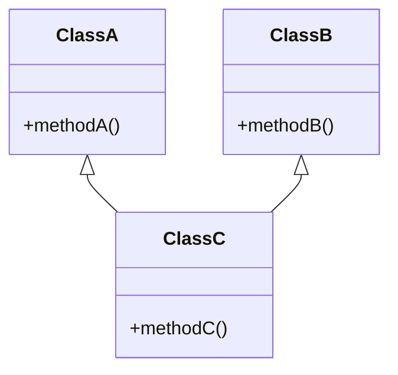

Java doesn't support multiple inheritance with classes to avoid:
1.  Ambiguity when same method exists in multiple parent classes
2.  Complexity in method resolution
3.  Potential naming conflicts

Instead, Java provides interfaces for implementing multiple inheritance of behaviour.

### DIY Exercise: Hybrid Inheritance
Create the classes listed below inside the `ie.atu.inheritance` package. 

Required classes:

1. `Vehicle` (superclass)
    - Private field: `String type`.
    - Constructor: `Vehicle(String type)` to initialise `type`.
    - Getter and setter for `type`.
    - Method: `void move()` that prints a short message, e.g. "The <type> is moving".

2. `Car` (subclass of `Vehicle`)
    - Private field: `int doors`.
    - Constructor: `Car(String type, int doors)` which calls `super(type)`.
    - Getter and setter for `doors`.
    - Method: `void honk()` that prints a short message, e.g. "Beep!".

3. `ElectricCar` (subclass of `Car`)
    - Private field: `int batteryCapacity` (e.g. in kWh).
    - Constructor: `ElectricCar(String type, int doors, int batteryCapacity)` which calls `super(type, doors)`.
    - Getter and setter for `batteryCapacity`.
    - Method: `void charge()` that prints a short message, e.g. "Charging...".

In the `Main` class:
- Create an instance of `ElectricCar` using the constructor.
- Call `move()`, `honk()`, and `charge()` on the instance.
- Use getters to retrieve and print the `type`, `doors`, and `batteryCapacity` values.

Notes:
- Keep method implementations simple (print statements are fine).
- Use `extends` and `super(...)` correctly to pass values up the inheritance chain.

Learning outcome: This exercise gives practice implementing a multi-level class inheritance chain, constructors that call `super(...)`, and using getters/setters to access private fields.

Extra (Hierarchical Inheritance) — `Motorbike`:
Add a `Motorbike` class to demonstrate hierarchical inheritance where multiple subclasses share the same superclass.

Requirements for `Motorbike`:
- `Motorbike` should extend `Vehicle` (do not extend `Car`).
- Private field: `boolean hasSidecar`.
- Constructor: `Motorbike(String type, boolean hasSidecar)` which calls `super(type)`.
- Getter and setter for `hasSidecar`.
- Method: `void ride()` that prints a short message, e.g. "Riding the <type>" and indicates whether it has a sidecar.

In `Main` show that `Motorbike` and `Car` are both `Vehicle` instances by:
- Creating a `Motorbike` instance and calling its methods (`move()`, `ride()`).
- Using `Vehicle` references where appropriate (e.g. `Vehicle v = new Motorbike(...);`) to demonstrate polymorphism.

This addition demonstrates hierarchical inheritance: multiple subclasses (`Car`, `Motorbike`, etc.) can extend the same superclass (`Vehicle`).

### Suggested Solution (UML)
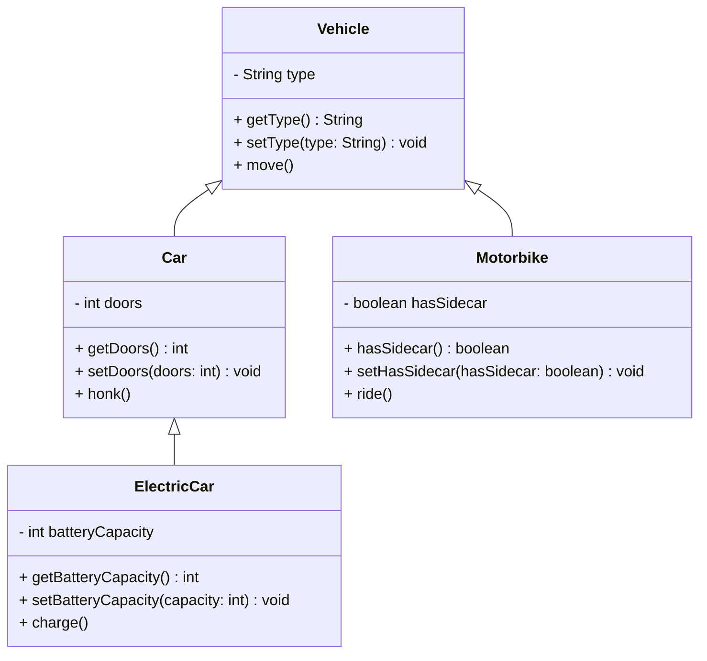


## 4. The Object Class

### Learning Objective
Understand that `Object` is the root superclass of all classes in Java and its significance in the class hierarchy.

### Visual Representation
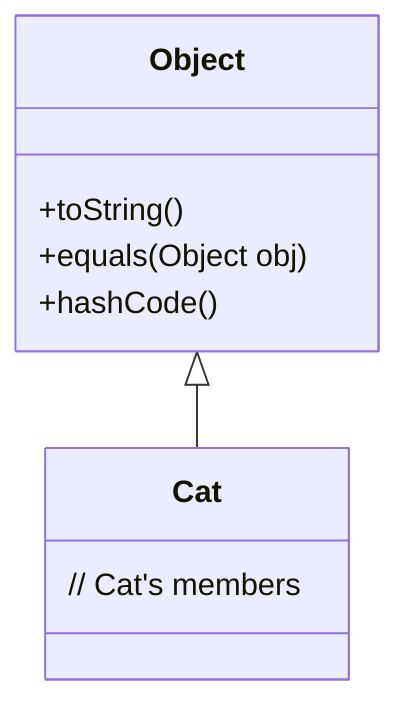

### DIY Exercise: Implicit Inheritance
Create a class `Gadget`:
-   Do not specify a superclass.

**In your `Main` class:**
-   Create an instance of `Gadget`.
-   Call the `toString()` method on the object.
-   Call another method from the dot operator list. 

### Suggested Solution (UML)
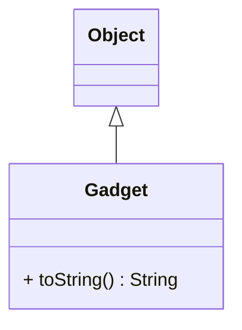

## 5. Constructors in Inheritance

### Learning Objective
Learn how constructors are used in inheritance, including how to invoke superclass constructors using the `super` keyword.

### Explanation

In Java inheritance, constructors play a crucial role in object initialization. When you create an instance of a subclass:

1.  The superclass constructor must be called first before the subclass constructor executes
2.  If not explicitly called, Java automatically calls the no-argument constructor of the superclass
3.  Use the `super()` keyword to call a specific superclass constructor
4.  The `super()` call must be the first statement in the subclass constructor

Key points to remember:

-   Every constructor must invoke a constructor from its superclass, either explicitly or implicitly
-   If the superclass doesn't have a no-argument constructor, the subclass must explicitly call a superclass constructor using `super()`
-   The `super` keyword can also be used to access superclass methods and fields

### Example
```java
public class Person {
    protected String name;

    public Person(String name) {
        this.name = name;
    }
}

public class Employee extends Person {
    private int employeeId;

    public Employee(String name, int employeeId) {
        super(name); // Call superclass constructor
        this.employeeId = employeeId;
    }
}
```

### Visual Representation
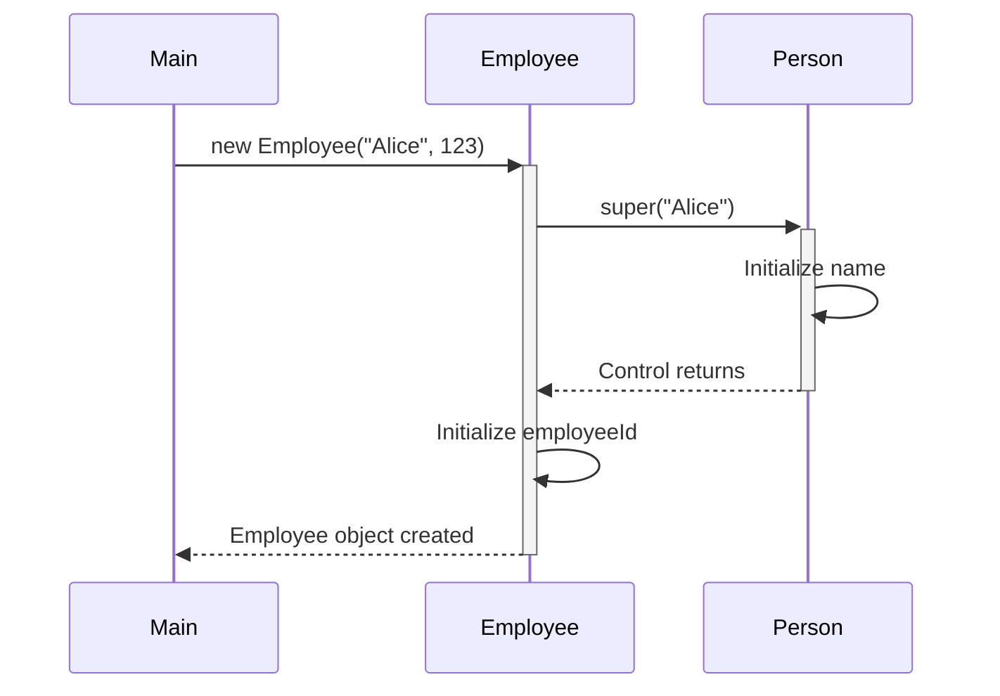

### DIY Exercise: School Management
1.  Create a `Person` class with:
    *   Private fields: `name` (String) and `age` (int)
    *   A constructor that initializes both fields.
    *   Getters and setters for the fields.

2.  Create a `Student` class that extends `Person` with:
    *   A private field: `studentId` (String)
    *   A constructor that initializes `name`, `age`, and `studentId`.
    *   Getters and setters for its field.

**In your `Main` class:**
-   Create instances of both `Person` and `Student`.
-   Print the details of both using the getter methods.

### Suggested Solution (UML)
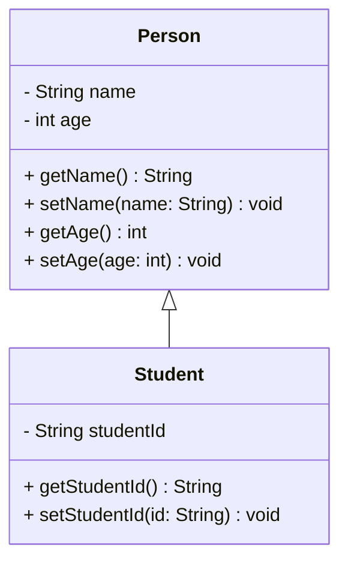

## Summary
-   Definition and Basics of Inheritance
-   Terminology
-   Types of Inheritance
-   The Object Class
-   Constructors in Inheritance

## Further Reading
-   [Java Documentation: Inheritance](https://docs.oracle.com/javase/tutorial/java/IandI/subclasses.html)
-   Book: [Effective Java by Joshua Bloch](https://www.oreilly.com/library/view/effective-java/9780134686097/)
-   Book: [Java: A Beginner's Guide by Herbert Schildt](https://www.accessengineeringlibrary.com/content/book/9781265242211)
-   Online Resource: [Inheritance in Java - GeeksforGeeks](https://www.geeksforgeeks.org/inheritance-in-java/)

Happy coding! Remember to test your classes and understand how inheritance affects the behaviour and structure of your objects.
