<!-- _class: lead -->
<!-- _paginate: false -->

<span class="kicker">// week 08 · inheritance · object-oriented computing</span>

# Java Inheritance


---

## Agenda

- The four pillars of OOP — where inheritance fits
- Definition & the is-a relationship
- Terminology: superclass & subclass
- Implementing inheritance with `extends`
- The `Object` class
- Types of inheritance in Java
- Class hierarchies
- Constructors & the `super` keyword
- Benefits, key facts & summary

---

## Four major principles of OOP

* Recall from week 7: OOP rests on four pillars — **Encapsulation, Inheritance, Polymorphism, Abstraction**.
* Last week we covered Encapsulation. This week: **Inheritance**.

<!-- diagram source: img/diagram-four-pillars.mmd -->


---

## Definition

* Inheritance is the mechanism by which one class acquires the instance variables and methods of another class.
* Inheritance is a mechanism for expressing an "Is-A" relationship (AKA parent-child relationship) in an Object-Oriented programming language.
* In the diagram below, the Employee class is inheriting from (AKA derived from) the Person class. Note the direction of the arrow — it points at the superclass.

<!-- diagram source: img/diagram-is-a.mmd -->


---

## Important terminology

* Superclass - The class that has its instance variables and methods inherited is known as the super class (AKA base class, AKA parent class).
* Subclass - The class that inherits instance variables and methods from another class is known as a subclass (AKA child class, AKA derived class, AKA extended class). The subclass can add its own instance variables and methods in addition to the superclass fields and methods it inherited.

---

## How is inheritance implemented in Java

- Inheritance is implemented in Java by using the extends keyword.
```java
class Superclass {
    // Instance variables and methods here
}

class Subclass extends Superclass {
    // Extra instance variables and methods here
}
```

---

## Inheritance Coding Example

```java
public class Person {
    private int age;

    public int getAge() { return age; }
    public void setAge(int a) { this.age = a; }
}

public class Employee extends Person {
    private String role;

    public String getRole() { return role; }
    public void setRole(String r) { this.role = r; }
    // inherits age, getAge(), setAge() from Person
}

public class Main {
    public static void main(String[] args) {
        Employee emp = new Employee();
        emp.setAge(25); // inherited setter
        emp.setRole("Developer"); // own setter
        System.out.println(emp.getAge() + " : " + emp.getRole());
    }
}
```

---

## The Object class

* Every class has one and only one direct superclass.
* If you do not supply a superclass for your class, then your class is a subclass of the Object class (i.e., The Object class is the parent class of all classes by default.)
* The Object class is defined in the java.lang package.
* The Object class provides some common behaviours to all objects such as object comparison and object cloning.
* Classes can be derived from classes that are derived from classes, and so on — ultimately every chain leads back to the topmost class, Object. Such a class is said to be descended from all the classes in its inheritance chain.

<!-- diagram source: img/diagram-object-root.mmd -->


---

## Types of Inheritance in Java

* Java supports **3 types** of class inheritance:
  - Single
  - Multilevel
  - Hierarchical
* Two more appear in OOP theory, and you should be able to recognise them:
  - Hybrid — a combination of the above
  - Multiple — **not allowed** for classes in Java (interfaces only)

---

## Types of Inheritance — Single

- Single inheritance - refers to a child and parent class relationship where a class extends another class.
- Structure: `class B extends A` — B (subclass) inherits from A (superclass).

<!-- diagram source: img/diagram-single.mmd -->


---

## Types of Inheritance — Multilevel

- Multilevel inheritance - refers to a child and parent class relationship where a class extends the child class. For example class C extends class B and class B extends class A.
- Structure: `class B extends A`, `class C extends B`

<!-- diagram source: img/diagram-multilevel.mmd -->


---

## Types of Inheritance — Hierarchical

- Hierarchical inheritance - refers to a child and parent class relationship where more than one classes extends the same class. For example, classes B, C & D extends the same class A.
- Structure: `class B extends A`, `class C extends A`, `class D extends A`

<!-- diagram source: img/diagram-hierarchical.mmd -->


---

## Types of Inheritance — Hybrid

- Hybrid inheritance - Combination of more than one types of inheritance in a single program.
- For example class A & B extends class C and another class D extends class A then this is a hybrid inheritance example because it is a combination of single and hierarchical inheritance.
- Structure: `class A extends C`, `class B extends C`, `class D extends A`

<!-- diagram source: img/diagram-hybrid.mmd -->


---

## Multiple Inheritance (not supported)

* Multiple Inheritance - refers to the concept where one class inherits from more than one class, i.e. a subclass with two superclasses.
* Java does not allow a class to extend more than one class and therefore DOES NOT support multiple inheritance.
* However, Java supports Multiple Inheritance of type, which is the ability of a class to implement more than one interface. More on this in week 11.
* Structure: `class C extends A, B` — **not valid Java**, shown for illustration only.

<!-- diagram source: img/diagram-multiple.mmd -->


---

## A Vehicle Class Hierarchy

- Hierarchies run from the **general** (top) to the **more specific** (bottom).
- Every arrow is an is-a relationship: a SportsCar is a Car, and a Car is a Vehicle.

<!-- diagram source: img/diagram-vehicle-hierarchy.mmd -->


---

## Animal Hierarchy

<!-- diagram source: img/diagram-animal-hierarchy.mmd -->


---

## Inheritance and Constructors

* The components of a class, such as its instance variables and methods are called the members of a class or "class members".
* With inheritance, the subclass class can see public and protected members of the superclass.
* Constructors are NOT members of a class.
* Constructors are not inherited by subclasses; however, constructors of a superclass can be called from a subclass!

---

## Inheritance and Constructors (continued)

* The subclass constructor implicitly calls the default constructor of superclass when we create an object of the subclass.
* The superclass constructor can be also be called explicitly, using the super keyword.
* With inheritance, subclass objects are constructed top-down. The superclass constructor must be called first in a subclass constructor.
* The super keyword refers to the superclass from which the subclass was derived in a hierarchy.
* The use of multiple super keywords to access an ancestor superclass other than the direct superclass is not permitted.

---

## The super keyword

* The super keyword is like the this keyword – the super keyword is used to access methods of the superclass while this keyword is used to access methods of the current class.
* The following are scenarios where the super keyword is used:
  - To differentiate the members of superclass from the members of subclass, if they have same names.
  - To invoke the superclass constructor from subclass.
* If a class is inheriting the properties of another class, the subclass automatically acquires the default constructor of the superclass. If you want to call a parameterized constructor of the superclass, you need to use the super keyword as shown on the next slide.

---

## Super keyword coding example

```java
public class Mammal {
    int age;

    // Constructor
    Mammal(int age) {
        this.age = age;
    }
}

public class Cat extends Mammal {
    Cat(int age) {
        super(age); // passes age up to the parent
    }
}
```

> The `super()` call must be the first statement in the subclass constructor. It ensures the parent class is initialized before the child class.

---

## Predict the Output

<style scoped>
section pre { padding: 10px 16px; margin: 6px 0; }
section pre code { font-size: 15px; line-height: 1.25; }
</style>

```java
class Animal {
    Animal() { System.out.println("Animal constructor"); }
    void greet() { System.out.println("Hello from Animal"); }
}
class Dog extends Animal {
    Dog() { System.out.println("Dog constructor"); }
}
public class Main {
    public static void main(String[] args) {
        Dog d = new Dog();
        d.greet();
    }
}
```

* `Animal constructor`, then `Dog constructor` — the superclass is always constructed first (implicit `super()`).
* `Hello from Animal` — `greet()` is inherited from Animal.

---

## Benefits of Inheritance

* Code Reusability (i.e., Minimising duplicate code)
  - If duplicate code (variable and methods) exists in two related classes, we can refactor that hierarchy by moving that common code up to the common superclass.
* Better organization of code
  - Moving of common code to superclass results in better organization of code.
* Code more flexible to change
  - Classes that inherit from a common superclass can be used interchangeably: a method whose parameter or return type is the superclass accepts and returns any of its subclasses.

---

<!-- _class: dense -->

## Important facts about inheritance in Java

| Fact | Detail |
|---|---|
| Default superclass | Every class except `Object` has exactly one direct superclass; with no explicit `extends`, that superclass is `Object`. |
| One superclass only | A superclass can have any number of subclasses, but a subclass extends exactly one class — multiple inheritance needs interfaces. |
| Constructors | Not members of a class, so never inherited — but the subclass can invoke them via `super(...)`. |
| Private members | Not inherited — reachable only through the superclass's public/protected methods (e.g. getters and setters). |

---

## Summary

- Inheritance lets a subclass acquire the fields and methods of a superclass — an is-a relationship written with `extends`.
- Every class descends from `Object`; a class has exactly one direct superclass.
- Java supports single, multilevel and hierarchical inheritance; multiple inheritance of classes is not allowed (interfaces cover that gap).
- Constructors are not inherited — a subclass constructor calls the superclass constructor first, implicitly or via `super(...)`.
- Move common code up the hierarchy for reuse, organisation and flexibility.
