<!-- _class: lead -->
<!-- _paginate: false -->

<span class="kicker">// week 10 · inheritance · object-oriented computing</span>

# Java Inheritance

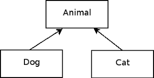

---

## Four major principles of OOP

- A
- P
- Inheritance
- E


---

## Four major principles of OOP

- Abstraction
- P
- Inheritance
- E


---

## Four major principles of OOP

- Abstraction
- Polymorphism
- Inheritance
- E


---

## Four major principles of OOP

- Abstraction
- Polymorphism
- Inheritance
- Encapsulation

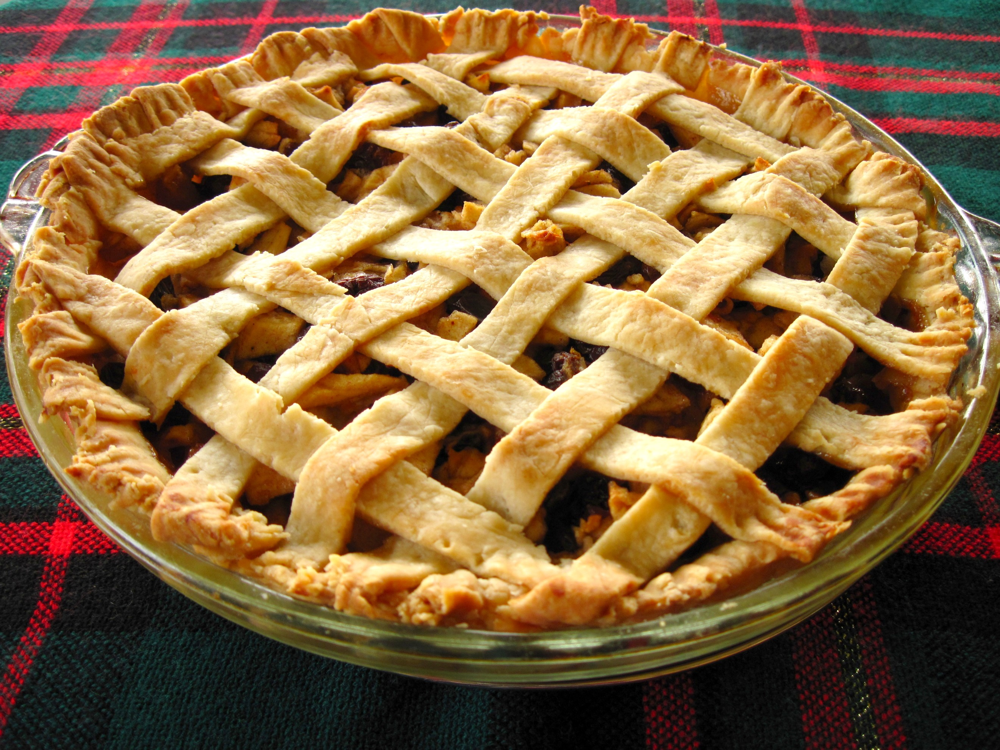

---

## Definition

- Inheritance is the mechanism by which one class acquires the instance variables and methods of another class.
- Inheritance is a mechanism for expressing an "Is-A" relationship (AKA parent-child relationship) in an Object-Oriented programming language.
- In the example on the right, the Employee class is inheriting from (AKA derived from) the Person class. Note the direction of the arrow.
- Is-A

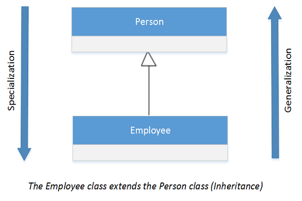

---

## Important terminology

- Superclass - The class that has its instance variables and methods inherited is known as the super class (AKA base class, AKA parent class).
- Subclass - The class that inherits instance variables and methods from another class is known as a subclass (AKA child class, AKA derived class, AKA extended class). The subclass can add its own instance variables and methods in addition to the superclass fields and methods it inherited.
- Super Class
- Sub Class


---

## How is inheritance implemented in Java

- Inheritance is implemented in Java by using the extends keyword.
```java
class Subclass extends Superclass {
	 // Extra instance variables and methods here
}
```
```java
class Superclass {
	// Instance variables and methods here
}
```

---

## Inheritance Coding Example

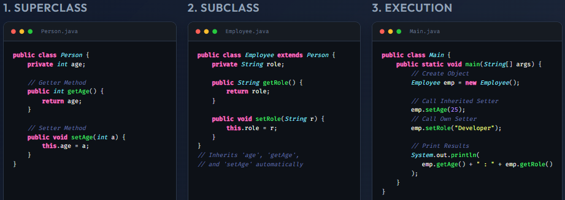

---

## The Object class

- Every class has one and only one direct superclass.
- If you do not supply a superclass for your class, then your class is a subclass of the Object class (i.e., The Object class is the parent class of all classes by default.)
- The Object class is defined in the java.lang package.
- The Object class provides some common behaviours to all objects such as object comparison and object cloning.
- Classes can be derived from classes that are derived from classes that are derived from classes, and so on, and ultimately derived from the topmost class, Object.
- Such a class is said to be descended from all the classes in the inheritance chain stretching back to Object.

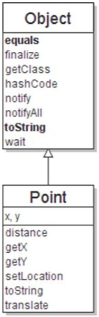

---

## Types of Inheritance in Java

- There are 3 types of class inheritance in Java:
        - Single
        - Multilevel
        - Hierarchical

---

## Types of Inheritance

- Superclass
- Subclass

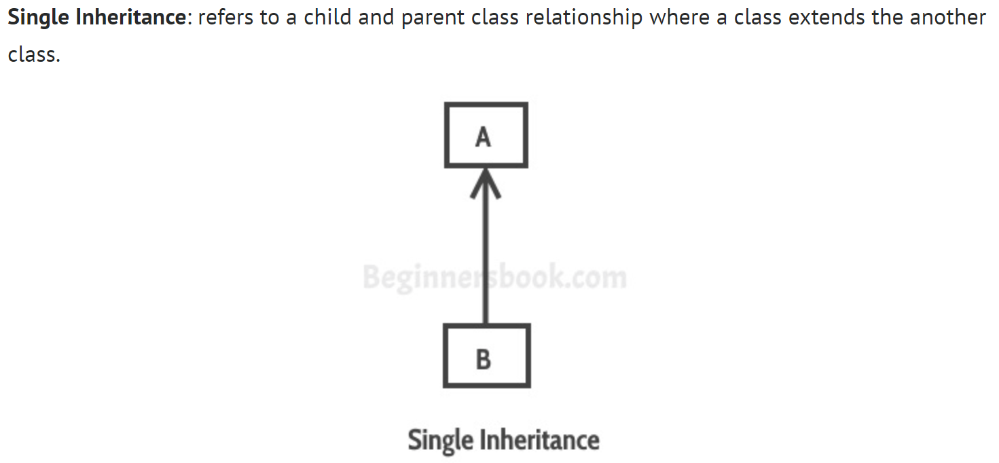


---

## Types of Inheritance

- Multilevel inheritance - refers to a child and parent class relationship where a class extends the child class. For example class C extends class B and class B extends class A.

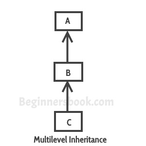

---

## Types of Inheritance

- Hierarchical inheritance - refers to a child and parent class relationship where more than one classes extends the same class. For example, classes B, C & D extends the same class A.
- Superclass
- Subclasses

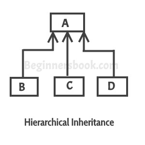

---

## Types of Inheritance

- Hybrid inheritance - Combination of more than one types of inheritance in a single program.
- For example class A & B extends class C and another class D extends class A then this is a hybrid inheritance example because it is a combination of single and hierarchical inheritance.

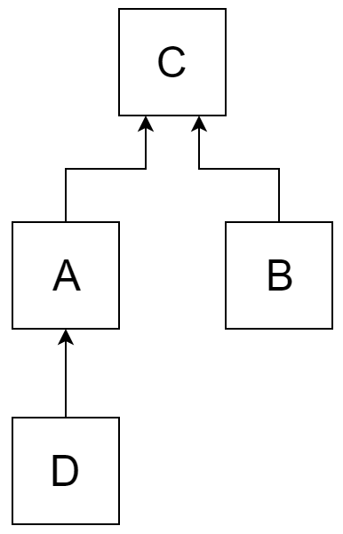

---

## Types of Inheritance

- Multiple Inheritance - refers to the concept where one class inherits from more than one class.
- This means a sub class has two super classes. For example class C extends both class A and B.
- Java does not allow the inheritance from more than one class and therefore DOES NOT support multiple inheritance.
- However, Java supports Multiple Inheritance of type, which is the ability of a class to implement more than one interface. More on this later.

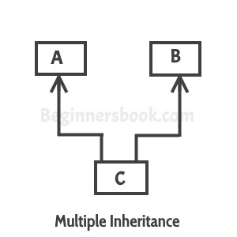

---

## A Vehicle Class Hierarchy

- General
- Specialized
- More Specific
- Page


<!-- image img/slide17-1.wmf not web-renderable -->
> ⚠️ `img/slide17-1.wmf` is not web-renderable — convert to PNG manually.

---

## Animal Hierarchy

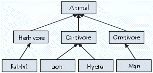

---

## Types of Inheritance

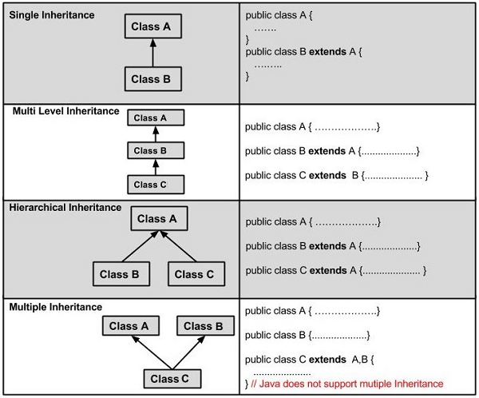

---

## Identifying an Inheritance situation

> 🎬 This slide has an embedded video in the original deck (see `original/`).

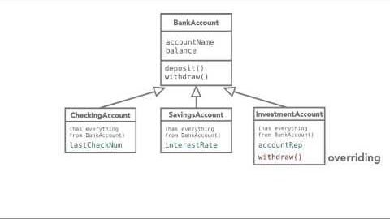

---

## Inheritance and Constructors

- The components of a class, such as its instance variables and methods are called the members of a class or “class members”.
- With inheritance, the subclass class can see public and protected members of the superclass.
- Constructors are NOT members of a class.
- Constrictors are not inherited by subclasses; however, constructors of a superclass can be called from a subclass!

---

## Inheritance and Constructors

- The subclass constructor implicitly calls the default constructor of superclass when we create an object of the subclass.
- The superclass constructor can be also be called explicitly, using the super keyword.
- With inheritance, subclass objects are constructed top-down. The superclass constructor must be called first in a subclass constructor.
- The super keyword refers to the superclass from which the subclass was derived in a hierarchy.
- The use of multiple super keywords to access an ancestor superclass other than the direct superclass is not permitted.

---

## Super keyword coding example

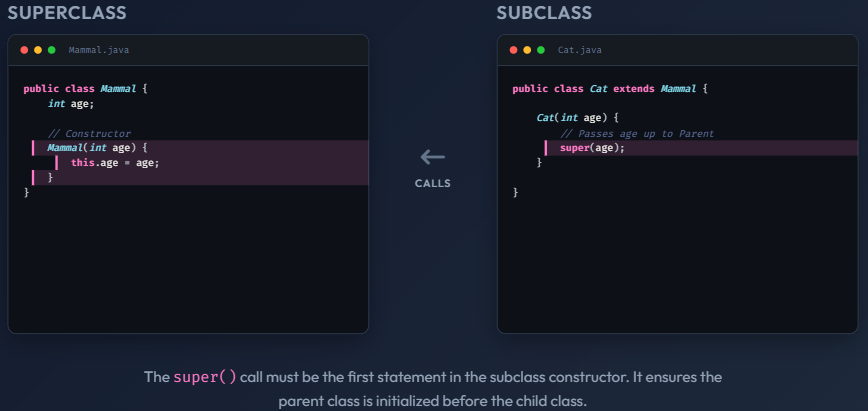

---

## The super keyword

- The super keyword is like the this keyword – the super keyword is used to access methods of the superclass while this keyword is used to access methods of the current class.
- The following are scenarios where the super keyword is used:
  - To differentiate the members of superclass from the members of subclass, if they have same names.
  - To invoke the superclass constructor from subclass.

---

## Invoking the Superclass Constructor

- If a class is inheriting the properties of another class, the subclass automatically acquires the default constructor of the superclass.
- If you want to call a parameterized constructor of the superclass, you need to use the super keyword as shown below.

---

## Benefits of Inheritance

- Code Reusability (i.e., Minimising duplicate code)
  - If  duplicate code (variable and methods) exists in two related classes, we can refactor that hierarchy by moving that common code up to the common superclass.
- Better organization of code
  - Moving of common code to superclass results in better organization of code.
- Code more flexible to change
  - Inheritance can also make application code more flexible to change because classes that inherit from a common superclass can be used interchangeably. If the return type of a method is superclass.

---

## Important facts about inheritance in Java

- Default superclass: Except Object class, which has no superclass, every class has one and only one direct superclass (single inheritance). In the absence of any other explicit superclass, every class is implicitly a subclass of Object class.
- Superclass can only be one: A superclass can have any number of subclasses. But a subclass can have only one superclass. This is because Java does not support multiple inheritance with classes. Although with interfaces, multiple inheritance is supported by java.
- Inheriting Constructors: A subclass inherits all the members (fields, methods, and nested classes) from its superclass. Constructors are not members, so they are not inherited by subclasses, but the constructor of the superclass can be invoked from the subclass using the super keyword.
- Private member inheritance: A subclass does not inherit the private members of its superclass. However, if the superclass has public or protected methods (like getters and setters) for accessing its private fields, these can also be used by the subclass.

---

## Resources

- [Show me an example of java inheritance. Use coding examples with commentary. - Your Personalized AI Assistant.](https://you.com/search?q=Show%20me%20an%20example%20of%20java%20inheritance.%20Use%20coding%20examples%20with%20commentary.%20&fromSearchBar=true&tbm=youchat&chatMode=default)
- https://www.youtube.com/watch?v=gQTzUpqeLH4
- http://www.geeksforgeeks.org/inheritance-in-java/
- https://www.javatpoint.com/inheritance-in-java
- http://ccm.net/contents/422-oop-inheritance

