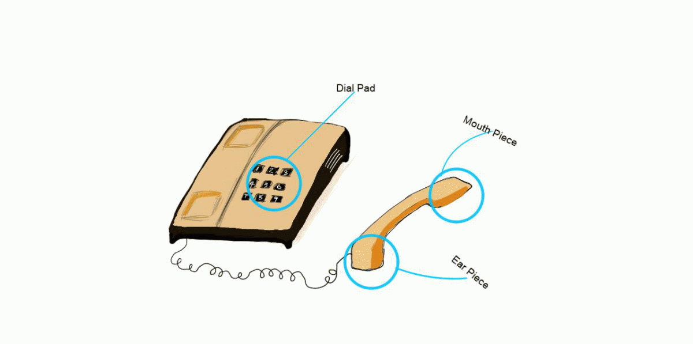
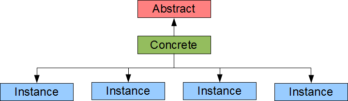
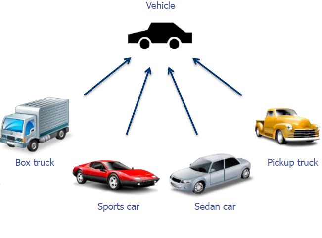

<!-- _class: lead -->
<!-- _paginate: false -->

<span class="kicker">// week 11 · abstraction · object-oriented computing</span>

# Abstraction



---

## Agenda

- What is Abstraction?
- Abstract Classes
- Abstract Methods
- Interfaces
- Examples of Abstraction
- Benefits of Abstraction

---

## Four major principles of OOP

- Recall: OOP rests on 4 pillars — Abstraction, Polymorphism, Inheritance, Encapsulation.
- Covered in full back in week 7 — this week we go deep on **Abstraction**.

---

## What is Abstraction?

- Abstraction is the process of hiding the implementation details (i.e., the body) of methods and showing only method signatures.
```java
public int add(int a, int b) {
  return a + b;
}
```
<!-- no-compile -->
```java
public int add(int a, int b);
```
- METHOD
- METHOD SIGNATURE

---

## Abstraction Vs Encapsulation

- Abstraction means hiding method  implementation details using abstract classes and interfaces.
- Encapsulation means hiding data with access modifiers and allowing access via getters and setters.

---

## Real Life Abstraction Examples

- A remote control
- Email
- A calculator

---

## How do we implement abstraction in Java?

- In Java we implement abstraction by using the abstract keyword

---

## Types of Abstraction in Java

- Abstract Classes
- Abstract Methods
- Interfaces

---

## Abstract Classes

- A class which contains the abstract keyword in its declaration is known as abstract class.
- If a class is declared abstract, it cannot be instantiated.
- To use an abstract class, you have to inherit it from another class.
- If you inherit an abstract class, you have to provide implementations to all the abstract methods in it.
- Abstract classes may or may not contain abstract methods.
- If a class has at least one abstract method, then the class must be declared abstract.

---

## Abstraction Coding Example

- public abstract class AbstractClass {
- // Instance Variables and Methods
- }
- Note: The abstract keyword is placed before the class keyword in the class declaration

---

## Concrete Classes Vs Abstract classes

- Abstract classes cannot be instantiated. Declaring a class as abstract means that you do not want it to be instantiated and that the class can only be inherited. You are imposing a rule in your code.
- Concrete classes are classes that can be instantiated.



---

## Abstract Methods

- If you want a class to contain a particular method but you want the actual implementation of that method to be determined by any sub class which inherits said method then you can declare the method in the abstract super class as an abstract method.
- The abstract keyword is used to declare a method as abstract.
- An abstract method contains a method signature, but no method body.
- Instead of curly braces, an abstract method will have a semicolon (;) at the end.

---

## Abstract Methods Vs Concrete Methods

- Abstract methods have no body.
- public abstract int methodName();
- Note: The abstract keyword is placed after the access modifier and before the return type.
- Concrete methods have a body.
- public int methodName() {
- return number;
- }

---

## Consequences of declaring a method abstract

- The class containing it MUST be declared as abstract.
- Any class inheriting the current class must either override the abstract method or declare itself as abstract.
- Note: Eventually, a descendant class has to implement the abstract method; otherwise, you would have a hierarchy of abstract classes that cannot be instantiated.

---

## Abstraction Example

- Here we have different types of truck and car. They have different colour, shape, engine type and purpose etc. that makes them distinct.
- However, they have some common properties and behaviour among them i.e., they all have tires, engine, steering, gear etc. They are used for the travelling and can be operated in a common way.
- What should be the abstract concept for these entities?
- Vehicle can be the general idea of a car or a truck. It retains only the information on general vehicle attributes and behaviour, eliminating the other characteristics of a particular car or a truck.



---

## Interface

- An interface is like an abstract class, except an interface contains only abstract methods i.e., an interface is a completely “abstract class”.
- An interface contains only method signatures (i.e. name and parameters) of the methods. Method signatures have no braces { } and are terminated with a semicolon.
- Interfaces provide a way to ensure that a class adheres to a certain contract.
- You can use interfaces in Java as a way to achieve polymorphism.

---

## Interface Definition and Implementation

- Defining an interface is similar to creating a new class. An interface is declared using the interface keyword.
- Just like with classes, an interface can be declared public.
- Interfaces cannot be instantiated. They can only be implemented by classes or extended by other interfaces. implements is the keyword used in class definitions to implement an interface.
- When a class implements an interface, it provides a method body for each of the abstract methods declared in the interface.
- A class can implement multiple interfaces.

---

## Interface Example

```java
public interface ExampleInterface {
/* An interface can contain constant declarations. All constant values
 * defined in an interface are implicitly public, static, and final. You
 * can omit these modifiers e.g. double PI = 3.1415;
 */
/* All method declarations in an interface are implicitly public and
 * abstract so you can omit the public modifier and abstract keyword.
 */
public abstract void method1();
void method2();
}
```

---

## Implementing an Interface

<style scoped>
section pre { padding: 8px 14px; margin: 4px 0; }
section pre code { font-size: 16px; line-height: 1.25; }
</style>

- Before you can use an interface, it must be implemented by some class. Here `ExampleClass` implements `ExampleInterface`:
```java
interface ExampleInterface {
void method1();
void method2();
}

public class ExampleClass implements ExampleInterface {
@Override
public void method1() {
	System.out.println("This is method 1");
}
@Override
public void method2() {
	System.out.println("This is method 2");
}
}
```

---

## Implementing an Interface

- A class that implements an interface must implement ALL the abstract methods declared in the interface before it can be instantiated.
- The methods must have the exact same method signature (name and parameters) as declared in the interface.

---

## Real world Interface Example

- A simple interface and a class that implements it:

```java
public interface Drawable {
    void draw();
}

public class Circle implements Drawable {
    @Override
    public void draw() {
        System.out.println("Drawing a circle");
    }
}
```

- Any class that implements `Drawable` must provide its own `draw()` method.

---

## What can an Interface contain?

- Constants
- Method signatures
- Default methods
- Static methods
- Nested types (i.e., a nested class)

---

## Differences between a class and an interface

<!-- _class: dense -->

- The keyword used to create a class is “class”. The keyword used to create an interface is “interface”
- A class can be instantiated i.e, objects of a class can be created. An Interface cannot be instantiated i.e, objects cannot be created.
- Multiple inheritance: classes don't support it, interfaces do (see comparison table).
- Classes can inherit from another class. An interface cannot inherit a class.
- A class implements an interface and an interface can inherit other interfaces NOT implement them!
- Classes can be inherited by another class using the keyword ‘extends’. An interface can be inherited by a class by using the keyword ‘implements’ and it can be inherited by an interface using the keyword ‘extends’.
- It can contain constructors. Interface cannot contain constructors.
- Instance variables and methods in a class can be declared using any access modifier (i.e. public, private, default, protected). All variables and methods in an interface are implicitly public.
- Instance variables in a class can be public, static, final or none of these. All instance variables in an interface are implicitly public, static and final.
- Classes can not contain abstract methods. An interface contains only abstract methods.

---

## Why use Interfaces?

- Interfaces increase flexibility: a class can implement several of them (see comparison table).
- An interface is a contract (or a protocol, or a common understanding) of what the classes can do. When a class implements a certain interface, it promises to provide implementation to all the abstract methods declared in the interface.
- Interfaces facilitate polymorphism.

---

## Interface Vs Abstract Class

- The choice between using an interface or an abstract class in Java depends on the design requirements of your application. Here are some factors to consider:
- Multiple inheritance: extend one class only, but implement many interfaces — use interfaces if you need behavior from multiple sources (see comparison table).
- Default behavior: If you want to provide default behavior for some methods, you should use an abstract class. Abstract classes can have fully implemented methods, while interfaces can only have method signatures until Java 7. However, from Java 8 onwards, interfaces can have default methods and static methods.
- Type definition: If you want to define a type that will be used by many classes, including unrelated ones, use an interface. An interface is a good way to define a contract that can be implemented by any class anywhere in the class hierarchy.

---

<!-- _class: dense -->

<style scoped>table { font-size: 15px; } td, th { padding: 5px 10px 5px 4px; }</style>

## Concrete vs Abstract vs Interface

| Feature | Concrete Class | Abstract Class | Interface |
|---|---|---|---|
| Definition | A standard class that can be instantiated. | A class declared with abstract that cannot be instantiated. | A blueprint of behavior; a contract that implementing classes must follow. |
| Instantiation | Yes (e.g., new Student()). | No. You cannot create an object directly. | No. You cannot create an object directly. |
| Methods | All methods must have a body (implementation). | Can have both abstract (no body) and concrete (with body) methods. | Methods are implicitly abstract (no body).<br>(Since Java 8: default and static methods can have bodies).* |
| Inheritance Limit | A class can extend only one other class. | A class can extend only one abstract class (Single Inheritance). | A class can implement multiple interfaces (Multiple Inheritance of Type). |
| Variables (State) | Can have any type of variable (instance, static, final, etc.). | Can have instance variables to hold state (non-final, non-static, etc.). | Variables are implicitly public static final (Constants only). |
| Constructors | Yes. Used to initialize the object. | Yes. Called by subclasses (via super()) to initialize the parent part of the object. | No. Interfaces do not have constructors. |
| Access Modifiers | Members can be private, protected, public, or default. | Members can use any access modifier. | Methods are implicitly public. (Java 9 allows private methods for internal logic). |
| Keyword | class Name { ... } | abstract class Name { ... } | interface Name { ... } |
| Relationship | "Is-a" relationship (e.g., A Dog is an Animal). | "Is-a" relationship (Partial implementation). | "Can-do" relationship (Capability/Contract, e.g., Runnable, Serializable). |

- Class vs Abstract Class vs Interface

---

## Class vs Abstract Class vs Interface examples

- Concrete Class: Use when the class is "finished" and ready to be used as an object (e.g., Car, User).
- Abstract Class: Use when you want to share code (state/variables) among closely related classes but the base concept is too vague to exist on its own (e.g., Animal—you can't just have a generic "animal", it must be a specific type like Dog).
- Interface: Use when you want to define a capability that unrelated classes might share (e.g., Flyable could apply to a Bird, Airplane, or Superman).

---

## Benefits of Abstraction

- Reduces Complexity & Improves Maintainability
- Separates frequently changing code from stable code.
- Enforces the Open/Closed Principle
- Open (The Extension):
  - We can add new features by creating new classes that implement the interface.
- Closed (The Protection):
  - The existing system (client code) relies only on the interface, so it does not need to be modified when new features are added.
- Provides "Class-Level" Protection
- Similar to private/protected modifiers for data, abstract protects the class usage.
- Safety
- Prevents incorrect usage by making instantiation impossible.

