# Polymorphism

- Polymorphism

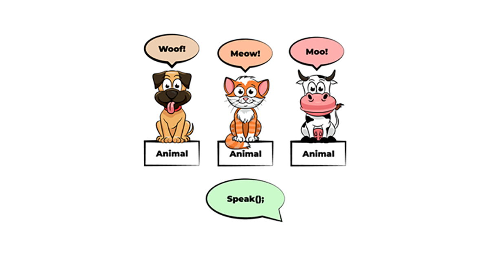

---

## Agenda

- Agenda
- What is Polymorphism?
- Types of Polymorphism
- Examples of Polymorphism
- Object Upcasting and Downcasting
- Benefits of Polymorphism

---

## Four major principles of OOP

- Four major principles of OOP
- Polymorphism is one of the 4 major principles of OOP
      - A
      - Polymorphism
      - I
      - E

---

## Four major principles of OOP

- Four major principles of OOP
- Polymorphism is one of the 4 major principles of OOP
      - Abstraction
      - Polymorphism
      - I
      - E

---

## Four major principles of OOP

- Four major principles of OOP
- Polymorphism is one of the 4 major principles of OOP
      - Abstraction
      - Polymorphism
      - I
      - E

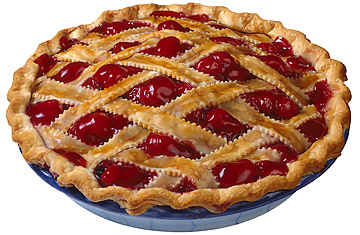

---

## Four major principles of OOP

- Four major principles of OOP
- Polymorphism is one of the 4 major principles of OOP
      - Abstraction
      - Polymorphism
      - Inheritance
      - E

---

## Four major principles of OOP

- Four major principles of OOP
- Polymorphism is one of the 4 major principles of OOP
      - Abstraction
      - Polymorphism
      - Inheritance
      - Encapsulation

---

## What is Polymorphism

- What is Polymorphism
- Polymorphism comes from the Greek word poly meaning “many” or “much” and morphē meaning “form” or  “shape”.
- Polymorphism is the capability of a method to do different things based on the object that it is acting upon.

---

## Types of Polymorphism

- Types of Polymorphism
- Polymorphism is the ability of the same method call to be bound to different method bodies
- Binding refers to linking a method call to the method body that will run.
- Compile time Polymorphism known as static or early binding
- Runtime Polymorphism known as dynamic or late binding

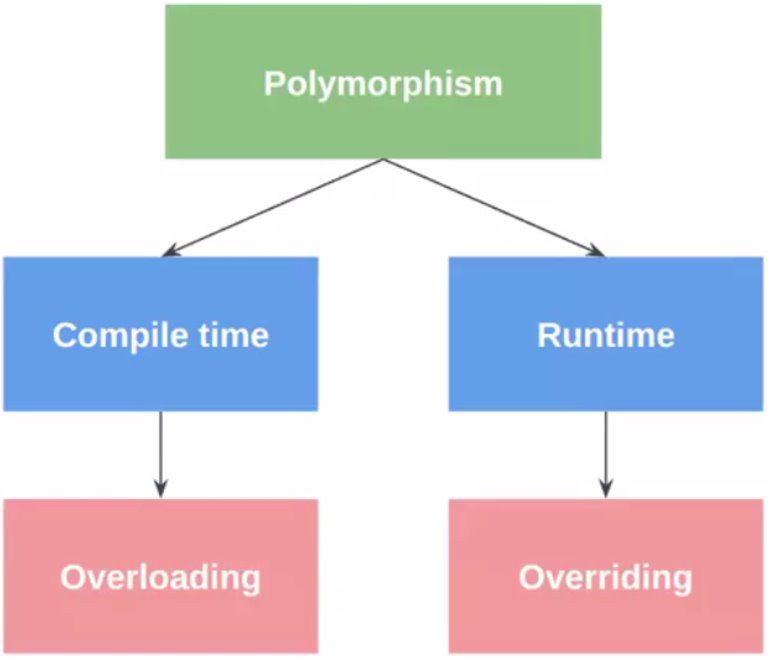

---

## Compile time Polymorphism

- Compile time Polymorphism
- Compile time Polymorphism is polymorphism that is resolved during compile time i.e., binding of the method call to its definition happens at compile time.
- The compiler can decide which method to call just by looking at the method signature (number and type of parameters).
- Method Overloading is an example of compile time polymorphism.

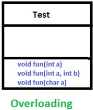

---

## Method Signature

- Method Signature
- A method signature is the method name and the number, type and order of its parameters.
- Java can uniquely identify methods based on their method signatures:
      - Number of parameters passed
      - Data type of parameters
      - Sequence of data type of parameters

---

## Method Structure

- Method Structure

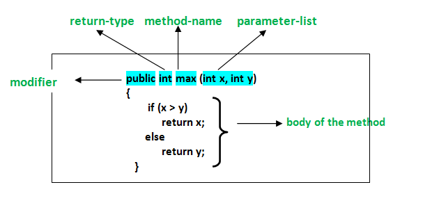

---

## Method Signature

- Method Signature
- max(int, int)

---

## Method Signature

- Method Signature
- A method signature is a combination of the method name and the parameter list.
- A class cannot have two methods with the same signature

---

## Method Overloading Example

- Method Overloading Example
- Method Overloading allows a class to have more than one method with the same name, as long as their signatures are different.

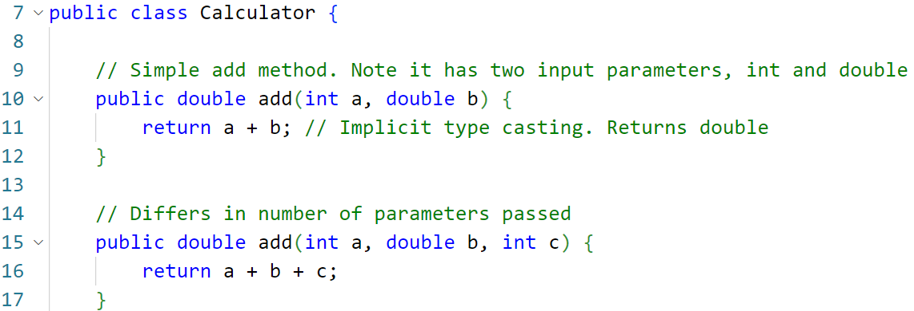

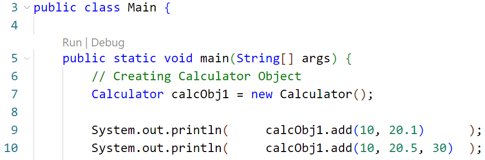

<!-- Speaker notes:
Output: 
30
60
-->

---

## Runtime Polymorphism

- Runtime Polymorphism
- Runtime Polymorphism is polymorphism which is resolved at runtime i.e., it is implemented dynamically when a program being executed
- Java supports run-time polymorphism by dynamically dispatching methods at run time through Method Overriding i.e., method invocations are resolved at run time by the JVM and not at the compile time.
- Method Overriding is an example of runtime polymorphism

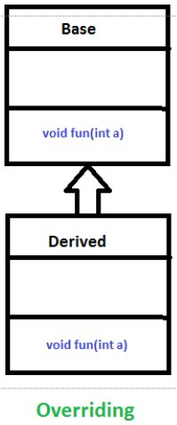

---

## What is Method Overriding?

- What is Method Overriding?
- Method Overriding allows us to declare a method in a subclass which has already been declared in a superclass.
- Method Overriding is done so that a subclass can provide its own implementation of a method which is already provided by the super class.
- The method in the superclass is called the Overridden Method and the method in subclass is called the Overriding Method.

---

## Method Overriding Example

- Method Overriding Example

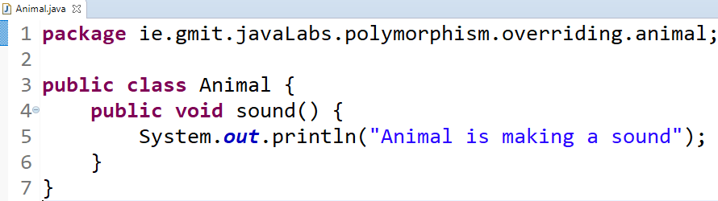

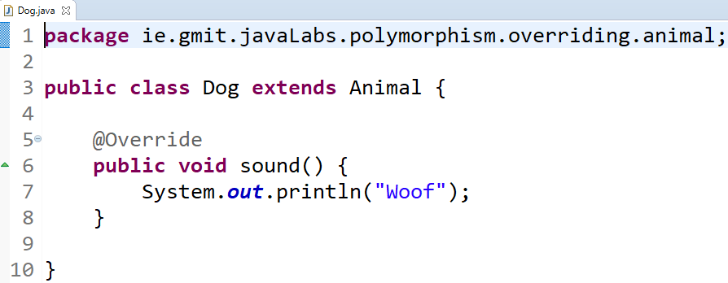

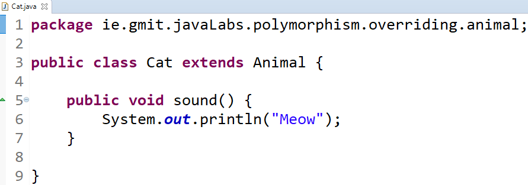

---

## Overriding Example

- Overriding Example
- Create Human Class
- Create IrishPerson Class that inherits from Human
- Create FrenchPerson Class that inherits from Human
- Create speak() method for all
- Human speak method says “Nǐ hǎo”
- IrishPerson speak method says “Dia Dhuit”
- FrenchPerson speak method says “Bonjour”

---

## Slide 20

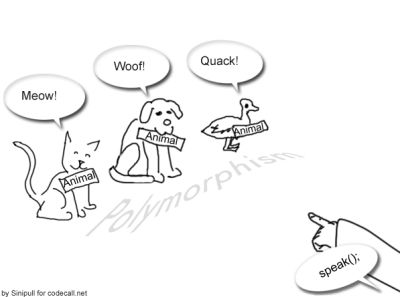

---

## Why Method Overriding has to be done at Runtime and not Compile time

- Why Method Overriding has to be done at Runtime and not Compile time
- The exact method to call depends on the actual object created at runtime — not just the variable type.
- The compiler cannot know which object you will actually create.

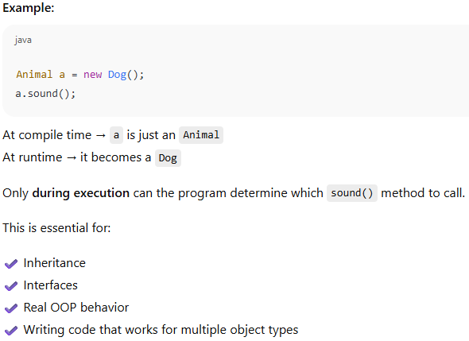

---

## Difference between Overloading and Overriding

- Difference between Overloading and Overriding
- Overloading is about the same method having different signatures.
- Overriding is about the same method with the same signature but with different classes, connected through inheritance.

---

## Difference between Overloading and Overriding

- Difference between Overloading and Overriding

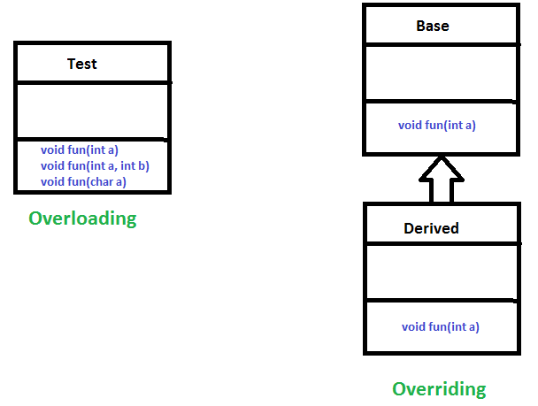

---

## Objects: Upcasting & Downcasting

- Objects: Upcasting & Downcasting
- Upcasting (Widening)
  - Subclass → Superclass
  - Safe, automatic.
- Downcasting (Narrowing)
  - Superclass → Subclass
  - Explicit cast required, can fail at runtime.

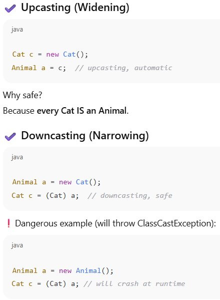

---

## Why Upcasting Is Useful (Arrays / Lists / Polymorphism)

- Why Upcasting Is Useful (Arrays / Lists / Polymorphism)
- Upcasting allows you to store different subclasses inside a single array or list of the superclass type.
- This is one of the most important uses of upcasting → polymorphism.
- Here is an array of Animals holding different types of Cats
- Output:

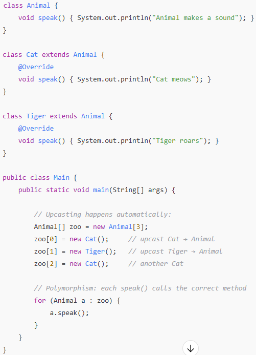

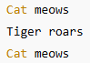

---

## WHY this works

- WHY this works
- Even though the array is typed as Animal[], the objects inside retain their true type (Cat, Tiger).
- That lets Java call the correct overridden method at runtime.
- Without Upcasting, you would need one reference variable per object! This is exactly what polymorphism is for.

---

## Downcasting Example With Arrays

- Downcasting Example With Arrays
- Sometimes you need to downcast when retrieving an object.

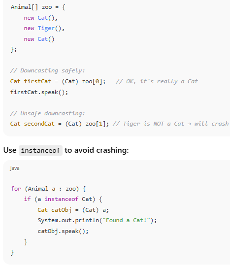

---

## Full Program Demonstrating Everything

- Full Program Demonstrating Everything
- Upcasting and downcasting are not polymorphism by themselves.
- BUT
- ➡️ Upcasting is what enables polymorphism. Polymorphism happens when an upcast reference calls overridden methods.
- Downcasting is not polymorphism — it's just a way to get back a more specific type.

---

## Benefits of Polymorphism

- Benefits of Polymorphism
- Code Reusability: Polymorphism allows us to define one interface and have multiple implementations. We can write methods that work on the superclass, and they will work with any subclass type. This means we can write less code, which is always a good thing.
- Flexibility: With polymorphism, objects of a subclass can be treated as objects of a superclass. This provides flexibility for methods to handle arguments of the superclass type, which can actually be any subclass type.
- Separation of Concerns: By using polymorphism, we can separate operations and objects. The objects do what they are supposed to do, and the operations act on the interfaces of the objects. This leads to clean, modular, and understandable code.
- Dynamic Method Dispatch: Polymorphism enables Java's ability to select the appropriate method at runtime based on the actual object, which is a key aspect of what makes Java an object-oriented language.
- Extensibility: In a system designed using polymorphism, new subclasses can be easily added with little or no modification to the general portions of the program, as long as the new classes are part of the inheritance hierarchy.

---

## Quick Recap

- Quick Recap
- Method overloading allows methods that perform similar or closely related functions to be accessed through a common name. For example, a program performs operations on an array of numbers which can be int, float, or double type. Method overloading allows you to define three methods with the same name and different types of parameters to handle the array operations.
- Method overloading can be implemented on constructors allowing different ways to initialise objects of a class. This enables you to define multiple constructors for handling different types of initialisations.
- Method overriding allows a sub class to use all the general definitions that a super class provides and add specialized definitions through overridden methods.
- Method overriding works together with inheritance to enable code reuse of existing classes without the need for re-compilation.

---

## Resources

- Resources
- Explain Polymorphism in Java. Use coding examples. Demonstrate method overridding and method overloading. - Your Personalized AI Assistant.
- https://beginnersbook.com/2013/03/polymorphism-in-java/
- http://www.geeksforgeeks.org/overloading-in-java/
- http://www.c-sharpcorner.com/UploadFile/433c33/polymorphism-in-java/
- https://www.simplilearn.com/tutorials/java-tutorial/java-polymorphism

